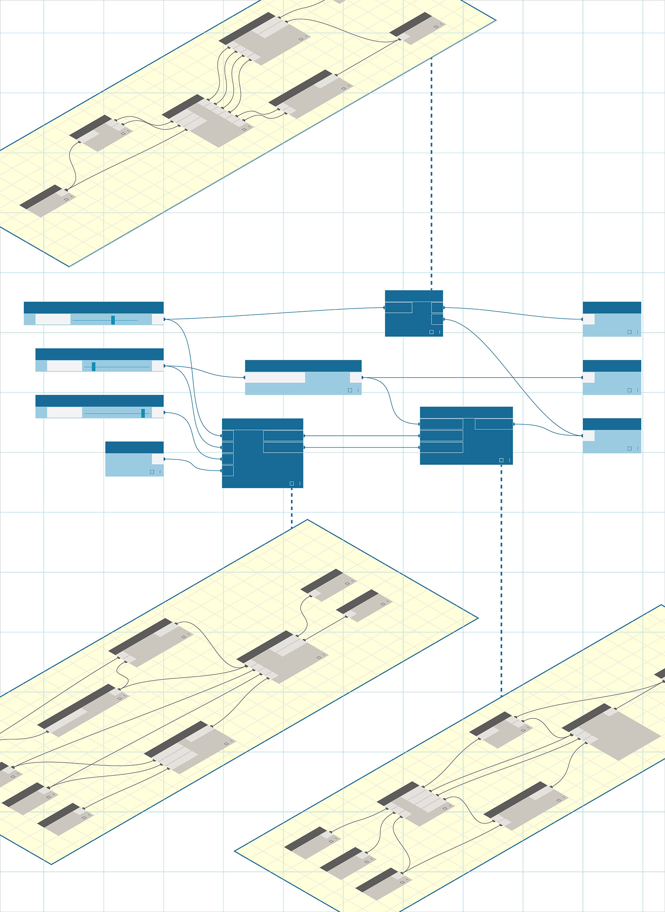

# Nodi personalizzati

Dynamo dispone di molte funzionalità incorporate, memorizzate nella libreria di nodi. Per le routine utilizzate di frequente o per il grafico speciale che si desidera condividere con la comunità, i nodi personalizzati rappresentano un ottimo modo per estendere ulteriormente Dynamo.

