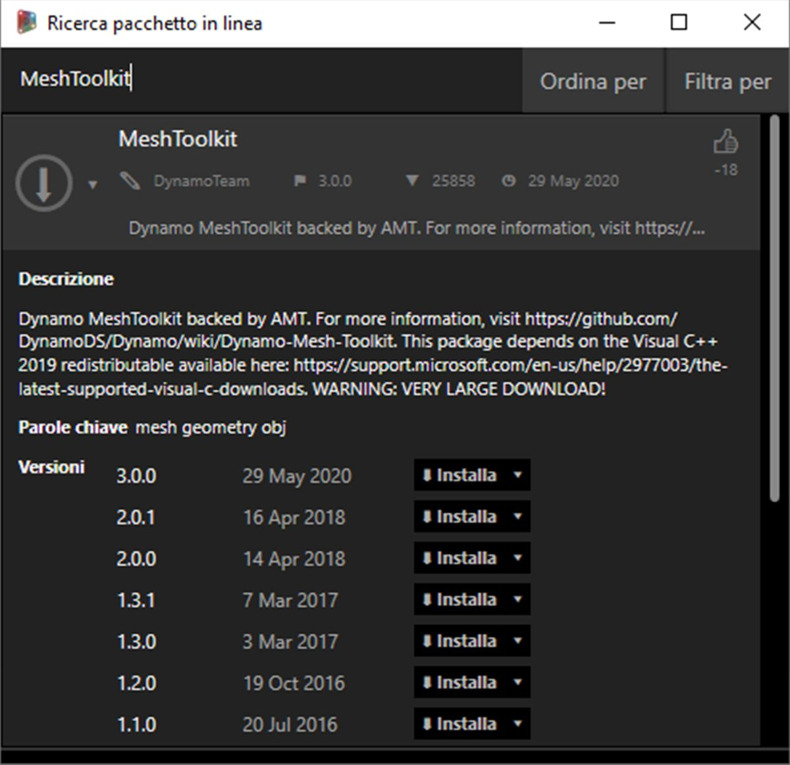
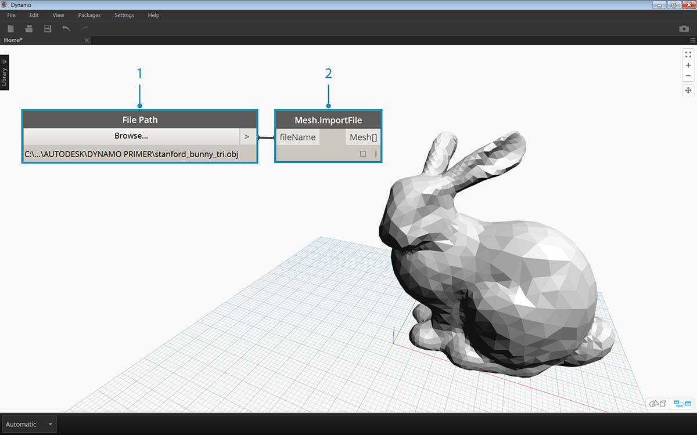

## Case study di un pacchetto - Mesh Toolkit

Dynamo Mesh Toolkit fornisce strumenti per importare mesh da formati di file esterni, creare mesh da oggetti della geometria di Dynamo e generare manualmente mesh in base ai vertici e agli indici. La libreria fornisce inoltre strumenti per modificare e correggere mesh o estrarre sezioni orizzontali da utilizzare nella fabbricazione.

Dynamo Mesh Toolkit fa parte del costante programma di ricerca sulle mesh di Autodesk e, come tale, continuerà a crescere nei prossimi anni. Si prevede di aggiungere frequentemente nuovi metodi nel toolkit e pertanto gli utenti sono invitati a contattare il team di Dynamo per eventuali commenti, bug e suggerimenti per le nuove funzionalità.

### Confronto tra mesh e solidi

Nel seguente esercizio sono illustrate alcune operazioni di base sulle mesh mediante Mesh Toolkit. Nell'esercizio, si interseca una mesh con una serie di piani, il che può risultare complesso dal punto di vista computazionale se si utilizzano solidi. A differenza di un solido, una mesh presenta una risoluzione impostata e non è definita matematicamente, ma topologicamente; è possibile definire questa risoluzione in base all'attività in corso. Per ulteriori dettagli sulle relazioni tra mesh e solidi, è possibile fare riferimento al capitolo [Geometria per la progettazione computazionale](../05_Geometry-for-Computational-Design/5_geometry-for-computational-design.md) di questa guida introduttiva. Per un esame più approfondito di Mesh Toolkit, è possibile fare riferimento alla [pagina Wiki di Dynamo.](https://github.com/DynamoDS/Dynamo/wiki/Dynamo-Mesh-Toolkit) Passare al pacchetto nell'esercizio riportato di seguito.

### Installazione di Mesh Toolkit

> In Dynamo, accedere a *Pacchetti > Cerca pacchetto...* sulla barra dei menu superiore. Nel campo di ricerca, digitare *MeshToolkit*, tutta una parola, facendo attenzione alle maiuscole. Fare clic sulla freccia di download del pacchetto appropriato per la versione di Dynamo in uso. È semplicissimo.

### Esercizio

> Scaricare e decomprimere i file di esempio per questo esercizio (fare clic con il pulsante destro del mouse e scegliere Salva link con nome...). Un elenco completo di file di esempio è disponibile nell'Appendice. [MeshToolkit.zip](datasets/11-2/MeshToolkit.zip)

Iniziare aprendo *Mesh-Toolkit_Intersect-Mesh.dyn in Dynamo.* In questo esempio, si esaminerà il nodo Intersect in Mesh Toolkit. Si importerà una mesh e la si intersecherà con una serie di piani di input per creare sezioni. Questo è il punto di partenza per la preparazione del modello per la fabbricazione su un taglierino laser, un taglierino a getto d'acqua o una fresa CNC.

> 1. **File Path:** individuare il file della mesh da importare (*stanford_bunny_tri.obj*). I tipi di file supportati sono .mix e .obj.
2. **Mesh.ImportFile:** collegare il percorso del file per importare la mesh.

> 1. **Point.ByCoordinates:** creare un punto, che sarà il centro di un arco.
2. **Arc.ByCenterPointRadiusAngle:** creare un arco attorno al punto. Questa curva verrà utilizzata per posizionare una serie di piani.

> 1. Code Block: creare un intervallo di numeri compreso tra zero e uno.
2. **Curve.PointAtParameter:** collegare l'arco all'input *curve* e l'output del blocco di codice all'input *param* per estrarre una serie di punti lungo la curva.
3. **Curve.TangentAtParameter:** collegare gli stessi input del nodo precedente.
4. **Plane.ByOriginNormal:** collegare i punti all'input *origin* e i vettori all'input *normal* per creare una serie di piani in corrispondenza di ogni punto.

Dovrebbe essere presente una serie di piani orientati lungo l'arco. Quindi, si utilizzeranno questi piani per intersecare la mesh.

> 1. **Mesh.Intersect:** intersecare i piani con la mesh importata, creando una serie di contorni di PolyCurve.
2. **PolyCurve.Curves:** dividere le PolyCurve nei relativi frammenti di curva.
3. **Curve.EndPoint:** estrarre i punti finali di ogni curva.
4. **NurbsCurve.ByPoints:** utilizzare i punti per costruire una curva NURBS. Utilizzare un nodo booleano impostato su *True* per chiudere le curve.

> 1. **Surface.ByPatch:** costruire superfici chiuse per ogni contorno per creare sezioni della mesh.

> Aggiungere un secondo insieme di sezioni per un effetto di waffle/cassa delle uova.

Si potrebbe notare che le operazioni di intersezione vengono calcolate più rapidamente con una mesh rispetto ad un solido confrontabile. I workflow, come quello illustrato in questo esercizio, si prestano anche all'utilizzo delle mesh.

