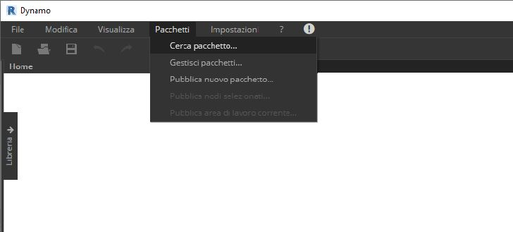
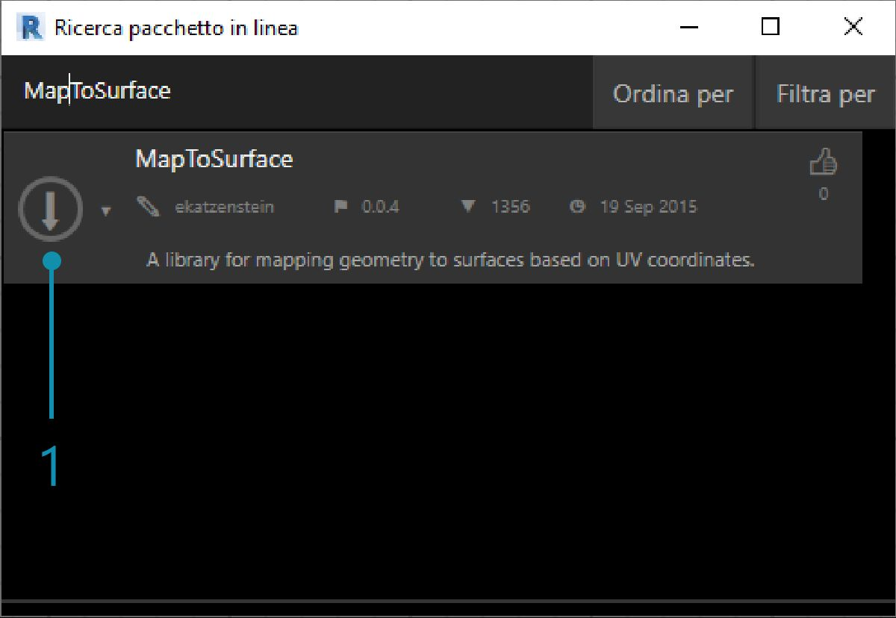
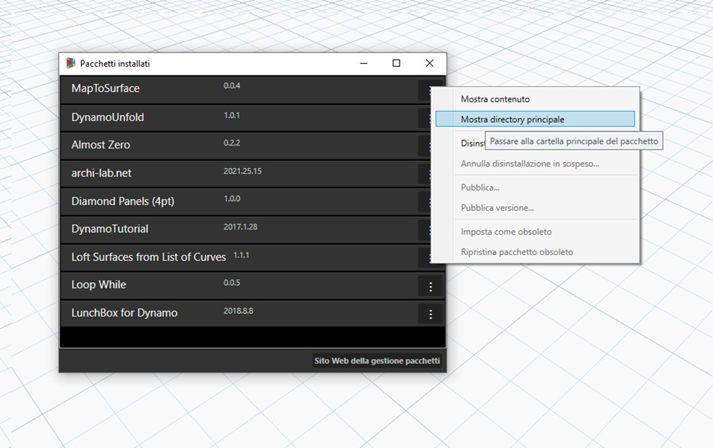
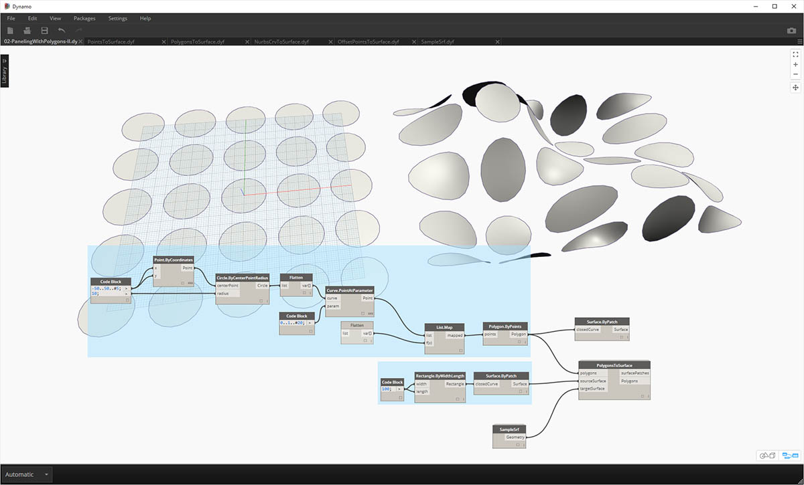
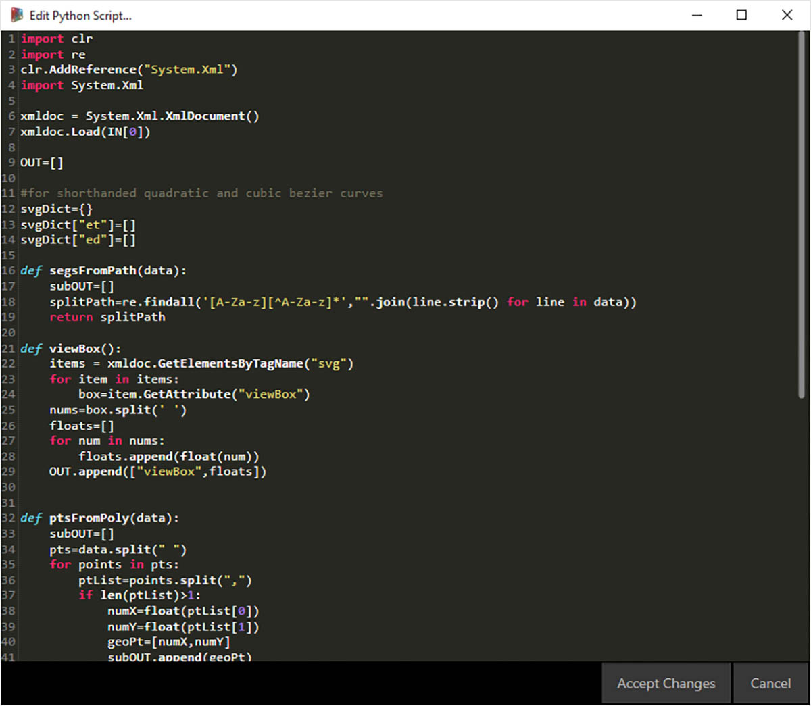

## Sviluppo di un pacchetto

Dynamo offre diversi modi per creare un pacchetto per l'utilizzo personale o per la condivisione con la comunità di Dynamo. Nel case study riportato di seguito, si esaminerà in maniera dettagliata la configurazione di un pacchetto smontandone uno esistente. Questo case study si basa sulle lezioni del capitolo precedente, fornendo un gruppo di nodi personalizzati per il mappaggio della geometria, tramite le coordinate UV, da una superficie di Dynamo ad un'altra.

### MapToSurface

Si utilizzerà un pacchetto di esempio che mostra il mappaggio UV di punti da una superficie ad un'altra. Sono già stati illustrati i principi fondamentali dello strumento nella sezione [Creazione di un nodo personalizzato](../10_Custom-Nodes/10-2_Creating.md) di questa guida introduttiva. I file riportati di seguito mostrano com'è possibile prendere il concetto di mappaggio UV e sviluppare un set di strumenti per una libreria pubblicabile.

> In questa immagine, si associa un punto da una superficie ad un'altra utilizzando le coordinate UV. Il pacchetto si basa su questo concetto, ma con una geometria più complessa.

### Installazione del pacchetto

Nel capitolo precedente, sono stati esaminati i metodi per la suddivisione di una superficie in pannelli in Dynamo in base alle curve definite nel piano XY. Questo case study estende questi concetti per altre quote della geometria. Si installerà questo pacchetto una volta creato per dimostrare com'è stato sviluppato. Nella sezione successiva, verrà illustrato come questo pacchetto è stato pubblicato.

> Questa è la parte facile. In Dynamo, accedere a *Pacchetti > Cerca pacchetto*.

> Cercare il pacchetto *"MapToSurface"* (tutta una parola).

> 1. Quando il pacchetto viene trovato, fare clic sulla grande freccia di download a sinistra del nome del pacchetto. Il pacchetto verrà installato in Dynamo.

> 1. Dopo l'installazione, i nodi personalizzati dovrebbero essere disponibili nel gruppo "DynamoPrimer" o nella libreria di Dynamo. Dopo aver installato il pacchetto, esaminarne in maniera dettagliata la configurazione.

### Nodi personalizzati

Il pacchetto che si sta creando utilizza cinque nodi personalizzati che sono stati generati come riferimento. Si esaminerà in maniera dettagliata la funzione di ogni nodo di seguito. Alcuni nodi personalizzati si basano su altri nodi personalizzati e i grafici mostrano un layout per consentire ad altri utenti di comprendere ciò in maniera chiara.

> Si tratta di un pacchetto semplice con cinque nodi personalizzati. Nei passaggi riportati di seguito, verrà descritta brevemente la configurazione di ogni nodo personalizzato.

> **PointsToSurface:** è un nodo di base personalizzato e uno su cui sono basati tutti gli altri nodi di mappaggio. In sostanza, il nodo associa un punto da una coordinata UV della superficie di origine alla posizione della coordinata UV della superficie di destinazione. Poiché i punti sono la geometria più primitiva, dalla quale viene creata una geometria più complessa, è possibile utilizzare questa logica per associare la geometria 2D e persino 3D da una superficie ad un'altra.

> **PolygonsToSurface:** la logica di estensione dei punti associati dalla geometria 1D alla geometria 2D è illustrata semplicemente con i poligoni qui. Notare che è stato nidificato il nodo *PointsToSurface* in questo nodo personalizzato. In questo modo è possibile associare i punti di ogni poligono alla superficie e quindi rigenerare il poligono da tali punti associati. Mantenendo la struttura dei dati appropriata (un elenco di elenchi di punti), è possibile mantenere i poligoni separati dopo averli ridotti ad un gruppo di punti.

> **NurbsCrvtoSurface:** la stessa logica si applica qui come nel nodo *"PolygonsToSurface"*. Invece di associare i punti poligonali, si stanno associando i punti di controllo di una curva NURBS.

> **OffsetPointsToSurface:** questo nodo risulta un po' più complesso, ma il concetto è semplice: come il nodo *PointsToSurface*, questo nodo associa i punti da una superficie ad un'altra. Tuttavia, considera anche i punti che non si trovano sulla superficie di origine originale, calcola la loro distanza dal parametro UV più vicino e associa questa distanza alla normale della superficie di destinazione nel punto della coordinata UV corrispondente. Ciò risulta più utile quando si esaminano i file di esempio.

> **SampleSrf:** questo è un nodo semplice che crea una superficie parametrica da associare dalla griglia di origine ad una superficie ondulata nei file di esempio.

### File di esempio

I file di esempio sono disponibili nella cartella principale del pacchetto (in Dynamo, accedere a questa cartella selezionando *Pacchetti > Gestisci pacchetti*).

> Nella finestra Gestisci pacchetti, fare clic sui tre punti verticali a destra di *"MapToSurface"* e scegliere *"Mostra directory principale".*

Con la directory principale aperta, accedere alla cartella *"extra"*, che contiene tutti i file del pacchetto che non sono nodi personalizzati. Questo è il percorso in cui vengono memorizzati i file di esempio (se presenti) per i pacchetti di Dynamo. Nelle schermate riportate di seguito sono mostrati i concetti illustrati in ogni file di esempio.

> **01-PanelingWithPolygons:** questo file di esempio illustra com'è possibile utilizzare *PointsToSurface* per eseguire la suddivisione di una superficie in pannelli in base ad una griglia di rettangoli. Questo processo dovrebbe risultare familiare, poiché è stato dimostrato un workflow simile nel [capitolo precedente](../10_Custom-Nodes/10-2_Creating.md).

> **02-Paneling WithPolygons-II:** utilizzando un workflow simile, questo file di esercizio mostra una configurazione per il mappaggio di cerchi (o poligoni che rappresentano cerchi) da una superficie ad un'altra. Viene utilizzato il nodo *"PolygonsToSurface"*.

> **03-NurbsCrvsAndSurface:** questo file di esempio aggiunge una certa complessità utilizzando il nodo "NurbsCrvToSurface". Viene eseguito l'offset della superficie di destinazione ad una determinata distanza e la curva NURBS viene associata alla superficie di destinazione originale e alla superficie di offset. Da qui, viene eseguito il loft delle due curve associate per creare una superficie, che viene poi ispessita. Questo solido risultante ha un'ondulazione che è rappresentativa delle normali della superficie di destinazione.

> **04-PleatedPolysurface-OffsetPoints**: questo file di esempio illustra come associare una PolySurface pieghettata da una superficie di origine ad una superficie di destinazione. La superficie di origine e quella di destinazione sono rispettivamente una superficie rettangolare che si estende sulla griglia e una superficie di rivoluzione.

> **04-PleatedPolysurface-OffsetPoints:** indica la PolySurface di origine associata dalla superficie di origine alla superficie di destinazione.

> **05-SVG-Import:** poiché i nodi personalizzati sono in grado di associare diversi tipi di curve, quest'ultimo file fa riferimento ad un file SVG esportato da Illustrator e associa le curve importate ad una superficie di destinazione.

> **05-SVG-Import:** analizzando la sintassi di un file .svg, le curve vengono convertite dal formato .xml nelle PolyCurve di Dynamo.

> **05-SVG-Import:** le curve importate vengono associate ad una superficie di destinazione. Questo consente di progettare in modo esplicito (fare clic e puntare) una suddivisione in pannelli in Illustrator, importarla in Dynamo e applicarla ad una superficie di destinazione.

