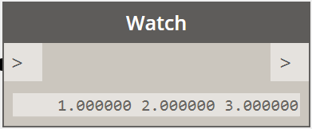
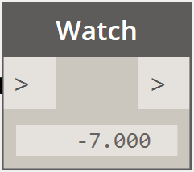

# Matematica vettoriale

Gli oggetti nelle progettazioni computazionali raramente vengono creati esplicitamente nella loro posizione e nella loro forma finali e più spesso vengono traslati, ruotati e altrimenti posizionati in base alla geometria esistente. La matematica vettoriale serve come una sorta di impalcatura geometrica per dare direzione e orientamento alla geometria, nonché per concettualizzare i movimenti attraverso lo spazio 3D senza rappresentazione visiva.

Fondamentalmente, un vettore rappresenta una posizione nello spazio 3D e spesso viene considerato come il punto finale di una freccia dalla posizione (0, 0, 0) a quella posizione. I vettori possono essere creati con il costruttore *ByCoordinates*, utilizzando la posizione x, y e z dell'oggetto vettoriale appena creato. Notare che gli oggetti vettoriali non sono oggetti geometrici e non compaiono nella finestra di Dynamo. Tuttavia, le informazioni relative ad un vettore appena creato o modificato possono essere stampate nella finestra della console:



```js
// construct a Vector object
v = Vector.ByCoordinates(1, 2, 3);

s = v.X + " " + v.Y + " " + v.Z;
```

Un insieme di operazioni matematiche viene definito sugli oggetti vettoriali, consentendo di aggiungere, sottrarre, moltiplicare e altrimenti spostare oggetti nello spazio 3D, come si sposterebbero numeri reali nello spazio 1D su una linea numerica.

L'addizione vettoriale è definita come la somma dei componenti di due vettori e può essere considerata come il vettore risultante se le frecce dei componenti dei due vettori vengono posizionate "dalla punta alla coda". L'addizione vettoriale viene eseguita con il metodo *Add* ed è rappresentata dal diagramma a sinistra.


```js
a = Vector.ByCoordinates(5, 5, 0);
b = Vector.ByCoordinates(4, 1, 0);

// c has value x = 9, y = 6, z = 0
c = a.Add(b);
```

Analogamente, due oggetti vettoriali possono essere sottratti l'uno dall'altro con il metodo *Subtract*. La sottrazione vettore può essere considerata come direzione dal primo vettore al secondo vettore.


```js
a = Vector.ByCoordinates(5, 5, 0);
b = Vector.ByCoordinates(4, 1, 0);

// c has value x = 1, y = 4, z = 0
c = a.Subtract(b);
```

La moltiplicazione vettoriale può essere considerata come lo spostamento del punto finale di un vettore nella sua direzione mediante un determinato fattore di scala.


```js
a = Vector.ByCoordinates(4, 4, 0);

// c has value x = 20, y = 20, z = 0
c = a.Scale(5);
```

Spesso è necessario durante la messa in scala di un vettore avere la lunghezza del vettore risultante esattamente uguale al valore in scala. Ciò si ottiene facilmente normalizzando prima un vettore, in altre parole impostando la lunghezza del vettore esattamente uguale ad uno.


```js
a = Vector.ByCoordinates(1, 2, 3);
a_len = a.Length;

// set the a's length equal to 1.0
b = a.Normalized();
c = b.Scale(5);

// len is equal to 5
len = c.Length;
```

c punta ancora nella stessa direzione di a (1, 2, 3), anche se ora ha una lunghezza esattamente uguale a 5.

Nella matematica vettoriale esistono due metodi di addizione che non hanno paralleli chiari con la matematica 1D, il prodotto vettoriale e il prodotto punto. Il prodotto vettoriale è un mezzo per generare un vettore ortogonale (a 90 gradi) rispetto a due vettori esistenti. Ad esempio, il prodotto vettoriale degli assi x e y è l'asse x, sebbene i due vettori di input non debbano essere ortogonali tra loro. Viene calcolato un vettore del prodotto vettoriale con il metodo *Cross*.


```js
a = Vector.ByCoordinates(1, 0, 1);
b = Vector.ByCoordinates(0, 1, 1);

// c has value x = -1, y = -1, z = 1
c = a.Cross(b);
```

Un'ulteriore funzione, sebbene più avanzata di matematica vettoriale, è il prodotto punto. Il prodotto punto tra due vettori è un numero reale (non un oggetto Vector) che è correlato, ma non è esattamente, all'angolo tra due vettori. Una delle proprietà utili del prodotto punto è che il prodotto punto tra due vettori sarà 0 se e solo se sono perpendicolari. Il prodotto punto viene calcolato con il metodo *Dot*.



```js
a = Vector.ByCoordinates(1, 2, 1);
b = Vector.ByCoordinates(5, -8, 4);

// d has value -7
d = a.Dot(b);
```

