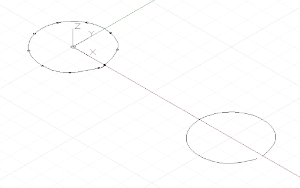

# Curve: punti interpolati e di controllo

In Dynamo vi sono due metodi fondamentali per creare curve di forma libera: la specifica di una raccolta di punti e l'impostazione del programma in modo che venga interpolata una curva levigata tra di essi oppure esiste un metodo di livello molto più basso, ossia specificare i punti di controllo sottostanti di una curva di un determinato grado. Le curve interpolate sono utili quando un progettista sa esattamente la forma che deve assumere una linea o se il progetto ha vincoli specifici per il punto in cui la curva può e non può attraversare. Le curve specificate tramite i punti di controllo sono essenzialmente una serie di segmenti di linee rette che un algoritmo leviga in una forma di curva finale. Specificare una curva tramite punti di controllo può essere utile per esplorare forme di curva con diversi gradi di levigatezza o quando è necessaria una continuità uniforme tra segmenti di curva.

Per creare una curva interpolata, è sufficiente trasferire una raccolta di punti al metodo *NurbsCurve.ByPoints*.


```
num_pts = 6;

s = Math.Sin(0..360..#num_pts) * 4;

pts = Point.ByCoordinates(1..30..#num_pts, s, 0);

int_curve = NurbsCurve.ByPoints(pts);
```

La curva generata interseca ciascuno dei punti di input, iniziando e terminando rispettivamente nel primo e nell'ultimo punto della raccolta. È possibile utilizzare un parametro periodico facoltativo per creare una curva periodica chiusa. Dynamo inserirà automaticamente il segmento mancante, pertanto non è necessario un punto finale duplicato (identico al punto iniziale).



```
pts = Point.ByCoordinates(Math.Cos(0..350..#10),
Math.Sin(0..350..#10), 0);

// create an closed curve
crv = NurbsCurve.ByPoints(pts, true);

// the same curve, if left open:
crv2 = NurbsCurve.ByPoints(pts.Translate(5, 0, 0),
false);
```

Le NurbsCurve vengono generate in modo molto simile, con i punti di input che rappresentano i punti finali di un segmento di linea retta e un secondo parametro che specifica il livello e il tipo di levigatezza a cui è sottoposta la curva, denominati grado.* Una curva di grado 1 non ha alcuna levigatezza; è una polilinea.


```
num_pts = 6;

pts = Point.ByCoordinates(1..30..#num_pts,
Math.Sin(0..360..#num_pts) * 4, 0);

// a B-Spline curve with degree 1 is a polyline
ctrl_curve = NurbsCurve.ByControlPoints(pts, 1);
```

Una curva di grado 2 viene levigata in modo che si intersechi ed è tangente al punto medio dei segmenti della polilinea:


```
num_pts = 6;

pts = Point.ByCoordinates(1..30..#num_pts,
Math.Sin(0..360..#num_pts) * 4, 0);

// a B-Spline curve with degree 2 is smooth
ctrl_curve = NurbsCurve.ByControlPoints(pts, 2);
```

Dynamo supporta curve NURBS (Non-Uniform Rational B-Spline) fino ad un massimo di 20 gradi. Nel seguente script è illustrato l'effetto che l'aumento dei livelli di levigatezza ha sulla forma di una curva:


```
num_pts = 6;

pts = Point.ByCoordinates(1..30..#num_pts,
Math.Sin(0..360..#num_pts) * 4, 0);

def create_curve(pts : Point[], degree : int) 
{
return = NurbsCurve.ByControlPoints(pts,
degree);
}

ctrl_crvs = create_curve(pts, 1..11);
```

Notare che è necessario disporre di almeno un altro punto di controllo rispetto al grado della curva.

Un altro vantaggio della costruzione delle curve tramite vertici di controllo è la possibilità di mantenere la tangenza tra singoli segmenti della curva. Per eseguire questa operazione, estrarre la direzione tra gli ultimi due punti di controllo e continuare in questa direzione con i primi due punti di controllo della curva seguente. Nel seguente esempio vengono create due curve NURBS separate, che sono tuttavia levigate come una curva:


```
pts_1 = {};

pts_1[0] = Point.ByCoordinates(0, 0, 0);
pts_1[1] = Point.ByCoordinates(1, 1, 0);
pts_1[2] = Point.ByCoordinates(5, 0.2, 0);
pts_1[3] = Point.ByCoordinates(9, -3, 0);
pts_1[4] = Point.ByCoordinates(11, 2, 0);

crv_1 = NurbsCurve.ByControlPoints(pts_1, 3);

pts_2 = {};

pts_2[0] = pts_1[4];
end_dir = pts_1[4].Subtract(pts_1[3].AsVector());

pts_2[1] = Point.ByCoordinates(pts_2[0].X + end_dir.X,
pts_2[0].Y + end_dir.Y, pts_2[0].Z + end_dir.Z);

pts_2[2] = Point.ByCoordinates(15, 1, 0);
pts_2[3] = Point.ByCoordinates(18, -2, 0);
pts_2[4] = Point.ByCoordinates(21, 0.5, 0);

crv_2 = NurbsCurve.ByControlPoints(pts_2, 3);
```

* Questa è una descrizione molto semplificata della geometria della curva NURBS. Per una descrizione più accurata e dettagliata, vedere Pottmann, et al, 2007, nei riferimenti.

