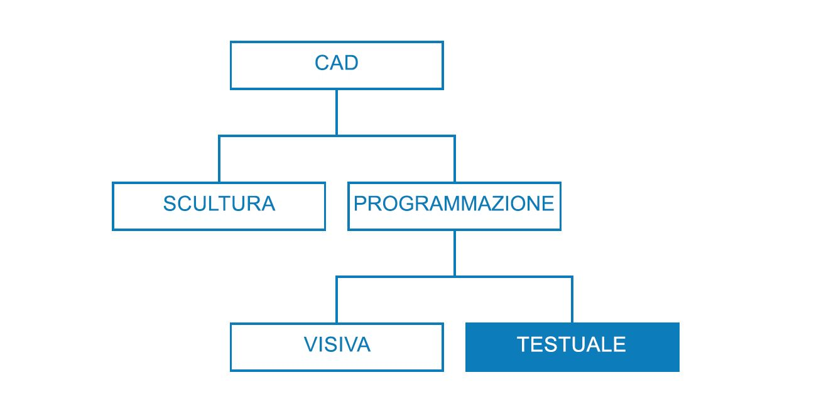
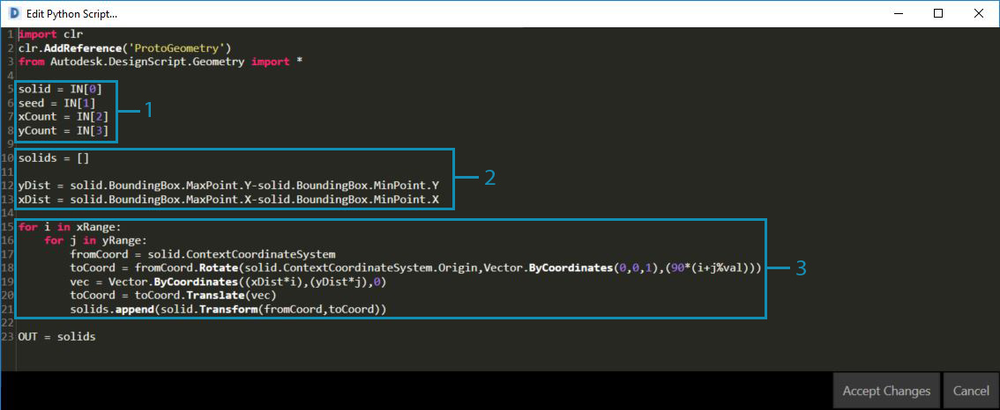

## Strategie di scripting

Lo scripting basato su testo all'interno dell'ambiente di creazione di scripting visivo consente relazioni potenti e visive utilizzando DesignScript, Python e ZeroTouch (C#). L'utente può esporre elementi quali dispositivi di scorrimento di input, comprimere operazioni di grandi dimensioni in DesignScript e accedere a potenti strumenti e librerie tramite Python o C#, tutto nella stessa area di lavoro. Se gestita in modo efficace, la combinazione di queste strategie può conferire un elevato livello di personalizzazione, chiarezza ed efficienza al programma generale. Di seguito è riportato un insieme di linee guida per ottimizzare lo script visivo con lo script testuale.



### Sapere quando eseguire lo script

Lo scripting di testo può stabilire relazioni di maggiore complessità rispetto alla programmazione visiva, ma anche le loro funzionalità si sovrappongono in modo significativo. Ciò è utile perché i nodi sono di fatto codice preconfezionato e probabilmente si potrebbe scrivere un intero programma Dynamo in DesignScript o Python. Tuttavia, si utilizza lo scripting visivo perché l'interfaccia di nodi e collegamenti crea un flusso intuitivo di informazioni grafiche. Sapere dove le funzionalità dello scripting di testo vanno oltre lo scripting visivo fornirà importanti dettagli su quando deve essere utilizzato senza dover dimenticare la natura intuitiva di nodi e collegamenti. Di seguito sono riportate le linee guida su quando eseguire lo script e su quale linguaggio utilizzare.

**Utilizzare lo scripting di testo per:**

* Loop

* Ricorsione

* Accesso alle librerie esterne

**Scegliere una linguaggio:**

||Loop|Ricorsione|Compressione di nodi|Est. Librerie|Sintassi abbreviata|
| -- | -- |
|**DesignScript**|Sì|Sì|Sì|No|Sì|
|**Python**|Sì|Sì|Parzialmente|Sì|No|
|**ZeroTouch (C#)**|No|No|No|Sì|No|

> Fare riferimento a [Riferimento per lo scripting](http://primer.dynamobim.org/en/12_Best-Practice/12-3_Scripting-Reference.html) per un elenco di ciò a cui ogni libreria di Dynamo consente di accedere.

### Pensiero parametrico

Quando si esegue lo scripting in Dynamo, un ambiente inevitabilmente parametrico, è opportuno strutturare il codice in relazione alla struttura dei nodi e dei collegamenti in cui si troverà. Considerare il nodo contenente lo script di testo come se si trattasse di qualsiasi altro nodo del programma con alcuni input specifici, una funzione e un output previsto. In questo modo il codice all'interno del nodo viene immediatamente corredato di un piccolo gruppo di variabili con cui lavorare, la chiave per un sistema parametrico ordinato. Di seguito sono riportate alcune linee guida per una migliore integrazione del codice in un programma visivo.

**Identificare le variabili esterne:**

* Provare a determinare i parametri specificati nel problema di progettazione in modo da poter costruire un modello che consenta la creazione diretta di tali dati.

* Prima di scrivere il codice, identificare le variabili:

  * Un gruppo minimo di input

  * L'output desiderato

  * Costanti


> Prima di scrivere il codice, sono state definite diverse variabili.

> 1. La superficie su cui verrà simulata la pioggia.
2. Il numero di gocce di pioggia (agenti) desiderato.
3. La distanza percorsa delle gocce di pioggia.
4. Alternare tra scendere nel percorso più ripido e attraversare la superficie.
5. Nodo Python con il rispettivo numero di input.
6. Un blocco di codice per rendere blu le curve restituite.

**Progettare le relazioni interne:**

* Il parametricismo consente la modifica di determinati parametri o variabili per manipolare o cambiare il risultato finale di un'equazione o un sistema.

* Ogni volta che le entità nello script sono correlate in modo logico, è necessario definirle come funzioni l'una dell'altra. In questo modo, quando una viene modificata, l'altra può essere aggiornata in modo proporzionale.

* Ridurre al minimo il numero di input esponendo solo i parametri chiave:

  * Se è possibile derivare un gruppo di parametri da più parametri principali, esporre solo i parametri principali come input di script. Ciò consente di migliorare la fruibilità dello script riducendone la complessità dell'interfaccia.



> I "moduli" del codice dell'esempio nel [nodo Python](http://primer.dynamobim.org/en/09_Custom-Nodes/9-4_Python.html).

> 1. Input.
2. Variabili interne allo script.
3. Un loop che utilizza questi input e variabili per eseguirne la funzione.
> Suggerimento: porre l'accento sul processo come si fa con la soluzione.

**Don't repeat yourself (principio DRY):**

* Quando si hanno più modi per esprimere la stessa cosa nello script, ad un certo punto le rappresentazioni duplicate non verranno sincronizzate, cosa che può portare a problemi di manutenzione, scarsa scomposizione in fattori e contraddizioni interne.

* Il principio DRY prevede che "ogni conoscenza deve avere una rappresentazione unica, inequivocabile e autorevole all'interno di un sistema":

  * Se il principio viene applicato correttamente, tutti gli elementi correlati nello script cambiano in modo prevedibile e uniforme e tutti gli elementi non correlati non hanno conseguenze logiche l'uno sull'altro.

```
### BAD
for i in range(4):
for j in range(4):
point = Point.ByCoordinates(3*i, 3*j, 0)
points.append(point)
```

```
### GOOD
count = IN[0]
pDist = IN[1]

for i in range(count):
for j in range(count):
point = Point.ByCoordinates(pDist*i, pDist*j, 0)
points.append(point)
```

> Suggerimento: prima di duplicare le entità nello script (ad esempio una costante nell'esempio precedente), chiedere se è invece possibile eseguire il collegamento all'origine.

### Strutturazione modulare

Man mano che il codice diventa sempre più lungo e più complesso, la "grande idea" o l'algoritmo complessivo diventa sempre più illeggibile. Inoltre, diventa più difficile tenere traccia di quali cose specifiche accadono (e dove), trovare bug quando le cose vanno male, integrare altro codice e assegnare attività di sviluppo. Per evitare questi problemi, è opportuno scrivere il codice in moduli, una strategia organizzativa che suddivide il codice in base all'attività che esegue. Di seguito sono riportati alcuni suggerimenti per rendere gli script più gestibili tramite la modularizzazione.

**Scrivere il codice in moduli:**

* Un "modulo" è un gruppo di codice che esegue un'attività specifica, simile ad un nodo di Dynamo nell'area di lavoro.

* Può trattarsi di qualsiasi elemento che deve essere separato visivamente dal codice adiacente (una funzione, una classe, un gruppo di input o le librerie che si stanno importando).

* Lo sviluppo di codice nei moduli consente di sfruttare la qualità visiva e intuitiva dei nodi, nonché le complesse relazioni che possono essere ottenute solo tramite lo scripting di testo.


> Questi loop chiamano una classe denominata "agente" che verrà sviluppata nell'esercizio.

> 1. Un modulo del codice che definisce il punto iniziale di ogni agente.
2. Un modulo del codice che aggiorna l'agente.
3. Un modulo del codice che disegna una traccia per il percorso dell'agente.

**Individuare il riutilizzo del codice:**

* Se il codice esegue la stessa operazione (o molto simile) in più posizioni, trovare modi di raggrupparla in una funzione che può essere chiamata.

* Le funzioni "manager" controllano il flusso del programma e contengono principalmente chiamate alle funzioni "worker" che gestiscono dettagli di basso livello, ad esempio lo spostamento di dati tra le strutture.


> In questo esempio vengono create sfere con raggi e colori in base al valore Z dei punti centrali.

> 1. Due funzioni principali "worker": una che crea sfere con raggi e visualizza i colori in base al valore Z del punto centrale.
2. Una funzione principale "manager" che combina le due funzioni worker. Chiamando questa funzione si chiameranno entrambe le funzioni al suo interno.

**Mostrare solo ciò che è necessario vedere:**

* Un'interfaccia del modulo esprime gli elementi forniti e richiesti dal modulo.

* Una volta definite le interfacce tra le unità, la progettazione dettagliata di ciascuna unità può procedere separatamente.

**Separabilità/Sostituibilità:**

* Ogni modulo ignora l'esistenza dell'altro.

**Forme generali di modularizzazione:**

* Raggruppamento di codici:

```
# IMPORT LIBRARIES
import random
import math
import clr
clr.AddReference('ProtoGeometry')
from Autodesk.DesignScript.Geometry import *

# DEFINE PARAMETER INPUTS
surfIn = IN[0]
maxSteps = IN[1]
```

* Funzioni:

```
def get_step_size():
area = surfIn.Area
stepSize = math.sqrt(area)/100
return stepSize

stepSize = get_step_size()
```

* Classi:

```
class MyClass:
i = 12345

def f(self):
return 'hello world'

numbers = MyClass.i
greeting = MyClass.f
```

### Flessibilità continua

Durante lo sviluppo di script di testo in Dynamo, è opportuno assicurarsi costantemente che ciò che viene creato sia allineato con quello che si prevede. Ciò garantirà che eventi imprevisti, come errori di sintassi, discrepanze logiche, imprecisioni di valore, risultati anomali e così via,vengano rapidamente scoperti e affrontati quando si presentano piuttosto che tutti contemporaneamente alla fine. Poiché gli script di testo sono presenti all'interno dei nodi dell'area di disegno, sono già integrati nel flusso di dati del programma visivo. In questo modo, il monitoraggio consecutivo dello script sarà semplice quanto l'assegnazione di dati di output, l'esecuzione del programma e la valutazione del flusso di dati dello script utilizzando un nodo Watch. Di seguito sono riportati alcuni suggerimenti per un'ispezione continua degli script durante la loro costruzione.

**Fare delle prove mentre si procede:**

* Ogni volta che si completa un cluster di funzionalità:

  * Tornare indietro e ispezionare il codice.

  * Essere critici. Un collaboratore potrebbe capire cosa sta facendo? Occorre farlo? Questa funzione può essere eseguita in modo più efficiente? Si stanno creando dipendenze o duplicati non necessari?

  * Fare rapidamente delle prove per assicurarsi che restituisca dati "appropriati".

* Assegnare come output i dati più recenti che si stanno utilizzando nello script, in modo che il nodo generi sempre dati pertinenti quando lo script viene aggiornato:


> Flessibilità del codice di esempio del [nodo Python](http://primer.dynamobim.org/en/09_Custom-Nodes/9-4_Python.html).

> 1. Verificare che tutti i bordi del solido vengano restituiti come curve per creare un riquadro di delimitazione attorno.
2. Verificare che gli input del conteggio siano stati convertiti correttamente in intervalli.
3. Verificare che i sistemi di coordinate siano stati correttamente convertiti e ruotati in questo loop.

**Prevedere "casi limite":**

* Durante lo scripting, aumentare i parametri di input ai valori minimo e massimo del relativo dominio assegnato per verificare se il programma funziona ancora in condizioni estreme.

* Anche se il programma funziona in condizioni estreme, verificare se restituisce valori nulli/vuoti/zero indesiderati.

* Talvolta, i bug e gli errori che evidenziano un problema di base relativo allo script compariranno solo durante questi casi limite.

  * Comprendere la causa dell'errore, quindi decidere se deve essere corretto internamente o se è necessario ridefinire un dominio dei parametri per evitare il problema.

> Suggerimento: assicurarsi sempre che l'utente utilizzi ogni combinazione di ogni valore di input che gli è stato esposto. Questo aiuterà ad eliminare sorprese indesiderate.

### Debug efficiente

Il debug è il processo di eliminazione dei "bug" dallo script. I bug possono essere errori, inefficienze, imprecisioni o eventuali risultati imprevisti. La risoluzione di un bug può essere semplice quanto la correzione di errori di ortografia nel nome di una variabile fino a problemi strutturali più diffusi con lo script. Idealmente, la flessibilità dello script durante la compilazione consentirà di individuare i potenziali problemi in anticipo, anche se non vi è garanzia che sia privo di bug. Di seguito è riportato un riepilogo delle diverse procedure ottimali descritte sopra per aiutare a risolvere i bug in modo sistematico.

**Utilizzare il simbolo circolare di controllo:**

* Verificare i dati restituiti in posizioni diverse nel codice assegnandoli alla variabile OUT, in modo simile al concetto di flessibilità del programma.

**Scrivere commenti significativi:**

* Se l'esito previsto è chiaramente descritto, sarà più semplice eseguire il debug di un modulo di codice.

```
# Loop through X and Y
for i in range(xCount):
for j in range(yCount):

# Rotate and translate the coordinate system
toCoord = fromCoord.Rotate(solid.ContextCoordinateSystem.Origin,Vector.ByCoordinates(0,0,1),(90*(i+j%seed)))
vec = Vector.ByCoordinates((xDist*i),(yDist*j),0)
toCoord = toCoord.Translate(vec)

# Transform the solid from the source coord system to the target coord system and append to the list
solids.append(solid.Transform(fromCoord,toCoord))
```

> In genere, si tratta di una quantità eccessiva di commenti e righe vuote, ma quando si esegue il debug può essere utile suddividere i dati in parti gestibili.

**Sfruttare la modularità del codice:**

* L'origine di un problema può essere isolata in determinati moduli.

* Una volta identificato il modulo difettoso, correggere il problema è notevolmente più semplice.

* Quando un programma deve essere modificato, il codice sviluppato in moduli sarà molto più facile da modificare:

  * È possibile inserire moduli nuovi o sottoposti al debug in un programma esistente con la certezza che il resto del programma non cambierà.


> Debug del file di esempio del [nodo Python](http://primer.dynamobim.org/en/09_Custom-Nodes/9-4_Python.html).

> 1. La geometria di input restituisce un riquadro di delimitazione di dimensioni maggiori, come si può vedere dall'assegnazione di xDist e yDist ad OUT.
2. Le curve dei bordi della geometria di input restituiscono un riquadro di delimitazione appropriato con le distanze corrette per xDist e yDist.
3. Il "modulo" del codice inserito per risolvere il problema relativo ai valori xDist e yDist.

### Esercizio - Percorso più ripido

> Scaricare il file di esempio fornito con questo esercizio (fare clic con il pulsante destro del mouse e scegliere Salva link con nome...). Un elenco completo di file di esempio è disponibile nell'Appendice. [SteepestPath.dyn](datasets/13-1/SteepestPath.dyn)

Tenendo a mente le procedure ottimali per lo scripting di testo, si scrive uno script di simulazione della pioggia. Sebbene sia stato possibile applicare le procedure ottimali ad un programma visivo disorganizzato in Strategie sui grafici, è molto più difficile farlo con lo scripting di testo. Le relazioni logiche definite nello scripting di testo sono meno visibili e sono quasi impossibile da distinguere in un codice caotico. La potenza dello scripting di testo comporta una responsabilità più grande nell'organizzazione. Si esaminerà ogni passaggio e si applicheranno le pratiche ottimali lungo il percorso.


> Lo script è stato applicato ad una superficie deformata dall'attrattore.

La prima cosa da fare è importare le librerie di Dynamo necessarie. Questa prima operazione garantirà l'accesso globale alle funzionalità di Dynamo in Python.


> Tutte le librerie che si intende utilizzare devono essere importate qui.

Successivamente dobbiamo definire gli input e l'output dello script, che verranno visualizzati come porte di input sul nodo. Questi input esterni sono la base dello script e la chiave per stabilire un ambiente parametrico.


> È necessario definire input corrispondenti alle variabili nello script Python e determinare l'output desiderato:

> 1. La superficie che si intende percorrere.
2. Il numero di agenti che si desidera far camminare.
3. Il numero massimo di passi che gli agenti possono fare.
4. Un'opzione che consente di fare il percorso più breve lungo la superficie o di attraversarla.
5. Il nodo Python con identificatori di input corrispondenti agli input nello script (IN[0], IN[1]).
6. Le curve di output che possono essere visualizzate con un colore diverso.

Ora, si applicherà la pratica della modularità e verrà creato il corpo dello script. La simulazione del percorso più breve lungo una superficie per più punti iniziali è un'attività significativa che richiede diverse funzioni. Invece di chiamare le diverse funzioni in tutto lo script, è possibile modularizzare il codice raccogliendole in un'unica classe, l'agente. Le diverse funzioni di questa classe o di questo "modulo" possono essere chiamate con variabili differenti o persino riutilizzate in un altro script.


> Occorre definire una classe, o cianografia, per un agente con l'intenzione di percorrere una superficie scegliendo di viaggiare nella direzione più ripida possibile ogni volta che fa un passo:

> 1. Nome.
2. Attributi globali condivisi da tutti gli agenti.
3. Attributi di istanza univoci per ogni agente.
4. Una funzione per fare un passo.
5. Una funzione per la catalogazione della posizione di ciascun passo in un elenco di tracce.

Si inizializzano gli agenti definendo la loro posizione iniziale. Questa è un'ottima opportunità per adattare lo script e verificare che la classe degli agenti funzioni.


> Occorre creare un'istanza di tutti gli agenti che si desidera osservare percorrere la superficie e definire i loro attributi iniziali:

> 1. Un nuovo elenco di tracce vuoto.
2. Dove inizieranno il loro viaggio sulla superficie.
3. È stato assegnato l'elenco degli agenti come output per verificare che lo script venga restituito qui. Viene restituito il numero corretto di agenti, ma sarà necessario adattare nuovamente lo script in un secondo momento per verificare la geometria che restituisce.

Aggiornare ogni agente ad ogni passo.


> Sarà quindi necessario immettere un loop nidificato where per ogni agente e per ogni passo, quindi aggiornare e registrare la loro posizione nell'elenco delle loro tracce. Ad ogni passo, occorre assicurarsi inoltre che l'agente non abbia raggiunto un punto sulla superficie dove non può fare un altro passo che gli consenta la discesa. Se questa condizione è soddisfatta, finirà il viaggio dell'agente.

Ora che i nostri agenti sono stati completamente aggiornati, si può tornare alla geometria che li rappresenta.


> Dopo che tutti gli agenti hanno raggiunto il loro limite di discesa o il loro numero massimo di passi, verrà creata una PolyCurve attraverso i punti nell'elenco delle loro tracce e verranno generate le tracce di PolyCurve.

Lo script per trovare i percorsi più ripidi.


> 1. Una preimpostazione che simula la pioggia sulla superficie sottostante.
2. Anziché trovare il percorso più ripido, gli agenti possono essere attivati per attraversare la superficie sottostante.


> Lo script di testo di Python completo.

