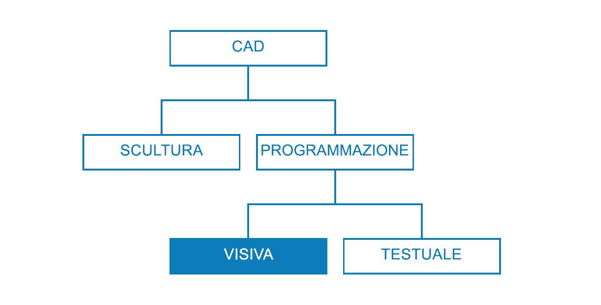
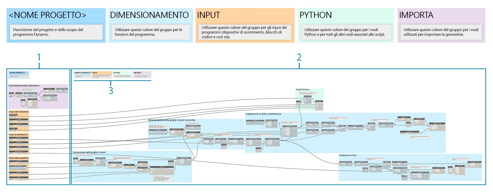
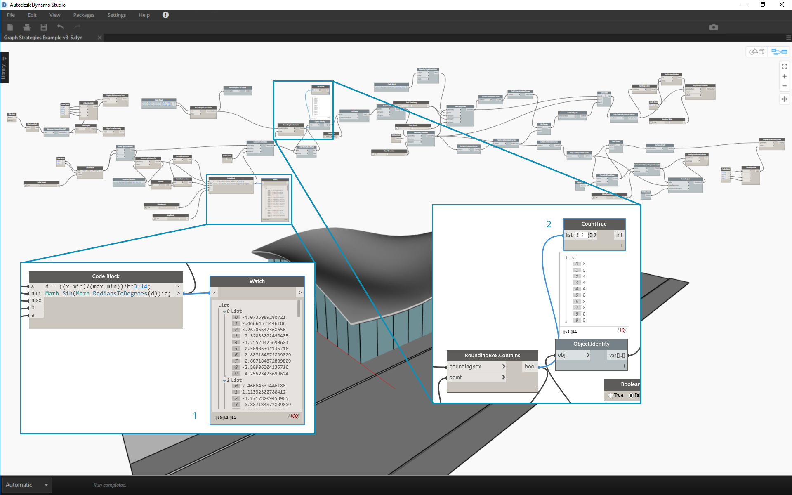

## Strategie sui grafici

Prima di questo capitolo, nella guida introduttiva è stato descritto come implementare le potenti funzionalità di scripting visivo di Dynamo. Una buona comprensione di queste funzionalità è una solida base e il primo passo nella compilazione di efficaci programmi visivi. Quando si utilizzano i programmi visivi sul campo, li si condivide con i colleghi, si correggono gli errori oppure si testano i limiti, ci sono altri problemi da risolvere. Se un altro utente sta utilizzando il programma o ci si aspetta di aprirlo tra sei mesi, deve avere un'immediata chiarezza grafica e logica. Dynamo dispone di molti strumenti per gestire la complessità del programma e in questo capitolo sono fornite linee guida su quando utilizzarli.

### Riduzione della complessità

Man mano che si sviluppa il grafico di Dynamo e si testano le idee, è possibile che la dimensione e la complessità aumentino rapidamente. Sebbene sia importante creare un programma funzionante, è altrettanto importante farlo il più semplicemente possibile. Non solo il grafico verrà eseguito in modo più rapido e più prevedibile, ma insieme ad altri utenti si potrà comprendere la sua logica in un secondo momento. Di seguito sono riportati diversi modi che consentono di chiarire la logica del grafico.

#### Modularizzazione con gruppi

* I gruppi consentono di **creare parti distinte dal punto di vista funzionale** durante la compilazione di un programma.
* I gruppi consentono di **spostare parti di grandi dimensioni del programma** mantenendo al contempo la modularità e l'allineamento.
* È possibile modificare il **colore del gruppo per differenziare** l'azione dei gruppi (input e funzioni).
* È possibile utilizzare i gruppi per iniziare a **organizzare il grafico per semplificare la creazione di nodi personalizzati**.

> I colori in questo programma identificano lo scopo di ciascun gruppo. Questa strategia può essere utilizzata per creare la gerarchia in eventuali modelli o standard grafici sviluppati.

> 1. Gruppo di funzioni (blu)
2. Gruppo di input (arancione)
3. Gruppo di script (verde)
> Per informazioni sull'utilizzo dei gruppi, fare riferimento a [Gestione del programma](http://primer.dynamobim.org/en/03_Anatomy-of-a-Dynamo-Definition/3-4_best_practices.html).

#### Sviluppo efficiente con i blocchi di codice

* A volte, è possibile utilizzare un blocco di codice per **digitare un metodo di nodo o numero più rapidamente della ricerca** (Point.ByCoordinates, Number, String, Formula).

* I blocchi di codice sono utili **quando si desidera definire funzioni personalizzate in DesignScript per ridurre il numero di nodi in un grafico**.

> Entrambi i valori 1 e 2 svolgono la stessa funzione. La scrittura di alcune righe di codice è molto più rapida rispetto alla ricerca e all'aggiunta di ogni nodo singolarmente. Anche il blocco di codice è molto più conciso.

> 1. Linguaggio DesignScript scritto nel blocco di codice
2. Programma equivalente nei nodi
> Per informazioni su come utilizzare il blocco di codice, vedere [Che cos'è un blocco di codice](http://primer.dynamobim.org/en/07_Code-Block/7-1_what-is-a-code-block.html).

#### Compressione con Nodo da aggiungere al codice

* È possibile **ridurre la complessità di un grafico utilizzando Nodo da aggiungere al codice**, che consente di acquisire una raccolta di nodi semplici e di scrivere il linguaggio DesignScript corrispondente in un unico blocco di codice.
* Nodo da aggiungere al codice può** comprimere il codice senza eliminare la chiarezza del programma**.
* Di seguito sono riportati i **vantaggi** dell'utilizzo di Nodo da aggiungere al codice:
* Comprime facilmente il codice in un componente che è ancora modificabile.
* Può semplificare una parte significativa del grafico.
* È utile se il "mini-programma" non verrà spesso modificato.
* È utile per incorporare altre funzionalità del blocco di codice, come le funzioni.

* Di seguito sono riportati gli **svantaggi** dell'utilizzo di Nodo da aggiungere al codice:
* La denominazione generica lo rende meno leggibile.
* È più difficile da comprendere per altri utenti.
* Non è possibile tornare facilmente alla versione di programmazione visiva.

> 1. Programma esistente
2. Blocco di codice creato da Nodo da aggiungere al codice
> Per informazioni su come utilizzare Nodo da aggiungere al codice, vedere [Sintassi di DesignScript](http://primer.dynamobim.org/en/07_Code-Block/7-2_Design-Script-syntax.html).

#### Accesso flessibile ai dati con List@Level

* L'utilizzo di List@Level può aiutare a **ridurre la complessità del grafico sostituendo i nodi List.Map e List.Combine** che potrebbero occupare una notevole quantità di spazio nell'area di disegno.
* List@Level offre un** modo più rapido rispetto a List.Map/List.Combine per costruire la logica dei nodi**, consentendo di accedere ai dati a qualsiasi livello in un elenco direttamente dalla porta di input di un nodo.

> Si può verificare quanti valori True BoundingBox.Contains restituisce e in quali elenchi attivando List@Level per l'input "list" di CountTrue. List@Level consente all'utente di determinare da quale livello l'input acquisirà i dati. L'utilizzo di List@Level è flessibile, efficiente e altamente incoraggiato rispetto ad altri metodi che coinvolgono List.Map e List.Combine.

> 1. Conteggio dei valori true al livello di elenco 2
2. Conteggio dei valori true al livello di elenco 3
> Per informazioni su come utilizzare List@Level, fare riferimento a [Elenchi di elenchi](http://primer.dynamobim.org/en/06_Designing-with-Lists/6-3_lists-of-lists.html#list@level).

### Mantenimento della leggibilità

Oltre a rendere il grafico il più semplice ed efficiente possibile, è necessario puntare alla chiarezza grafica. Nonostante i grandi sforzi compiuti per rendere il grafico intuitivo con raggruppamenti logici, le relazioni potrebbero non essere subito visibili. Una semplice nota all'interno di un gruppo o la ridenominazione di un dispositivo di scorrimento consente all'utente corrente o ad un altro utente di evitare un'inutile confusione o panoramica del grafico. Di seguito sono riportati diversi modi per applicare la coerenza grafica tra i grafici e al loro interno.

#### Continuità visiva con l'allineamento dei nodi

* Per ridurre il lavoro dopo aver completato la creazione del grafico, è necessario provare ad assicurarsi che il layout del nodo sia leggibile tramite l'**allineamento di nodi spesso e mentre si procede**.
* Se altri utenti lavoreranno con il grafico, è necessario **verificare che il layout nodo-collegamento fluisca facilmente prima del rilascio**.
* Per semplificare l'allineamento, **utilizzare la funzionalità "Semplifica layout nodi" per allineare automaticamente** il grafico, anche se in modo meno preciso rispetto a quello eseguito manualmente.

> 1. Grafico non organizzato
2. Grafico allineato
> Per informazioni sull'utilizzo dell'allineamento dei nodi, fare riferimento a [Gestione del programma](http://primer.dynamobim.org/en/03_Anatomy-of-a-Dynamo-Definition/3-4_best_practices.html).

#### Assegnazione di etichette descrittive mediante ridenominazione

* La ridenominazione degli input consente ad altri utenti di comprendere facilmente il grafico, **in particolare se ciò in cui questi si inseriranno sarà fuori dallo schermo**.
* **È consigliabile rinominare i nodi diversamente dagli input.** In alternativa, è possibile creare un nodo personalizzato da un cluster di nodi e rinominarlo. Si capirà che contiene qualcos'altro.

> 1. Input per la manipolazione della superficie
2. Input per i parametri architettonici
3. Input per lo script di simulazione del drenaggio
> Per rinominare un nodo, fare clic con il pulsante destro del mouse sul nome e scegliere "Rinomina nodo...".

#### Spiegazione con delle note

* Se un elemento del **grafico richiede una spiegazione in un linguaggio semplice** che i nodi non possono esprimere, è necessario aggiungere una nota.
* Se una raccolta di **nodi o un gruppo è troppo grande o complesso e non può essere facilmente compreso immediatamente**, è necessario aggiungere una nota.

> 1. Una nota che descrive la parte del programma che restituisce le distanze di traslazione non elaborate
2. Una nota che descrive il codice che associa tali valori a un'onda sinusoidale
> Per informazioni su come aggiungere una nota, fare riferimento a [Gestione del programma](http://primer.dynamobim.org/en/03_Anatomy-of-a-Dynamo-Definition/3-4_best_practices.html).

### Flessibilità continua

Durante la compilazione dello script visivo, è importante verificare che ciò che viene restituito sia quello previsto. Non tutti gli errori o i problemi causano immediatamente la mancata esecuzione del programma, in particolare valori nulli o pari a zero che potrebbero influire più a valle. Questa strategia viene inoltre discussa nel contesto dello scripting di testo in [Strategie di scripting](http://primer.dynamobim.org/en/12_Best-Practice/13-2_Scripting-Strategies.html). La seguente procedura consentirà di assicurarsi di ottenere quanto previsto.

#### Monitoraggio dei dati con i simboli circolari di anteprima e controllo

* Durante la compilazione del programma, utilizzare i simboli circolari di anteprima o controllo per** verificare che gli output chiave restituiscano ciò che è previsto**.

> I nodi Watch vengono utilizzati per confrontare:

> 1. Le distanze di traslazione non elaborate
2. I valori passati tramite l'equazione in seno
> Per informazioni su come utilizzare Watch, fare riferimento a [Libreria](http://primer.dynamobim.org/en/03_Anatomy-of-a-Dynamo-Definition/3-2_dynamo_libraries.html).

### Garanzia di riutilizzabilità

È molto probabile che qualcun altro stia aprendo il programma in un certo punto, anche se si lavora in modo indipendente. Deve essere in grado di comprendere rapidamente cosa il programma richiede e produce dai relativi input e output. Ciò è particolarmente importante quando si sviluppa un nodo personalizzato da condividere con la community di Dynamo e utilizzarlo nel programma di qualcun'altro. Queste pratiche portano a programmi e nodi solidi e riutilizzabili.

#### Gestione dell'I/O

* Per garantire la leggibilità e la scalabilità, è necessario provare a **ridurre al minimo input e output il più possibile**.
* È necessario tentare di **pianificare la modalità di compilazione della logica creando innanzitutto una descrizione approssimativa** di come la logica potrebbe funzionare anche prima di aggiungere un singolo nodo all'area di disegno. Mentre si sviluppa la descrizione approssimativa, è necessario tenere traccia degli input e degli output che verranno inseriti negli script.

#### Uso delle preimpostazioni per incorporare i valori di input

* Se nel grafico sono presenti **determinate opzioni o condizioni che si desidera incorporare**, è necessario utilizzare le preimpostazioni per l'accesso rapido.
* È inoltre possibile utilizzare le preimpostazioni per **ridurre la complessità memorizzando nella cache valori specifici del dispositivo di scorrimento** in un grafico con tempi di esecuzione lunghi.

> Per informazioni sull'uso delle preimpostazioni, fare riferimento a [Gestione dei dati con le preimpostazioni](http://primer.dynamobim.org/en/03_Anatomy-of-a-Dynamo-Definition/3-5_presets.html).

#### Contenimento di programmi con nodi personalizzati

* È necessario utilizzare un nodo personalizzato se **è possibile raccogliere il programma in un unico contenitore**.
* È necessario utilizzare un nodo personalizzato **quando una parte del grafico verrà riutilizzata spesso** in altri programmi.
* È necessario utilizzare un nodo personalizzato se si desidera **condividere una funzionalità con la community di Dynamo**.

> La raccolta del programma di traslazione dei punti in un nodo personalizzato rende un programma affidabile, unico e molto più facile da comprendere. Le porte di input con nome significativo consentono ad altri utenti di comprendere come utilizzare il nodo. Ricordarsi di aggiungere le descrizioni e i tipi di dati richiesti per ogni input.

> 1. Programma dell'attrattore esistente
2. Nodo personalizzato che raccoglie questo programma, PointGrid
> Per informazioni sull'utilizzo dei nodi personalizzati, vedere [Introduzione ai nodi personalizzati](http://primer.dynamobim.org/en/09_Custom-Nodes/9-1_Introduction.html).

#### Creazione di modelli

* È possibile creare modelli per **stabilire standard grafici nei grafici visivi al fine di garantire che i collaboratori abbiano un metodo standardizzato di comprensione del grafico**.
* Durante la creazione di un modello, è possibile standardizzare **i colori dei gruppi e le dimensioni dei font** per suddividere in categorie i tipi di workflow o le azioni di dati.
* Durante la creazione di un modello, è anche possibile standardizzare il modo in cui si desidera **etichettare, colorare o applicare stili alla differenza tra i workflow front-end e back-end** nel grafico.

> 1. L'interfaccia utente, o front-end, del programma include un nome di progetto, dispositivi di scorrimento di input e geometria di importazione.
2. Il back-end del programma.
3. Categorie di colori dei gruppi (progettazione generale, input, scripting Python, geometria importata).

### Esercizio - Tetto architettonico

> Scaricare il file di esempio fornito con questo esercizio (fare clic con il pulsante destro del mouse e scegliere Salva link con nome...). Un elenco completo di file di esempio è disponibile nell'Appendice. [RoofDrainageSim.zip](datasets/13-2/RoofDrainageSim.zip)

Ora che sono state definite diverse pratiche ottimali, è possibile applicarle ad un programma che è stato realizzato rapidamente. Sebbene il programma possa generare il tetto, lo stato del grafico è una "mappa mentale" del programmatore. Non è presente alcuna organizzazione o descrizione del suo utilizzo. Si esamineranno le procedure ottimali per organizzare, descrivere e analizzare il programma in modo che altri utenti possano comprendere come utilizzarlo.

> Il programma funziona, ma il grafico è disorganizzato.

Iniziare determinando i dati e la geometria restituiti dal programma.

> Comprendere quando si apportano modifiche importanti ai dati è fondamentale per stabilire le divisioni logiche o la modularità. Provare a controllare il resto del programma con i nodi Watch per verificare se è possibile determinare i gruppi prima di andare al passaggio successivo.

> 1. Questo blocco di codice con un'equazione matematica è un elemento cruciale del programma. Un nodo Watch visualizza che restituisce elenchi di distanze di traslazione.
2. Lo scopo di quest'area non è immediatamente ovvio. La disposizione dei valori True al livello di elenco L2 di BoundingBox.Contains e la presenza di List.FilterByBoolMask suggerisce che si sta campionando una parte della griglia di punti.

Una volta comprese le parti elementari del programma, si possono inserirle in gruppi.

> I gruppi consentono all'utente di differenziare visivamente le parti del programma.

> 1. Importare il modello della planimetria 3D
2. Convertire la griglia di punti in base all'equazione in seno
3. Parte campione della griglia di punti
4. Creare una superficie del tetto architettonico
5. Creare una facciata continua in vetro

Con i gruppi stabiliti, allineare i nodi per creare una continuità visiva nel grafico.

> La continuità visiva consente all'utente di vedere il flusso del programma e le relazioni implicite tra i nodi.

Rendere il programma più accessibile aggiungendo un altro livello di miglioramenti grafici. Aggiungere note per descrivere il funzionamento di una specifica area del programma, assegnare nomi personalizzati agli input e assegnare colori a diversi tipi di gruppi.

> Questi miglioramenti grafici consentono all'utente di conoscere meglio le attività del programma. I diversi colori dei gruppi consentono di distinguere gli input dalle funzioni.

> 1. Note
2. Input con nomi descrittivi

Prima di iniziare a comprimere il programma, è necessario individuare una posizione strategica per introdurre il simulatore di drenaggio dello script Python. Inserire l'output della prima superficie del tetto in scala nel rispettivo input di scripting.

> Si è scelto di integrare lo scripting in questo punto del programma in modo che la simulazione del drenaggio possa essere eseguita sulla superficie originale del tetto singolo. Questa superficie specifica non viene visualizzata in anteprima, ma consente di evitare di scegliere la superficie superiore della PolySurface smussata.

> 1. Geometria di origine per l'input dello script
2. Nodo Python
3. Dispositivi di scorrimento di input
4. "Interruttore" attivato/disattivato

Si può semplificare il grafico ora che tutto è pronto.

> La compressione del programma con Nodo da aggiungere al codice e Nodo personalizzato ha ridotto notevolmente la dimensione del grafico. I gruppi che creano la superficie del tetto e i muri sono stati convertiti in codice poiché sono molto specifici di questo programma. Il gruppo di traslazione dei punti è contenuto in un nodo personalizzato, in quanto potrebbe essere utilizzato in un altro programma. Nel file di esempio, creare il proprio nodo personalizzato dal gruppo di traslazione dei punti.

> 1. Nodo personalizzato per contenere il gruppo di "traslazione della griglia di punti"
2. Nodo da aggiungere al codice per comprimere i gruppi di "creazione della superficie del tetto architettonico e della facciata continua"

Come passaggio finale, creare preimpostazioni per forme di tetto esemplificative.

> Questi input sono i fattori principali della forma del tetto e consentiranno agli utenti di vedere il potenziale del programma.

Il programma con le viste di due preimpostazioni.

> I modelli di drenaggio del tetto offrono all'utente una vista analitica delle rispettive preimpostazioni.

