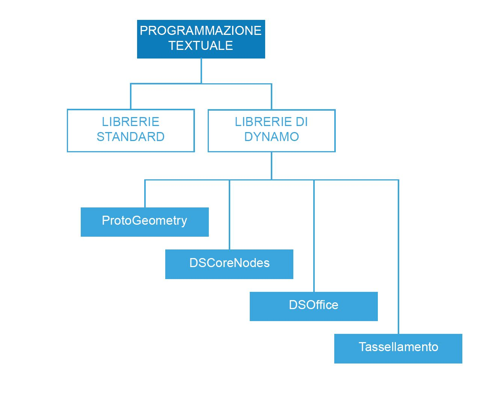

## Riferimento per lo scripting

Questa pagina di riferimento estende le procedure ottimali descritte in Strategie di scripting con maggiori dettagli su librerie di codici, etichettatura e applicazione di stili. Per illustrare i concetti riportati di seguito, verrà utilizzato Python, ma gli stessi principi si applicano a Python e C# (zero-touch) ma con una sintassi diversa.

### Quali librerie utilizzare

Le librerie standard sono esterne a Dynamo e sono presenti nei linguaggi di programmazione Python e C# (zero-touch). Dynamo dispone anche di un suo gruppo di librerie che corrispondono direttamente alla gerarchia dei nodi, consentendo all'utente di creare qualsiasi elemento nel codice che potrebbe essere creato con nodi e fili. Di seguito è riportata una guida per quali elementi a cui ciascuna libreria di Dynamo consente di accedere e per quando utilizzarne una standard.



**Librerie standard e librerie di Dynamo**

* Le librerie standard di Python e C# possono essere utilizzate per creare strutture avanzate di flussi e dati nell'ambiente Dynamo.
* Le librerie di Dynamo corrispondono direttamente alla gerarchia dei nodi per la creazione della geometria e di altri oggetti di Dynamo.

**Librerie di Dynamo**

* ProtoGeometry
  * Funzionalità: arco, riquadro di delimitazione, cerchio, cono, sistema di coordinate, cuboide, curva, cilindro, spigolo, ellisse, arco di ellisse, faccia, geometria, elica, gruppo di indici, linea, mesh, curva NURBS, superficie NURBS, piano, punto, poligono, rettangolo, solido, sfera, superficie, topologia, TSpline, UV, vettore, vertice.
  * Come importare: ```import Autodesk.DesignScript.Geometry```
  * **Nota: quando si utilizza ProtoGeometry tramite Python o C#**, si stanno creando oggetti non gestiti, che richiedono la gestione manuale della memoria. Per ulteriori informazioni, vedere la sezione riportata di seguito: **Oggetti non gestiti**.
* DSCoreNodes
  * Funzionalità: colore, intervallo di colori 2D, data e ora, intervallo di tempo, IO, formula, logica, elenco, matematica, Quadtree, stringa, filettatura.
  * Come importare: ```import DSCore```
* Tassellamento
  * Funzionalità: superficie convessa, Delaunay, Voronoi.
  * Come importare: ```import Tessellation```
* DSOffice
  * Funzionalità: Excel.
  * Come importare: ```import DSOffice```

### Etichettatura con attenzione

Durante lo scripting, vengono costantemente utilizzati identificatori per denotare elementi quali variabili, tipi, funzioni e altre entità. Attraverso questo sistema di notazione simbolica, mentre si creano algoritmi si può comodamente fare riferimento alle informazioni tramite etichette, solitamente composte da una sequenza di caratteri. L'assegnazione di nomi alle cose gioca un ruolo significativo nella scrittura di un codice che possa essere facilmente letto e compreso da altri e in futuro anche dal programmatore stesso. Di seguito sono riportati alcuni suggerimenti da tenere presenti durante la denominazione di elementi nello script:

**È possibile utilizzare abbreviazioni, ma spiegare l'abbreviazione con un commento:**

```
### BAD
csfX = 1.6
csfY= 1.3
csfZ = 1.0
```

```
### GOOD
# column scale factor (csf)
csfX = 1.6
csfY= 1.3
csfZ = 1.0
```

**Evitare l'etichettatura ridondante:**

```
### BAD
import car
seat = car.CarSeat()
tire = car.CarTire()
```

```
### GOOD
import car
seat = car.Seat()
tire = car.Tire()
```

**Utilizzare la logica positiva per i nomi delle variabili anziché la logica negativa:**

```
### BAD
if 'mystring' not in text:
print 'not found'
else:
print 'found'
print 'processing'
```

```
### GOOD
if 'mystring' in text:
print 'found'
print 'processing'
else:
print 'not found'
```

**Preferire la "notazione inversa":**

```
### BAD
agents = …
active_agents = …
dead_agents ...
```

```
### GOOD
agents = …
agents_active = …
agents_dead = ...
```

> È più adatta, in termini strutturali.

**Per accorciare le catene troppo lunghe e spesso ripetute, è necessario utilizzare alias:**

```
### BAD
from RevitServices.Persistence import DocumentManager

DocumentManager = DM

doc = DM.Instance.CurrentDBDocument
uiapp = DM.Instance.CurrentUIApplication
```

```
### GOOD
from RevitServices.Persistence import DocumentManager as DM

doc = DM.Instance.CurrentDBDocument
uiapp = DM.Instance.CurrentUIApplication
```

> L'aliasing può portare rapidamente a programmi molto confusi e non standard.

**Utilizzare solo parole necessarie:**

```
### BAD
rotateToCoord = rotateFromCoord.Rotate(solid.ContextCoordinateSystem.Origin,Vector.ByCoordinates(0,0,1),5)
```

```
### GOOD
toCoord = fromCoord.Rotate(solid.ContextCoordinateSystem.Origin,Vector.ByCoordinates(0,0,1),5)
```

> "Tutto dovrebbe essere reso il più semplice possibile, ma non più semplice." – Albert Einstein

### Stile coerente

In generale, esistono più modi per programmare qualsiasi cosa, quindi lo "stile personale" di scripting è il risultato delle innumerevoli piccole decisioni che si è scelto di prendere (o di non prendere) lungo la strada. Detto questo, la leggibilità e la gestibilità del codice sono un risultato diretto della sua coerenza interna e della sua conformità alle convenzioni stilistiche generali. Come regola generale, anche il codice che risulta identico in due punti dovrebbe funzionare allo stesso modo. Di seguito sono riportati alcuni suggerimenti per la scrittura di un codice chiaro e coerente.

**Convenzioni di denominazione:** scegliere una delle convenzioni riportate di seguito per ogni tipo di entità nel codice e attenersi ad essa.

* Variabili, funzioni, metodi, pacchetti, moduli:
`lower_case_with_underscores`

* Classi ed eccezioni:
`CapWords`

* Metodi protetti e funzioni interne:
`_single_leading_underscore(self, ...)`

* Metodi privati:
`__double_leading_underscore(self, ...)`

* Costanti:
`ALL_CAPS_WITH_UNDERSCORES`

> Suggerimento: evitare variabili con una lettera (soprattutto l, O, I) tranne che in blocchi molto corti, quando il significato è chiaramente visibile dal contesto immediato.

**Utilizzo di righe vuote:**

* Circondare le definizioni di classi e funzioni di livello superiore con due righe vuote.

  * Le definizioni dei metodi all'interno di una classe sono circondate da una singola riga vuota.

  * È possibile utilizzare (con moderazione) righe vuote aggiuntive per separare gruppi di funzioni correlate.

**Evitare spazi estranei:**

* Immediatamente all'interno delle parentesi tonde, quadre o graffe:

```
### BAD
function( apples[ 1 ], { oranges: 2 } )
```

```
### GOOD:
function(apples[1], {oranges: 2})
```

* Subito prima di una virgola, un punto e virgola o due punti:

```
### BAD
if x == 2 : print x , y ; x , y = y , x
```

```
### GOOD
if x == 2: print x, y; x, y = y, x
```

* Subito prima della parentesi aperta che inizia l'elenco di argomenti di una chiamata di funzione:

```
### BAD
function (1)
```

```
### GOOD
function(1)
```

* Subito prima della parentesi aperta che inizia un'indicizzazione o un sezionamento:

```
### BAD
dict ['key'] = list [index]
```

```
### GOOD
dict['key'] = list[index]
```

* Circondare sempre questi operatori binari con uno spazio su entrambi i lati:

```
assignment ( = )
augmented assignment ( += , -= etc.)
comparisons ( == , < , > , != , <> , <= , >= , in , not in , is , is not )
Booleans ( and , or , not )
```

**Controllare la lunghezza della riga:**

* Non superare circa i 79 caratteri.

* Limitare la larghezza richiesta per la finestra dell'editor consente di mostrare diversi file aperti affiancati e funziona bene quando si utilizzano gli strumenti di verifica del codice che presentano le due versioni in colonne adiacenti.

* Le righe lunghe possono essere suddivise su più righe con il ritorno a capo delle espressioni tra parentesi:

**Evitare commenti ovvi e ridondanti:**

* A volte meno commenti creano codice più leggibile. Soprattutto se obbliga ad utilizzare nomi di simboli significativi.

* L'adozione di buone abitudini di codifica riduce la dipendenza dai commenti:

```
### BAD
# get the country code
country_code = get_country_code(address)

# if country code is US
if (country_code == 'US'):
# display the form input for state
print form_input_state()
```

```
### GOOD
# display state selection for US users
country_code = get_country_code(address)
if (country_code == 'US'):
print form_input_state()
```

> Suggerimento: i commenti indicano perché, il codice indica come.

**Verificare il codice open source:**

* I progetti open source sono realizzati grazie alle iniziative collaborative di molti sviluppatori. Questi progetti devono mantenere un elevato livello di leggibilità del codice, in modo che il team possa collaborare nel modo più efficiente possibile. È pertanto consigliabile esaminare il codice sorgente di questi progetti per osservare le attività di questi sviluppatori.

* Migliorare le convenzioni:

  * Chiedersi se ciascuna convenzione soddisfa o meno le esigenze imminenti.

  * Le funzionalità/L'efficienza sono compromesse?

### Standard di C# (zero-touch)

**Consultare queste pagine Wiki per indicazioni sulla scrittura di C# per la funzionalità zero-touch e sul contributo a Dynamo:**

  * Questa Wiki illustra alcuni standard di codifica generali per la documentazione e il test del codice: [https://github.com/DynamoDS/Dynamo/wiki/Coding-Standards](https://github.com/DynamoDS/Dynamo/wiki/Coding-Standards).

  * Questa Wiki illustra in particolare gli standard di denominazione per librerie, categorie, nomi di nodi, nomi di porte e abbreviazioni: [https://github.com/DynamoDS/Dynamo/wiki/Naming-Standards](https://github.com/DynamoDS/Dynamo/wiki/Naming-Standards).

  **Oggetti non gestiti:**

  Quando si utilizza la libreria della geometria di Dynamo *(ProtoGeometry)* da Python o C#, gli oggetti della geometria che si creano non verranno gestiti dalla macchina virtuale e la memoria di molti di questi oggetti dovrà essere pulita manualmente. Per eliminare oggetti nativi o non gestiti, è possibile utilizzare il metodo **Dispose** o la parola chiave **using**. Per una panoramica, vedere questa voce Wiki: [https://github.com/DynamoDS/Dynamo/wiki/Zero-Touch-Plugin-Development#dispose--using-statement](https://github.com/DynamoDS/Dynamo/wiki/Zero-Touch-Plugin-Development#dispose--using-statement).

  È sufficiente eliminare le risorse non gestite che non vengono restituite nel grafico o in cui non viene memorizzato un riferimento. Per il resto di questa sezione, si farà riferimento a questi oggetti come *geometria intermedia*. Nell'esempio di codice riportato di seguito è mostrato un esempio di questa classe di oggetto. Questa funzione di C# zero-touch **singleCube** restituisce un singolo cubo, ma crea 10.000 cubi aggiuntivi durante l'esecuzione. Si può far finta che quest'altra geometria sia stata utilizzata come geometria di costruzione intermedia.

  **Questa funzione zero-touch probabilmente provocherà un arresto anomalo di Dynamo.** E ciò perché sono stati creati 10.000 solidi, ma ne è stato memorizzato solo uno e ne è stato restituito solo uno. Si dovrebbero invece eliminare tutti i cubi intermedi, tranne quello restituito. Non si desidera eliminare ciò che viene restituito, perché verrà propagato nel grafico e utilizzato da altri nodi.

```
public Cuboid singleCube(){

var output = Cuboid.ByLengths(1,1,1);

for(int i = 0; i<10000;i++){
output = Cuboid.ByLengths(1,1,1);
}
return output;
}
```

Il codice corretto avrà un aspetto simile al seguente:

```
public Cuboid singleCube(){

var output = Cuboid.ByLengths(1,1,1);
var toDispose = new List<Geometry>();

for(int i = 0; i<10000;i++){
toDispose.Add(Cuboid.ByLengths(1,1,1));
}

foreach(IDisposable item in toDispose ){
item.Dispose();
}

return output;
}
```

In generale, è necessario eliminare solo la geometria come ```Surfaces```, ```Curves``` e ```Solids```. Per essere sicuri, tuttavia, è possibile eliminare tutti i tipi di geometria (```Vectors```, ```Points```, ```CoordinateSystems```).

