

# INDICE DEI NODI

##### In questo indice sono fornite informazioni aggiuntive su tutti i nodi utilizzati in questa guida introduttiva, nonché su altri componenti che potrebbero risultare utili. Questa è solo un'introduzione ad alcuni dei 500 nodi disponibili in Dynamo.

## Funzioni incorporate

||||
| -- | -- | -- |
||**Conteggio** Restituisce il numero di voci dell'elenco specificato.||
||**Livella** Restituisce l'elenco unidimensionale non nidificato dell'elenco di input multidimensionale.||
||**Mappa** Mappa un valore in un intervallo di input.||

## Punzone

#### Core.Color

||||
| -- | -- | -- |
||CREAZIONE||
||**Color.ByARGB** Crea un colore in base ai componenti alfa, rosso, verde e blu.||
||**Intervallo colori** Restituisce un colore da una sfumatura di colore compresa tra un colore iniziale e uno finale.||
||AZIONI||
||**Color.Brightness** Restituisce il valore di luminosità del colore.||
||**Color.Components** Elenca i componenti del colore nell'ordine seguente: alfa, rosso, verde, blu.|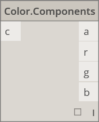|
||**Color.Saturation** Restituisce il valore di saturazione del colore.||
||**Color.Hue** Restituisce il valore di tonalità del colore.||
||QUERY||
||**Color.Alpha** Individua il componente alfa di un colore, da 0 a 255.||
||**Color.Blue** Individua il componente blu di un colore, da 0 a 255.||
||**Color.Green** Individua il componente verde di un colore, da 0 a 255.||
||**Color.Red** Individua il componente rosso di un colore, da 0 a 255.||

#### Core.Display

||||
| -- | -- | -- |
||CREAZIONE||
||**Display.ByGeometryColor** Visualizza la geometria con un colore.||

#### Core.Input

||||
| -- | -- | -- |
||AZIONI||
||**Booleano** Possibile selezione: true o false.||
||**Blocco codice** Consente la creazione diretta di codice DesignScript.||
||**Percorso di directory** Consente di selezionare una directory del sistema per ottenere il relativo percorso.||
||**Percorso file** Consente di selezionare un file nel sistema per ottenere il relativo nome file.||
||**Dispositivo di scorrimento numero intero** Dispositivo di scorrimento che genera numeri interi.||
||**Numero**  Crea un numero.|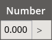|
||**Dispositivo di scorrimento numero**  Dispositivo di scorrimento che genera valori numerici.||
||**String** Crea una stringa.||

#### Core.List

||||
| -- | -- | -- |
||CREAZIONE||
||**List.Create** Crea un nuovo elenco in base agli input specificati.||
||**List.Combine** Applica un combinatore ad ogni elemento in due sequenze.||
||**Intervallo di numeri** Crea una sequenza di numeri nell'intervallo specificato.||
||**Sequenza numerica** Crea una sequenza di numeri.||
||AZIONI||
||**List.Chop** Suddivide un elenco in un gruppo di elenchi, ognuno con il numero di voci impostato.||
||**List.Count** Restituisce il numero di elementi memorizzati nell'elenco dato.||
||**List.Flatten** Riduce di un determinato numero di livelli la nidificazione di una lista di elenchi.||
||**List.FilterByBoolMask** Consente di applicare un filtro ad una sequenza sulla base di indici corrispondenti in un elenco di valori booleani separato.|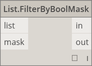|
||**List.GetItemAtIndex** Restituisce un elemento dall'elenco dato, situato in corrispondenza dell'indice specificato.||
||**List.Map** Applica una funzione a tutti gli elementi di un elenco, generando un nuovo elenco dai risultati.||
|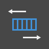|**List.Reverse** Crea un nuovo elenco con gli elementi dell'elenco dato disposti in ordine inverso.|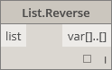|
||**List.ReplaceItemAtIndex** Sostituisce una voce posizionata in corrispondenza dell'indice specificato nell'elenco dato.||
||**List.ShiftIndices** Sposta indici nell'elenco verso destra, in base al valore specificato.||
||**List.TakeEveryNthItem** Ricava voci dall'elenco in corrispondenza di indici multipli del valore dato, dopo l'offset indicato.||
||**List.Transpose** Scambia righe e colonne in una lista di elenchi. Se alcune righe sono più corte di altre, nella matrice risultante vengono inseriti valori null come segnaposto, per ottenere sempre una matrice rettangolare.||

#### Core.Logic

||||
| -- | -- | -- |
||AZIONI||
||**If** Istruzione condizionale. Verifica il valore booleano dell'input di prova. Se l'input del test è true, il risultato produce l'input reale, altrimenti il risultato genera l'input false.||

#### Core.Math

||||
| -- | -- | -- |
||AZIONI||
||**Math.Cos** Restituisce il coseno di un angolo.||
||**Math.DegreesToRadians** Converte un angolo in gradi in un angolo in radianti.||
||**Math.Pow** Eleva un numero alla potenza specificata.||
||**Math.RadiansToDegrees** Converte un angolo in radianti in un angolo in gradi.||
||**Math.RemapRange** Regola l'intervallo di un elenco di numeri, mantenendo il rapporto di distribuzione.||
||**Math.Sin** Determina il seno di un angolo.||

#### Core.Object

||||
| -- | -- | -- |
||AZIONI||
||**Object.IsNull** Determina se l'oggetto dato è nullo.||

#### Core.Scripting

||||
| -- | -- | -- |
||AZIONI||
||**Formula** Valuta le formule matematiche. Utilizza NCalc per la valutazione. Vedere [http://ncalc.codeplex.com](http://ncalc.codeplex.com)|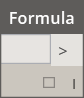|

#### Core.String

||||
| -- | -- | -- |
||AZIONI||
||**String.Concat** Concatena più stringhe in un'unica stringa.||
||**String.Contains** Determina se la stringa data contiene la sottostringa data.||
||**String.Join** Concatena più stringhe in un'unica stringa, inserendo il separatore dato tra le stringhe concatenate.||
||**String.Split** Suddivide una singola stringa in un elenco di stringhe, in corrispondenza delle stringhe separatore date.||
||**String.ToNumber** Converte una stringa in un intero o un valore Double.||

#### Core.View

||||
| -- | -- | -- |
||AZIONI||
||**View.Watch** Visualizza l'output del nodo.|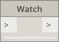|
||**View.Watch 3D** Visualizza un'anteprima dinamica della geometria.||

## Geometria

#### Geometry.Circle

||||
| -- | -- | -- |
||CREAZIONE||
||**Circle.ByCenterPointRadius** Crea un cerchio con un punto centrale di input e un raggio dati nel piano XY globale, con l'asse Z globale come normale.||
||**Circle.ByPlaneRadius** Crea un cerchio con centro nell'origine del piano di input (radice), posto sul piano di input, con il raggio specificato.||

#### Geometry.CoordinateSystem

||||
| -- | -- | -- |
||CREAZIONE||
||**CoordinateSystem.ByOrigin** Crea un CoordinateSystem con origine nel punto di input. Gli assi X e Y sono impostati come assi WCS X e Y.||
||**CoordinateSystem.ByCyclindricalCoordinates** Crea un CoordinateSystem in corrispondenza dei parametri di coordinata cilindrica specificati, rispetto al sistema di coordinate specificato.||

#### Geometry.Cuboid

||||
| -- | -- | -- |
||CREAZIONE||
||**Cuboid.ByLengths** (origine) Crea un cuboide con centro nel punto di input e con la larghezza, lunghezza e altezza specificate.||

#### Geometry.Curve

||||
| -- | -- | -- |
||AZIONI||
||**Curve.Extrude** (distanza) Estrude una curva nella direzione del vettore normale.||
||**Curve.PointAtParameter** Ottiene un punto sulla curva in corrispondenza di un parametro specificato, incluso tra StartParameter() e EndParameter().|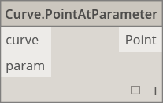|

#### Geometry.Geometry

||||
| -- | -- | -- |
||AZIONI||
||**Geometry.DistanceTo** Restituisce la distanza tra la geometria corrente e un'altra geometria.||
||**Geometry.Explode** Separa gli elementi composti o non separati nei rispettivi componenti.||
||**Geometry.ImportFromSAT** Elenco delle geometrie importate||
|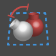|**Geometry.Rotate** (basePlane) Ruota un oggetto di un numero di gradi specificato intorno all'origine del piano e alla normale.||
||**Geometry.Translate** Applica la traslazione a qualsiasi tipo di geometria, con la distanza e la direzione specificate.||

#### Geometry.Line

||||
| -- | -- | -- |
||CREAZIONE||
||**Line.ByBestFitThroughPoints** Crea la linea di approssimazione ottimale tra i punti di un insieme diffuso.||
||**Line.ByStartPointDirectionLength** Crea una linea retta a partire dal punto, che si estende nella direzione del vettore per la lunghezza specificata.||
||**Line.ByStartPointEndPoint** Crea una linea retta tra due punti di input.||
||**Line.ByTangency** Crea una linea tangente alla curva di input, posizionata nel punto della curva corrispondente al parametro.||
||QUERY||
||**Line.Direction** Direzione della curva.||

#### Geometry.NurbsCurve

||||
| -- | -- | -- |
||Crea||
||**NurbsCurve.ByControlPoints** Crea una curva BSpline mediante punti di controllo espliciti.||
||**NurbsCurve.ByPoints** Crea una curva BSpline tramite interpolazione tra i punti.|qcomm|

#### Geometry.NurbsSurface

||||
| -- | -- | -- |
||Crea||
||**NurbsSurface.ByControlPoints** Crea una NurbsSurface utilizzando punti di controllo espliciti con i gradi U e V specificati.||
||**NurbsSurface.ByPoints** Crea una NurbsSurface con i punti interpolati e i gradi U e V specificati. La superficie risultante passa attraverso tutti i punti.||

#### Geometry.Plane

||||
| -- | -- | -- |
||CREAZIONE||
||**Plane.ByOriginNormal** Crea un piano centrato nel punto radice, con il vettore normale di input.|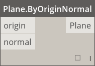|
||**Plane.XY** Crea un piano nel piano XY globale.||

#### Geometry.Point

||||
| -- | -- | -- |
||CREAZIONE||
||**Point.ByCartesianCoordinates** Definisce un punto da tre coordinate cartesiane nel sistema di coordinate dato.||
|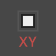|**Point.ByCoordinates** (2D)  Definisce un punto nel piano XY da due coordinate cartesiane. Il componente Z è 0.||
||**Point.ByCoordinates** (3D) Definisce un punto da tre coordinate cartesiane.|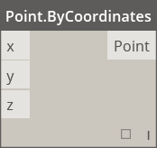|
||**Point.Origin** Ottiene il punto di origine (0,0,0).||
||AZIONI||
||**Point.Add** Aggiunge un vettore ad un punto. Analoga a Translate(Vector).||
||QUERY||
||**Point.X** Ottiene il componente X di un punto.||
||**Point.Y** Ottiene il componente Y di un punto.||
||**Point.Z** Ottiene il componente Z di un punto.|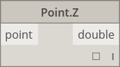|

#### Geometry.Polycurve

||||
| -- | -- | -- |
||CREAZIONE||
||**Polycurve.ByPoints** Crea una PolyCurve dalla sequenza di linee che collegano i punti. Per la curva chiusa l'ultimo punto dovrebbe trovarsi nella stessa posizione del punto iniziale.||

#### Geometry.Rectangle

||||
| -- | -- | -- |
||CREAZIONE||
||**Rectangle.ByWidthLength** (piano) Crea un rettangolo centrato nel punto di origine del piano di input, con larghezza (lunghezza asse X del piano) e lunghezza (lunghezza asse Y del piano) di input.||

#### Geometry.Sphere

||||
| -- | -- | -- |
||CREAZIONE||
||**Sphere.ByCenterPointRadius** Crea una sfera solida centrata nel punto di input, con il raggio dato.||

#### Geometry.Surface

||||
| -- | -- | -- |
||CREAZIONE||
||**Surface.ByLoft** Crea una superficie mediante loft tra curve di sezione trasversale di input.||
||**Surface.ByPatch** Crea una superficie mediante il riempimento di un contorno chiuso definito da curve di input.||
||AZIONI||
||**Surface.Offset** Applica un offset alla superficie in direzione della normale e in base ad una distanza specificata.||
||**Surface.PointAtParameter** Restituisce il punto in corrispondenza dei parametri U e V specificati.||
||**Surface.Thicken** Ispessisce una superficie e crea un solido. L'estrusione avviene nella direzione delle normali su entrambi i lati della superficie.|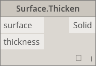|

#### Geometry.UV

||||
| -- | -- | -- |
||CREAZIONE||
||**UV.ByCoordinates** Crea un UV da due valori Double.||

#### Geometry.Vector

||||
| -- | -- | -- |
||CREAZIONE||
||**Vector.ByCoordinates**Definisce un vettore a partire da tre coordinate euclidee.|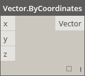|
||**Vector.XAxis** Ottiene il vettore asse X canonico (1,0,0).||
|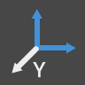|**Vector.YAxis** Ottiene il vettore asse Y canonico (0,1,0).||
||**Vector.ZAxis** Ottiene il vettore asse Z canonico (0,0,1).||
||AZIONI||
||**Vector.Normalized** Ottiene la versione normalizzata di un vettore.||

## Operatori

||||
| -- | -- | -- |
||**+** Addizione||
||**-** Sottrazione||
||***** Moltiplicazione||
||**/** Divisione||
||**%** La divisione modulare trova il resto del primo input dopo la divisione per il secondo input.||
||**<** Minore di||
||**>** Maggiore di|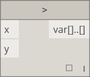|
||**==** L'uguaglianza verifica la parità tra due valori.||

