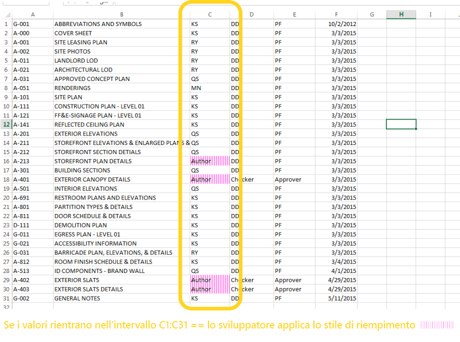
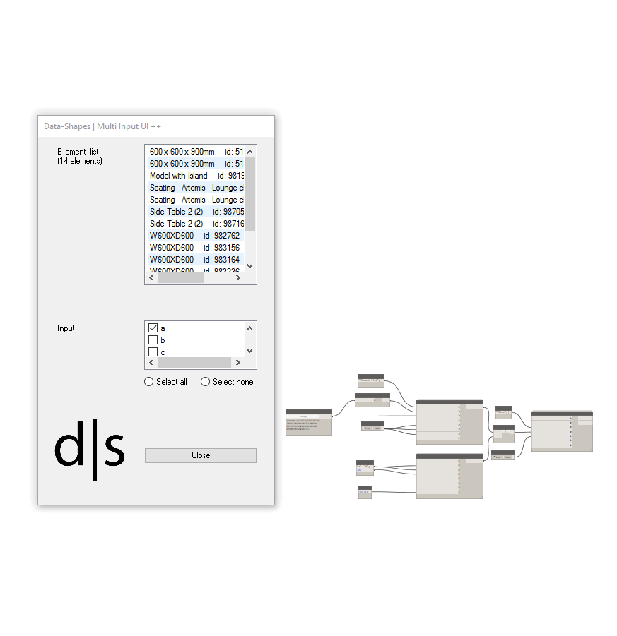
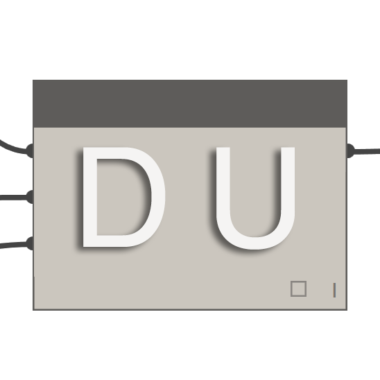
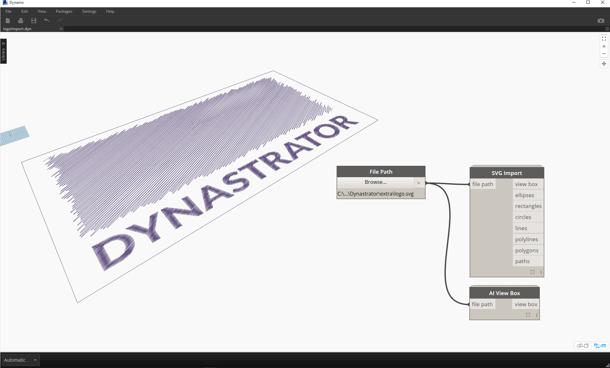
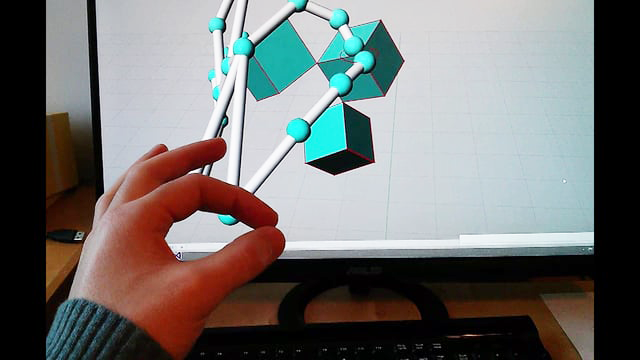
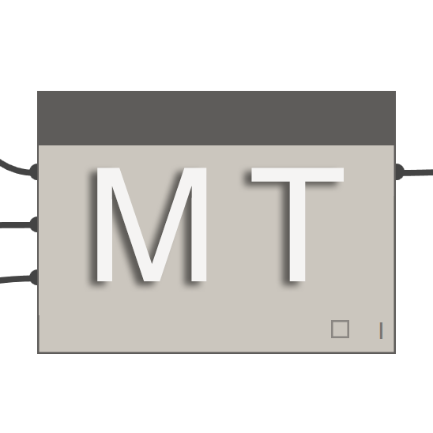
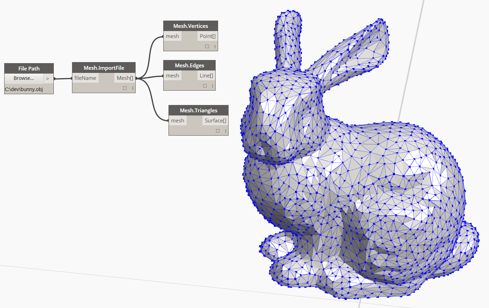
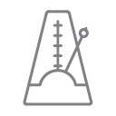

## Pacchetti di Dynamo
Di seguito è riportato un elenco di alcuni dei pacchetti più popolari nella comunità di Dynamo. Sviluppatori, aggiungeteli all'elenco! Tenere presente che [Dynamo Primer](https://github.com/DynamoDS/DynamoPrimer ) è open source.

<table>
   <tr>
      <td width="10%">
         </img>
      </td>
      <td width="55%">
         <b>ARCHI-LAB</b>
      </td>
      <td>
         <a href="http://archi-lab.net/">Visitare il sito ufficiale di archi-lab
      </td>
      </a>
   </tr>
   <tr>
      <td colspan="2">archi-lab è una raccolta di oltre 50 pacchetti personalizzati che estendono notevolmente la capacità di Dynamo di interagire con Revit. I nodi contenuti nel pacchetto archi-lab variano dalle operazioni di base sugli elenchi ai nodi di Analysis Visualization Framework avanzati per Revit. </td>
      <td>
         </img>
      </td>
   </tr>
</table>
<table>
  <tr>
    <td width="10%"></img></td>
    <td width="55%"><b>BIMORPH NODES</b></td>
    <td><a href="https://bimorph.com/bimorph-nodes/">Visitare il dizionario di Bimorph Nodes</td></a>
  </tr>
  <tr>
    <td colspan="2">Bimorph Nodes è una raccolta versatile di potenti nodi di utilità. Le caratteristiche principali del pacchetto includono il rilevamento ultra-efficiente delle interferenze e i nodi di intersezione della geometria, i nodi di conversione delle curve di ImportInstance (CAD) e i collettori di elementi collegati che risolvono le limitazioni nell'API di Revit. Per informazioni sull'intera gamma di nodi disponibili, visitare il dizionario di Bimorph Nodes.</td>
    <td></img></td>
  </tr>
</table>
<table>
  <tr>
    <td width="10%"></img></td>
    <td width="55%"><b>BUMBLEBEE FOR DYNAMO</b></td>
    <td><a href="http://archi-lab.net/bumblebee-dynamo-and-excel-interop/">Visitare il sito ufficiale di BumbleBee</td></a>
  </tr>
  <tr>
    <td colspan="2">Bumblebee è un plug-in di interoperabilità tra Excel e Dynamo che migliora in modo significativo la capacità di Dynamo di leggere e scrivere file Excel. </td>
    <td></img></td>
  </tr>
</table>

<table>
  <tr>
    <td width="10%"></img></td>
    <td width="55%"><b>CLOCKWORK FOR DYNAMO</b></td>
    <td><a href="https://github.com/CAAD-RWTH/ClockworkForDynamo">Visitare la pagina di Clockwork for Dynamo in GitHub</td></a>
  </tr>
  <tr>
    <td colspan="2">Clockwork è una raccolta di nodi personalizzati per l'ambiente di programmazione visiva Dynamo. Contiene molti nodi correlati a Revit, ma anche numerosi nodi per altri scopi quali la gestione degli elenchi, le operazioni matematiche, le operazioni di tipo stringa, le conversioni di unità, le operazioni geometriche (principalmente riquadri di delimitazione, mesh, piani, punti, superfici, UV e vettori) e la suddivisione in pannelli. </td>
    <td></img></td>
  </tr>
</table>

<table>
  <tr>
    <td width="10%"></img></td>
    <td width="55%"><b>DATA|SHAPES</b></td>
    <td><a href="https://github.com/MostafaElAyoubi/Data-shapes">Visitare la pagina di Data|Shapes su GitHub</td></a>
  </tr>
  <tr>
    <td colspan="2"> Data|Shapes è un pacchetto che ha lo scopo di estendere la funzionalità utente degli script Dynamo. Ha un'attenzione particolare all'aggiunta di maggiori funzionalità al Lettore Dynamo. Per ulteriori informazioni, visitare il sito Web https://data-shapes.net/. Si desidera creare fantastici workflow del Lettore Dynamo? Utilizzare questo pacchetto.</td>
    <td></img></td>
  </tr>
</table>

<table>
  <tr>
    <td width="10%"></img></td>
    <td width="55%"><b>DYNAMO SAP</b></td>
    <td><a href="http://core.thorntontomasetti.com/dynamosap-is-now-open-source/">Visitare il progetto DynamoSAP in Core Studio</td></a>
  </tr>
  <tr>
    <td colspan="2">DynamoSAP è un'interfaccia parametrica per SAP2000, basata su Dynamo. Il progetto consente a progettisti e ingegneri di creare e analizzare in modo generativo i sistemi strutturali in SAP, utilizzando Dynamo per gestire il modello SAP. Il progetto prevede alcuni workflow comuni descritti nei file di esempio inclusi e offre un'ampia gamma di opportunità per l'automazione di attività tipiche in SAP. </td>
    <td></img></td>
  </tr>
</table>

<table>
  <tr>
    <td width="10%"></img></td>
    <td width="55%"><b>DYNAMOUNFOLD</b></td>
    <td><a href="https://github.com/mjkkirschner/DynamoUnfold">Visitare la pagina di DynamoUnfold in GitHub</td></a>
  </tr>
  <tr>
    <td colspan="2">Questa libreria estende le funzionalità di Dynamo/Revit consentendo agli utenti di spiegare la geometria di superficie e di polisuperficie. La libreria consente agli utenti di convertire prima le superfici in topologia tassellata planare, quindi di spiegarle utilizzando gli strumenti di protogeometria di Dynamo. Questo pacchetto include anche alcuni nodi sperimentali e alcuni file di esempio di base. </td>
    <td></img></td>
  </tr>
</table>

<table>
  <tr>
    <td width="10%"></img></td>
    <td width="55%"><b>DYNASTRATOR</b></td>
    <td><a href="http://dynamopackages.com/">Download di Dynastrator in Package Manager</td></a>
  </tr>
  <tr>
    <td colspan="2">È possibile importare immagini vettoriali da Illustrator o dal Web utilizzando .svg.  Ciò consente di importare disegni creati manualmente in Dynamo per operazioni parametriche. </td>
    <td></img></td>
  </tr>
</table>

<table>
  <tr>
    <td width="10%"></img></td>
    <td width="55%"><b>ENERGY ANALYSIS FOR DYNAMO</b></td>
    <td><a href="https://github.com/tt-acm/EnergyAnalysisForDynamo">Visita il progetto Energy Analysis for Dynamo in GitHub</td></a>
  </tr>
  <tr>
    <td colspan="2">Energy Analysis for Dynamo consente la modellazione energetica parametrica e i workflow di analisi energetica dell'intero edificio in Dynamo 0.8. Energy Analysis for Dynamo consentono all'utente di configurare il modello energetico da Autodesk Revit, di inviarlo a Green Building Studio per l'analisi energetica DOE2 e di analizzare i risultati restituiti dall'analisi. Il pacchetto è stato sviluppato dallo studio CORE di Thornton Tomasetti.  </td>
    <td></img></td>
  </tr>
</table>

<table>
  <tr>
    <td width="10%"></img></td>
    <td width="55%"><b>FIREFLY FOR DYNAMO</b></td>
    <td><a href="http://dynamopackages.com/">Download di Firefly in Dynamo Package Manager</td></a>
  </tr>
  <tr>
    <td colspan="2">Firefly è una raccolta di nodi che consente a Dynamo di parlare con i dispositivi di input/output, come il micro controller Arduino. Poiché il flusso di dati avviene "in diretta", Firefly offre molte opportunità per la prototipazione interattiva tra il mondo digitale e quello fisico attraverso Webcam, cellulari, controller di gioco, sensori e altro ancora. </td>
    <td></img></td>
  </tr>
</table>

<table>
  <tr>
    <td width="10%"></img></td>
    <td width="55%"><b>LUNCHBOX FOR DYNAMO</b></td>
    <td><a href="http://provingground.io/tools/lunchbox/">Visitare la pagina di Lunchbox for Dynamo in proving ground</td></a>
  </tr>
  <tr>
    <td colspan="2">LunchBox è un insieme di nodi di gestione di dati e geometria riutilizzabili. Gli strumenti sono stati testati con Dynamo 0.8.1 e Revit 2016. Lo strumento include nodi per la suddivisione della superficie in pannelli, la geometria, la raccolta di dati di Revit e altro ancora.</td>
    <td></img></td>
  </tr>
</table>

<table>
  <tr>
    <td width="10%"></img></td>
    <td width="55%"><b>MANTIS SHRIMP</b></td>
    <td><a href="http://archi-lab.net/mantis-shrimp-getting-started/">Visitare il sito ufficiale di Mantis Shrimp</td></a>
  </tr>
  <tr>
    <td colspan="2">Mantis Shrimp è un progetto di interoperabilità che consente di importare facilmente la geometria di Grasshopper e/o Rhino in Dynamo.</td>
    <td></img></td>
  </tr>
</table>

<table>
  <tr>
    <td width="10%"></img></td>
    <td width="55%"><b>MESH TOOLKIT</b></td>
    <td><a href="https://github.com/DynamoDS/Dynamo/wiki/Dynamo-Mesh-Toolkit">Visitare la pagina di Dynamo Mesh Toolkit in GitHub</td></a>
  </tr>
  <tr>
    <td colspan="2">Dynamo Mesh Toolkit fornisce molti strumenti utili per l'utilizzo della geometria della mesh. Le funzionalità di questo pacchetto includono la possibilità di importare mesh da formati di file esterni, generare mesh da oggetti della geometria di Dynamo preesistenti e generare manualmente mesh tramite vertici e informazioni di connettività. Inoltre, questo toolkit include strumenti per la modifica e la correzione della geometria della mesh. </td>
    <td></img></td>
  </tr>
</table>

<table>
  <tr>
    <td width="10%"></img></td>
    <td width="55%"><b>OPTIMO</b></td>
    <td><a href="https://github.com/BPOpt/Optimo/wiki/0_-Home">Visitare la pagina di Optimo su GitHub</td></a>
  </tr>
  <tr>
    <td colspan="2">Optimo fornisce agli utenti di Dynamo la possibilità di ottimizzare i problemi di progettazione definiti dall'utente utilizzando vari algoritmi evolutivi. Gli utenti possono definire l'obiettivo o la serie di obiettivi del problema, nonché specifiche funzioni di adattamento. </td>
    <td></img></td>
  </tr>
</table>

<table>
  <tr>
    <td width="10%"></img></td>
    <td width="55%"><b>RHYNAMO</b></td>
    <td><a href="https://bitbucket.org/caseinc/rhynamo">Visitare la pagina di Rhynamo su Bitbucket</td></a>
  </tr>
  <tr>
    <td colspan="2">La libreria di nodi di Rhynamo consente agli utenti di leggere e scrivere file Rhino 3DM dall'interno di Dynamo. Rhynamo converte la geometria di Rhino in geometria di Dynamo utilizzabile mediante la libreria OpenNURBS di McNeel, consentendo nuovi workflow in grado di scambiare la geometria e i dati in modo fluido tra Rhino e Revit. Questo pacchetto contiene anche alcuni nodi sperimentali che consentono l'accesso "in diretta" alla riga di comando di Rhino. </td>
    <td></img></td>
  </tr>
</table>

<table>
  <tr>
    <td width="10%"></img></td>
    <td width="55%"><b>RHYTHM</b></td>
    <td><a href="https://github.com/sixtysecondrevit/RhythmForDynamo">Visitare la pagina di Rhythm su GitHub</td></a>
  </tr>
  <tr>
    <td colspan="2"> A prima vista, Rhythm non è niente di speciale. Non coinvolge un codice sofisticato o qualsiasi elemento di tale natura. Ciò che Rhythm rappresenta però è il risultato di pensiero pratico e diligenza. L'idea è che questo pacchetto aiuti gli utenti a gestire Rhythm in Revit con Dynamo. Rhythm consiste principalmente in nodi di Dynamo predefiniti, utilizzati in modo intelligente, così come sono validi per l'ambiente di Revit. </td>
    <td></img></td>
  </tr>
</table>
