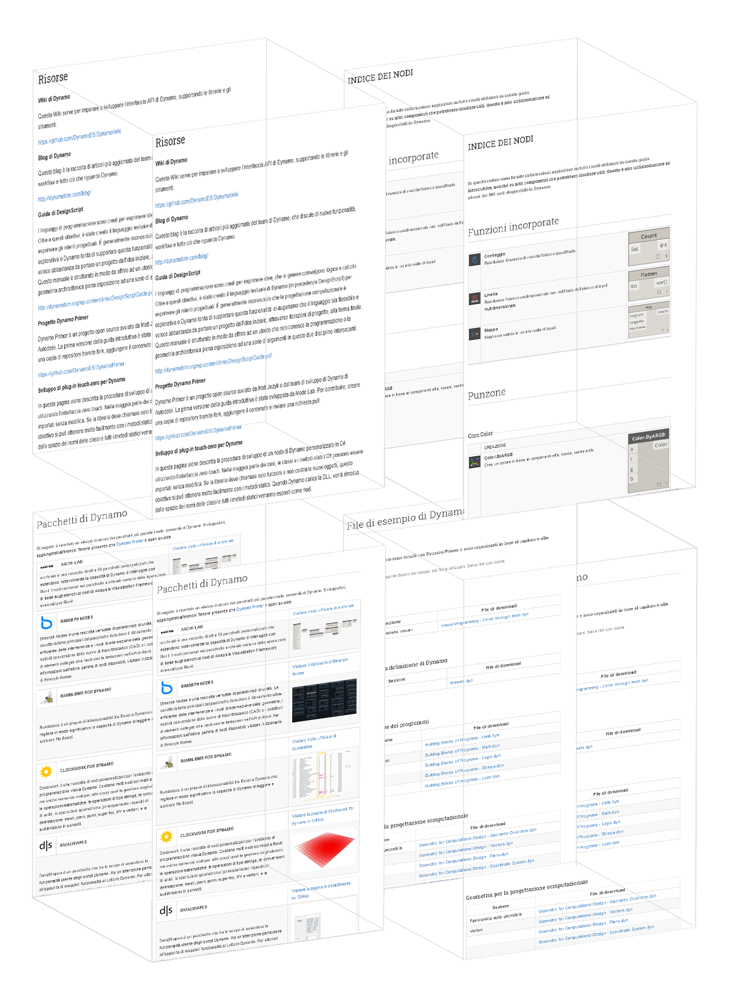

# Appendice A: Risorse

In questa sezione, è possibile trovare risorse aggiuntive per approfondire ulteriormente le conoscenze su Dynamo. È stato inoltre aggiunto un indice di nodi importanti, una raccolta di pacchetti utili e un repository di file di esempio presenti in questa guida introduttiva. È possibile aggiungere elementi a questa sezione. Ricordarsi che [Dynamo Primer](https://github.com/DynamoDS/DynamoPrimer) è open source. 

