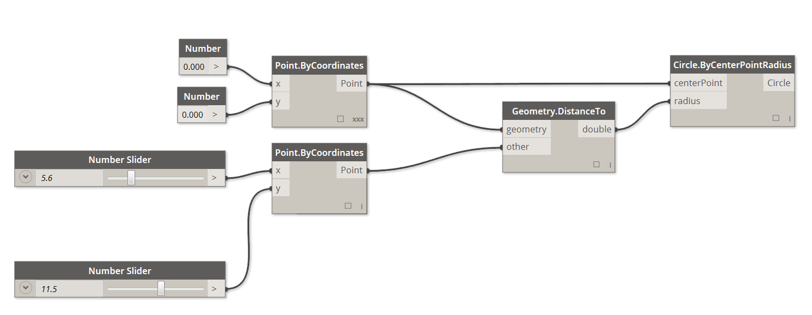

### ビジュアル プログラミングの概要

設計作業では、多くの場合、設計要素間の視覚的な関係、システム的な関係、幾何学的な関係を決定するという作業が発生します。通常、こうした関係は、ルールに従って概念から具体的な成果を生み出すワークフローによって構築されていきます。私たちは、アルゴリズムを意識することなく、アルゴリズムに従って毎日の業務を行っています。たとえば、入力、処理、出力という基本的なロジックに従い、段階的に業務を行っています。プログラミングでアルゴリズムを定式化することにより、こうした方法で業務を継続的に行うことができるようになります。

### 折り鶴で確かめるアルゴリズム

**アルゴリズム**は非常に便利な手法ですが、誤って理解される場合もあります。 アルゴリズムは、予想もできない素晴らしいものを生み出す可能性を秘めていますが、決して魔法ではありません。実際に、アルゴリズム自体は非常に単純なものです。具体的な例として、折り鶴について考えてみましょう。最初に正方形の紙を用意します。これを一連の手順に従って折っていくと、折り鶴が出来上がります。この場合、紙が「入力」、折る手順が「処理」、出来上がった折り鶴が「出力」になります。


では、折り鶴のどこにアルゴリズムがあるのでしょうか。アルゴリズムは一連の抽象的な手順であり、テキストとグラフィックスのどちらでも表現することができます。

**テキストによる手順の説明:**

1. 正方形の紙を用意し、色が付いている面を表にして置きます。対角線で 2 つ折りにしてから元に戻します。次に、もう一方の対角線で 2 つ折りにしてから元に戻します。
2. 紙を裏返し、白い面を表にして置きます。正方形の両辺を 2 つ折りにして、折筋をつけてから元に戻します。次に、別の方向に 2 つ折りにしてから元に戻します。
3. ここまでにつけた折筋を使って、紙の上部の 3 つの角を下の角に合わせ、正方形に折りつぶします。
4. 手前の 2 つの三角形の両側下辺を中心線に合わせて折り、元に戻します。
5. 上の角を中央に合わせて、折筋をつけてから元に戻します。
6. 手前の袋の部分を開いて持ち上げながら、両端を中央へ向かって押しつぶし、折筋をつけます。
7. 紙を裏返して、手順 4 ～ 6 を繰り返します。
8. 上の頂点を中央に合わせて折ってから元に戻します。
9. 反対側でも同じ手順を繰り返します。
10. 左右の「脚」を上に向かって折り、折筋をつけてから元に戻します。
11. 上の手順でつけた折筋に沿って、左右の「脚」を中割り折りします。
12. 一方を中割り折りして鶴の頭を作り、羽の部分を引き下げて開きます。
13. これで折り鶴が出来上がりました。

**グラフィックスによる手順の説明**


### プログラミングとは

どちらの手順に従って折っても、折り鶴が出来上がります。実際に折ってみると、アルゴリズムに従って折り鶴を作ったことになります。唯一異なるのは、定式化された一連の手順を読む方法です。これが、**プログラミング**を行う理由になります。 *コンピュータ プログラミング*(通常は、省略してプログラミングといいます)とは、一連の処理を実行可能なプログラムとして定式化する行為のことです。 上記の鶴の折り方をコンピュータで読み取って実行できる形式に変換した場合、プログラミングを行っていることになります。

プログラミングで最初に直面する重要な課題は、コンピュータと効率的なコミュニケーションを行うために、特定の抽象化形式を使用しなければならないということです。その抽象化の形式として、JavaScript、Python、C などのプログラミング言語が使用されています。先ほどの鶴の折り方のように反復可能な手順を作成できれば、後はそれをコンピュータ用に翻訳するだけで済みます。近いうちに、コンピュータで折り鶴を作るだけでなく、それぞれ微妙に異なる多数の折り鶴を作ることもできるようになるでしょう。これがプログラミングの能力です。どんなタスクをコンピュータに割り当てても、遅延やヒューマン エラーを発生させることなくタスクを繰り返し実行することができます。

#### ビジュアル プログラミングとは

> この演習に付属しているサンプル ファイル [Visual Programming - Circle Through Point.dyn](datasets/1-1/Visual Programming - Circle Through Point.dyn) をダウンロードしてください(右クリックして[名前を付けてリンク先を保存]を選択)。 すべてのサンプルファイルの一覧については、付録を参照してください。

折り鶴の作り方を記述するタスクを割り当てられたとしたら、どのようにしてそのタスクを実行しますか。この場合、グラフィックスで手順を記述する方法、テキストで手順を記述する方法、グラフィックスとテキストを組み合わせて手順を記述する方法が考えられます。

グラフィックスで手順を記述する場合、またはグラフィックスとテキストを組み合わせて手順を記述する場合、**ビジュアル プログラミング**が最適な方法です。 通常のプログラミングとビジュアル プログラミングのどちらの場合も、基本的なプロセスは同じです。どちらも同じ定式化の枠組みを使用しますが、ビジュアル プログラミングの場合は、視覚的なグラフィカル ユーザ インタフェースを使用して、プログラムの指示や関係を定義します。この場合、構文に従ってテキストを入力するのではなく、事前にパッケージ化されたノードを相互に接続します。ここで、同じアルゴリズムを使用して、ビジュアル プログラミングとテキストによるプログラミングを比較してみましょう。「指定された点を通過する円弧を描画する」という命令を、ノードを使用してプログラミングする場合の例と、コードを使用してプログラミングする場合の例を示します。

**ビジュアル プログラミング:**



**テキストによるプログラミング:**

```
myPoint = Point.ByCoordinates(0.0,0.0,0.0);
x = 5.6;
y = 11.5;
attractorPoint = Point.ByCoordinates(x,y,0.0);
dist = myPoint.DistanceTo(attractorPoint);
myCircle = Circle.ByCenterPointRadius(myPoint,dist);
```

このアルゴリズムの結果は、次のようになります。


このように、ビジュアル プログラミングには、視覚的に理解しやすいという特徴があります。そのため、最初から簡単にプログラミングを実行することができ、設計者にとっても便利な仕様になっています。Dynamo はビジュアル プログラミングの範疇に分類されますが、アプリケーション内でテキストを使用してプログラミングを行うこともできます。これについては、後で説明します。

