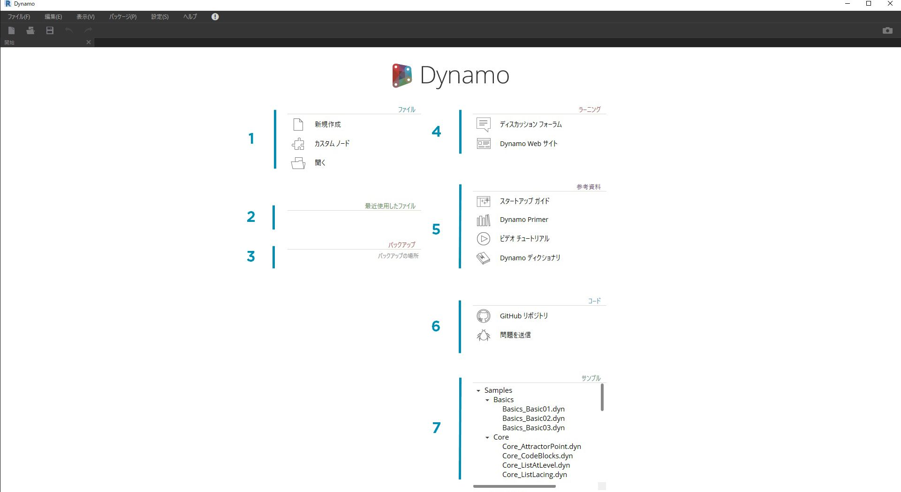
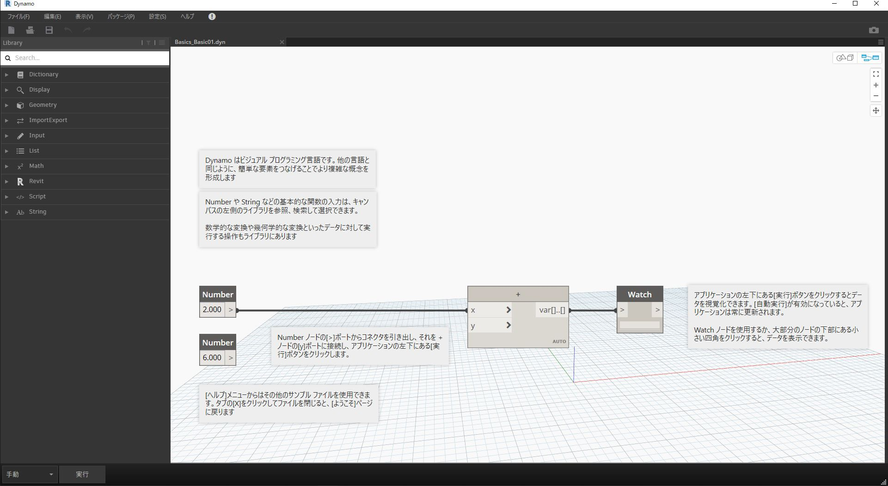

## Dynamo のインストールと起動

Dynamo は、オープンソースのプロジェクトであり、活発に開発が進められているため、ダウンロードできるインストーラとして、公式リリースと毎日更新されるプレリリースの 2 種類が用意されています。Dynamo を初めて使用する場合は、公式リリースをダウンロードしてください。また、プレリリースや GitHub プロジェクトを通じて、ぜひ Dynamo の開発にご協力ください。

### ダウンロード

Dynamo の公式リリースをダウンロードするには、[Dynamo の Web サイト](http://dynamobim.com/)にアクセスします。 トップページまたはダウンロード ページにアクセスしてダウンロード ボタンをクリックすると、ダウンロードがすぐに開始されます。

> 1. Dynamo を活用した建築意匠の計算設計に関するビデオを見ることができます。
2. ダウンロード ページにアクセスできます。

[Dynamo Github](https://github.com/DynamoDS/Dynamo) プロジェクトにアクセスすると、プレリリースをダウンロードして開発中の最新機能を確認することができます。

> 1. 公式リリースのインストーラをダウンロードできます。
2. プレリリースのインストーラをダウンロードできます。
3. 開発者のコミュニティからカスタム パッケージを確認できます。
4. GitHub で Dynamo の開発プロジェクトに参加できます。

### インストール

ダウンロードしたインストーラの保存フォルダを開き、.exe ファイルを実行します。インストール時に、[Setup]ダイアログでインストールするコンポーネントをカスタマイズすることができます。

![[Setup]ウィンドウ](images/2-1/03-InstallSetup.jpg)

> 1. インストールするコンポーネントを選択します。

ここで、Revit などの他のインストール済みアプリケーションに Dynamo を接続するコンポーネントをインストールするかどうかを決定する必要があります。Dynamo プラットフォームの詳細については、**1.2.**を参照してください。

### 起動

Dynamo を起動するには、¥Program Files¥Dynamo¥Dynamo Revit¥x.y にアクセスして、DynamoSandbox.exe を選択します。これにより、Dynamo のスタンドアロン版が起動し、*スタート ページ*が表示されます。 このページには、標準のメニューとツールバーの他に、ファイル、機能、追加リソースにアクセスするためのショートカットの一覧が表示されます。

> 1. [ファイル] - 新しいファイルを作成したり、既存のファイルを開くことができます。
2. [最近使用したファイル] - 最近使用したファイルが一覧表示されます。
3. [バックアップ] - バックアップにアクセスできます。
4. [確認] - ユーザ フォーラムと Dynamo Web サイトに直接アクセスできます。
5. [参照] - 追加の学習リソースを参照することができます。
6. [コード] - オープンソースの開発プロジェクトに参加できます。
7. [サンプル] - インストールに付属するサンプルを確認できます。

最初のサンプル ファイルを開いてワークスペースを作成し、Dynamo が正しく動作することを確認します。[サンプル] > [基本機能] > [**Basics_Basic01.dyn**] をクリックします。

> 1. 拡張バーに[自動]と表示されていることを確認します。表示されていない場合は、[実行]をクリックします。
2. 画面上の指示に従って、**Number** ノードを [**+**] ノードに接続します。
3. Watch ノードに結果が表示されることを確認します。

このファイルが正常にロードされていれば、Dynamo でビジュアル プログラミングを開始することができます。

