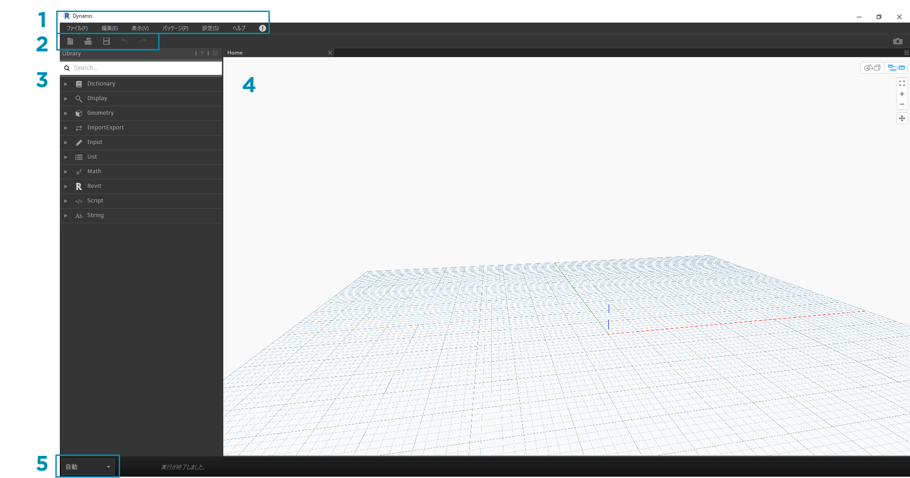
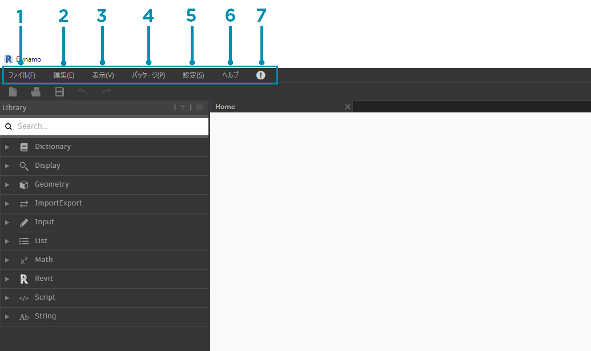
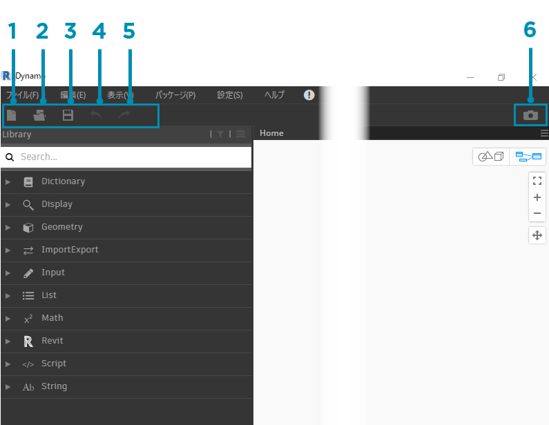
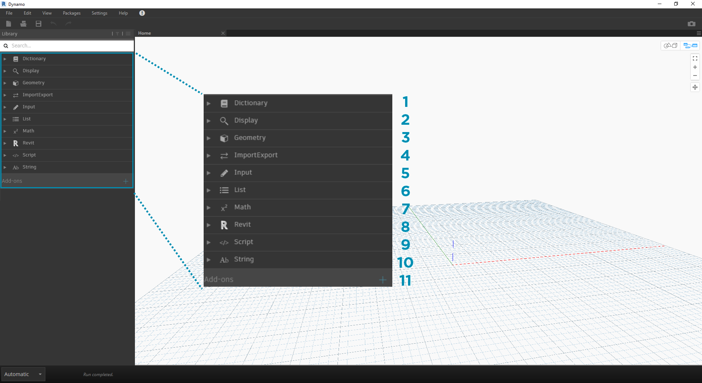
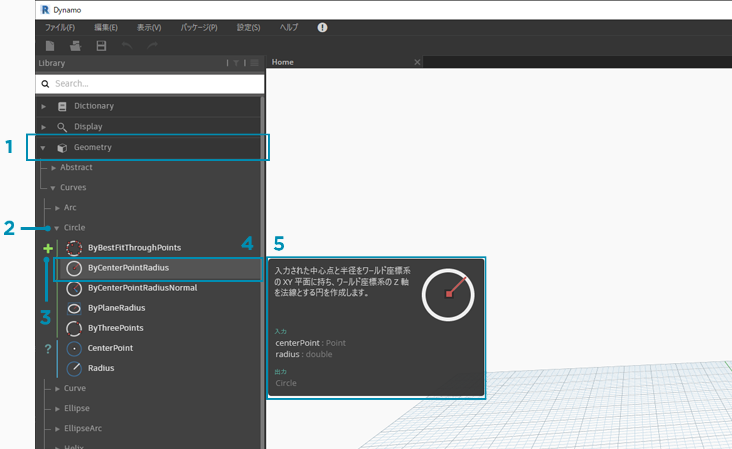
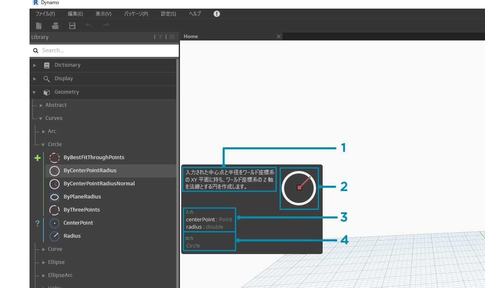
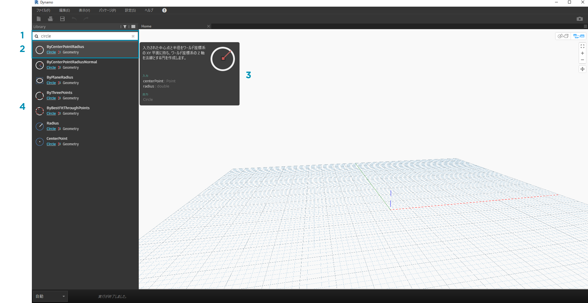
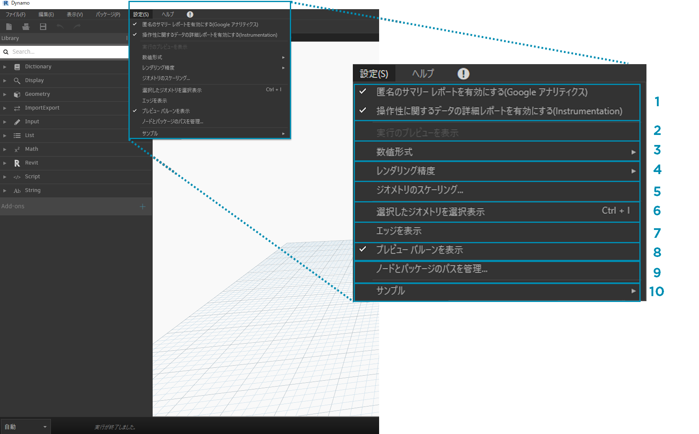
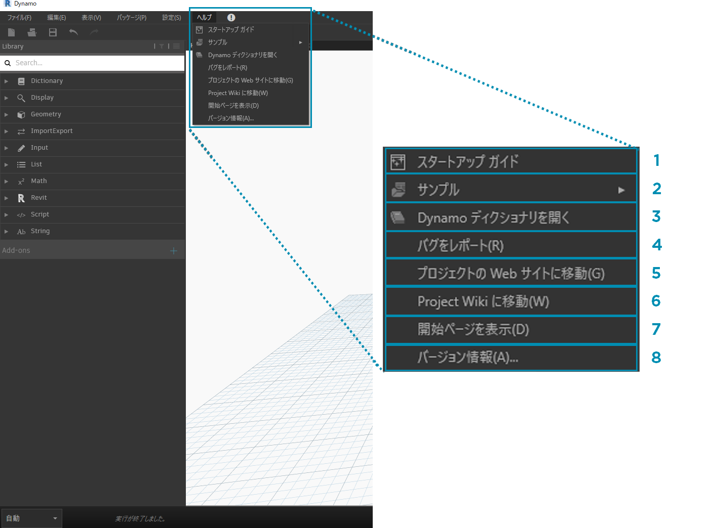

## Dynamo ユーザ インタフェース

Dynamo のユーザ インタフェースは、5 つの主要な領域で構成されています。そのうち最も大きな領域は、ビジュアル プログラミングの構成に使用されるワークスペースです。

> 1. メニュー
2. ツールバー
3. ライブラリ
4. ワークスペース
5. 実行バー

ここからは、Dynamo の UI を確認しながら、各領域の機能を詳しく見ていきます。

#### メニュー

ドロップダウン メニューでは、Dynamo アプリケーションの基本的な機能の一部にアクセスすることができます。多くの Windows ソフトウェアと同様に、最初の 2 つのメニュー項目(左端のメニュー項目とその横のメニュー項目)で、ファイルの管理に関する操作や、選択とコンテンツ編集に関する操作を行うことができます。他のメニュー項目は、Dynamo 固有のメニュー項目です。

> 1. ファイル
2. 編集
3. ビュー
4. パッケージ
5. 設定
6. ヘルプ

#### ツールバー

Dynamo ツールバーには、[元に戻す][Ctrl + Z]コマンドと[やり直し][Ctrl + Y]コマンドの他に、ファイルに関する作業に役立つ一連のクイック アクセス ボタンが用意されています。右端にあるボタンを使用すると、ワークスペースのスナップショットを書き出すことができます。このボタンは、ドキュメントの作成や共有を行う場合に特に便利です。

> 1. [新規] - 新しい .dyn ファイルを作成する場合に使用します。
2. [開く] - 既存の .dyn ファイル(ワークスペース)または .dyf ファイル(カスタム ノード)を開く場合に使用します。
3. [保存]/[名前を付けて保存] - アクティブな .dyn ファイルや .dyf ファイルを保存する場合に使用します。
4. [元に戻す] - 最後の操作を元に戻す場合に使用します。
5. [やり直し] - 次の操作をやり直す場合に使用します。
6. [ワークスペースをイメージとして書き出す] - 表示されているワークスペースを PNG ファイルに書き出す場合に使用します。

#### ライブラリ

ライブラリには、付属の既定ノード、追加でロードされるカスタム ノードやパッケージなど、ロードされたすべてのノードが格納されます。ライブラリ内のノードは、そのノードがデータを**作成**するのか、**アクション**を実行するのか、データを**クエリー**するのかという区別に基づいて、ライブラリやカテゴリ内部で、(あるいは該当する場合)サブカテゴリ内部で、階層別に分類されます。

##### カテゴリを参照する

既定では、**ライブラリ**にはノードのカテゴリが 8 つ存在します。 **[Core]**と**[Geometry]**には最も多くのノードが含まれているため、ノードを探す場合は最初にこれらのカテゴリを使用することをお勧めします。 これらのカテゴリを参照すると、ワークスペースに追加できるノードの階層や、これまでに使用したことがない新しいノードを探す最適な方法について、簡単に理解することができます。

> ここでは、既定のノードを中心に確認しますが、後で、カスタム ノード、追加のライブラリ、Package Manager を使用して、このライブラリを拡張していきます。

> 1. Analyze
2. Built-in Functions
3. Core
4. Geometry
5. Migration
6. Office
7. Operators

メニューで[ライブラリ]をクリックしてライブラリを参照し、[Geometry] > [Circle]をクリックします。新しいメニュー項目(具体的には、**作成**用の「+」ラベルと**クエリー**用の「?」ラベル)が表示されることを確認してください。

> 1. ライブラリ
2. カテゴリ
3. サブカテゴリ: 作成/アクション/クエリー
4. ノード
5. ノードの説明とプロパティ(ノードのアイコンの上にカーソルを置くと表示されます)

同じ[Circle]メニューで、**ByCenterPointRadius** の上にカーソルを置きます。 ウィンドウに、ノード名とアイコン以外の詳細情報が表示されます。これにより、そのノードの機能、必要な入力、生成される出力について、すばやく確認することができます。

> 1. ノードに関する簡単な説明
2. [ライブラリ]メニューの大きなアイコン
3. 入力(名前、データ タイプ、データ構造)
4. 出力(データ タイプと構造)

##### ノードを検索する

ワークスペースに追加するノードが具体的に決まっている場合は、**[検索]**フィールドを使用すると便利です。 ワークスペースで設定の編集や値の指定を行っているとき以外は、このフィールドにカーソルが常に表示されます。検索する文字列を入力すると、その文字列に最も近いノードと他のノードのリストが、そのノードが格納されているカテゴリとともに、Dynamo ライブラリに表示されます。ブラウザで[Enter]キーを押すか対象の項目をクリックすると、ハイライト表示されたノードがワークスペースの中央に追加されます。

> 1. 検索フィールド
2. 検索文字列に最も近いノード/選択されたノード
3. 代替ノード

### 設定

ジオメトリの設定オプションやユーザ設定オプションは、**[設定]**メニューに用意されています。 このメニューを使用して、Dynamo を改善するためのユーザ データを共有したり、アプリケーションの小数点の精度とジオメトリのレンダリング品質を設定することができます。

> 注: Dynamo では汎用的な単位が使用されます。

> 1. [レポートを有効にする] - Dynamo の向上に使用されるユーザ データを送信するオプションです。
2. [数値形式] - 浮動小数点型の数値に関するドキュメント設定を変更します。
3. [レンダリング精度] - ドキュメントのレンダリング品質を調整します。
4. [エッジを表示] - 3D ジオメトリのエッジの表示設定を切り替えます。
5. [プレビュー バルーンを非表示] - ノードの下に表示されるデータ プレビュー バルーンを非表示にします。
6. [ノードとパッケージのパスを管理] - ノードとパッケージをライブラリに表示するのに使用されるファイル パスを管理します。
7. [サンプルの実験的機能を有効にする] - Dynamo に試験的に導入されているベータ版の機能を使用します。

### ヘルプ

不明な点については、**[ヘルプ]**メニューを確認します。 このメニューを使用して、付属のサンプル ファイルを入手したり、既定のインターネット ブラウザで Dynamo の参照用 Web サイトにアクセスすることができます。必要な場合は、**[バージョン情報]**オプションを使用して、インストールされている Dynamo のバージョンを確認したり、Dynamo が最新の状態に更新されているかどうかを確認することができます。

> 1. [スタートアップ ガイド] - Dynamo の使用方法を簡単に紹介しています。
2. [サンプル] - 参照用のサンプル ファイルです。
3. [バグをレポート] - GitHub 上に Issue (イシュー)を作成します。
4. [プロジェクトの Web サイトに移動] - GitHub 上の Dynamo プロジェクトを表示します。
5. [プロジェクトの Wiki に移動] - Wiki にアクセスして、Dynamo API を使用する開発方法やライブラリとツールのサポートに関する情報を表示します。
6. [開始ページを表示] - ドキュメント内の Dynamo 開始ページに戻ります。
7. [バージョン情報...] - Dynamo のバージョン情報を確認します。

