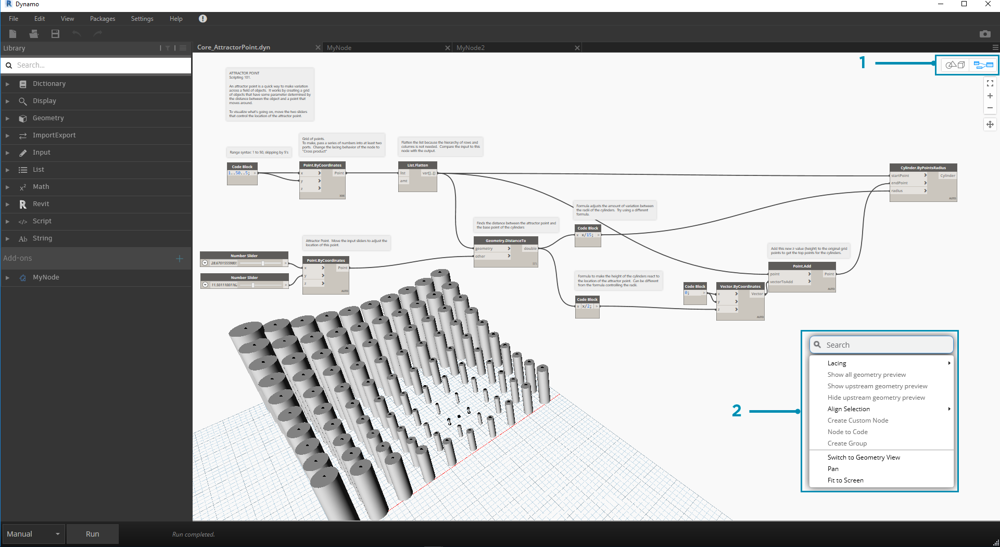
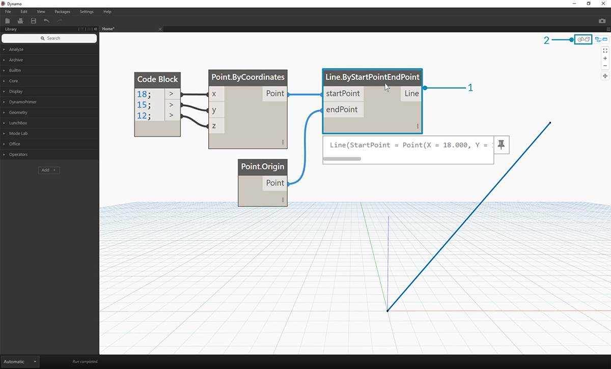
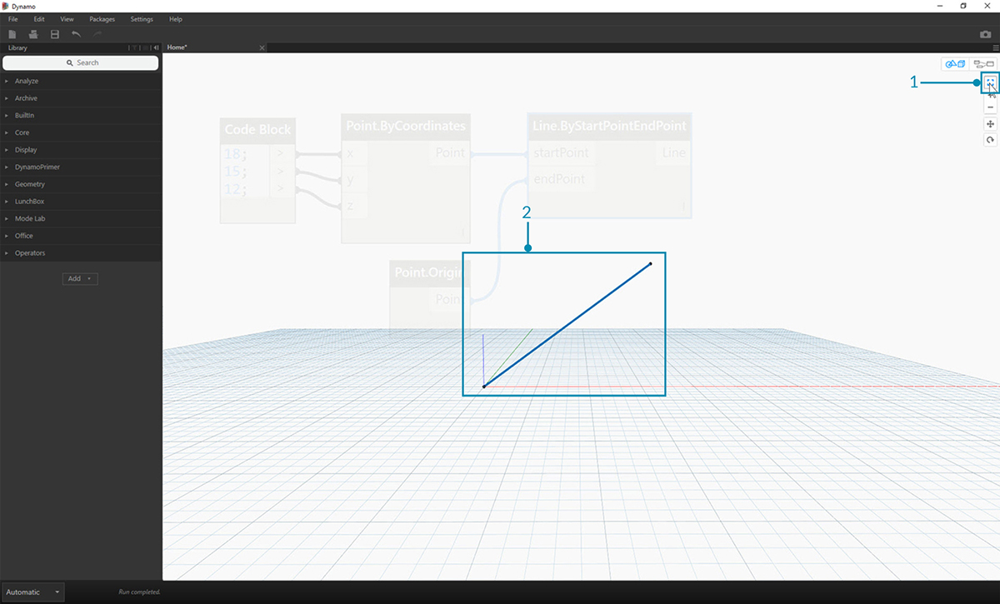

## ワークスペース

Dynamo の**ワークスペース** では、ビジュアル プログラミングを行うだけでなく、出力されるジオメトリのプレビューを確認することもできます。 ホーム ワークスペースとカスタム ノードのどちらで作業しているかにかかわらず、マウスか画面右上のコントロール ボタンを使用してナビゲートすることができます。ナビゲート中にプレビュー モードを切り替えるには、画面右上のスイッチを使用します。

> 注: ノードとジオメトリは順序にしたがって描画されるため、複数のオブジェクトが互いに折り重なるようにレンダリングされる場合があります。そのため、複数のノードをまとめて追加すると、複数のオブジェクトがワークスペース内の同じ位置にレンダリングされ、見にくくなることがあります。

> 1. タブ
2. ズーム/画面移動ボタン
3. プレビュー モード
4. ワークスペースをダブルクリック

### タブ

ワークスペースのアクティブなタブ上では、プログラムのナビゲートや編集を行うことができます。新しいファイルを開くと、既定で新しい**ホーム**ワークスペースが表示されます。 または、複数のノードを選択し、右クリックで[*選択から新規ノードを作成*]オプションを選択して、新しい**カスタム ノード** ワークスペースを開くこともできます。これについては、後で詳しく説明します([ファイル]メニューから開くこともできます)。

> 注: 同時に開くことができるホーム ワークスペースは 1 つだけです。ただし、カスタム ノード ワークスペースについては、タブを追加していくことで複数のワークスペースを同時に開くことができます。

### グラフと 3D プレビュー ナビゲーション

Dynamo では、グラフとそのグラフの 3D 出力結果の両方が、ワークスペース内にレンダリングされます(ただし、3D の出力結果がレンダリングされるのは、ジオメトリを作成する場合にだけです)。既定では、グラフがアクティブなプレビューとして設定されています。そのため、ナビゲーション ボタンまたはマウスの中央ホイールを使用して、グラフ上で画面移動やズームを行うことになります。アクティブなビューを切り替えるには、次の 3 つの方法があります。

> 1. ワークスペース内のプレビュー切替ボタンを使用する。
2. ワークスペース内で右クリックして、*[ジオメトリ ビューに切り替える]または[ノード ビューに切り替える]*を選択する。
3. キーボード ショートカット([Ctrl] + [B])を使用する。

3D プレビュー ナビゲーション モードを使用すると、[スタートアップ ガイド](http://dynamoprimer.com/02_Hello-Dynamo/2-6_the_quick_start_guide.html)で紹介したように、点の**直接操作**を行うことができます。

### ズームして中心位置を変更する

3D プレビュー ナビゲーション モードでは、モデルの画面移動、ズーム、回転を簡単に行うことができます。ただし、ジオメトリ ノード上で作成されたオブジェクトのズームを行うには、特定のノードを 1 つだけ選択して[全体表示]アイコンを使用します。

> 1. ビューの中心となるジオメトリに対応するノードを選択します。
2. 3D プレビュー ナビゲーションに切り替えます。

> 1. 画面右上の[全体表示]アイコンをクリックします。
2. 選択したジオメトリがビューの中心位置になります。

### マウス操作の基本

プレビュー モードがアクティブになっているかどうかによって、マウス ボタンの動作が異なります。通常、マウスの左クリックで要素の選択や入力値の指定を行い、マウスの右クリックでオプションを表示します。マウスの中央ホイールをクリックすると、ワークスペース内をナビゲートすることができます。マウスの右ボタンをクリックすると、クリックした場所に応じて異なるオプションが表示されます。

> 1. ワークスペースを右クリックします。
2. ノードを右クリックします。
3. 注釈を右クリックします。

次の表に、プレビュー時のマウス操作を示します。

|**マウスの操作**|**グラフ プレビュー**|**3D プレビュー**|
| -- | -- | -- |
|左クリック|選択|(動作なし)|
|右クリック|コンテキスト メニュー|ズーム オプション|
|ホイール クリック|画面移動|画面移動|
|ホイール スクロール|ズーム イン/ズーム アウト|ズーム イン/ズーム アウト|
|ダブルクリック|コード ブロックを作成|(動作なし)|

### キャンバス内検索

キャンバス内検索機能を使用すると、作業中のグラフ位置から離れることなくノードの説明やツールチップにアクセスできるため、Dynamo ワークフローをすばやく進めることができます。キャンバスのどの位置で作業していても、右クリックするだけで便利なライブラリ検索機能を使用することができます。

> 1. 検索機能を使用するには、キャンバス上の任意の場所を右クリックします。検索バーに何も入力されていない場合は、ドロップダウン メニューがプレビュー表示されます。
2. 検索バーに入力された文字列に応じて、その入力内容に最も関係がある検索結果がドロップダウン メニューに表示されます。この検索結果は、検索バーに文字を入力するたびに更新されます。
3. マウス カーソルを検索結果の上に置くと、対応する説明とツールチップが表示されます。

## ノードのレイアウトをクリーンアップ

開発が進んでファイル構成が複雑になると、Dynamo のキャンバスを整理することが重要になります。小数のノードを選択して整理する場合は、[**選択を位置合わせ**]ツールを使用しますが、ファイル全体をクリーンアップする場合は、[**ノードのレイアウトをクリーンアップ**]ツールを使用すると便利です。

#### クリーンアップ前のノード

> 1. 自動的に整理するノードを選択します。ファイル内のすべてのノードをクリーンアップする場合は、すべてのノードを未選択の状態にしておきます。
2. [編集]タブで[ノードのレイアウトをクリーンアップ]を選択します。
#### クリーンアップ後のノード

3. ノードの再配置と位置合わせが自動的に実行されます。ノードのズレや重なりが解消され、隣り合うノードに合わせて位置が調整されます。

