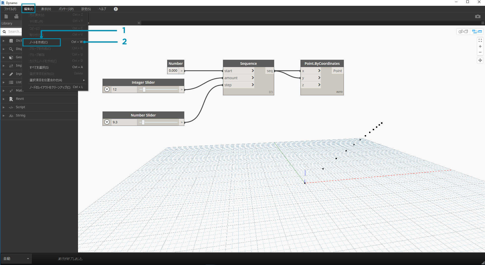
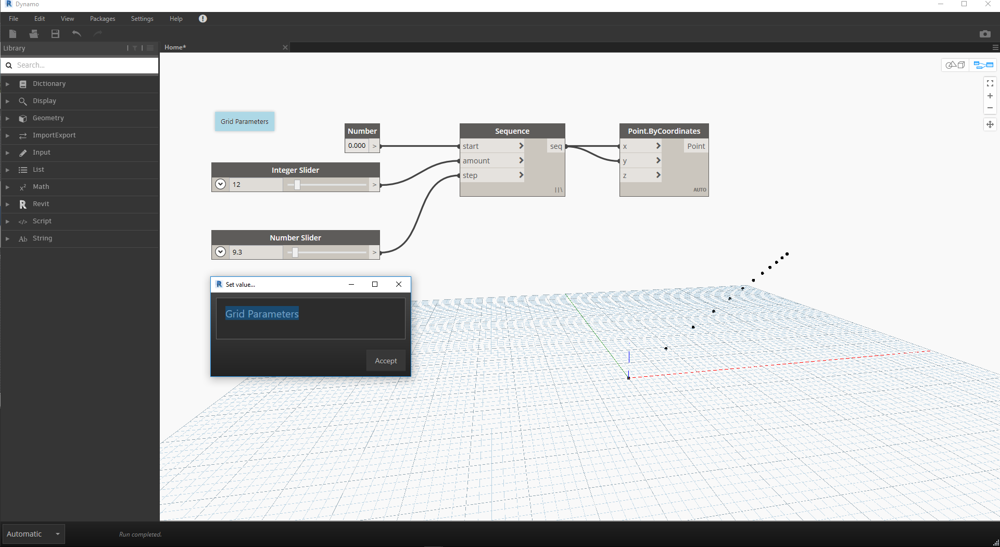

## プログラムを管理する

ビジュアル プログラミングは非常にクリエイティブな作業ですが、ワークスペースの複雑性やレイアウトの関係で、プログラム フローや主要なユーザ入力がすぐにわかりにくくなる場合があります。ここでは、プログラムの管理に関するベスト プラクティスをいくつか確認してみましょう。

### 位置合わせ

ワークスペースにある程度の数のノードを追加した場合は、画面を見やすくするためにノードのレイアウトを再編成することをお勧めします。複数のノードを選択してワークスペースを右クリックすると、X と Y で位置合わせオプションや分配オプションを指定するための**[選択を位置合わせ]**メニューがポップアップ ウィンドウに表示されます。

> 1. 複数のノードを選択します。
2. ワークスペースを右クリックします。
3. [**選択を位置合わせ**]オプションを使用します。

### ノート

Dynamo の操作に慣れてくると、ノード名とプログラム フローを確認することにより、ビジュアル プログラムを「読む」ことができるようになります。経験のレベルを問わず、すべてのユーザにとって、わかりやすい名前と説明を入力することが重要になります。そのため、Dynamo には、編集可能なテキスト フィールドが含まれている**ノート**ノードが用意されています。 ノートをワークスペースに追加する方法は 2 つあります。

> 1. [編集] > [ノートを作成]メニューを参照します。
2. キーボード ショートカット[Ctrl]+[W]を使用します。

ワークスペースにノートが追加されると、ノート内のテキストを編集するためのテキスト フィールドがポップアップ表示されます。ノートが作成されると、ノート ノードをダブルクリックするか右クリックしてノートを編集できるようになります。

### グループ化

ビジュアル プログラムのサイズが大きい場合、大まかな実行手順が特定できると便利です。**グループ**を使用してノードの集合をハイライト表示し、色付きの長方形にタイトルが表示されたラベルを付けることができます。 複数のノードを選択してグループを作成する方法は 3 つあります。

> 1. [編集] > [グループを作成]メニューを参照します。
2. キーボード ショートカット[Ctrl]+[G]を使用します。
3. ワークスペースを右クリックし、[グループを作成]を選択します。

作成したグループについては、タイトルやカラーなどの設定を編集できます。

> ヒント: ノードとグループの両方を使用すると、わかりやすい注釈をファイルに簡単に追加することができます。

これはセクション 2.4 で使用したプログラムですが、ノートとグループが追加されています。

> 1. ノート: 「Grid Parameters」
2. ノート: 「Grid Points」
3. グループ:「Create a Grid of Points」
4. グループ:「Create an Attractor Point」
5. ノート: 「Calibrate Distance Values」
6. ノート: 「Variable Grid of Circles」

