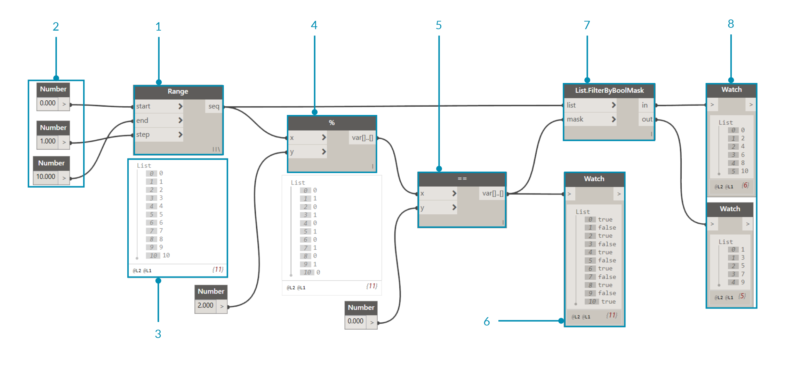
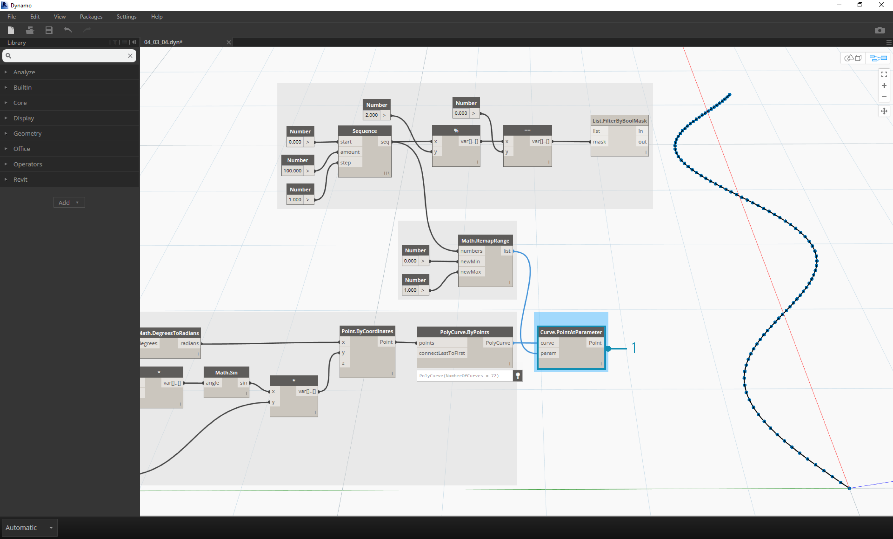

## ロジック

**ロジック**(正確には**条件付きロジック**)により、テストに基づく単一のアクションや一連のアクションを指定することができます。 テストの評価を行うと、```True``` または ```False``` のブール値が返されます。このブール値を使用して、プログラム フローをコントロールすることができます。

### ブール値

数値変数には、さまざまな数値の範囲全体を格納することができます。ブール変数には、True または False、Yes または No、1 または 0 など、2 つの値のみを格納することができます。このようにブール値の範囲は限られているため、ブール値を使用して計算を行うことはほとんどありません。

### 条件ステートメント

If ステートメントは、プログラミングにおける重要な概念です。このステートメントは、「*この条件*が真である場合は*この処理*を実行し、偽である場合は*別の処理*を実行する」という形式で記述されます。 このステートメントの結果として出力されるアクションは、ブール値によって制御されます。Dynamo で If ステートメントを定義する場合、いくつかの方法があります。

|アイコン|名前|構文|入力|出力|
| -- | -- | -- | -- | -- |
||If|If|test、true、false|result|
||Formula|IF(x,y,z)|x、y、z|result|
||Code Block|(x?y:z)|x、y、z|result|

ここでは簡単な例を使用して、If 条件ステートメントを使用する 3 つのノードの動作を確認していきます。


> 上の図では、*Boolean* ノードの出力値が *True* に設定されているため、その結果として*"this is the result if true"* という文が表示されます。この場合、*If* ステートメントを構成する 3 つのノードの動作は同じになります。


> 繰り返しますが、これら 3 つのノードの動作はすべて同じになります。*ブール値*を *False* に変更すると、元の *If* ステートメントで定義されているとおりに、出力結果の値が *Pi* になります。

### リストをフィルタする

> この演習に付属しているサンプル ファイルをダウンロードしてください(右クリックして[名前を付けてリンク先を保存...]を選択): [Building Blocks of Programs - Logic.dyn](datasets/4-3/Building Blocks of Programs - Logic.dyn)。 すべてのサンプルファイルの一覧については、付録を参照してください。

ここでは、ロジックを使用して、数値のリストを偶数のリストと奇数のリストに分割してみましょう。



> 1. **Number Range** ノードを使用して、数値の範囲をキャンバスに追加します。
2. **Number ** ノードを使用して、3 つの Number ノードをキャンバスに追加します。 各 Number ノードで、次のように値を指定します。*start* 入力: *0.0*、*end* 入力: *10.0*、*step* 入力: *1.0*。
3. **出力結果**として、0 から 10 までの範囲にわたる 11 個の数値のリストが生成されます。
4. 「**(%)**」ノード(モジュロ演算ノード)の *x* 入力に *Number Range* ノードを接続し、*y* 入力で *2.0* を指定します。 この操作により、リスト内の各数値を 2 で除算した場合の余りが算出されます。このリストの出力値は、0 と 1 が交互に現れる数値のリストになります。
5. 「**(==)**」ノード(等価テスト ノード)を使用して、キャンバスに等価テストを追加します。 「*(%)*」ノードの出力を「(==)」ノードの *x* 入力に接続し、Number ノードの *0.000* 出力を「(==)」ノードの *y* 入力に接続します。
6. **Watch** ノードを使用して、等価テストの出力が true と false の値を交互に繰り返すリストになっていることを確認します。 これらの値を使用して、リスト内の項目が区別されます。*0* (または *true*)は偶数を表し、*1* (または *false*)は奇数を表します。
7. **List.FilterByBoolMask** ノードは、ブール値の入力に基づいて数値をフィルタし、2 つの異なるリストに分割します。 元の*数値の範囲*を *list* 入力に接続し、「*(==)」ノードの出力を *mask* 入力に接続します。 *in* 出力は true の値を表し、*out 出力は false の値を表します。
8. **Watch** ノードを使用して、偶数のリストと奇数のリストが生成されたことを確認します。 これで、論理演算子を使用して、リストがパターン別に分類されました。

### ロジックからジオメトリへ

ここでは、最初の演習で作成したロジックを変更してモデリング操作に適用してみましょう。


> 1. ここでも、前の演習と同じノードを使用します。ただし、次のように、いくつか違いがあります。
2. ノードの形式が変更されています。
3. 入力値が変更されています。
4. *List.FilterByBoolMask* ノードの list 入力に対する接続が解除されています。 これらのノードは、この演習の後半で使用します。


> 最初に、上の図のように各ノードを接続します。このノード グループは、曲線を定義するためのパラメータ制御式を表しています。ここで、次の点に注意する必要があります。

> 1. **1 番目の Number Slider** ノードでは、最小値 1、最大値 4、ステップ値 0.01 に設定する必要があります。
2. **2 番目の Number Slider** ノードでは、最小値 0、最大値 1、ステップ値 0.01 に設定する必要があります。
3. **PolyCurve.ByPoints** ノードにより、上図のとおりにノード ダイアグラムを構成した時点で、Dynamo のプレビューに正弦曲線が出力されます。

ここでは、静的なプロパティで Number ノードを使用し、動的なプロパティで Number Slider ノードを使用して入力を行います。この手順の最初で定義した元の数値の範囲をそのまま使用してもかまいませんが、ここで作成する正弦曲線に対して、ある程度の柔軟性を設定しておく必要があります。Number Slider ノードの値を変更して、曲線の周波数と振幅がどのように変化するかを確認してください。


> ここで少し先回りをして、最終的な結果を確認しましょう。個別に作成した最初の 2 つのステップを接続する必要があります。基本の正弦曲線を使用して、ジッパー状のコンポーネントの位置をコントロールし、真偽判定のロジックを使用して、小さなボックスと大きなボックスを交互に配置します。


> 1. Sequence ノードの step 入力の値 1 で作成された数列の範囲を **Math.RemapRange** ノードで再マッピングして、新しい一連の数値を作成します。 元の数値の範囲は、0 から 100 までになります(step 値 1)。新しい数値の範囲は、0 から 1 になります。最小値の 0 を *newMin* 入力に接続し、最大値の 1 を *newMax* 入力に接続します。



> 1. **Curve.PointAtParameter** ノードの *curve* 入力に *Polycurve.ByPoints* ノード(セクション 4.2 を参照)を接続し、*param* 入力に *Math.RemapRange* ノードを接続します。 この操作により、曲線に沿って点群が作成されます。ここでは数値の範囲を 0 から 1 までの範囲に再マッピングしましたが、その理由は、*param* 入力に 0 から 1 までの範囲の値を指定する必要があるためです。 *0* の値は始点を表し、*1* の値は終点を表します。 すべての中間値は、*[0,1]* の範囲内で評価されます。


> 1. **List.FilterByBoolMask** ノードの *list* 入力に、前の手順で使用した *Curve.PointAtParameter* ノードを接続します。
2. **Watch** ノードを *in* 出力と *out* 出力に 1 つずつ接続し、偶数値のインデックスを表すリストと奇数値のインデックスを表すリストが生成されたことを確認します。 これらの点群は、曲線上に同じ方法で配置されます。これについては、次の手順で確認します。


> 1. **Cuboid.ByLengths** ノードを上の図のように接続し、正弦曲線に沿ったジッパー構造を作成します。 ノード名の「Cuboid」とは、直方体という意味です。ここでは、直方体の中央に位置する曲線上の点を基準として、直方体のサイズを定義します。この操作により、偶数と奇数の除算ロジックがモデル内に明示的に定義されます。


> 1. **Number Slider** ノードの数値スライダを使用して最初の定義からやり直すと、ジッパー構造がどのように変化するかを確認することができます。 上の図の上列の画像は、上部の Number Slider ノードの値を調整した場合の変化を示しています。これが、波の周波数になります。
2. 下列の画像は、下部の **Number Slider** ノードの値を調整した場合の変化を示しています。 これが、波の振幅になります。

