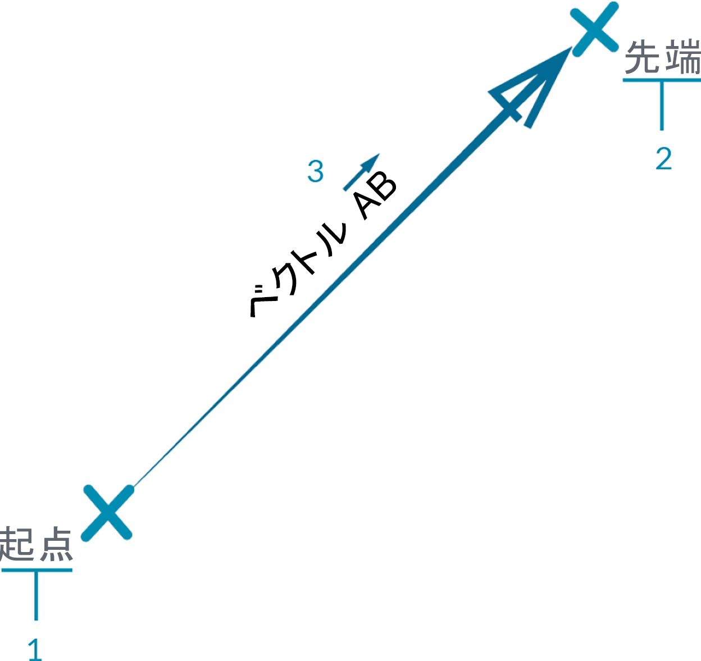

## ベクトル、平面、座標系

抽象的なジオメトリ タイプの主要なグループは、ベクトル、平面、座標系により構成されています。ベクトル、平面、座標系により、形状を表すその他のジオメトリの位置、方向、空間コンテキストを定義することができます。たとえば、ニューヨーク市 42 丁目のブロードウェイ(座標系)の路上(平面)に立って北(ベクトル)を向いている場合、ベクトル、平面、座標系という[Helper]カテゴリの情報を使用して自分の現在の居場所を定義していることになります。電話ケース製品や高層ビルについても、同じことが言えます。モデルを開発するには、このコンテキストが必要です。

### ベクトルの概要

ベクトルとは、方向と大きさを表すジオメトリの量です。ベクトルは、特定のジオメトリ要素ではなく量を表す抽象的な概念です。ベクトルは点と同様に値のリストで構成されているため、点とベクトルを混同しないようにする必要があります。ただし、点とベクトルには大きな違いがあります。点が特定の座標系における位置を表すのに対して、ベクトルは位置における相対的な差異を表します。これは、「方向」と言い換えることもできます。

「相対的な差異」という概念がわかりにくい場合は、ベクトル AB を「点 A に立って点 B の方向を向いている」と考えてみてください。現在地 A から目的地 B に対する方向が、ベクトルです。

ここでは、同じ AB 表記を使用して、ベクトルを構成する要素について説明します。

> 1. ベクトルの**開始点**は、**起点**と呼ばれます。
2. ベクトルの**終了点**は、**先端**または**向き**と呼ばれます。
3. ベクトル AB とベクトル BA は違います。これらは、反対方向のベクトルです。

ベクトルとその定義に関するジョークとして、古典的なコメディである Airplane (邦題: フライングハイ)の有名なジョークがあります。

> *Roger, Roger. What's our vector, Victor? (訳注: ロジャー、了解だ(発音は「ロジャー」、ラジャー)。ビクター、機首の向き(発音は「ベクター」、ベクトル)は?*

ベクトルは、Dynamo のモデルにおける主要なコンポーネントです。ベクトルは[Helper]という抽象的なカテゴリに分類されるため、ベクトルを作成しても背景プレビューには何も表示されないことに注意してください。

> 1. ベクトル プレビューの代わりに線分を使用することができます。
> この画像に付属しているサンプル ファイルをダウンロードしてください(右クリックして[名前を付けてリンク先を保存...]を選択): [Geometry for Computational Design - Vectors.dyn](datasets/5-2/Geometry for Computational Design - Vectors.dyn)。 すべてのサンプルファイルの一覧については、付録を参照してください。

### 平面の概要

平面は、2 次元の抽象的な Helper です。より厳密に定義すると、平面とは 2 つの方向に無限に延びる概念的に「平らな」面のことです。平面は、通常、小さな長方形として基準点の近くにレンダリングされます。

ここで、「基準点とは、CAD ソフトウェアでモデルを作成する場合に使用する、座標系に関係ある用語ではないだろうか」と思いつく人がいるかもしれません。

そのとおりです。多くのモデル作成ソフトウェアは、構築面(「レベル」)を使用してローカルな 2 次元のコンテキストを定義し、その面上に図面を作成します。XY 平面、XZ 平面、YZ 平面や、北、南東などの用語の方がなじみがあるかもしれません。これらはすべて、無限の平らなコンテキストを定義する平面です。平面に厚みはありませんが、方向を表す場合に役立ちます。平面には、基準点、X 方向、Y 方向、Z (上下)方向があります。

> 1. 平面は抽象的な概念ですが、平面には基準点があるため、空間内で平面の場所を特定することができます。
2. Dynamo では、平面は背景プレビューにレンダリングされます。
> この画像に付属しているサンプル ファイルをダウンロードしてください(右クリックして[名前を付けてリンク先を保存...]を選択): [Geometry for Computational Design - Planes.dyn](datasets/5-2/Geometry for Computational Design - Plane.dyn)。 すべてのサンプルファイルの一覧については、付録を参照してください。

### 座標系の概要

平面を理解できれば、座標系もすぐに理解することができます。平面のすべての要素は、標準的なユークリッド座標系または XYZ 座標系の要素と同じです。

ただし、円柱や球体など、他の座標系もあります。平面の要素は、これらの座標系の要素とは異なります。他のジオメトリ タイプに座標系を適用し、そのジオメトリ上の位置を定義することもできます。これについては、これ以降のセクションで説明します。

> 別の座標系(円柱、球体)に関する説明をここに追加

> 1. 座標系は抽象的な概念ですが、座標系には基準点があるため、空間内で座標系の場所を特定することができます。
2. Dynamo の座標系は、点(基準点)と 3 つの軸を定義する線分(X は赤、Y は緑、Z は青で表示)として背景プレビューにレンダリングされます。
> この画像に付属しているサンプル ファイルをダウンロードしてください(右クリックして[名前を付けてリンク先を保存...]を選択): [Geometry for Computational Design - Coordinate System.dyn](datasets/5-2/Geometry for Computational Design - Coordinate System.dyn)。 すべてのサンプルファイルの一覧については、付録を参照してください。

