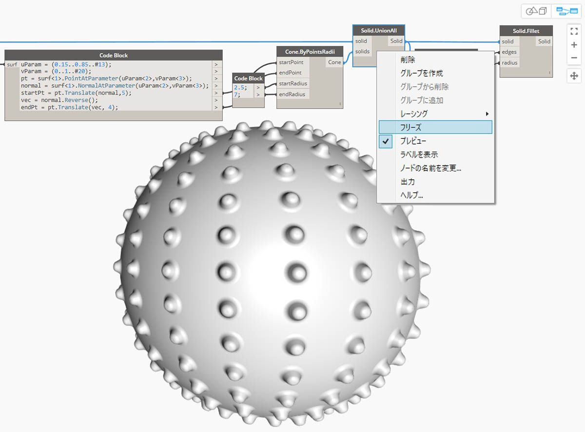

## ソリッド

単一のサーフェスから作成することのできない複雑なモデルを構築する場合や、明示的な体積を定義する場合は、ソリッド(およびポリサーフェス)を使用する必要があります。単純な立方体でさえ、全部で 6 つのサーフェスが必要になる複雑な構造をしています。ソリッドには、サーフェスには存在しない 2 つの重要な概念があります。それは、高度な位相幾何学的な概念(面、辺、頂点)と、ブール演算という概念です。

### ソリッドの概要

ソリッドは 1 つまたは複数のサーフェスから構成され、「内部」と「外部」を定義する閉じた境界によって体積が定義されます。ソリッドとして認識される条件は、サーフェスの数に関係なく、全体が完全に閉じた形状になっているということです。ソリッドは、サーフェスまたはポリサーフェスを結合して作成することも、ロフト、スイープ、回転などの操作を使用して作成することもできます。球体、立方体、円錐、円柱プリミティブなどもソリッドです。立方体から 1 つまたは複数の面を取り除いた場合、その形状はポリサーフェスとして認識されます。ポリサーフェスのプロパティはソリッドのプロパティと似ていますが、このポリサーフェスはソリッドではありません。

> 1. 単一のサーフェスで構成される平面は、ソリッドではありません。
2. 単一のサーフェスで構成される球体は、*ソリッドです*。
3. 2 つの結合されたサーフェスで構成される円錐は、ソリッドです。
4. 3 つの結合されたサーフェスで構成される円柱は、ソリッドです。
5. 6 つの結合されたサーフェスで構成される立方体は、ソリッドです。

### トポロジ

ソリッドは、頂点、辺、面という 3 種類の要素で構成されます。面は、ソリッドを構成するサーフェスです。辺は、隣接する面の接続を定義する曲線です。頂点は、これらの曲線の開始点と終了点です。Topology ノードを使用すると、これらの要素についてクエリーを実行することができます。

> 1. 面
2. 辺
3. 頂点

### 操作

ソリッドの辺をフィレット操作や面取り操作で変更することにより、角のとがりや出っ張りを取り除くことができます。面取り操作を実行すると、2 つの面の間に直線的なサーフェスが作成され、フィレット操作を実行すると、2 つの面がなめらかに接合されます。

> 1. ソリッド立方体
2. 面取りされた立方体
3. フィレットされた立方体

### ブール演算

ソリッドのブール演算は、2 つ以上のソリッドを組み合わせるための方法です。ブール演算を 1 回実行すると、実際には次に示す 4 つの操作が実行されます。

1. 2 つ以上のオブジェクトを**交差**させる。
2. すべてのオブジェクトを交点で**分割**する。
3. ジオメトリの不要な部分を**削除**する。
4. すべてのオブジェクトを 1 つに**結合**する。

このように、ソリッドのブール演算は、作業時間を節約するための強力な機能です。ソリッドのブール演算には、ジオメトリのどの部分を保持するかを区別する 3 つの操作があります。

> 1. **和:** ソリッドの重複部分を削除して 1 つのソリッドに結合します。
2. **差:** 一方のソリッドから別のソリッドを取り除きます。 取り除く側のソリッドは、ツールと呼ばれます。ツールとなるソリッドを切り替えて、逆のボリュームを作成することができます。
3. **積:** 2 つのソリッドが交差している部分だけを保持します。

これら 3 つの演算に加えて、Dynamo には、さまざまなソリッドの差演算と和演算を実行するための **Solid.DifferenceAll** ノードと **Solid.UnionAll** ノードが用意されています。

> 1. **UnionAll** ノードは、球体と外側を向いた円錐の和演算を行います。
2. **DifferenceAll** ノードは、球体と内側を向いた円錐の差演算を行います。

いくつかのブール演算を使用して、スパイク状のボールを作成してみましょう。

> 1. **Sphere.ByCenterPointRadius** ノードを使用して、ベースとなるソリッドを作成します。
2. **Topology.Faces** ノードと **Face.SurfaceGeometry** ノードを使用してソリッドの面のクエリーを実行し、サーフェス ジオメトリに変換します。この場合、球体には 1 つの面しかありません。
3. **Cone.ByPointsRadii** ノードで、サーフェス上の点を使用して円錐を作成します。
4. **Solid.UnionAll** ノードを使用して、円錐と球体との和演算を行います。
5. **Topology.Edges** ノードを使用して、新しいソリッドの辺のクエリーを実行します。
6. **Solid.Fillet** ノードを使用して、スパイク状の球体のエッジの面取りを行います。
> この画像に付属しているサンプル ファイルをダウンロードしてください(右クリックして[名前を付けてリンク先を保存]を選択)。すべてのサンプルファイルの一覧については、付録を参照してください。[Geometry for Computational Design - Solids.dyn](datasets/5-6/Geometry for Computational Design - Solids.dyn)

### フリーズ

ブール演算は複雑なため、計算に時間がかかります。選択したノードとその影響を受ける下流ノードの実行を中止するには、フリーズ機能を使用します。

> Solid.UnionAll ノードの和演算をフリーズするには、右クリックしてコンテキスト メニューを使用します。

> 選択したノードとすべての下流ノードがライト グレーのゴースト モードでプレビュー表示され、影響を受けるワイヤが破線で表示されます。影響を受けるジオメトリのプレビューも、ゴースト モードになります。これで、ブール論理和を計算することなく、上流で値を変更することができます。

> ノードのフリーズを解除するには、ノードを右クリックして[フリーズ]の選択を解除します。

> 影響を受けるすべてのノードとそれに関連するジオメトリのプレビューが更新され、標準プレビュー モードに戻ります。

