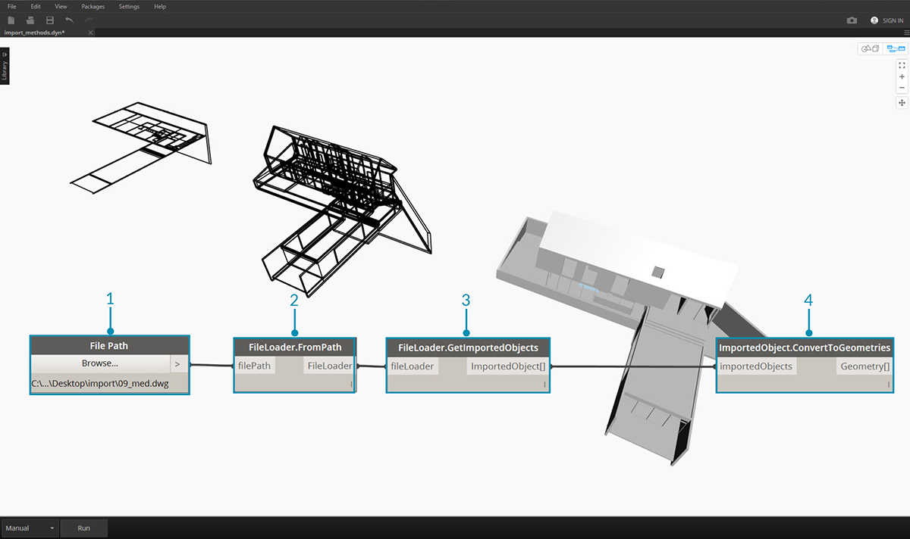

## ジオメトリの読み込み

いくつかの方法で、Dynamo にジオメトリを読み込むことができます。前のセクションでは、*Mesh Toolkit* を使用してメッシュを読み込む方法を説明しました。同様に、ソリッド モデルを .SAT ファイルから読み込むこともできます。 これらのプロセスでは、別のプラットフォームでジオメトリを開発し、そのジオメトリを Dynamo に読み込み、ビジュアル プログラミングを使用してパラメトリック操作を適用します。

ジオメトリは、*ATF 変換*と呼ばれる処理を使用して読み込むこともできます。 ATF 変換では、ジオメトリだけでなく、ファイルの構造も読み込むことができます。たとえば、モデル全体を読み込むのではなく、読み込む .DWG のレイヤを選択することができます。この操作については、これ以降で詳しく説明します。

### DWG ファイルからジオメトリを読み込む

DWG を Dynamo 環境に読み込むためのノードは、*Translation* カテゴリにあります(注: これらのノードは、[Dynamo Studio](http://www.autodesk.com/products/dynamo-studio/overview) でのみ利用できます)。 次の例は、ファイルを参照してその内容を読み込み、使用可能な Dynamo ジオメトリに変換するための一連のコンポーネントを示しています。Dynamo には、DWG ファイルの特定のオブジェクトをフィルタまたは選択して読み込むための機能が用意されています。この機能については、これ以降で詳しく説明します。DWG ファイルからのジオメトリの読み込みについて詳しくは、Ben Goh の[ブログ記事](http://dynamobim.org/dwg-import-in-dynamo-studio-0-9-1/)を参照してください。

### 読み込まれたオブジェクトの取得

Dynamo Studio に DWG を読み込むための最も簡単な方法は、ワークスペースにファイル全体を読み込む方法です。

> 1. File Path ノードを使用して、Dynamo に読み込む DWG ファイルを参照します。
2. File Path ノードを **FileLoader.FromPath** ノードに接続し、ファイルを読み取ります。
3. **FileLoader.GetImportedObjects** ノードを使用してジオメトリを解析し、Dynamo Studio に読み込みます。
4. **ImportedObject.ConvertToGeometries** ノードにより、オブジェクトが Dynamo ワークスペース内で使用可能なジオメトリに変換されます。

上の図のように、DWG ファイル内のすべてのジオメトリ タイプ(サーフェス、メッシュ、曲線、線分)が Dynamo に読み込まれます。

### オブジェクト フィルタ

DWG ファイルから読み込むジオメトリを指定するには、**ObjectFilter** ノードを定義に追加します。 **ObjectFilter** ノードは、**Fileloader** ノードと **ImportedObject** ノードのリストと互換性があり、**ImportedObject** のリストを出力します。

次の図は、各 **ObjectFilter** ノード内の条件ステートメントを示しています。 指定された条件を満たすすべての **ImportedObject** がフィルタを通過します。 レイヤのラベル(レイヤ名)、ジオメトリ タイプ、拡散色などに基づいてフィルタすることができます。別のフィルタと組み合わせて、選択肢を絞り込むこともできます。

> 1. **FileLoader.GetImportedObjects** ノードの代わりに **ObjectFilter** ノードを使用して、DWG ファイルで特定の条件に基づく検索を行います。 この場合、サーフェス ジオメトリのみが読み込まれ、前の図で表示されていたすべての曲線と線分のジオメトリが削除されます。
2. ObjectFilter ノードを **ImportedObject.ConvertToGeometries** ノードに接続し、フィルタ後のジオメトリを読み込みます。

異なる条件ステートメントを持つ 2 つのフィルタを追加することにより、ジオメトリのリストを複数のストリームに分割することができます。

> 1. **FileLoader.GetImportedObjects** ノードの代わりに、別の条件ステートメントを持つ 2 つの **ObjectFilter** ノードを使用します。 こうすると、1 つのファイルのジオメトリが 2 つの異なるストリームに分割されます。
2. ObjectFilter ノードを **ImportedObject.ConvertToGeometries** ノードに接続し、フィルタ後のジオメトリを読み込みます。
3. **ImportedObject.ConvertToGeometries** ノードを **Display.ByGeometryColor** ノードに接続し、各ストリームを異なる色で表示します。

### 明示的なオブジェクト選択

別の方法として、**ObjectSelector** ノードを使用して、DWG ファイルからオブジェクトを読み込むこともできます。 この方法では、フィルタを使用することなく、Dynamo に読み込むオブジェクトとレイヤを指定することができます。

> 1. **FileLoader.GetImportedObjects** ノードの代わりに **ObjectSelector** ノードを使用して、DWG ファイル内の特定のレイヤとオブジェクトを指定します。
2. ObjectSelector ノードを **ImportedObject.ConvertToGeometries** ノードに接続します。

