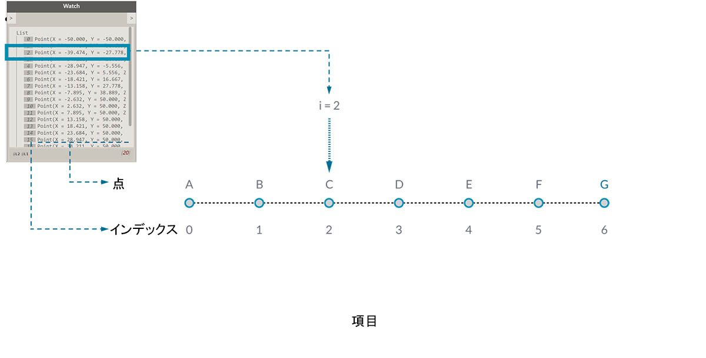
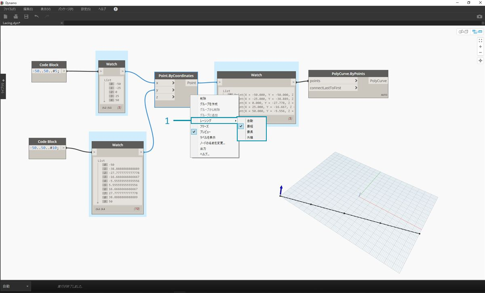
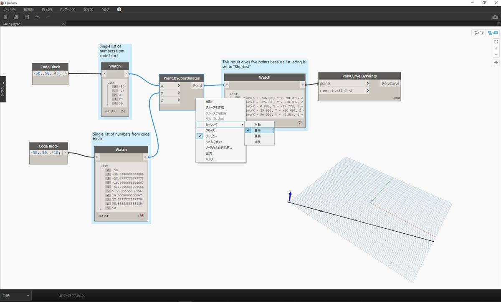
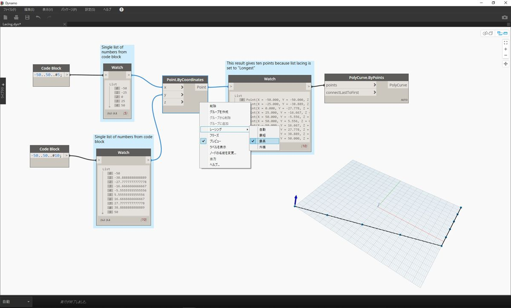
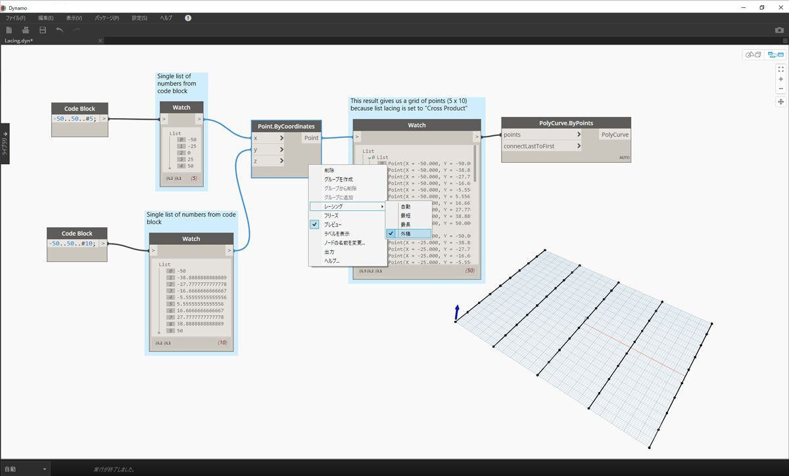

## リストの概要

リストとは、要素(項目)の集合です。例として、1 房のバナナを考えてみましょう。1 本のバナナが、リスト(房)内の 1 つの項目になります。それぞれのバナナをばらばらに取り上げるより、房をまとめて持ち上げる方が簡単です。同じことが、データ構造内のパラメータに基づく関係によって各要素をグループ化する場合についても当てはまります。

> 写真: [AugustusBinu](https://commons.wikimedia.org/wiki/File:Bananas_white_background_DS.jpg?fastcci_from=11404890&c1=11404890&d1=15&s=200&a=list)

日用品を購入する場合、購入した商品をすべて買い物カゴに入れます。このカゴも、リストと考えることができます。たとえば、3 房のバナナを使用して多くのバナナ パンを作るとします。** この場合、すべてのバナナが入っている袋がバナナの房のリストで、それぞれの房がバナナのリストになります。この袋は 2 次元の「リストのリスト」で、バナナは 1 次元の「リスト」です。

Dynamo では、リスト データには順序が付けられ、各リストの最初の項目にはインデックス「0」が割り当てられます。次のセクションでは、Dynamo におけるリストの定義の仕組みと、複数のリストの相互関係について説明します。

## ゼロで始まるインデックス

リストのインデックスは、1 ではなく必ず 0 から始まります。これは、最初は不思議に感じるかもしれません。今後、リストの最初の項目と言う場合は、インデックス 0 の付いた項目のことを意味します。

たとえば、右手の指を使って数を数える場合、1 から 5 の順序で数えます。0 から数え始めることはほとんどないはずです。しかし、右手の指を Dynamo のリストだと仮定すると、それぞれの指に 0 から 4 のインデックスが割り当てられることになります。プログラミングの初心者にとっては少し不思議に感じられるかもしれませんが、ほとんどのコンピュータ システムでは、インデックスの値はゼロで始まるのが普通です。

ここでも、引き続きリスト内に 5 つの項目が含まれています。ただし、最初の項目に 0 のインデックス値が割り当てられているものと仮定して説明を続けます。リストに格納できる項目は、数値だけではありません。Dynamo でサポートされているデータ タイプであれば、点、曲線、サーフェス、ファミリなど、任意のデータ タイプをリスト内に格納することができます。

多くの場合、リストに格納されているデータのタイプを確認する最も簡単な方法は、ノードの出力を Watch ノードに接続する方法です。既定では、Watch ノードにはリストの左側のすべてのインデックスと、右側のすべてのデータ項目が自動的に表示されます。

これらのインデックスは、リストを操作する場合の重要な要素です。

### 入力と出力

リストの入力と出力は、使用する Dynamo ノードによって異なります。例として、5 つの点を持つリストのノードの出力を *PolyCurve.ByPoints* ノードと *Circle.ByCenterPointRadius* ノードに接続してみましょう。

> 1. *PolyCurve.ByPoints* ノードの *points* 入力には、*Point[]* が必要です。 これは、点のリストを表しています。
2. *PolyCurve.ByPoints* ノードの出力は、5 つの点を持つリストから作成された 1 つのポリカーブです。
3. *Circle.ByCenterPointRadius* ノードの *CenterPoint* 入力には、*Point* が必要です。
4. *Circle.ByCenterPointRadius* ノードの出力は、5 つの円を持つリストです。それぞれの円の中心が、元のリスト内の点に対応しています。

*PolyCurve.ByPoints* ノードと *Circle.ByCenterPointRadius* ノードの入力データは同じですが、PolyCurve.ByPoints ノードは 1 つのポリカーブを返し、Circle.ByCenterPointRadius ノードは各点を中心とする 5 つの円を返します。 この場合、5 つの点をつなぐ曲線としてポリカーブが描画され、Circle.ByCenterPointRadius ノードは各点を中心とする個別の円を描画します。これは、直感的に理解することができます。では、データには何が起きているのでしょうか。

*Polycurve.ByPoints* ノードの *points* 入力の上にカーソルを置くと、この入力に *Point[]* が必要であることがわかります。 最後の角括弧に注意してください。これは、点のリストであることを表しています。ポリカーブを作成するには、ポリカーブごとにリストを入力する必要があります。入力された各リストは、Polycurve.ByPoints ノードによって 1 つのポリカーブに集約されます。

一方、*Circle.ByCenterPointRadius* ノードの *centerPoint* 入力には、*Point* が必要です。 このノードはリストの項目である 1 つの点を取得し、それを円の中心として定義します。入力されたデータから 5 つの円が生成されるのは、このためです。Dynamo の入力に関するこれらの違いを認識しておくと、ノードによるデータ処理の仕組みを正しく理解することができます。

### レーシング

データの一致は、明確に解決することができない問題です。このような問題は、異なるサイズの入力をノードに渡すときに発生します。データ一致アルゴリズムを変更すると、結果が大きく変わってしまうことがあります。

例として、2 点の間に直線セグメントを作成するノード(Line.ByStartPointEndPoint)を考えてみます。このノードは、点の座標を指定する 2 つの入力パラメータを使用します。

これらの点の集まりの間に直線を描画する場合、いくつかの方法があります。レーシング オプションを使用するには、ノードの中心を右クリックして[レーシング]メニューを選択します。

### 基準ファイル

> この演習に付属しているサンプル ファイルをダウンロードしてください(右クリックして[名前を付けてリンク先を保存...]を選択): [Lacing.dyn](datasets/6-1/Lacing.dyn)。 すべてのサンプルファイルの一覧については、付録を参照してください。

次の図を使用して、レーシング操作について説明します。ここでは、上記の基準ファイルを使用して、最短リスト、最長リスト、直積を定義します。

> 1. *Point.ByCoordinates* ノードでレーシングを変更しますが、上図のグラフについては何も変更しません。

#### 最短リスト

最も単純な方法は、一方のリストが終了するまで、入力された点を 1 対 1 で接続していく方法です。これは、「最短リスト」アルゴリズムと呼ばれます。Dynamo ノードの既定の動作です。

> レーシングを[*最短リスト*]に変更すると、5 つの点で構成される基本的な対角線が生成されます。 最短リストのレーシングは、2 つのリストのうち短い方のリストの最後の項目に達した場合に動作が終了します。そのためこの例では、5 つの点が含まれているリストの最後に達すると、レーシング動作が停止します。

#### 最長リスト

「最長リスト」アルゴリズムの場合、すべてのリストの最後の項目に達するまで、同じ要素を繰り返し使用して入力が接続されたままの状態になります。

> レーシングを[*最長リスト*]に変更すると、垂直方向に伸びる対角線が生成されます。 上の概念図のように、長い方のリストの最後の項目に達するまで、短い方のリスト(項目数が 5 のリスト)の最後の項目が繰り返し使用されます。

#### 直積

最後に、「直積」方式について説明します。この方式では、考えられる接続がすべて生成されます。

> レーシングを[*直積*]に変更すると、各リスト間で考えられるすべての組み合わせの 5x10 の点のグリッドが生成されます。 これは、上の概念図に示す直積に該当するデータ構造です。ただし、ここで使用しているデータは、「リストのリスト」です。ポリカーブを接続すると、各リストは X 値によって定義され、垂直な直線の列が生成されていることがわかります。

