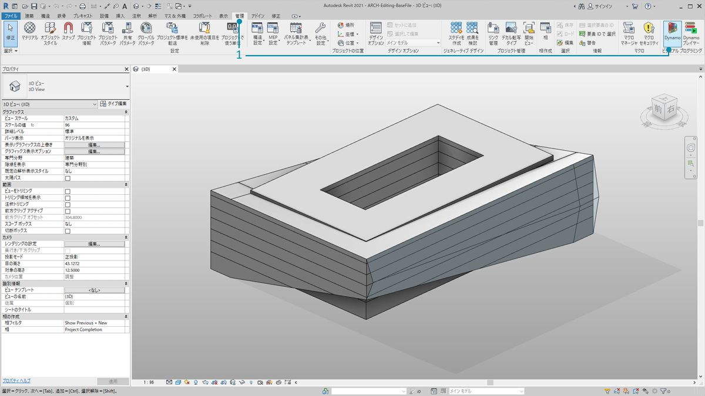
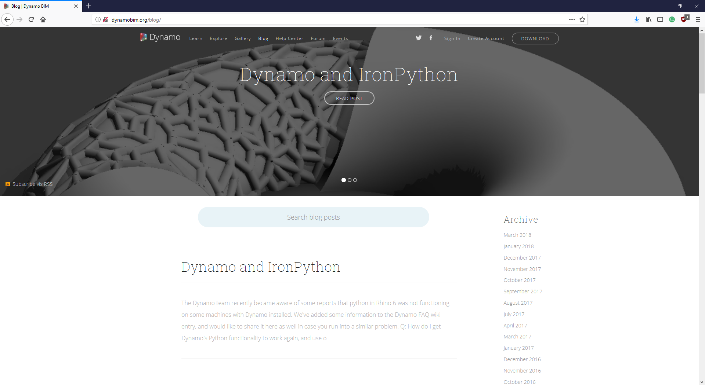

## Revit との関係

 Dynamo を Revit に組み込んで使用すると、Revit のビルディング インフォメーション モデリング(BIM)機能を、データとロジックに基づく Dynamo の視覚的なアルゴリズム編集環境によって拡張することができます。Dynamo の柔軟性を Revit の堅牢なデータベース機能と組み合わせることにより、BIM の新しい可能性が広がります。

この章では、Dynamo を使用した BIM ワークフローについて説明します。この章の各セクションでは、演習を行いながら BIM を確認していきます。BIM の視覚的なアルゴリズム編集機能の仕組みを理解するには、サンプルのプロジェクトで実際に操作するのが最適な方法です。ただしその前に、Dynamo の歴史を簡単に説明します。

### #

#### Revit のバージョンの互換性

Revit と Dynamo はどちらも進化し続けているため、作業中の Revit のバージョンが、マシンにインストールされている Dynamo for Revit のバージョンと互換性がない場合があります。次の一覧は Revit と互換性のある Dynamo for Revit のバージョンの概要です。

|Revit のバージョン|最も安定する Dynamo のバージョン|サポートされる最も古い Dynamo for Revit のバージョン|
| -- | -- | -- |
|2013|[0.6.1](http://dyn-builds-data.s3-us-west-2.amazonaws.com/DynamoInstall0.6.1.exe)|[0.6.3](http://dyn-builds-data.s3-us-west-2.amazonaws.com/DynamoInstall0.6.3.exe)|
|2014|[0.6.1](http://dyn-builds-data.s3-us-west-2.amazonaws.com/DynamoInstall0.6.1.exe)|[0.8.2](http://dyn-builds-data.s3-us-west-2.amazonaws.com/DynamoInstall0.8.2.exe)|
|2015|[0.7.1](http://dyn-builds-data.s3-us-west-2.amazonaws.com/DynamoInstall0.7.1.exe)|[1.2.1](http://dyn-builds-data.s3-us-west-2.amazonaws.com/DynamoInstall1.2.1.exe)|
|2016|[0.7.2](http://dyn-builds-data.s3-us-west-2.amazonaws.com/DynamoInstall0.7.2.exe)|[1.3.2](http://dyn-builds-data.s3-us-west-2.amazonaws.com/DynamoInstall1.3.2.exe)|
|2017|[0.9.0](http://dyn-builds-data.s3-us-west-2.amazonaws.com/DynamoInstall0.9.0.exe)|[最新のプレリリース](http://dynamobuilds.com/)|
|2018|[1.3.0](http://dyn-builds-data.s3-us-west-2.amazonaws.com/DynamoInstall1.3.0.exe)|[最新のプレリリース](http://dynamobuilds.com/)|
|2019|[1.3.3](http://dyn-builds-data.s3-us-west-2.amazonaws.com/DynamoInstall1.3.3.exe)|[最新のプレリリース](http://dynamobuilds.com/)|

### #

#### Dynamo の歴史

> Dynamo プロジェクトは、開発チームとコミュニティの積極的なサポートによってここまで発展しましたが、最初の目標は小さなものでした。

Dynamo は、もともと Revit の設計ワークフローを合理化するために開発されました。Revit では、プロジェクトごとに堅牢なデータベースが作成されますが、ユーザ インタフェースの制約を受けることなくこの情報にアクセスすることは、一般的なユーザにとっては難しい場合があります。Revit には包括的な API (アプリケーション プログラム インタフェース)が用意されているため、サードパーティの開発者はこれらの API を使用して、カスタマイズされたツールを作成することができます。プログラマーであればこの API には慣れていますが、プログラミングの経験がないユーザとっては、テキストベースのスクリプトを記述することは簡単なことではありません。Dynamo の開発チームは、わかりやすい視覚的なアルゴリズム エディタを提供することにより、Revit のデータを簡単に操作できるようにすることを目指しています。

カスタマイズされた Revit と Dynamo の主要なノードを組み合わせて使用すると、相互運用性、設計図書作成、解析、モデル生成などにおいて、パラメータ制御によるワークフローの範囲を大きく広げることができます。Dynamo を使用すれば、面倒なワークフロー作業を自動化し、設計作業に集中することができます。

### Revit で Dynamo を実行する

> 1. Revit プロジェクトやファミリ エディタで、[アドイン]タブから[*Dynamo*]をクリックします。Dynamo は、Dynamo を起動したファイル内でのみ実行されることに注意してください。

> 1. Revit で Dynamo を起動すると、Dynamo のライブラリ内に[*Revit*]という新しいカテゴリが表示されます。この新しいカテゴリから、Revit ワークフロー専用のノードにアクセスすることができます。

**注: Dynamo グラフで Revit 固有のファミリを扱うノードを使用する場合、そのグラフは Revit で稼働している Dynamo から開いたときにのみ正常に動作します。 たとえば、Revit で稼働している Dynamo のグラフを Dynamo Sandbox で開くと、Revit ノードが失われます。*

### ノードのフリーズ

Revit は堅牢なプロジェクト管理を提供するプラットフォームであるため、場合によっては Dynamo のパラメータ操作が複雑になり、計算速度が低下することがあります。Dynamo によるノード計算で時間がかかる場合は、ノードを「フリーズ」する機能を使用して、グラフの開発中に Revit 関連操作の実行を停止することができます。ノードをフリーズする操作の詳細については、[「ソリッド」の章](../05_Geometry-for-Computational-Design/5-6_solids.md#freezing)の「フリーズ」セクションを参照してください。

### コミュニティ

Dynamo は、もともと建築設計者や構造設計者向けに開発されたツールです。Dynamo のコミュニティは、建設業界の専門家と交流しながら学ぶことができる場所として、現在も成長を続けています。Dynamo のコミュニティは、情報の共有と開発プロジェクトに積極的に参加する建築設計者、構造設計者、プログラマ、デザイナーによって構成されています。

Dynamo は、継続的に進化していくオープンソース プロジェクトであり、その開発の大部分は Revit に関係しています。ディスカッション フォーラムにアクセスし、[質問を投稿](http://dynamobim.org/forums/forum/dyn/)してみてください。 プログラマとして Dynamo プロジェクトに参加する場合は、次のリンクを参照してください: [GitHub の Dynamo ページ](https://github.com/DynamoDS/Dynamo) また、[Dynamo Package Manager](http://dynamopackages.com/) では、さまざまなサードパーティ製ライブラリが提供されています。 提供されているパッケージの多くは、建設業界のワークフローで使用することを目的として作成されています。実際に、パネル作成用のサードパーティ製パッケージを使用してみましょう。

> Dynamo 開発チームは、[ブログ](http://dynamobim.com/blog/)を頻繁に更新しています。 最近の記事を確認し、最新の開発情報を入手してください。

