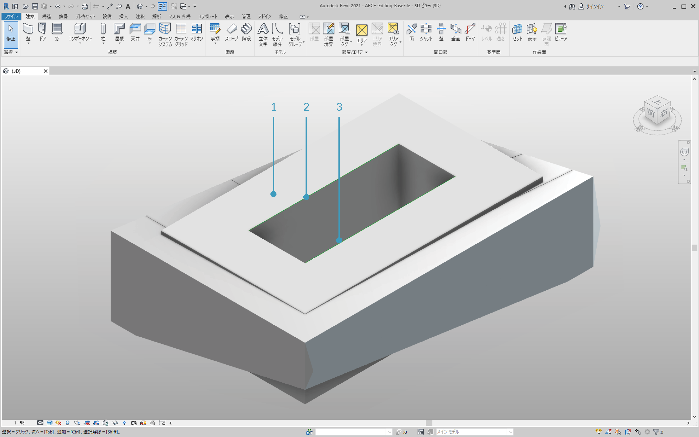

## 作成

Dynamo では、完全なパラメトリック コントロールを使用して Revit 要素の配列を作成できます。Dynamo の Revit ノードは、一般的なジオメトリから特定のカテゴリ タイプ(壁、床など)まで、さまざまな要素を読み込む機能を提供します。このセクションでは、パラメータを使用してアダプティブ コンポーネントを含む柔軟性が高い要素を読み込みます。


### アダプティブ コンポーネント

アダプティブ コンポーネントはオブジェクトの生成に役立つ柔軟性の高いファミリ カテゴリです。インスタンス化すると、アダプティブ点の基本的な位置でコントロールされる複雑なジオメトリ要素を作成することができます。


> これは、ファミリ エディタ上で 3 つのアダプティブ点により構成されているアダプティブ コンポーネントです。これにより生成されるトラスは、各アダプティブ点の位置によって設定されます。次の演習では、このコンポーネントを使用して、ファサード全体に一連のトラスを生成します。

#### 相互運用性の原則

アダプティブ コンポーネントは相互運用性のベスト プラクティスの好例です。基本的なアダプティブ点を設定することにより、アダプティブ コンポーネントの配列を作成できます。また、このデータを他のプログラムに転送すると、ジオメトリを単純なデータに変換できます。Excel などのプログラムに読み込んだり書き出す場合も同様です。

ファサード設計の監修者が、完全なジオメトリを詳細に解析する必要なく、トラス要素の位置を確認する必要があるとします。製造の準備段階で、コンサルタントはアダプティブ点の位置を参照することにより、Inventor などのプログラムでジオメトリを再生成できます。

次の演習のワークフローでは、このようなデータすべてにアクセスしながら、Revit 要素を作成するための設定を行います。このプロセスにより、概念化、ドキュメント作成、製造を、1 つのシームレスなワークフローに統合できます。これにより、相互運用性を実現するためのよりインテリジェントで効率的なプロセスを作成できます。

#### 複数の要素とリスト


次の演習では、Revit 要素を作成するためのデータを Dynamo が参照する仕組みについて学習します。複数のアダプティブ コンポーネントを生成するには、リストのリストを設定します。各リストには、アダプティブ コンポーネントの各点を表す 3 つの点が含まれています。Dynamo でデータ構造を管理する際は、このことを考慮します。

### 演習

> この演習に付属しているサンプル ファイルをダウンロードしてください(右クリックして[名前を付けてリンク先を保存]を選択)。すべてのサンプル ファイルの一覧については、付録を参照してください。

> 1. [Creating.dyn](datasets/8-4/Creating.dyn)
2. [ARCH-Creating-BaseFile.rvt](datasets/8-4/ARCH-Creating-BaseFile.rvt)


> このセクションでサンプル ファイルの使用を開始した場合(または、前のセッションの Revit ファイルを継続して使用した場合)は、同じ Revit のマスが表示されます。

> 1. これはファイルを開いた状態です。
2. これは Dynamo で作成するトラス システムです。Revit のマスとインテリジェントにリンクされています。


> これまで *Select Model Element* ノードと *Select Face* ノードを使用しました。ここでは、ジオメトリ階層の 1 段階下の層で *Select Edge* ノードを使用します。 Dynamo ソルバを[*自動*]で実行するように設定すると、グラフは Revit ファイルの変更に応じて継続的に更新されます。 選択したエッジは Revit 要素トポロジに動的に関連付けられます。*トポロジ*が変更されない限り、Revit と Dynamo 間の接続はリンクされ続けます。

> 1. グレージング ファサードの最上部の曲線を選択します。これは建物の全体の長さに及びます。Revit でエッジを選択するには、エッジにカーソルを置いて、目的のエッジがハイライト表示されるまで[*Tab*]を押し続けます。
2. 2 つの *Select Edge* ノードを使用して、ファサード中央の傾斜を示す各エッジを選択します。
3. Revit でファサードの最下部のエッジに対して同じ操作を行います。
4. Dynamo に線が設定されたことが *Watch* ノードによって示されます。 エッジ自体は Revit 要素ではないため、自動的に Dynamo ジオメトリに変換されます。これらの曲線は、ファサード全体にわたるアダプティブ トラスをインスタンス化する際に使用する参照です。

**注意: トポロジの一貫性を保持するため、面やエッジが追加されないモデルを参照します。 パラメータにより形状を変更することはできますが、トポロジの構築方法を変更することはできません。**


> まず曲線を結合して 1 つのリストに統合する必要があります。これにより、曲線を「*グループ化*」して、ジオメトリ操作を実行できます。

> 1. ファサードの中央にある 2 つの曲線のリストを作成します。
2. *List.Create* コンポーネントを *Polycurve.ByJoinedCurves* ノードに接続して、2 つの曲線を 1 つのポリカーブに結合します。
3. ファサードの最下部にある 2 つの曲線のリストを作成します。
4. *List.Create* コンポーネントを *Polycurve.ByJoinedCurves* ノードに接続して、2 つの曲線を 1 つのポリカーブに結合します。
5. 最後に、3 つの主要な曲線(1 つの直線と 2 つのポリカーブ)を 1 つのリストに結合します。


> 直線になっている最上部の線を使用して、ファサードのスパン全体を表します。この線に沿って平面を作成し、リストでグループ化した曲線のセットと交差させます。

> 1. *Code Block* ノードで、構文 ```0..1..#numberOfTrusses;``` を使用して範囲を設定します。
2. *Integer Slider* ノードを Code Block ノードの入力に接続します。 おわかりのとおり、これはトラスの数を表します。スライダは項目の数を *0* から *1* の範囲でコントロールします。
3. *Code Block* ノードを *Curve.PlaneAtParameter* ノードの *param* 入力に接続し、最上部のエッジを *curve* 入力に接続します。 これにより、10 個の平面がファサードのスパン全体にわたって均等に配置されます。


> 平面はジオメトリの抽象的なピースであり、無限の 2 次元空間を表します。平面は輪郭や交差の作成に適しています。実際に行ってみましょう。

> 1. *Geometry.Intersect* ノードを使用して、*Curve.PlaneAtParameter* を *Geometry.Intersect* ノードの *entity* 入力に接続します。 メインの *List.Create* ノードを *geometry* 入力に接続します。 Dynamo のビューポートには、設定した平面と各曲線の交点が表示されます。


> 出力にはリストのリストのリストが表示されます。操作目的に対してリストの数が多すぎます。リストの一部をフラットにしましょう。リストの 1 段階下の層で結果をフラットにします。これを行うには、手引のリストに関する章で説明したように、*List.Map* 操作を使用します。

> 1. *Geometry.Intersect* ノードを *List.Map* の list 入力に接続します。
2. *Flatten* ノードを *List.Map* ノードの f(x) 入力に接続します。 この結果、リストは 3 個になり、各リストにはトラスと同じ数の項目が含まれます。
3. このデータは変更する必要があります。トラスをインスタンス化する場合は、ファミリで設定されているアダプティブ点と同じ数を使用する必要があります。これは 3 つの点で構成されているアダプティブ コンポーネントです。このため、それぞれ 10 個の項目(numberOfTrusses)が含まれている 3 個のリストではなく、それぞれ 3 個の項目が含まれている 10 個のリストが必要になります。これにより、10 個のアダプティブ コンポーネントを作成できます。
4. *List.Map* ノードを *List.Transpose* ノードに接続します。 これで目的のデータ出力を得ることができます。
5. データが正しいことを確認するには、*Polygon.ByPoints* ノードをキャンバスに追加して、Dynam プレビューで再確認します。


> ポリゴンを作成するのと同じ方法で、アダプティブ コンポーネントを配列します。

> 1. *AdaptiveComponent.ByPoints* ノードをキャンバスに追加し、*List.Transpose* ノードを *points* 入力に接続します。
2. *Family Types* ノードを使用して、*AdaptiveTruss* ファミリを選択し、これを *AdaptiveComponent.ByPoints* ノードの *familySymbol* 入力に接続します。


> Revit で確認すると、10 個のトラスがファサード全体にわたって均等に配置されています。


> 1. グラフを柔軟に調整することができます。*Integer Slider* ノードを変更して *numberOfTrusses* を「*40*」にします。 トラスの数が尋常でなく増えますが、パラメトリック リンクは機能しています。


> 1. トラス システムに慣れてきたら、*numberOfTrusses* に値 *15* を設定してみましょう。


> 最後の確認として、Revit でマスを選択してインスタンス パラメータを編集することにより建物の形状を変更して、トラスがこれに従って変更されるかを確認します。この更新を確認するには、この Dynamo グラフを開いておく必要があります。閉じた場合、リンクはすぐに切断されます。

### DirectShape 要素

Dynamo のパラメトリック ジオメトリを Revit に読み込む別の方法として、DirectShape を使用する方法があります。つまり、DirectShape 要素と関連クラスは、外部で作成されたジオメトリ形状を Revit ドキュメントに保存する機能をサポートしています。ジオメトリには閉じたソリッドやメッシュを含めることができます。DirectShape の主な目的は、「実際」の Revit 要素を作成するための情報が不足している IFC や STEP などの他のデータ形式の形状を読み込むことにあります。DirectShape 機能は、IFC や STEP のワークフローのように、Dynamo で作成されたジオメトリを Revit プロジェクトに実際の要素として読み込むことに優れています。

Dynamo ジオメトリを DirectShape として Revit プロジェクトに読み込む方法を学習し、演習を行いましょう。この方法を使用すると、Dynamo グラフへのパラメトリック リンクを維持しつつ、読み込んだジオメトリのカテゴリ、マテリアル、名前を割り当てることができます。

### 演習

> この演習に付属しているサンプル ファイルをダウンロードしてください(右クリックして[名前を付けてリンク先を保存]を選択)。すべてのサンプル ファイルの一覧については、付録を参照してください。

> 1. [DirectShape.dyn](datasets/8-4/DirectShape.dyn)
2. [ARCH-DirectShape-BaseFile.rvt](datasets/8-4/ARCH-DirectShape-BaseFile.rvt)



> このレッスンのサンプル ファイル ARCH-DirectShape-BaseFile.rvt を開きます。

> 1. 3D ビューには、前の演習で使用した建物のマスが表示されます。
2. アトリウムのエッジに沿って見えるのは 1 つの参照曲線です。これは Dynamo で参照する曲線として使用します。
3. アトリウムの反対側のエッジに見えるのは別の参照曲線です。これも Dynamo で参照します。


> 1. Dynamo でジオメトリを参照するには、Revit の各要素に対して *Select Model Element* ノードを使用します。 Revit でマスを選択し、*Element.Faces* ノードを使用して Dynamo にジオメトリを読み込みます。マスが Dynamo プレビューに表示されます。
2. *Select Model Element* ノードと *CurveElement.Curve* ノードを使用して、一方の参照曲線を Dynamo に読み込みます。
3. *Select Model Element* ノードと *CurveElement.Curve* ノードを使用して、もう一方の参照曲線を Dynamo に読み込みます。


> 1. 縮小して画面をサンプル グラフの右に移動すると、大きなノードのグループが見えます。これらはジオメトリを操作し、Dynamo プレビューで表示される格子状の屋根構造を生成します。これらのノードは、手引の「[コード ブロック](../07_Code-Block/7-2_Design-Script-syntax.md#Node)」セクションで説明されている[*ノードをコード化*]機能を使用して生成されます。
2. この構造は、Diagonal Shift、Camber、Radius という 3 つの主要なパラメータでコントロールされます。


> このグラフのパラメータをクローズアップします。これらを調整して、さまざまなジオメトリを出力することができます。


> 1. *DirectShape.ByGeometry* ノードをキャンバス上にドロップすると、**geometry、category、material、****name** という 4 つの入力が表示されます。
2. ジオメトリは、グラフのジオメトリ作成部分から作成されるソリッドになります。
3. category 入力はドロップダウン *Categories* ノードを使用して選択されます。 ここでは、[Structural Framing]を使用します。
4. 上記のノードの配列から material 入力が選択されます。この場合は、より単純に「既定値」として設定できます。


> Dynamo を実行した後に Revit に戻ると、プロジェクト内の屋根に読み込まれたジオメトリが表示されます。これは生成モデルではなく構造フレーム要素です。Dynamo へのパラメトリック リンクは維持されます。


> 1. 「Diagonal Shift」パラメータを[-2]に変更して Dynamo グラフを調整した場合は、Dynamo を再度実行して、新しく読み込んだ DirectShape を取得します。

