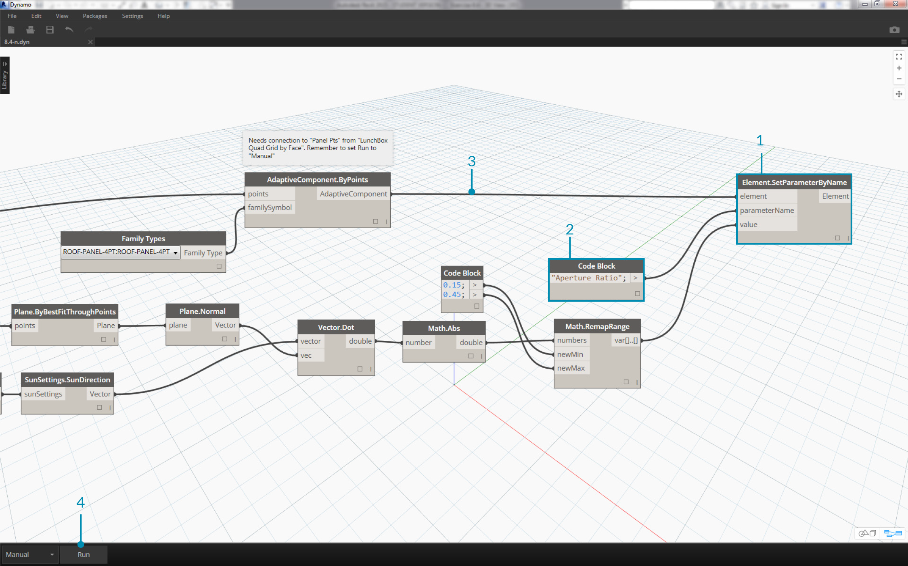
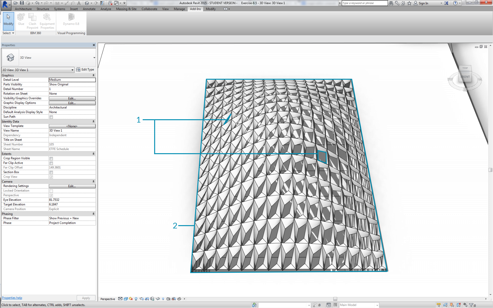

## カスタマイズ

ここまで、基本的な建物のマスを編集する方法について紹介してきました。ここからは、多数の要素を一度に編集することで Dynamo と Revit のリンクについてより深く掘り下げていきましょう。カスタマイズする対象の規模が拡大すると、リストのデータ構造においてより高度な操作が要求されるので、カスタマイズの操作がより複雑になります。ただし、それを実行する背景で駆動している原理原則は、根本的にはこれまでと変わりありません。検討のために、アダプティブ コンポーネントのセットからいくつかの事例を取り上げてみましよう。

#### 点の位置

アダプティブ コンポーネントを既に作成したという前提で、これからその点群の位置に基づいてパラメータを編集していくことにします。点群により、たとえば、要素の領域にかかわる厚みのパラメータをコントロールすることができます。また、太陽光の年間露光量にかかわる透過性のパラメータをコントロールすることもできます。Dynamo では、少ない手順で簡単に解析結果をパラメータに渡すことができます。次の演習でその基本的な手順を実践してみましょう。


> *AdaptiveComponent.Locations* ノードを使用して、選択したアダプティブ コンポーネントのアダプティブ点のクエリーを実行します。 これにより、Revit の要素を解析用に抽出したバージョンを使用して作業することができます。

アダプティブ コンポーネントを構成する点の位置を抽出することで、その要素に関するさまざまな解析を行うことができます。4 点構成のアダプティブ コンポーネントにより、たとえば指定したパネルにおける水平面からの偏差を検討することができます。

#### 太陽の向きの解析


> 再マッピング機能を使用すると、一連のデータ セットを一定のパラメータ範囲にマッピングすることができます。これはパラメトリック モデリングで使用する基本的なツールです。これ以降の演習で実際に扱ってみることにします。

Dynamo を使用すると、アダプティブ コンポーネントを構成する点群の位置から、要素ごとに最も適した平面を作成することができます。さらに Revit ファイル内の太陽の位置を参照して、太陽に対するその平面の向きを、他のアダプティブ コンポーネントと比較しながら検討することもできます。これ以降の演習で、アルゴリズムに基づいて屋根の形状を生成することで、その設定を行っていきましょう。

### 演習

> この演習に付属しているサンプル ファイルをダウンロードしてください(右クリックして[名前を付けてリンク先を保存]を選択)。すべてのサンプル ファイルの一覧については、付録を参照してください。

> 1. [Customizing.dyn](datasets/8-5/Customizing.dyn)
2. [ARCH-Customizing-BaseFile.rvt](datasets/8-5/ARCH-Customizing-BaseFile.rvt)

この演習では、前のセクションで紹介したテクニックについて詳しく説明します。このケースでは、Revit の要素からパラメトリック サーフェスを設定して、4 点構成のアダプティブ コンポーネントをインスタンス化し、太陽に対する向きに基づいて編集します。


> 1. まず、*Select Edge* ノードを使用して 2 本のエッジを選択します。 2 本のエッジはアトリウムの長辺です。
2. *List.Create* ノードを使用して、2 本のエッジを組み合わせて 1 つのリストを作成します。
3. *Surface.ByLoft* ノードを使用して、2 本のエッジの間に 1 つのサーフェスを作成します。


> 1. *Code Block* ノードを使用して、0 から 1 までの範囲を 10 等分した値 ```0..1..#10;``` に指定します。
2. *Code Block* ノードから *Surface.PointAtParameter* ノードの *u* 入力と *v* 入力に接続し、*Surface.ByLoft* ノードを *surface* 入力に接続します。 ノードを右クリックして、*レーシング*を*外積*に変更します。 これでサーフェス上の点群から成るグリッドを取得できます。

この点群によるグリッドは、パラメータに基づいて設定されたサーフェスの制御点として機能します。これら各点の位置を u と v の値として抽出することで、その値をパラメータの式に代入し、同一のデータ構造を保持できます。これを行うには、先ほど作成した点群の位置のパラメータをクエリーする必要があります。


> 1. *Surface.ParameterAtPoint* ノードをキャンバスに追加し、その入力を上図のように接続します。
2. *UV.U* ノードを使用して、上記のパラメータの *u* の値をクエリーします。
3. *UV.V *ノードを使用して、上記のパラメータの*v* の値をクエリーします。
4. サーフェス上のすべての点に対応する *u* と *v* の値が出力されます。 これで、適切なデータ構造で *0* から *1* までの範囲で各値を取得したので、パラメトリック アルゴリズムを適用する準備ができました。


> 1. キャンバスに *Code Block* ノードを追加して、次のコードを入力します。```Math.Sin(u*180)*Math.Sin(v*180)*w;``` これは、平坦なサーフェスから正弦波状の隆起を作成するパラメトリック関数です。
2. *u* 入力に、*UV.U* ノードからの出力を接続します。
3. *v* 入力に、*UV.V* ノードからの出力を接続します。
4. *w* 入力は形状の*振幅*を表します。そのため、ここには *Number Slider* を接続します。


> 1. ここまでの手順で、アルゴリズムによって定義された値のリストを取得することができました。この値のリストを使用して、点群を *Z* の正の向きに動かしましょう。 *Code Block* ノードを *Geometry.Translate* ノードの *zTranslation* 入力に接続し、*Surface.PointAtParameter* ノードをやはり Geometry.Translate ノードの *geometry* 入力に接続します。 Dynamo のプレビューに新しい点群が表示されるはずです。
2. 最後に、前の手順から *NurbsSurface.ByPoints* ノードの points 入力に接続することで、サーフェスを作成します。 こうしてパラメトリック サーフェスができあがりました。スライダを自由に動かして、隆起面が上下するのを確認してください。

パラメトリック サーフェスを使用して、その曲面を多数の小さなパネルから成る構造に変換する方法を設定し、4 点構成のアダプティブ コンポーネントを配列していきましょう。Dynamo で提供されている既定のノードには、サーフェスを多面構造に変換する機能をもつものはありません。そこで、コミュニティにアクセスして便利な Dynamo パッケージを入手しましょう。


> 1. *[パッケージ] > [パッケージの検索]*に進みます。
2. 「*LunchBox*」という文字列を検索して、「*LunchBox for Dynamo*」をダウンロードします。 このパッケージは、この種のジオメトリ操作にじつに役に立つツール セットです。


> 1. ダウンロードすると、LunchBox スイートに完全にアクセスできるようになります。「*Quad Grid*」を検索し、*LunchBox Quad Grid By Face* ノードを選択します。 このノードの *surface* 入力にパラメトリック サーフェスを接続し、*U* 区分と *V* 区分を *15* に設定します。 複数の長方形のパネルから成るサーフェスが Dynamo のプレビューに表示されます。


> 構成の詳細については、*Lunch Box* ノードをダブルクリックして確認してください。


> Revit に戻って、ここで使用しているアダプティブ コンポーネントを簡単に確認しておきましょう。必ずしも実際に確認する必要はありませんが、いずれにせよこれからインスタンス化する対象であるこのコンポーネントは屋根のパネルです。この 4 点構成のアダプティブ コンポーネントは、ETFE システムをおおまかに表現しています。中央の開口部は *ApertureRatio* というパラメータによってコントロールされています。


> 1. これから Revit 内の多数のジオメトリをインスタンス化するので、必ず事前に Dynamo のソルバを[*手動*]に切り替えてください。
2. *Family Types* ノードをキャンバスに追加し、[*ROOF-PANEL-4PT*]を選択します。
3. *AdaptiveComponent.ByPoints* ノードをキャンバスに追加し、その *points* 入力に *LunchBox Quad Grid by Face* ノードの *Panel Pts* 出力を接続します。 *familySymbol* 入力に *Family Types* ノードを接続します。
4. [*実行*]をクリックします。 Revit はジオメトリの作成中に計算に*少々時間をかける*必要があります。 あまりにも時間がかかりすぎている場合、*Code Block ノードの「15」の値を*より小さな数に減らしてください。 これを行うと、屋根の部分に使用されるパネルの数が減少します。

*注: Dynamo でノードの計算に膨大な時間がかかる場合は、ノードをフリーズする機能を使用して、グラフの開発中に Revit 関連操作の実行を停止することができます。 ノードをフリーズする操作の詳細については、「ソリッド」の章の「フリーズ」セクションを参照してください。*


> Revit に戻ると、屋根の上にバネルの配列が出現しています。


> 拡大表示すると、サーフェスの品質を詳細に確認できます。

### 解析


> 1. 前の手順からさらに先へと進み、各パネルが太陽光を浴びている量に基づいてそれぞれのパネルの開き方をコントロールしてみましょう。Revit でビューを拡大表示して 1 つのパネルを選択すると、プロパティ バーに[*開口率*]というパラメータが表示されます。 ファミリは、開口率の範囲が *0.05* ～ *0.45* になるように設定されています。


> 1. 太陽の軌道の表示をオンにすると、Revit で現在の太陽の位置を確認することができます。


> 1. *SunSettings.Current* ノードを使用すると、この太陽の位置を参照することができます。
2. そのノードの SunSettings の出力を *Sunsetting.SunDirection* ノードの入力に接続し、太陽光のベクトルを取得します。
3. アダプティブ コンポーネントの作成に使用した *Panel Pts* からの出力を、*Plane.ByBestFitThroughPoints* ノードを使用して、そのコンポーネントのために平面に近づけます。
4. この平面の*法線*のクエリーを実行します。
5. *内積*を使用して太陽の向きを計算します。 内積に基づいて、2 つのベクトルが平行であるかどうかを判定することができます。つまり、各アダプティブ コンポーネントの平面法線を取得し、それと太陽光のベクトルを比較することで、太陽の向きをおおまかにシミュレートします。
6. 結果の*絶対値*を取得します。 これにより、平面法線が逆方向を向いている場合に正確な内積が算出されます。
7. [*実行*]をクリックします。


> 1. *内積*を確認すると、複数の数値が広範囲にわたって取得されています。 これからその相対分布を使用するのですが、しかしそれらの数値を集約して[*開口率*]の適切な範囲に収めなければなりません。
2. これにたいへん役立つツールが *Math.RemapRange* ノードです。 そのノードにリストを入力し、その分布範囲を 2 つの目標値にマッピングし直します。
3. 目標値を *Code Block* ノードで *0.15* と *0.45* として定義します。
4. [*実行*]をクリックします。



> 1. マッピングし直した値を *Element.SetParameterByName* ノードに接続します。
2. そのノードの *parameterName* 入力に、「*Aperture Ratio*」という文字列を接続します。
3. 同じノードの *element* 入力に、*AdaptiveComponent.ByPoints* ノードの Adaptive Components 出力を接続します。
4. [*実行*]をクリックします。


> Revit に戻って建物のマスを遠くから見てみると、ETFE パネルの開き方が太陽の向きによって変化していることが確認できます。



> 拡大表示すると、太陽により向き合っているパネルほどより閉じていることがわかります。太陽光の照射による過熱を抑えることがねらいです。太陽光をたくさん浴びている面ほどより多く採光するように設定するには、ただ *Math.RemapRange* ノードで範囲を逆に切り替えるだけで済みます。

