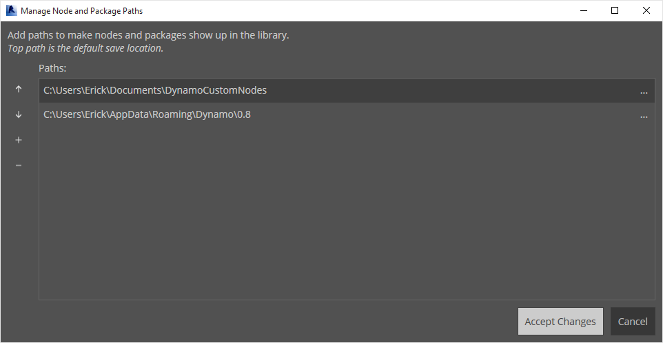

## ライブラリへの追加

ここまでの手順で、カスタム ノードを作成して Dynamo グラフ内の特定のプロセスに適用しました。このセクションでは、このノードを他の Dynamo グラフでも参照できるように、このノードをライブラリに保存します。これを実行するには、目的のノードをローカルにパブリッシュします。これは、パッケージをパブリッシュする場合と同様の手順です。パッケージのパブリッシュについては、次の章で詳しく説明します。

### カスタム ノードをローカルにパブリッシュする

前のセクションで作成したカスタム ノードを使用して、次の手順に進みましょう。ノードをローカルにパブリッシュすると、新しいセッションを開いたときに、Dynamo ライブラリからそのノードにアクセスできるようになります。ノードをパブリッシュせずに Dynamo グラフからカスタム ノードを参照する場合、グラフのフォルダ内に、そのカスタム ノードを含めておく必要があります。または、*[File] > [Import Library]*を使用してカスタム ノードを Dynamo に読み込む必要があります。

> この演習に付属しているサンプル ファイルをダウンロードしてください(右クリックして[名前を付けてリンク先を保存]を選択)。すべてのサンプル ファイルの一覧については、付録を参照してください。[PointsToSurface.dyf](datasets/9-3/PointsToSurface.dyf)

> PointsToSurface カスタム ノードを開くと、Dynamo カスタム ノード エディタ内に上図のグラフが表示されます。または、Dynamo グラフ エディタ内でカスタム ノードをダブルクリックしてカスタム ノードを開くこともできます。

> 1. カスタム ノードをローカルにパブリッシュするには、キャンバス上で右クリックして、[*このカスタム ノードをパブリッシュ...*]を選択します。

> 上図のように、関連情報を入力して[*ローカルにパブリッシュ*. [グループ]フィールドで、Dynamo メニューからアクセスできる主要な要素を定義します。

> ローカルにパブリッシュするすべてのカスタム ノードを格納するフォルダを 1 つ選択します。Dynamo を読み込むたびにこのフォルダが確認されるため、このフォルダの場所は変更しないでください。このフォルダにナビゲートし、[*フォルダを選択*]を選択します。これで、Dynamo ノードがローカルにパブリッシュされ、プログラムを読み込むたびに、このフォルダが Dynamo ツールバーに表示されるようになります。

> 1. カスタム ノードのフォルダの場所を確認するには、*[設定] > [ノードとパッケージのパスを管理...]*に移動します。

> このウィンドウには、次の 2 つのパスが表示されます。*AppData\Roaming\Dynamo...* は、オンラインでインストールされた Dynamo パッケージの既定の場所を参照します。 *Documents\DynamoCustomNodes...* は、ローカルにパブリッシュされたカスタム ノードの場所を参照します。*

> 1. 上図のリスト内で、ローカル フォルダのパスを下に移動するには、フォルダ パスを選択して、パス名の左に表示されている下向き矢印をクリックします。一番上に表示されているフォルダが、パッケージがインストールされる既定のパスになります。そのため、Dynamo パッケージの既定のインストール パスを既定のフォルダのままにすると、オンライン パッケージをローカルにパブリッシュしたノードと区別することができます。*

> Dynamo の既定のパスをパッケージのインストール場所に設定するため、パス名の順序を変更しました。

> このローカル フォルダにナビゲートすると、Dynamo のカスタム ノード ファイルの拡張である元のカスタム ノードが *.dyf* フォルダに表示されます。 このフォルダ内のファイルを編集すると、UI 上でノードが更新されます。また、メインの *DynamoCustomNode* フォルダにノードを追加すると、Dynamo の再起動時に、それらのノードがライブラリに追加されます。

> これで、Dynamo を読み込むたびに、*PointsToSurface* ノードが Dynamo ライブラリの[*DynamoPrimer*]グループに表示されるようになります。

