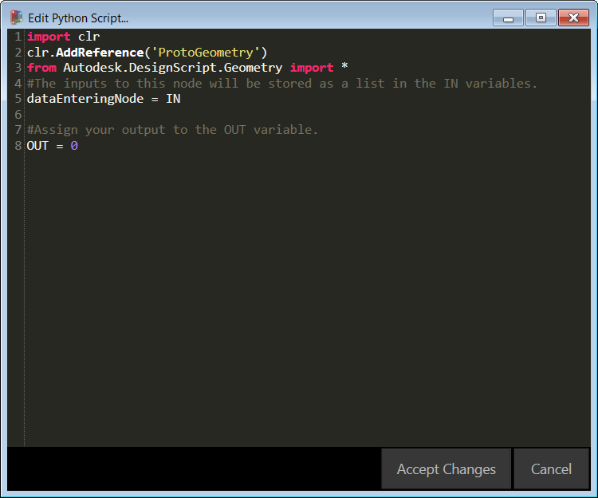

## Python

Python は、シンプルな構文が特徴の、幅広く使用されているプログラミング言語です。 構文が非常に読みやすいため、他の多くの言語より簡単に習得できます。Python はモジュールとパッケージをサポートしており、既存のアプリケーションに組み込むことができます。このセクションでは、Python についての基本的な知識があることを前提として説明を進めていきます。Python を実行する方法については、[Python.org](https://www.python.org/) の『[Getting Started](https://www.python.org/about/gettingstarted/)』ページを参照してください。

### ビジュアル プログラミングとテキスト プログラミングとの比較

Dynamo のビジュアル プログラミング環境で、テキスト プログラミングを使用するのはなぜでしょうか。第 1.1 章で説明したとおり、ビジュアル プログラミングには多くの利点があります。直感的なビジュアル インタフェースにより、特別な構文を学習することなくプログラムを作成することができます。ただし、ビジュアル プログラムは、処理が煩雑になったり、機能が不足することがあります。Python には、「if/then」の条件ステートメントやループを簡単に記述するための方法が用意されています。Python は、Dynamo の機能を拡張し、多数のノードを数行の簡潔なコード行で置き換えることができる強力なツールです。

**ビジュアル プログラム:** 

**テキスト プログラム:**

```
import clr
clr.AddReference('ProtoGeometry')
from Autodesk.DesignScript.Geometry import *

solid = IN[0]
seed = IN[1]
xCount = IN[2]
yCount = IN[3]

solids = []

yDist = solid.BoundingBox.MaxPoint.Y-solid.BoundingBox.MinPoint.Y
xDist = solid.BoundingBox.MaxPoint.X-solid.BoundingBox.MinPoint.X

for i in xRange:
for j in yRange:
fromCoord = solid.ContextCoordinateSystem
toCoord = fromCoord.Rotate(solid.ContextCoordinateSystem.Origin,Vector.ByCoordinates(0,0,1),(90*(i+j%val)))
vec = Vector.ByCoordinates((xDist*i),(yDist*j),0)
toCoord = toCoord.Translate(vec)
solids.append(solid.Transform(fromCoord,toCoord))

OUT = solids
```

### Python Script ノード

Code Block ノードと同様に、Python Script ノードはビジュアル プログラミング環境内のスクリプト インタフェースです。Python Script ノードは、ライブラリ内の*[Core] > [Scripting]*で使用することができます。 このノードをダブルクリックすると、Python のスクリプト エディタが開きます。ノードを右クリックして[*編集...*]を選択することもできます。



> エディタ上部の定型文は、必要なライブラリを参照する際に役立ちます。Python Script ノードの入力値は、IN 配列に格納されます。値は、OUT 変数に割り当てられて Dynamo に返されます。

Autodesk.DesignScript.Geometry ライブラリにより、Code Block ノードと同様のドット表記を使用することができます。Dynamo の構文の詳細については、第 7.2 章と『[DesignScript Guide](http://dynamobim.org/wp-content/uploads/forum-assets/colin-mccroneautodesk-com/07/10/Dynamo_language_guide_version_1.pdf)』を参照してください。 「Point.」などのジオメトリ タイプを入力すると、点の作成や点のクエリーを実行するためのメソッドのリストが表示されます。


> これらのメソッドには、*ByCoordinates* などのコンストラクタ、*Add* などのアクション、*X*、*Y*、*Z* 座標などのクエリーがあります。

### 演習

> この演習に付属しているサンプル ファイルをダウンロードしてください(右クリックして[名前を付けてリンク先を保存]を選択)。すべてのサンプルファイルの一覧については、付録を参照してください。[Python_Custom-Node.dyn](datasets/9-4/Python-CustomNode.dyn)

この例では、Python Script ノードを記述してソリッド モジュールからパターンを作成し、カスタム ノードに変換します。最初に、Dynamo ノードを使用してソリッド モジュールを作成します。


> 1. **Rectangle.ByWidthLength** ノードを使用して、ソリッドのベースとなる長方形を作成します。
2. **Surface.ByPatch** ノードの *closedCurve* 入力に Rectangle 出力を接続し、下部サーフェスを作成します。


> 1. **Geometry.Translate** ノードの *geometry* 入力に Rectangle 出力を接続し、長方形を上に移動します。次に、Code Block ノードを使用してソリッドの厚さを指定します。
2. **Polygon.Points** ノードを使用して、変換された長方形に対してクエリーを実行し、頂点を抽出します。
3. **Geometry.Translate** ノードを使用して、4 つの点に対応する 4 つの値のリストを作成します。この操作により、ソリッドの 1 つの頂点が上に移動します。
4. 変換後の点を **Polygon.ByPoints** ノードで使用して、上部ポリゴンを再作成します。
5. **Surface.ByPatch** ノードを使用してポリゴンを結合し、上部サーフェスを作成します。

これで、上部サーフェスと下部サーフェスが作成されました。次に、2 つのプロファイルの間をロフトしてソリッドの側面を作成しましょう。


> 1. **List.Create** ノードの index 入力に、底面の長方形と上面のポリゴンを接続します。
2. **Surface.ByLoft** ノードを使用して 2 つのプロファイルをロフトし、ソリッドの側面を作成します。
3. **List.Create** ノードの index 入力に上部サーフェス、側面サーフェス、下部サーフェスを接続して、サーフェスのリストを作成します。
4. **Solid.ByJoinedSurfaces** ノードを使用してサーフェスを結合し、ソリッド モジュールを作成します。

これで、ソリッドが作成されました。次に、ワークスペースに Python Script ノードをドロップします。


> エディタを閉じてノード上の[+]アイコンをクリックし、ノードに入力を追加します。入力には IN[0]、IN[1]などという名前が付いています。これらはリスト内の項目を表しています。

最初に、入力と出力を定義しましょう。ノードをダブルクリックして、Python エディタを開きます。


```
import clr
clr.AddReference('ProtoGeometry')
from Autodesk.DesignScript.Geometry import *

#The solid module to be arrayed
solid = IN[0]
#A number that determines which rotation pattern to use
seed = IN[1]
#The number of solids to array in the X and Y axes
xCount = IN[2]
yCount = IN[3]

#Create an empty list for the arrayed solids
solids = []

#Assign your output to the OUT variable.
OUT = solids
```

このコードの意味については、演習を進めながら説明していきます。ここで、ソリッド モジュールを配列化するためには、どのような情報が必要になるかを考慮する必要があります。最初に、移動距離を決定するために、ソリッドの寸法を知る必要があります。境界ボックスにはバグがあるため、境界ボックスを作成するにはエッジ曲線のジオメトリを使用する必要があります。


> Dynamo の Python Script ノードを確認すると、Dynamo のノードのタイトルと同じ構文が使用されていることがわかります。コメント付きのコードを次に示します。

```
import clr
clr.AddReference('ProtoGeometry')
from Autodesk.DesignScript.Geometry import *

#Inputs
solid = IN[0]
seed = IN[1]
xCount = IN[2]
yCount = IN[3]

#Create an empty list for the arrayed solids
solids = []
# Create an empty list for the edge curves
crvs = []

#Loop through edges and append corresponding curve geometry to the list
for edge in solid.Edges:
crvs.append(edge.CurveGeometry)

#Get the bounding box of the curves
bbox = BoundingBox.ByGeometry(crvs)

#Get the X and Y translation distance based on the bounding box
yDist = bbox.MaxPoint.Y-bbox.MinPoint.Y
xDist = bbox.MaxPoint.X-bbox.MinPoint.X

#Assign your output to the OUT variable.
OUT = solids
```

ここでは、ソリッドのモジュールの移動と回転を行うため、Geometry.Transform の操作を使用しましょう。Geometry.Transform ノードを確認すると、ソリッドを変換するにはソース座標系とターゲット座標系が必要になることがわかります。この場合、ソース座標系はソリッドのコンテキストの座標系で、ターゲット座標系は配列化された各モジュールの別の座標系になります。そのため、x 値と y 値をループして、座標系を毎回異なる距離と方向で変換する必要があります。


> ここで、Dynamo の Python Script ノードを確認します。コメント付きのコードを次に示します。

```
import clr
clr.AddReference('ProtoGeometry')
from Autodesk.DesignScript.Geometry import *

#Inputs
solid = IN[0]
seed = IN[1]
xCount = IN[2]
yCount = IN[3]

#Create an empty list for the arrayed solids
solids = []
# Create an empty list for the edge curves
crvs = []

#Loop through edges and append corresponding curve geometry to the list
for edge in solid.Edges:
crvs.append(edge.CurveGeometry)

#Get the bounding box of the curves
bbox = BoundingBox.ByGeometry(crvs)

#Get the X and Y translation distance based on the bounding box
yDist = bbox.MaxPoint.Y-bbox.MinPoint.Y
xDist = bbox.MaxPoint.X-bbox.MinPoint.X

#get the source coordinate system
fromCoord = solid.ContextCoordinateSystem

#Loop through X and Y
for i in range(xCount):
for j in range(yCount):
#Rotate and translate the coordinate system
toCoord = fromCoord.Rotate(solid.ContextCoordinateSystem.Origin,Vector.ByCoordinates(0,0,1),(90*(i+j%seed)))
vec = Vector.ByCoordinates((xDist*i),(yDist*j),0)
toCoord = toCoord.Translate(vec)
#Transform the solid from the source coord system to the target coord system and append to the list
solids.append(solid.Transform(fromCoord,toCoord))
```


> [変更を保存]をクリックして Python Script ノードを保存し、ノードに入力値を接続します。この操作により、ソリッドのパターンが表示されます。


> シード値を変更すると、異なるパターンが作成されます。ソリッド モジュールのパラメータを変更して、異なるエフェクトを作成することもできます。

これで、便利な Python Script ノードが作成されました。このノードをカスタム ノードとして保存しましょう。Python Script ノードを選択して右クリックし、[選択からノードを新規作成]を選択します。


> 名前、説明、カテゴリを設定します。

この操作により、カスタム ノードを編集するための新しいワークスペースが開きます。


> 1. 各 **Input** ノードの入力名をわかりやすい名前に変更し、データ タイプと既定値を追加します。
2. **Output** ノードの出力名を変更し、このノードを .dyf ファイルとして保存します。


> カスタム ノードに変更内容が反映されます。

