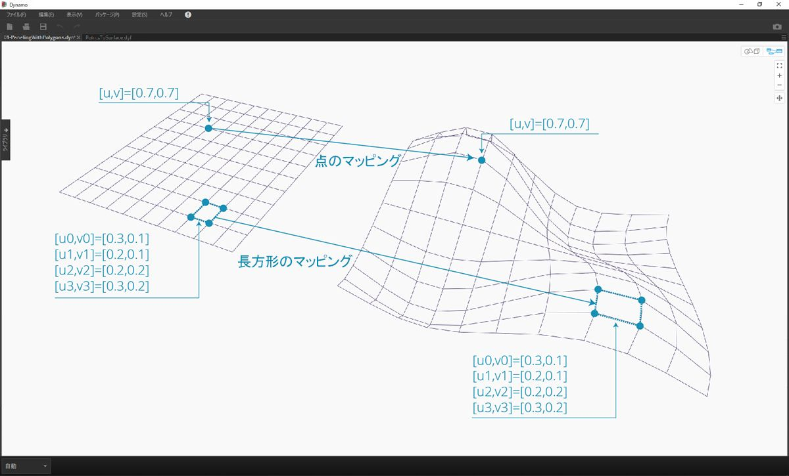
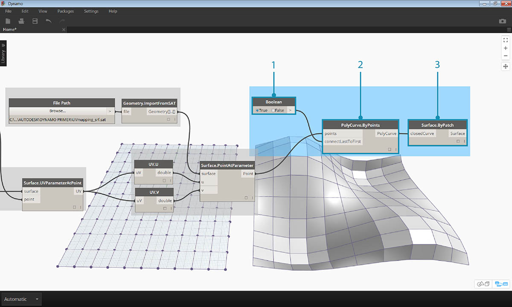
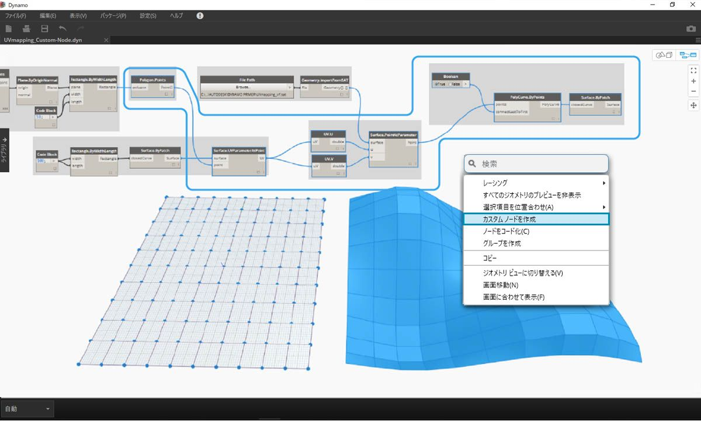
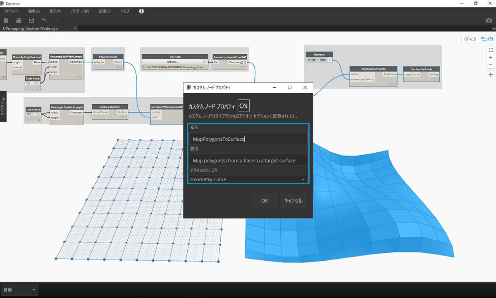

## カスタム ノードを作成する

Dynamo では、いくつかの方法でカスタム ノードを作成することができます。最初からカスタム ノードを作成することも、既存のグラフから作成することも、C# を使用して明示的に作成することもできます。このセクションでは、既存のグラフを使用して Dynamo UI 内にカスタム ノードを作成する方法について説明します。ワークスペースを整理し、一連のノードをパッケージ化して別の場所で再利用する場合は、この方法が最適です。

### UV マッピング用のカスタム ノード

次の図は、UV 座標を使用して、1 つのサーフェスから別のサーフェスに点をマッピングする場合の例を示しています。この概念を適用して、XY 平面上の曲線を参照する、複数の小さなパネルから構成されるサーフェスを作成してみましょう。ここでは、パネル化用の四角形のパネルを作成しますが、同じ概念を適用して、UV マッピングを使用する多様なパネルを作成することもできます。この演習を行うと、このグラフや Dynamo の別のワークフローで同様のプロセスを簡単に繰り返すことができるようになるため、カスタム ノード開発のよい練習になります。

### 既存のグラフからカスタム ノードを作成する

> この演習用のサンプル ファイルをダウンロードして解凍してください(右クリックして[名前を付けてリンク先を保存]を選択)。すべてのサンプルファイルの一覧については、付録を参照してください。[UV-CustomNode.zip](datasets/10-2/UV-CustomNode.zip)

最初に、カスタム ノード内にネストするグラフを作成します。この例では、UV 座標を使用して、基準となるサーフェスから目的のサーフェスにポリゴンをマッピングするグラフを作成します。この UV マッピング プロセスは頻繁に使用するプロセスであるため、カスタム ノードの演習素材として適しています。サーフェスと UV 空間の詳細については、セクション 5.5 を参照してください。グラフ全体は、上でダウンロードした .zip ファイルの *UVmapping_Custom-Node.dyn* で確認できます。

> 1. **Code Block** ノードを使用して、-45 ～ 45 の範囲内で 10 個の数値を作成します。
2. **Point.ByCoordinates** ノードの x 入力と y 入力に Code Block ノードの出力を接続し、[レーシング]を[外積]に設定します。 これで、点のグリッドが作成されます。
3. **Plane.ByOriginNormal** ノードの *origin* 入力に Point.ByCoordinates ノードの *Point* 出力を接続して、各点に平面を作成します。 この操作では、既定の法線ベクトル(0,0,1)が使用されます。
4. **Rectangle.ByWidthLength** ノードの *plane* 入力に前の手順で作成した平面を接続し、別の Code Block ノードで値 *10* を指定して幅と長さを設定します。

これで、長方形のグリッドが作成されます。UV 座標を使用して、これらの長方形を目的のサーフェスにマッピングします。

> 1. **Polygon.Points** ノードの *polygon* 入力に前の手順の Rectangle 出力を接続し、各長方形の頂点を抽出します。 これらの点を、目的のサーフェスにマッピングします。
2. 値 *100* が指定された Code Block ノードを **Rectangle.ByWidthLength** ノードに接続して、長方形の幅と長さを指定します。 これが、基準サーフェスの境界線になります。
3. **Surface.ByPatch** ノードの *closedCurve* 入力に前の手順の Rectangle 出力を接続し、基準となるサーフェスを作成します。
4. **Surface.UVParameterAtPoint** ノードに *Polygon.Points* ノードの *Point* 出力と *Surface.ByPatch* ノードの *Surface* 出力を接続すると、各点における UV パラメータが返されます。

これで、基準となるサーフェスと UV 座標のセットが作成されました。次に、目的のサーフェスを読み込み、2 つのサーフェス間で点をマッピングします。

> 1. **File Path** ノードを使用して、読み込むサーフェスのファイル パスを選択します。 ファイル タイプは .sat にしてください。[*参照...*]ボタンをクリックして、上でダウンロードした .zip ファイルの *UVmapping_srf.sat* にナビゲートします。
2. **Geometry.ImportFromSAT** ノードにファイル パスを接続して、サーフェスを読み込みます。 読み込んだサーフェスがジオメトリのプレビューに表示されます。
3. **UV** パラメータ出力を *UV.U* ノードと *UV.V* ノードに接続します。
4. **Surface.PointAtParameter** ノードに、読み込んだサーフェス、U 座標、V 座標を接続します。 これで、目的のサーフェス上に 3D の点のグリッドが表示されます。

最後に、3D の点を使用して長方形のサーフェス パッチを作成します。

> 1. **PolyCurve.ByPoints** ノードにサーフェス上の点群を接続し、その点群からポリカーブを作成します。
2. **Boolean** ノードをワークスペースに追加して PolyCurve.ByPoints ノードの *connectLastToFirst* 入力に接続し、Boolean ノードの値を True に切り替えてポリカーブを閉じます。 これで、サーフェスに長方形がマッピングされて表示されます。
3. **Surface.ByPatch** ノードの *closedCurve* 入力にポリカーブを接続し、サーフェス パッチを作成します。

次に、ノードの入力と出力を考慮しながら、カスタム ノード内にネストするノードを選択します。長方形以外の任意のポリゴンをマッピングできるように、カスタム ノードの柔軟性を可能な限り高めてみましょう。

> 上の図で青い線で囲まれている一連のノード(*Polygon.Points* ノードから始まる一連のノード)を選択し、ワークスペースを右クリックして[*選択からノードを新規作成*]を選択します。

> [カスタム ノード プロパティ]ダイアログボックスで、カスタム ノードに名前、説明、カテゴリを割り当てます。

> カスタム ノードにより、ワークスペースが見やすくなりました。入力と出力には、元のノードに基づいて名前が付いています。カスタム ノードを編集して、これらの名前をもっとわかりやすい名前に変更しましょう。

> 編集するカスタム ノードをダブルクリックします。ワークスペースの背景色が黄色で表示されます。これは、カスタム ノードの内部を表しています。

> 1. 各 **Input** ノードの入力名を *baseSurface* と *targetSurface* に変更します。
2. マッピングするポリゴン用に **Output** ノードを追加します。
> カスタム ノードを保存し、ホーム ワークスペースに戻ります。

> **MapPolygonsToSurface** ノードに変更内容が反映されます。

**カスタム コメント**を追加して、カスタム ノードの内容をさらにわかりやすくすることもできます。 コメントを入力すると、入力タイプと出力タイプの内容だけでなく、ノードの機能を説明することができます。カスタム ノードの入力や出力にカーソルを置くと、コメントが表示されます。

> 編集するカスタム ノードをダブルクリックします。背景が黄色のワークスペースがもう一度表示されます。

> 1. Input コード ブロックの編集を開始します。コメントを入力する場合は、最初に「//」を入力してから、コメント テキストを入力します。ノードの内容を説明するためのコメントを入力してください。ここでは、*targetSurface* ノードの説明を入力します。
2. 特定の値に一致する入力タイプを設定して、*inputSurface* ノードの既定値を設定します。 ここでは、既定値を元の Surface.ByPatch の値に設定します。

> コメントは、出力に対して適用することもできます。Output コード ブロックの編集を開始します。コメントを入力する場合は、最初に「//」を入力してから、コメント テキストを入力します。ここでは、*Polygons* 出力と *surfacePatches* 出力の詳細な説明を追加します。

 >

1. カスタム ノード入力にカーソルを置いてコメントを表示します。
2. *inputSurface* ノードの既定値が設定されているため、Surface 入力を使用することなく定義を実行することができます。

