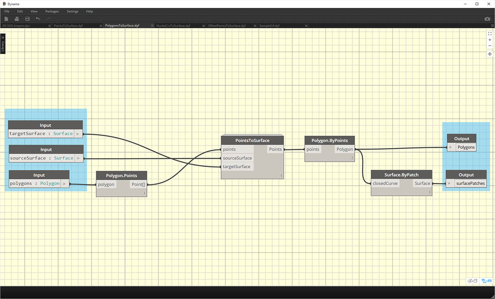

## パッケージを開発する

Dynamo では、さまざまな方法でパッケージを作成することができます。作成したパッケージは、個人的に使用することも、Dynamo コミュニティで共有することもできます。ここで紹介するケース スタディでは、既存のパッケージの中身を確認しながら、パッケージの設定方法について説明します。このケース スタディは、前の章の演習に基づいて構成されており、UV 座標を使用して Dynamo の特定のサーフェスから別のサーフェスへジオメトリをマッピングする際に使用した一連のカスタム ノードを提供します。

### MapToSurface

ここでは、点群を特定のサーフェスから別のサーフェスに UV マッピングする演習で使用したサンプル パッケージを使用していきます。ツールの基本部分は、この手引の「[カスタム ノードを作成する](../09_Custom-Nodes/9-2_Creating.md)」セクションで既に作成されています。 ここでは、UV マッピングの概念を理解する方法と、パブリッシュ可能なライブラリ用の一連のツールを開発する方法について確認します。

> このイメージは、UV 座標を使用して 1 つの点を特定のサーフェスから別のサーフェスにマッピングする場合の例を示しています。パッケージ構成はこの考え方に基づいていますが、パッケージには、より複雑なジオメトリが含まれます。

### パッケージをインストールする

前の章では、Dynamo 内の XY 平面上に定義された複数の曲線に基づいてサーフェスをパネル化する方法について確認しました。このケース スタディでは、この考え方を広げて、より高次元のジオメトリを処理します。ここでは、この構築済みパッケージをインストールし、このパッケージがどのように開発されたかを確認していきます。次のセクションでは、このパッケージのパブリッシュ方法を確認します。

> この場合の操作は簡単です。Dynamo で、*[パッケージ] > [パッケージの検索]* にナビゲートします。

> *「MapToSurface」*というパッケージを検索します。

> 1. パッケージが見つかったら、パッケージ名の左に表示されている大きなダウンロード矢印アイコンをクリックします。この操作により、パッケージが Dynamo にインストールされます。

> 1. パッケージをインストールすると、DynamoPrimer グループまたは Dynamo ライブラリで目的のカスタム ノードを使用できるようになります。これでパッケージのインストールが完了しました。次に、パッケージの設定方法を確認しましょう。

### カスタム ノード

ここで作成するパッケージでは、参照用として既に作成されている 5 つのカスタム ノードを使用します。ここで、各ノードの機能を確認しましょう。一部のカスタム ノードは、他のカスタム ノードを使用して作成されています。また、他のユーザが簡単に理解できるように、グラフにはレイアウトが用意されています。

> 上の図は、5 つのカスタム ノードによって構成される単純なパッケージを示しています。次の手順で、各カスタム ノードの設定について簡単に説明します。

> **PointsToSurface** ノードは基本的なカスタム ノードで、他のすべてのマッピング ノードのベースになるノードです。 このノードは、ソース サーフェスの UV 座標の点を、ターゲット サーフェスの UV 座標にマッピングします。点は、複雑なジオメトリを構築するための最も基本的なジオメトリであるため、このロジックを使用して、2D ジオメトリだけでなく 3D ジオメトリについても、特定のサーフェスから別のサーフェスにマッピングすることができます。

> **PolygonsToSurface** ノードを使用すると、1D ジオメトリのマッピングされた点群を 2D ジオメトリに拡張するロジックを、ポリゴンによって簡単に確認することができます。 図のように、*PointsToSurface* ノードがこのカスタム ノード内にネストされていることがわかります。 この方法で各ポリゴンの点群をサーフェスにマッピングし、その点群からポリゴンを再生成することができます。適切なデータ構造(点群のリストのリスト)を維持することにより、ポリゴンを一連の点群に変更した場合でも、それらのポリゴンを個別に保持することができます。

> **NurbsCrvtoSurface** ノードでは、*PolygonsToSurface* ノードと同じロジックが適用されます。 ただし、ここでは、ポリゴンの点群をマッピングするのではなく、NURB 曲線の制御点をマッピングします。

> **OffsetPointsToSurface** ノードの構成はやや複雑ですが、その概念は単純です。*PointsToSurface* ノードと同じように、このノードは特定のサーフェスから別のサーフェスに点群をマッピングします。 ただし、OffsetPointsToSurface ノードは、元のソース サーフェス上には存在しない点群を識別し、その点から最も近い UV パラメータまでの距離を取得して、対応する UV 座標上のターゲット サーフェスの法線にマッピングします。これは、サンプル ファイルを見るとよくわかります。

> **SampleSrf** ノードは、サンプル ファイル内のソース グリッドから波形のサーフェスにマッピングするためのパラメータ制御のサーフェスを作成する単純なノードです。

### サンプル ファイル

サンプル ファイルは、パッケージのルート フォルダに格納されています(Dynamo で、*[パッケージ] > [パッケージを管理...]*に移動)。

> パッケージ管理ウィンドウで、[*MapToSurface*]の右側にある垂直に並んだ 3 つの点をクリックし、[*ルート フォルダを表示*]をクリックします。

ルート フォルダを開いた状態で、「*extra*」フォルダにナビゲートします。このフォルダには、パッケージ内のすべてのファイル(カスタム ノードを除く)が格納されています。 Dynamo パッケージ用のサンプル ファイル(存在する場合)も、このフォルダに格納されています。これ以降のスクリーンショットは、各サンプル ファイルの概念を示しています。

> **01-PanelingWithPolygons:** このサンプル ファイルでは、*PointsToSurface* ノードを使用して長方形のグリッドに基づくサーフェスをパネル化する方法を確認することができます。 同様のワークフローについては、[前の章](../09_Custom-Nodes/9-2_Creating.md)で確認しました。

> **02-PanelingWithPolygons-II:** このサンプル ファイルでは、同様のワークフローを使用して、特定のサーフェスから別のサーフェスに円弧をマッピングする場合のセットアップ例を確認することができます。 このファイルでは *PolygonsToSurface* ノードを使用します。

> **03-NurbsCrvsAndSurface:** このサンプル ファイルは NurbsCrvToSurface ノードと連携するため、多少複雑な構成になっています。 ターゲット サーフェスは指定した距離でオフセットされ、NURB 曲線が元のターゲット サーフェスとオフセット後のサーフェスにマッピングされます。その後、マッピングされた 2 本の曲線がロフトされて 1 つのサーフェスが作成され、そのサーフェスに厚みが加えられます。その結果として出力されるソリッドは、ターゲット サーフェスの法線を表す波形の形状になります。

> **04-PleatedPolysurface-OffsetPoints:** このサンプル ファイルでは、ひだがついたポリサーフェスをソース サーフェスからターゲット サーフェスにマッピングする方法について確認することができます。 ソース サーフェスはグリッド上に広がる長方形のサーフェスで、ターゲット サーフェスは回転体のサーフェスです。

> **04-PleatedPolysurface-OffsetPoints:** このサンプル ファイルでは、ソース サーフェスのソース ポリサーフェスをターゲット サーフェスにマッピングする方法について確認することができます。

> **05-SVG-Import:** カスタム ノードを使用すると、さまざまなタイプの曲線をマッピングすることができます。このサンプル ファイルでは、Illustrator から書き出した SVG ファイルを参照し、読み込んだ曲線をターゲット サーフェスにマッピングすることができます。

> **05-SVG-Import:** .svg ファイルの構文を解析することにより、曲線が .xml 形式から Dynamo のポリカーブに変換されます。

> **05-SVG-Import:** 読み込んだ曲線がターゲット サーフェスにマッピングされます。 これにより、Illlustrator でパネルを明示的に(ポイント アンド クリック操作で)設計し、そのパネルを Dynamo で読み込んでターゲット サーフェスに適用することができます。

