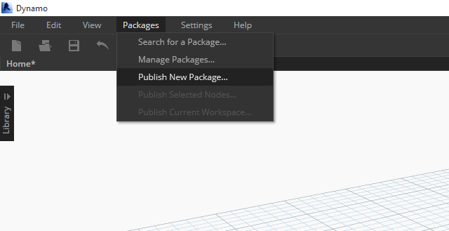

## パッケージをパブリッシュする

前のセクションでは、カスタム ノードとサンプル ファイルを使用して *MapToSurface* パッケージを設定する方法について確認しました。 では、ローカルで作成したパッケージはどのようにパブリッシュすればよいでしょうか。このケース スタディでは、ローカル フォルダ内のファイル セットを使用してパッケージをパブリッシュする方法について確認します。 パッケージは、さまざまな方法でパブリッシュすることができます。 ここでは、**パッケージをローカルにパブリッシュして作成し、オンラインでパブリッシュする**方法を確認していきます。 最初に、パッケージ内のすべてのファイルを格納するフォルダを作成します。

### パッケージをアンインストールする

前の演習で MapToSurface パッケージをインストールした場合は、同じパッケージを使用しないようにするため、このパッケージをアンインストールしてください。

> 最初に、*[パッケージ] > [パッケージを管理...]*に移動します。

> [*MapToSurface*]に対応するボタンを選択し、[*アンインストール...*]を選択します。 次に、Dynamo を再起動します。[*パッケージを管理*]ウィンドウをもう一度開いて、*MapToSurface* が表示されていないことを確認してください。 これで、作業を開始する準備ができました。

### パッケージをローカルにパブリッシュする

*注: この手引の作成時点では、Dynamo Studio または Dynamo for Revit でのみ Dynamo パッケージをパブリッシュすることができます。 Dynamo Sandbox には、パブリッシュ機能は用意されていません。*

> このパッケージのケース スタディに付属しているサンプル ファイル(Zero-Touch-Examples.zip)をダウンロードして解凍してください(右クリックして[名前を付けてリンク先を保存...]を選択)。すべてのサンプル ファイルの一覧については、付録を参照してください。[MapToSurface.zip](datasets/10-4/MapToSurface.zip)

> この演習で、パッケージを初めて送信することになります。サンプル ファイルとカスタム ノードは、すべて 1 つのフォルダ内に格納されています。このフォルダが作成されていれば、Dynamo Package Manager にパッケージをアップロードすることができます。

> 1. このフォルダには、5 つのカスタム ノード(.dyf)が格納されています。
2. このフォルダには、5 つのサンプル ファイル(.dyn)と、1 つの読み込み済みベクトル ファイル(.svg)も格納されています。これらのファイルは、カスタム ノードの使用方法を理解するための演習用のファイルです。

> Dynamo で、*[パッケージ] > [新しいパッケージをパブリッシュ...]*をクリックします。

> [*Dynamo パッケージをパブリッシュ*]ウィンドウの左側には、関連フォームが既に入力されています。

> 1. [*ファイルを追加*]をクリックして、画面の右側にあるフォルダ構造から既にファイルが追加されています(.dyf ファイル以外のファイルを追加するには、ブラウザ ウィンドウのファイル タイプを[**すべてのファイル(.)"**. カスタム ノード(.dyf)やサンプル ファイル(.dyn)など、すべてのファイルが追加されていることを確認してください。パッケージをパブリッシュすると、Dynamo によってこれらのファイルが分類されます。
2. [グループ]フィールドを使用して、Dymano UI でカスタム ノードを検索するためのグループを定義します。
3. [ローカルにパブリッシュ]をクリックして、パッケージをパブリッシュします。次に、[*オンラインでパブリッシュ*]**ではなく**[*ローカルにパブリッシュ*]をクリックします。これは、多数の複製パッケージを Package Manager にパブリッシュしないようにするためです。

> 1. パブリッシュが完了すると、DynamoPrimer グループまたは Dynamo ライブラリで目的のカスタム ノードを使用できるようになります。

> 次に、ルート フォルダを開き、作成したパッケージが Dymano でどのようにフォーマットされているかを確認します。これを行うには、*[パッケージ] > [パッケージを管理...]*をクリックします。

> パッケージ管理ウィンドウで、「*MapToSurface*」の右側にある垂直に並んだ 3 つの点をクリックし、[*ルート フォルダを表示*]をクリックします。

> ルート フォルダは、パッケージのローカルの場所にあります(ここまでの手順で、パッケージはローカルにパブリッシュされています)。Dynamo は、このフォルダを参照してカスタム ノードを読み込みます。そのため、このフォルダを保存する場合は、デスクトップではなく、ローカルの永続的な場所に保存する必要があります。Dynamo パッケージ フォルダの内容は次のとおりです。

> 1. *bin* フォルダには、C# ライブラリまたは Zero-Touch ライブラリを使用して作成された .dll ファイルが格納されます。 このパッケージにはこうしたファイルがないため、このフォルダは空になっています。
2. *dyf* フォルダには、カスタム ノードが格納されます。 このフォルダを開くと、このパッケージのすべてのカスタム ノード(.dyf ファイル)が表示されます。
3. extra フォルダには、すべての追加ファイルが格納されます。通常、これらのファイルは、Dynamo ファイル(.dyn)または必須の追加ファイル(.svg、.xls、.jpeg、.sat など)です。
4. pkg ファイルは、パッケージの設定を定義する基本のテキスト ファイルです。このファイルは Dynamo によって自動的に作成されますが、必要な場合は編集することができます。

### パッケージをオンラインでパブリッシュする

> **注: 独自のパッケージを実際にパブリッシュしない場合は、この手順を実行しないでください。**

> 1. パブリッシュの準備ができたら、[パッケージを管理]ウィンドウで MapToSurface の右に表示されているボタンを選択し、[*パブリッシュ...*]を選択します。
2. 既にパブリッシュされているパッケージを更新する場合、[パブリッシュ バージョン]を選択すると、パッケージのルート フォルダ内の新しいファイルに基づいて、パッケージがオンラインで更新されます。

### [パブリッシュ バージョン...]オプション

パブリッシュしたパッケージのルート フォルダ内にあるファイルを更新した場合、[*パッケージを管理*]ウィンドウで[*パブリッシュ バージョン...*]を選択すると、新しいバージョンのパッケージをパブリッシュすることができます。 この方法により、シームレスにコンテンツを更新してコミュニティ間で共有することできます。[*パブリッシュ バージョン*]オプションは、ユーザがパッケージを保守している場合にのみ機能します。

