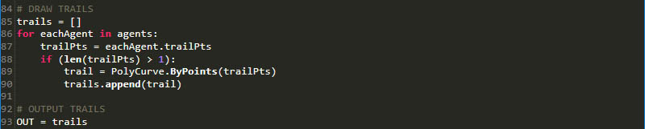

## スクリプト作成のガイドライン

ビジュアル スクリプト環境内で、DesignScript、Python、ZeroTouch (C#)を使用してテキストベースのスクリプトを作成すると、機能性の高い視覚的な関係を構築することができます。同じワークスペース内で Python や C# を使用して、入力スライダなどの要素を画面上に表示したり、大規模な操作を DesignScript 内に集約したり、便利なツールやライブラリにアクセスすることができます。こうした方法を組み合わせて効率的に管理することにより、プログラム全体のカスタマイズ性、明確性、効率性が大幅に向上します。ここでは、テキスト スクリプトを使用してビジュアル スクリプトを拡張するための一連のガイドラインを紹介します。


### どのような場合にスクリプトを作成するのかを理解する

テキスト スクリプトを使用すると、ビジュアル スクリプトよりも複雑な関係を記述することができます。ただし、テキスト スクリプトとビジュアル スクリプトの機能は多くの点で重複しています。事前にパッケージ化された便利なコードがビジュアル スクリプトのノードであるため、ビジュアル スクリプトで多くの機能が重複するのは避けられないことです。ビジュアル スクリプトを使用すると、Dynamo プログラム全体を DesignScript または Python で作成することができます。ただし、ノードとワイヤのインタフェースを使用すると、グラフィカルな情報を直感的なフローで作成できるため、Dynamo ではビジュアル スクリプトを使用しています。テキスト スクリプトの機能がビジュアル スクリプトの機能よりも優れている点について理解しておくと、ノードやワイヤの直感的な機能の代わりにテキスト スクリプトの機能を使用した方が効率的な場合を特定できるようになります。どのような場合にどの言語を使用してスクリプトを作成するかについては、次に示すガイドラインを参照してください。

**テキスト スクリプトを使用するケース:**

* ループ処理を記述する場合

* 反復処理を記述する場合

* 外部ライブラリへのアクセス処理を記述する場合

**言語の選択**

|  | ループ | 反復 | ノードの集約 | 外部 ライブラリへのアクセス | 省略表記 |
| -- | -- |
| **DesignScript** | 可 | 可 | 可 | 不可 | 可 |
| **Python** | 可 | 可 | 一部可 | 可 | 不可 |
| **ZeroTouch (C#)** | 不可 | 不可 | 不可 | 可 | 不可 |

> 各 Dynamo ライブラリでアクセスできるコンテンツのリストについては、「[スクリプトの参照情報](http://dynamoprimer.com/ja/12_Best-Practice/12-3_Scripting-Reference.html)」を参照してください。

### パラメトリックに考える

Dynamo でスクリプトを作成する場合は必ずパラメトリック環境で作業を行うことになるため、使用するノードとワイヤのフレームワークに関連する形で、構造化されたコードを記述することをお勧めします。例として、テキスト スクリプトが記述されているノードを考えてみます。このノードは、複数の入力、1 つの関数、予想される 1 つの出力が指定されている、プログラム内の他のノードと同じように構成されているとします。この場合、ノード内のコードにいくつかの作業用変数が即時に設定されます。これらの変数が、クリーンなパラメトリック システムの重要な要素になります。コードをビジュアル プログラムに統合するための適切な方法については、次のガイドラインを参照してください。

**外部変数を特定する**

* 設計内で使用するパラメータを特定します。これにより、対象のデータから直接作成されるモデルを構築できるようになります。

* コードを記述する前に、次の変数を特定します。

* 入力の最小セット

* 目的の出力

* 定数


> 一部の変数については、コードを記述する前に既に定義されています。

> 1. 降雨のシミュレーションを実行するサーフェス。
2. 必要な雨粒の数(エージェント)。
3. 雨粒の移動距離。
4. 最も急なパスの下降とサーフェス横断との切り替え。
5. 各入力の番号が指定された Python Script ノード。
6. 返された曲線が青で表示されるコード ブロック。

**内部的な関係を設計する**

* パラメトリシズム機能で特定のパラメータや変数を編集することにより、計算式やシステムの最終結果を操作または変更できます。

* スクリプト内のエンティティが論理的に関連付けられている場合は、常にそれらのエンティティを相互の関数として定義します。この場合、一方の関数を変更すると、その変更内容に応じてもう一方の関数が更新されます。

* 重要なパラメータだけを表示し、入力の数を最小限に抑えます。

* 追加の親パラーメータから一連のパラメータを継承できる場合は、それらの親パラメータだけをスクリプトの入力として表示してください。こうすることにより、インタフェースの複雑さが軽減されるため、スクリプトが使いやすくなります。


> 上記のコードは、[Python Script ノード](http://dynamoprimer.com/ja/09_Custom-Nodes/9-4_Python.html)の「modules」というサンプル コードです。

> 1. 入力。
2. スクリプト内で使用される変数。
3. 上記の入力と変数を使用して関数を実行するループ。
> ヒント: スクリプトの結果だけでなく、途中のプロセスも非常に重要です。どちらにも同じように重点を置いてください。

**Don't repeat yourself (DRY 原則)**

* スクリプト内で同じ処理を複数の方法で記述すると、いずれかのタイミングで、重複するコード記述間における整合性が取れなくなることがあります。その結果、保守作業に時間がかかったり、コードの解析効率が落ちたり、システム内部の不整合が発生する可能性があります。

* DRY 原則は、「すべての情報は、システム内において、ただ 1 つの明確な信頼できる表現を持っている」ということを表す原則です。

* この原則を正しく適用することにより、スクリプト内の関連要素が予期したとおりに統一して変更されます。関連しない要素については、相互に論理的な影響が及ぶことはありません。

```
### BAD
for i in range(4):
for j in range(4):
point = Point.ByCoordinates(3*i, 3*j, 0)
points.append(point)
```

```
### GOOD
count = IN[0]
pDist = IN[1]

for i in range(count):
for j in range(count):
point = Point.ByCoordinates(pDist*i, pDist*j, 0)
points.append(point)
```

> ヒント: 上記の「BAD」の例では定数を記述していますが、スクリプト内でエンティティを複製する前に、ソースにリンクさせることができないかどうかを検討することをお勧めします。

### モジュール単位で構成する

コードが長くなってより複雑になるにつれて、スクリプトの目的や全体的なアルゴリズムが分かりにくくなります。また、特定の処理の内容や、特定の処理が記述されている箇所を簡単に追跡できなくなり、エラーが発生した場合も、その原因となるバグを見つけることが難しくなります。さらに、他のコードへの統合や開発作業の割り当てについても、困難になります。こうした困難を避けるため、モジュール単位でコードを記述することをお勧めします。この方法では、コードで実行する処理に基づいて、コードを組織的に分割して記述します。ここでは、モジュール化の手法を使用して、スクリプトを簡単に管理するためのヒントをいくつか紹介します。

**モジュール単位でコードを記述する**

* 「モジュール」とは、特定の処理を実行するコードの集まりで、ワークスペース内の Dynamo ノードに似ています。

* モジュールは、隣接するコードから視覚的に離れた位置に記述します(関数、クラス、入力のグループ、読み込むライブラリなどがモジュールになります)。

* モジュール単位でコードを記述すると、視覚的で直感的なノードの利点を活用できるだけなく、テキスト スクリプトでしか記述できない複雑な関係を使用することもできます。


> 上記のループ処理では、「agent」というクラスを呼び出しています。このクラスは、次の演習で作成します。

> 1. 各エージェントの開始点を定義するコード モジュール。
2. エージェントを更新するコード モジュール。
3. エージェントのパスの基準線を描画するコード モジュール。

**複数の箇所に記述されている同じコードを関数としてまとめる**

* 同じ処理(または非常に類似した処理)を実行するコードが複数の箇所に記述されている場合は、呼び出し可能な関数としてそれらのコードをまとめます。

* 「Manager」関数は、プログラム フローをコントロールします。この関数には主に、構造間でのデータ移動などの低レベル詳細の動作を処理する「Worker」関数に対する呼び出しが格納されます。


> 上記の例では、中心点の Z 値に基づき、半径と色を指定して球体を作成しています。

> 1. 中心線の Z 値に基づき、半径と表示色を指定して球体を作成する 2 つの「Worker」親関数。
2. 2 つの Worker 関数を組み合わせる「Manager」親関数。この関数を呼び出すと、この関数に含まれている 2 つの Worker 関数が呼び出されることになります。

**必要な要素だけを表示する**

* モジュールのインタフェースには、そのモジュールで指定されている必要な要素が表示されます。

* ユニット間のインタフェースを定義すると、各ユニットの詳細設計を個別に進めることができるようになります。

**モジュールの分離や置き換え**

* モジュール間には相互の関係はないため、必要に応じて分離や置き換えを行うことができます。

**モジュール化の一般的な形式**

* コードをグループ化する場合は、次のように記述します。

```
# IMPORT LIBRARIES
import random
import math
import clr
clr.AddReference('ProtoGeometry')
from Autodesk.DesignScript.Geometry import *

# DEFINE PARAMETER INPUTS
surfIn = IN[0]
maxSteps = IN[1]
```

* 関数は、次のように記述します。

```
def get_step_size():
area = surfIn.Area
stepSize = math.sqrt(area)/100
return stepSize

stepSize = get_step_size()
```

* クラスは、次のように記述します。

```
class MyClass:
i = 12345

def f(self):
return 'hello world'

numbers = MyClass.i
greeting = MyClass.f
```

### スクリプトを継続的にモニタリングする

Dynamo でテキスト スクリプトを開発する場合は、目的とする結果と、実際に作成される結果を頻繁に確認することをお勧めします。こうすることにより、構文エラー、論理的な矛盾点、不正確な値、正しくない出力など、予期しない状況をすばやく検出し、そのたびに修正することができます。最後にまとめて修正するよりも、効率的に作業を進めることができます。テキスト スクリプトは、キャンバス上のノード内でアクティブになっているため、ビジュアル プログラムのデータ フローに既に統合された状態になっています。そのため、出力データを割り当ててプログラムを実行し、Watch ノードを使用してスクリプトからのフローを評価するだけで、スクリプトを継続的にモニタリングすることができます。ここでは、スクリプトを作成しながら、そのスクリプトを継続的に検査する場合のヒントをいくつか紹介します。

**スクリプトを開発しながらテストを行う**

* 機能を実行するためのコードの記述が完了するたびに、次の点を確認します。

* コードの内容を客観的に確認します。

* コードの内容を批判的に確認します。たとえば、共同作業を行っている他のメンバーがこのコードの内容を理解できるかどうか、この処理は本当に必要なのかどうか、この機能をさらに効率的に記述することができないかどうか、不要な重複コードや依存コードが記述されていないかどうか、などを確認します。

* 正しいデータが返されるかどうかを簡単にテストします。

* スクリプト内で使用する最新のデータを出力として割り当てます。これにより、スクリプトを更新するたびに、関連するデータがノードによって常に出力されるようになります。


> [Python ノード](http://dynamoprimer.com/ja/09_Custom-Nodes/9-4_Python.html)のサンプル コードで、次の動作を確認します。

> 1. ソリッドのすべてのエッジが、境界ボックスを作成するための曲線として返されるかどうかを確認します。
2. Count 入力が正しく Range に変換されるかどうかを確認します。
3. 座標系が適切に変換され、ループ内で回転するかどうかを確認します。

**極端な条件を想定してテストを行う**

* スクリプトの作成中に、割り当てられているドメインの最小値と最大値に入力パラメータを設定すると、極端な条件下でもプログラムが正常に機能するかどうかを確認することができます。

* 最小値や最大値を指定して正常にプログラムが機能する場合であっても、予期しない Null 値、空の値、ゼロが返されることがないかどうかを確認する必要があります。

* こうした極端な条件を設定しないと、スクリプト内に存在する問題を示すバグやエラーが見つからないことがあります。

* エラーの原因を特定し、エラーを内部的に修正する必要があるのかどうか、またはパラメータ ドメインを調整してエラーを回避する必要があるのかどうかを判断します。

> ヒント: スクリプトを開発する際には、「ユーザは、使用可能なすべての入力値のあらゆる組み合わせを使用する」ということを常に想定して作業を行う必要があります。これにより、予期しない問題が発生するのを防ぐことができます。

### 効率的なデバッグを行う

デバッグとは、スクリプトからバグをなくすためのプロセスのことです。エラー、非効率な処理、不正確な値、予期しない結果などをまとめて「バグ」と呼びます。バグの修正は、変数名のスペルミスを修正するような単純なものもあれば、スクリプトの構成に関する問題のように、広範囲にわたるものもあります。スクリプトを作成しながら、早い段階で潜在的な問題を検出して修正するのが理想的な方法ですが、この方法でも、バグのまったくないスクリプトを作成できるという保証はありません。ここでは、バグを系統的な方法で修正するためのベスト プラクティスをいくつか紹介します。これらのベスト プラクティスは、優先度の高い順に記載されています。

**ウォッチ バルーンを使用する**

* 返されるデータを OUT 変数に割り当てて、コード内の複数の場所でそのデータを確認します。これは、スクリプトを作成しながらバグを修正する方法に似ています。

**分かりやすいコメントを書く**

* コードをモジュール化して、目的とする結果をコメントとして明確に記述すると、デバッグが簡単になります。

```
# Loop through X and Y
for i in range(xCount):
for j in range(yCount):

# Rotate and translate the coordinate system
toCoord = fromCoord.Rotate(solid.ContextCoordinateSystem.Origin,Vector.ByCoordinates(0,0,1),(90*(i+j%seed)))
vec = Vector.ByCoordinates((xDist*i),(yDist*j),0)
toCoord = toCoord.Translate(vec)

# Transform the solid from the source coord system to the target coord system and append to the list
solids.append(solid.Transform(fromCoord,toCoord))
```

> 通常、コメント行と空白行は余分な情報ですが、デバッグを行う場合は、コードを細分化して内容を追跡できるため、便利です。

**モジュール化されたコードの利点を活用する**

* 分離された特定のモジュール内に問題の原因が存在している場合があります。

* 問題のあるモジュールを特定できれば、問題の修正が非常に簡単になります。

* プログラムを修正する必要がある場合、コードがモジュール化されていれば、非常に簡単に修正を行うことができます。

* プログラムの他の部分を変更することなく、新しいモジュールやデバッグ済みのモジュールを既存のプログラムに挿入することができます。


> [Python ノード](http://dynamoprimer.com/ja/09_Custom-Nodes/9-4_Python.html)のサンプル ファイルをデバックすると、次のようになります。

> 1. 自分よりも大きな境界ボックスを返す入力ジオメトリ(これを確認するには、xDist と yDist の値を OUT 変数に割り当てます)。
2. xDist と yDist の正しい距離が設定された適切な境界ボックスを返す入力ジオメトリのエッジ曲線。
3. xDist と yDist の値に関する問題に対応するための「module」コード(これは、これまでの説明で挿入したコードです)。

### 演習 - 最も急なパスを作成する

> この演習に付属しているサンプル ファイルをダウンロードしてください(右クリックして[名前を付けてリンク先を保存]を選択)。すべてのサンプル ファイルの一覧については、付録を参照してください。[SteepestPath.dyn](datasets/12-1/SteepestPath.dyn)

上で説明したテキスト スクリプトのベスト プラクティスを意識しながら、降雨シミュレーション スクリプトを作成してみましょう。「見やすいプログラムを作成するためのガイドライン」の演習では、ベスト プラクティスに従い、構造化されていないビジュアル プログラムを見やすく整理することができましたが、テキスト スクリプトの場合、それは非常に難しくなります。テキスト スクリプトで記述された論理的な関係は、視覚的に把握するのが難しいため、複雑なコードになると、関係を解読するのがほとんど不可能になる場合もあります。そのため、テキスト スクリプトの高度な機能を使用する場合は、組織的に記述する必要性が高くなります。この演習では、ステップごとに操作を確認しながら、ベスト プラクティスについて説明していきます。


> アトラクタが変形しているサーフェスに適用されるスクリプト

最初に、必要な Dynamo ライブラリを読み込みます。これにより、Python 内で Dynamo の機能にグローバルにアクセスできるようになります。


> この段階で、必要なライブラリをすべて読み込む必要があります。

次に、スクリプトの入力と出力を定義する必要があります。定義した入力は、ノード上で入力ポートとして表示されます。これらの外部入力が、このスクリプトの基礎となり、パラメトリック環境を構築するための重要なデータになります。


> Python スクリプト内の変数に対応する入力を定義する必要があります。これらの入力により、目的とする出力が設定されます。

> 1. ベースとなるサーフェス。
2. 使用するエージェントの数。
3. エージェントが進むことができるステップの最大数。
4. サーフェスからの最短距離のパスを取得するためのオプション(または、サーフェスを横断するためのオプション)。
5. スクリプト IN[0] とスクリプト IN[1] の入力に対応する入力 ID が設定された Python ノード。
6. 異なる色で表示可能な出力曲線。

では、モジュール化の手法を使用して、スクリプトの本文を作成してみましょう。複数の始点に対して、サーフェスからの最短パスのシミュレーションを実行するのは、複数の関数が必要になる複雑な作業です。そのため、スクリプト内の異なる場所で異なる関数を呼び出すのではなく、それらの関数をエージェントの 1 つのクラスとしてまとめることにより、コードをモジュール化します。このクラス(モジュール)の各関数は、それぞれ異なる変数を使用して呼び出すことができます。また、別のスクリプト内で再利用することもできます。


> サーフェス上を下降するエージェントに対して、その動作を指示するクラスを定義する必要があります。このクラスを使用して、エージェントがステップを進むたびに、最も急な方向へ移動することを選択します。

> 1. 名前。
2. すべてのエージェントが共有するグローバル属性。
3. 各エージェント固有のインスタンス属性。
4. ステップを進むための関数。
5. 各ステップの位置を基準線リストにカタログ化するための関数。

ここで、エージェントの開始位置を指定して、エージェントを初期化しましょう。それに合わせて、スクリプトの調整を行い、エージェント クラスが正しく機能するかどうかを確認します。


> サーフェスを下降するすべてのエージェントをインスタンス化し、それらのエージェントの初期属性を定義する必要があります。

> 1. 新しい空の基準線リスト。
2. サーフェス上での下降の開始を指定するためのコード。
3. エージェント リストを出力として割り当て、スクリプトから返される情報を確認するための Watch ノード。エージェントの正確な数が返されていますが、後でスクリプトをもう一度編集して、スクリプトから返されるジオメトリを確認します。

ステップごとにそれぞれのエージェントを更新します。


> 次に、エージェントとステップごとに、ネストされたループ処理を記述し、エージェントとステップの位置を更新してそれぞれの基準線リストに記録します。また、各ステップで、エージェントがサーフェス上の最終的な位置(それ以上は下降できない位置)にまだ到達していないことを確認します。エージェントがサーフェス上の最終的な位置に到達したら、エージェントの移動を停止します。

これで、各エージェントが完全に更新されました。次に、これらのエージェントを表すジオメトリを返してみましょう。



> すべてのエージェントが、それ以上は下降できない位置にまで達したことを確認した後で(または、ステップの最大数に達したことを確認した後で)、各エージェントの基準線リスト内の点を通過するポリカーブを作成し、そのポリカーブの基準線を出力します。

最も急なパスを探すためのスクリプト。


> 1. ベースとなるサーフェス上の降雨をシミュレーションするためのプリセット。
2. 最も急なパスを探す代わりに、エージェントを切り替えて、ベースとなるサーフェスを横断することもできます。


> 最終的な Python のテキスト スクリプトはこのようになります。

