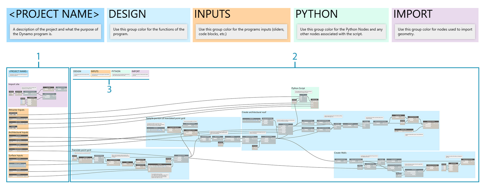

## 見やすいプログラムを作成するためのガイドライン

この章に入る前に、Dynamo の強力なビジュアル スクリプト機能の実装方法について説明しました。これらの機能を正しく理解することが、堅固なビジュアル プログラムを開発するための基礎となり、第一歩となります。実際の現場でビジュアル プログラムを使用する場合、チーム メンバーとビジュアル プログラムを共有する場合、エラーのトラブルシューティングを行う場合、制限値のテストを行う場合などは、新たな問題が発生します。自分が作成したプログラムを他のメンバーが使用する場合や、今から 6 ヵ月後にプログラムを起動するような場合は、外観的な面でも論理的な面でも、すぐに理解できるようなプログラムを作成する必要があります。Dynamo には、複雑なプログラムを管理するためのさまざまなツールが用意されています。この章では、そうしたツールを使用する場合のガイドラインについて説明します。

### 複雑さを軽減する

Dynamo でプログラムを作成したり、アイデアをテストする場合、そのサイズと複雑さが急激に増大することがあります。正しく機能するプログラムを作成することはもちろん重要なことですが、可能な限り簡潔なプログラムを作成することも同じくらいに重要なことです。簡潔なプログラムを作成することにより、プログラムの処理速度と精度が上がるだけでなく、後で他のメンバーとともにコードを解析する場合も、ロジックを簡単に追うことができるようになります。ここでは、プログラムのロジックを分かりやすく記述するための方法をいくつか紹介します。

#### グループを使用してプログラムをモジュール化する

* プログラムの作成時にグループを使用して、**機能別に異なるパーツを作成**することができます。
* グループを使用すると、各モジュールとその配置を維持しながら、**プログラム内の大きなパーツを移動**することができます。
* **グループの色を変えて**、各グループの用途(入力や関数など)を区別することができます。
* グループを使用して**プログラムを整理し、カスタム ノードの作成を簡素化**することができます。

> このプログラムでは、各グループの用途を色で示しています。この方法により、開発するプログラムの標準やテンプレート内で階層を作成することができます。

> 1. 関数グループ(青)
2. 入力グループ(オレンジ色)
3. スクリプト グループ(緑)
> グループの使用方法については、「[プログラムを管理する](http://dynamoprimer.com/ja/03_Anatomy-of-a-Dynamo-Definition/3-4_best_practices.html)」を参照してください。

#### コード ブロックを使用して効率的に開発する

* 必要に応じてコード ブロックを使用すると、**検索するよりも速く、数値メソッドやノード メソッドを入力**することができます(Point.ByCoordinates、Number、String、Formula)。

* **DesignScript でカスタム関数を定義してプログラム内のノードの数を減らす**場合は、コード ブロックを使用すると便利です。

> 1 と 2 は、どちらも同じ関数を実行します。各ノードを個別に検索して追加するよりも、コードを何行か入力する方が、ずっと速く作業を進めることができます。また、コード ブロックのサイズもずっと小さくなります。

> 1. コード ブロックを使用して記述した設計スクリプト
2. ノードを使用して同じスクリプトを記述した場合
> コード ブロックの使用方法については、「[コード ブロックとは](http://dynamoprimer.com/ja/07_Code-Block/7-1_what-is-a-code-block.html)」を参照してください。

#### ノードをコードに変換する

* **[ノードをコード化]機能を使用して、画面上の煩雑さを軽減**することができます。この機能では、複数の単純なノードを 1 つにまとめることにより、それらのノードに対応する DesignScript が 1 つのコード ブロック内で記述されます。
* [ノードをコード化]機能を使用すると、**プログラム ロジックのわかりやすさを損なうことなく、複数のノードを 1 つのコード ブロックにまとめる**ことができます。
* [ノードをコード化]機能を使用する**メリット**には、次のようなものがあります。
* コードを編集可能な 1 つのコンポーネントとして簡単に集約できる
* 画面上の大部分を簡素化できる
* 小さなプログラムを頻繁に編集する必要がない場合に便利である
* 関数など、他のコード ブロック機能を組み込む場合に便利である

* [ノードをコード化]機能を使用する**デメリット**には、次のようなものがあります。
* 一般的な命名規則が使用されるため、コードの内容が多少わかりにくくなる
* 他のユーザにとって、コードの理解が難しくなる
* 元のビジュアル プログラムに簡単に戻すことができない

> 1. 既存のプログラム
2. [ノードをコード化]機能によって作成されたコード ブロック
> [ノードをコード化]機能の使用方法については、「[DesignScript 構文](http://dynamoprimer.com/ja/07_Code-Block/7-2_Design-Script-syntax.html)」を参照してください。

#### List@Level 機能を使用してデータに柔軟にアクセスする

* List.Map ノードと List.Combine ノードはキャンバス上で大きなスペースを占有する場合がありますが、List@Level 機能を使用してこれらの**ノードを置き換えることにより、画面上の煩雑さを軽減**することができます。
* List@Level 機能を使用すると、ノードの入力ポートからリスト内の任意のレベルに直接アクセスできるため、**List.Map ノードや List.Combine ノードを使用するよりも速くノード ロジックを記述**することができます。

> CountTrue ノードの list 入力で List@Level 機能を有効にすると、BoundingBox.Contains ノードから返される True 値の数と、その True 値を返すリストを確認することができます。List@Level 機能により、入力データの取得元となるレベルを特定することができます。List.Map ノードと List.Combine ノードを使用する場合、List@Level 機能は、他の方法よりも柔軟で効率的な方法です。これらのノードで作業を行う場合は、List@Level 機能を使用することを強くお勧めします。

> 1. リスト レベル 2 で True 値の数をカウント
2. リスト レベル 3 で True 値の数をカウント
> List@Level 機能の使用方法については、「[リストのリスト](http://dynamoprimer.com/ja/06_Designing-with-Lists/6-3_lists-of-lists.html#list@level)」を参照してください。

### 見やすいプログラムにする

可能な限り簡潔で効率的なプログラムを作成するには、見やすいプログラムを作成するということに重点を置く必要があります。論理的にグループ化された直感的なプログラムを作成した場合であっても、データ間の関係性が分かりにくくなることがあります。グループ内に簡単な注記を記載したり、スライダー名を分かりやすい名前に変更すると、自分だけでなく他のメンバーも、名前などで混乱したり、画面上を無駄に移動することがなくなります。ここでは、プログラム全体で一貫した外観を保つための方法をいくつか紹介します。

#### ノードの配置を調整して視覚的な一貫性を保つ

* プログラム作成後の作業量を減らすには、**プログラムの作成時に頻繁にノードの配置を調整**して、ノードのレイアウトを見やすく整える必要があります。
* 自分が作成したプログラムで他のメンバーが作業を行う場合は、**ワイヤが自然な方向に流れるように各ノードを配置**する必要があります。
* ノードを配置するには、**[ノードのレイアウトをクリーンアップ]機能を使用してノードの配置を自動的に調整**します。ただし、手動で調整する場合と比べて、多少精度が下がることに注意してください。

> 1. ノードが整理されていない画面
2. ノードが整理されている画面
> ノードの配置を調整する方法については、「[プログラムを管理する](http://dynamoprimer.com/ja/03_Anatomy-of-a-Dynamo-Definition/3-4_best_practices.html)」を参照してください。

#### 名前を変更してわかりやすいラベルを付ける

* 入力の名前を変更することにより、自分が作成したプログラムを他のメンバーが使用する場合でも、内容を簡単に理解できるようになります。**特に、入力の接続先ノードが画面からはみ出してしまうような場合は、入力名からそのノードの内容を推測できるため、**分かりやすい名前を付けておくと便利です。
* **入力以外のノード名を変更する場合は、注意が必要です。**その場合は、別の方法として、ノード クラスタからカスタム ノードを作成し、そのカスタム ノードの名前を変更します。こうすることにより、そのノードの内容は、他のノードとは異なっているということを示すことができます。

> 1. サーフェスを操作するための入力
2. 建築設計パラメータ用の入力
3. 排水シミュレーション スクリプト用の入力
> ノード名を変更するには、変更するノード名を右クリックして[ノードの名前を変更...]を選択します。

#### 説明としてノートを追加する

* ノードでは表現できないような**分かりやすい説明をプログラムに挿入**する必要がある場合は、ノートと呼ばれる注記を追加します。
* **ノードの集合やグループのサイズが大きすぎて(または複雑すぎて)簡単には理解できない場合**は、ノートを追加することをお勧めします。

> 1. 行の移動距離を返すプログラムの特定の箇所を説明するためのノート
2. 上記の移動距離の値を正弦波にマッピングするコードを説明するためのノート
> ノートの追加方法については、「[プログラムを管理する](http://dynamoprimer.com/ja/03_Anatomy-of-a-Dynamo-Definition/3-4_best_practices.html)」を参照してください。

### スクリプトを継続的にモニタリングする

ビジュアル スクリプトを作成する場合、正しい値がスクリプトから返されるかどうかを確認することが重要になります。すべてのエラーが、プログラムの即時停止につながるエラーというわけではありません。特に、Null 値やゼロの値に関するエラーは、プログラムの下流部分に影響する場合があるため、注意が必要です。この方法は、「[スクリプト作成のガイドライン](http://dynamoprimer.com/ja/12_Best-Practice/12-2_Scripting-Strategies.html)」の章でも、テキスト スクリプトに関連する形で記載されています。 次の演習では、正しい結果を得る方法について確認していきます。

#### ウォッチ バルーンとプレビュー バルーンを使用してデータをモニターする

* プログラムの作成時にウォッチ バルーンまたはプレビュー バルーンを使用すると、**重要な出力データが正しく返されるかどうかを確認**することができます。

> この例では、Watch ノードを使用して、次のデータを比較しています。

> 1. 行の移動距離
2. 正弦式から渡された値
> Watch ノードの使用方法については、「[ライブラリ](http://dynamoprimer.com/ja/03_Anatomy-of-a-Dynamo-Definition/3-2_dynamo_libraries.html)」を参照してください。

### 再利用しやすいプログラムを作成する

自分が他のメンバーとは別の作業を行っている場合であっても、自分が作成したプログラムを後で他のメンバーが使用するというのは非常によくあることです。そうした場合に備えて、入力データと出力データから、プログラムの内容と結果を短時間で把握できるようにしておく必要があります。これは特に、カスタム ノードを開発して Dynamo コミュニティで共有し、他のメンバーが作成したプログラム内でそのカスタム ノードを使用する場合に重要になります。こうすることにより、簡単に再利用できる堅固なプログラムとノードを作成することができます。

#### 入出力を管理する

* プログラムの読みやすさと拡張性を確保するため、**入力と出力は可能な限り少なくする**ことをお勧めします。
* キャンバス上でノードを追加する前に、**ロジックの概要を組み立ててから、そのロジックをどのように作成していくかを検討**するようにしてください。 概要を組み立てる際に、スクリプト内で使用する入力と出力を検討する必要があります。

#### プリセットを使用して入力値を組み込む

* **特定のオプションや条件をプログラム内に組み込む**場合は、プリセットを使用すると、迅速に作業を進めることができます。
* また、長期間実行されるプログラム内でプリセットを使用して**特定のスライダ値をキャッシュすると、プログラムの複雑さを軽減**することができます。

> プリセットの使用方法については、「[プリセットを使用してデータを管理する](http://dynamoprimer.com/ja/03_Anatomy-of-a-Dynamo-Definition/3-5_presets.html)」を参照してください。

#### プログラムを構成する各ノードをカスタム ノード内に収集する

* **プログラムを構成する各ノードを 1 つのコンテナ内に収集できる**場合は、カスタム ノードを使用することをお勧めします。
* 他のプログラム内で**一部のコードを頻繁に再利用する**場合は、カスタム ノードを使用することをお勧めします。
* **Dynamo コミュニティ内で特定の機能を共有**する場合は、カスタム ノードを使用することをお勧めします。

> 点の移動プログラムを構成する各ノードをカスタム ノード内に収集すると、移植可能で堅固な一意のプログラムを作成することができます。また、プログラムの内容も簡単に理解できるようになります。入力ポートに分かりやすい名前を付けると、他のメンバーがそのプログラムを使用する際に、ノードの使用方法を簡単に理解できるようになります。すべての入力について、説明と必要なデータ タイプを追加してください。

> 1. 既存のアトラクタ プログラム
2. 上記のプログラムを構成する各ノードを収集するためのカスタム ノード「PointGrid」
> カスタム ノードの使用方法については、「[カスタム ノードの概要](http://dynamoprimer.com/ja/09_Custom-Nodes/9-1_Introduction.html)」を参照してください。

#### テンプレートを作成する

* テンプレートを作成して**ビジュアル プログラム全体の外観的な標準を定義することにより、すべてのチーム メンバーが標準化された方法でプログラムを理解**できるようになります。
* テンプレートを作成する際に、**グループの色とフォント サイズ**を標準化して、ワークフローやデータ操作のタイプを分類することができます。
* テンプレートを作成する際に、プログラム内の**ワークフローのフロントエンドとバックエンドとの差異について、ラベルを付けたり、色を付けたり、スタイルを設定**することもできます。

> 1. プログラムの UI (フロントエンド)。プロジェクト名、入力スライダ、読み込みジオメトリが表示されます。
2. プログラムのバックエンド。
3. グループ(一般的な設計、入力、Python スクリプト、読み込まれたジオメトリ)を区別するための色分け。

### 演習 - 建築設計で使用する屋根を作成する

> この演習に付属しているサンプル ファイルをダウンロードしてください(右クリックして[名前を付けてリンク先を保存]を選択)。すべてのサンプル ファイルの一覧については、付録を参照してください。[RoofDrainageSim.zip](datasets/12-2/RoofDrainageSim.zip)

この演習では、上で説明したベスト プラクティスを構造化されていないプログラムに適用してみましょう。このプログラムでは、屋根を正しく作成することができますが、計画的に作成されたものではないため、構造化されていない状態になっています。各ノードの配置は整理されておらず、ノードの用途を示す説明も入力されていません。このプログラムの作成者以外のユーザもこのプログラムの内容を理解できるように、ノード配置の整理、説明の追加、プログラムの解析について、ベスト プラクティスを適用する手順を順に見ていきましょう。

> このプログラムは正しく機能しますが、ノードが乱雑に配置されているため、見にくくなっています。

最初に、プログラムから返されるデータとジオメトリを確認しましょう。

> 論理的な単位であるモジュールを作成する場合、データが大きく変更されるタイミングを把握することが非常に重要になります。Watch ノードを使用してプログラムを検査し、ノードのグループ化を検討してから、次のステップに進むようにしてください。

> 1. このコード ブロックには数式が記述されているため、プログラムの重要な部分を構成していると考えられます。Watch ノードを使用すると、プログラムから返される移動距離のリストを表示することができます。
2. これらのノードの用途については、一見しただけではよくわかりません。BoundingBox.Contains ノードのリスト レベル L2 の True 値の配置と、List.FilterByBoolMask ノードが使用されていることから考えると、点構成グリッドの一部をサンプリングしていることが推測できます。

プログラム内の各要素の内容が理解できたら、それらの要素をグループ化します。

> ノードをグループ化することにより、プログラムを構成するパーツを視覚的に区別できるようになります。

> 1. 3D サイト モデルを読み込むグループ
2. 正弦式に基づいて点構成グリッドを移動するグループ
3. 点構成グリッドの一部をサンプリングするグループ
4. 建築設計で使用する屋根のサーフェスを作成するグループ
5. ガラス カーテン ウォールを作成するグループ

グループ化が完了したら、ノードの配置を調整して、プログラム全体の流れを見やすく整理します。

> プログラムの流れを見やすく整理することにより、プログラムの構造と各ノード間の暗黙的な関係を把握できるようになります。

プログラムをさらに見やすくするため、外観的な情報を追加してみましょう。ここでは、プログラムの特定の領域がどのように機能するかを示すためのノートを追加し、入力のカスタム名を設定し、グループのタイプを区別するための色を割り当てます。

> これらの外観的な情報を追加することにより、プログラムの内容がさらに分かりやすくなります。グループを色分けすると、関数から渡される入力を簡単に区別することができます。

> 1. ノート
2. 分かりやすい名前が設定された入力

プログラムの集約を開始する前に、プログラムのどの位置に Python スクリプトの排水シミュレータを組み込むかについて確認しましょう。スケーリングされた最初の屋根のサーフェスの出力を、それぞれのスクリプト入力に接続します。

> ここでは、上図の位置にスクリプトを組み込みます。これにより、元の屋根のサーフェス上で排水シミュレーションを実行できるようになります。このサーフェスはプレビュー表示されていませんが、このサーフェスにより、面取りされたポリサーフェスの上部サーフェスを選択する必要がなくなります。

> 1. スクリプト入力のソース ジオメトリ
2. Python ノード
3. 入力スライダ
4. オン/オフ スイッチ

これですべての準備が整ったので、プログラムを集約してみましょう。

> [ノードをコード化]機能とカスタム ノードを使用してプラグラムを集約すると、プログラムのサイズが大幅に削減されます。屋根のサーフェスと壁を作成するグループは、このプログラムにとって非常に重要な機能を実行するグループであるため、コードに変換されています。点を移動するグループは、他のプログラムでも使用できるように、カスタム ノード内に集約されています。このサンプル ファイルで、点を移動するグループを使用して、独自のカスタム ノードを作成してみてください。

> 1. 点構成グリッドを移動するグループを格納するためのカスタム ノード
2. 建築設計で使用する屋根のサーフェスとカーテン ウォールを作成するグループを集約するための[ノードをコード化]機能

最後に、サンプルの屋根形状用のプリセットを作成します。

> 上図の各入力が、屋根形状の主要な駆動要素になります。これらの入力を確認することにより、プログラムの概要を把握することができます。

2 つのプリセットは、次のようなビューとして表示されます。

> 屋根の排水パターンを指定することにより、それぞれのプリセットをさまざまな角度から解析することができます。

