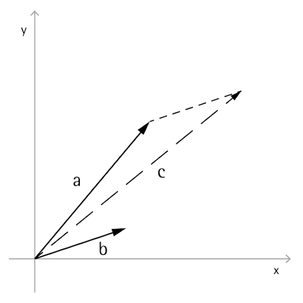

# ベクトル計算

計算設計ではオブジェクトが最終的な位置や形状で明示的に作成されることはほとんどなく、通常は既存のジオメトリに基づいて、移動、回転、およびその他の方法で配置されます。ベクトル計算は、幾何学的な足場の一種として機能することで方向およびジオメトリに対する向きを示し、視覚的に表示せずに 3D 空間での動きを概念化します。

最も基本的には、ベクトルは 3D 空間における位置を表し、通常は(0, 0, 0)の位置からその位置までの矢印の終了点と考えられます。ベクトルは *ByCoordinates* コンストラクタで、新しく作成される Vector オブジェクトの X、Y、Z の位置を指定することで作成できます。Vector オブジェクトはジオメトリ オブジェクトではないため、Dynamo ウィンドウには表示されません。ただし、新しく作成または修正されたベクトルに関する情報は、コンソール ウィンドウに出力されます。


```js
// construct a Vector object
v = Vector.ByCoordinates(1, 2, 3);

s = v.X + " " + v.Y + " " + v.Z;
```

一連の算術演算が Vector オブジェクトで定義されることによって数直線上の 1 次元空間で実数を移動するように、3 次元空間で加算、減算、乗算、およびその他の方法でオブジェクトを移動できます。

ベクトルの加算は、2 つのベクトルのコンポーネントの合計として定義され、2 つのコンポーネントのベクトルの矢印が「後端に先端が付く」形で配置された場合に結果として得られるベクトルと考えることができます。ベクトルの加算は *Add* メソッドを使用して実行され、左側のダイアグラムで表示されます。



```js
a = Vector.ByCoordinates(5, 5, 0);
b = Vector.ByCoordinates(4, 1, 0);

// c has value x = 9, y = 6, z = 0
c = a.Add(b);
```

同様に、2 つの Vector オブジェクトは、*Subtract* メソッドを使用して互いに減算できます。ベクトルの減算は 1 番目のベクトルから 2 番目のベクトルへの方向と考えることができます。


```js
a = Vector.ByCoordinates(5, 5, 0);
b = Vector.ByCoordinates(4, 1, 0);

// c has value x = 1, y = 4, z = 0
c = a.Subtract(b);
```

ベクトルの乗算はベクトルの終了点がそのベクトル自身の方向に所定のスケール係数だけ移動すると考えることができます。


```js
a = Vector.ByCoordinates(4, 4, 0);

// c has value x = 20, y = 20, z = 0
c = a.Scale(5);
```

通常、ベクトルのスケールを変更する場合には、結果として得られるベクトルの長さをスケール変更された量と正確に同じにすることが求められます。これは、最初にベクトルを正規化する、つまり、ベクトルの長さが正確に 1 に等しくなるように設定することで、容易に実行できます。


```js
a = Vector.ByCoordinates(1, 2, 3);
a_len = a.Length;

// set the a's length equal to 1.0
b = a.Normalized();
c = b.Scale(5);

// len is equal to 5
len = c.Length;
```

c の長さは正確に 5 に等しいですが、a (1, 2, 3)と同じ方向を向いたままです。

ベクトル計算には 1 次元の計算とは明確な類似点のないメソッドがさらに 2 つあります。外積と内積です。外積は、2 つの既存のベクトルに対して(90 度で)直交するベクトルを生成する手段です。たとえば、X 軸と Y 軸の外積は Z 軸です。ただし、2 つの入力ベクトルが互いに直交している必要はありません。外積ベクトルは *Cross* メソッドを使用して計算されます。


```js
a = Vector.ByCoordinates(1, 0, 1);
b = Vector.ByCoordinates(0, 1, 1);

// c has value x = -1, y = -1, z = 1
c = a.Cross(b);
```

ベクトル計算のさらに少し高度な関数が内積です。2 つのベクトル間の内積は、2 つのベクトル間の角度に関係する実数(Vector オブジェクトではない)ですが、角度そのものではありません。内積の便利なプロパティの 1 つとして、2 つのベクトルが垂直の場合、かつ垂直の場合に限り、そのベクトル間の内積が 0 となります。内積は *Dot* メソッドを使用して計算されます。


```js
a = Vector.ByCoordinates(1, 2, 1);
b = Vector.ByCoordinates(5, -8, 4);

// d has value -7
d = a.Dot(b);
```

