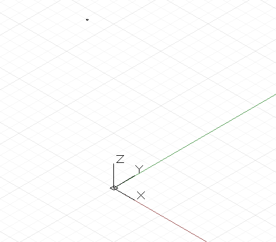

# 移動、回転、およびその他の変換

3 次元空間で X、Y、Z 座標を明示的に指定することで、特定のジオメトリ オブジェクトを作成できます。ただし、多くの場合、オブジェクト自体またはその基礎となる座標系でジオメトリ変換を使用して、ジオメトリを最終的な位置に移動します。

最も単純な幾何学的変換は移動であり、オブジェクトを X、Y、Z 軸方向に指定した単位の数だけ動かします。



```
// create a point at x = 1, y = 2, z = 3
p = Point.ByCoordinates(1, 2, 3);

// translate the point 10 units in the x direction,
// -20 in y, and 50 in z
// p2’s new position is x = 11, y = -18, z = 53
p2 = p.Translate(10, -20, 50);
```

Dynamo 内のすべてのオブジェクトは、オブジェクト名の末尾に *.Translate* メソッドを追加することで移動できますが、より複雑な変換では、基礎となる座標系から新しい座標系にオブジェクトを変換する必要があります。たとえば、オブジェクトを X 軸を中心にして 45 度回転させるには、回転していない既存の座標系から、*.Transform* メソッドで X 軸を中心にして 45 度回転した座標系にオブジェクトを移動します。


```
cube = Cuboid.ByLengths(CoordinateSystem.Identity(),
10, 10, 10);

new_cs = CoordinateSystem.Identity();
new_cs2 = new_cs.Rotate(Point.ByCoordinates(0, 0),
Vector.ByCoordinates(1,0,0.5), 25);

// get the existing coordinate system of the cube
old_cs = CoordinateSystem.Identity();

cube2 = cube.Transform(old_cs, new_cs2);
```

移動と回転だけではなく、スケーリングやせん断変形された座標系も作成できます。座標系は *.Scale* メソッドを使用してスケーリングできます。


```
cube = Cuboid.ByLengths(CoordinateSystem.Identity(),
10, 10, 10);

new_cs = CoordinateSystem.Identity();
new_cs2 = new_cs.Scale(20);

old_cs = CoordinateSystem.Identity();

cube2 = cube.Transform(old_cs, new_cs2);
```

せん断変形された座標系は、非直交ベクトルを CoordinateSystem コンストラクタに入力することで作成されます。


```
new_cs = CoordinateSystem.ByOriginVectors(
Point.ByCoordinates(0, 0, 0),
Vector.ByCoordinates(-1, -1, 1),
Vector.ByCoordinates(-0.4, 0, 0));

old_cs = CoordinateSystem.Identity();

cube = Cuboid.ByLengths(CoordinateSystem.Identity(), 
5, 5, 5);

new_curves = cube.Transform(old_cs, new_cs);
```

スケーリングとせん断変形は回転や移動よりも比較的複雑なジオメトリ変換であるため、すべての Dynamo オブジェクトで実行できるわけではありません。次の表は、スケールが均一でない座標系およびせん断変形された座標系を持つことができる Dynamo オブジェクトの概略です。

|クラス|スケールが均一でない座標系|せん断変形された座標系|
| -- | -- | -- |
|円弧|不可|不可|
|NURBS 曲線|可|可|
|NURBS 曲面|不可|不可|
|円|不可|不可|
|線分|可|可|
|平面|不可|不可|
|点|可|可|
|ポリゴン|不可|不可|
|ソリッド|不可|不可|
|サーフェス|不可|不可|
|文字|不可|不可|

