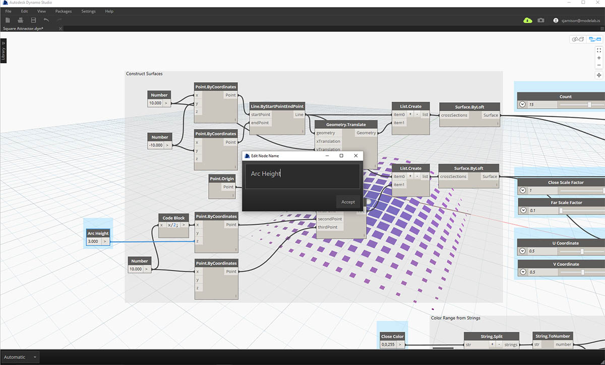
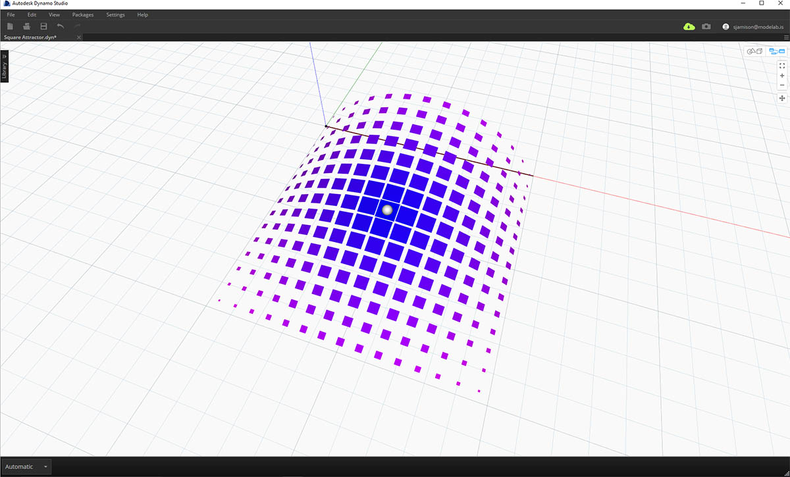

## Web に送信(Dynamo Studio を使用)

Dynamo Studio では、すばやく簡単にファイルを Web にパブリッシュすることができます。ただし、入力の選択とラベル付けには時間をかけることをお勧めします。また、わかりやすいファイル名を付けてください。Dynamo Studio をダウンロードする場合は、[Autodesk の Web サイト](http://www.autodesk.com/products/dynamo-studio/overview)で詳細情報を参照してください。

### 演習: 「Web に送信」機能の準備を行う

> この演習用のサンプル ファイルをダウンロードしてください(右クリックして[名前を付けてリンク先を保存])。すべてのサンプル ファイルの一覧については、付録を参照してください。[アトラクタ スケールのサンプルをダウンロード](datasets/Attractor Scale.dyn)

この演習では、Dynamo のグラフを Web にパブリッシュします。このファイルにより、長方形のグリッドが作成されます。このグリッドは、アトラクタに基づいてスケールを調整され、基準点からターゲットのサーフェスにマップされます。サーフェスのパッチは各長方形から作成され、アトラクタからの距離に基づいて色が付けられます。

> この演習では、上記のカスタマイザを作成します。このサンプルは、[Web](https://dynamo.autodesk.com/share/572a49033a47345a0407e803) で確認できます。

スクリプトのパブリッシュを準備するには、ユーザにアクセスできる入力を最初に決定します。使用可能な入力は、スライダ、数値、文字列、ブール値です。コード ブロックとファイル パスを入力として使用することはできません。[カスタマイザ]ビューに表示したくない入力がある場合は、その入力のコンテキスト メニューで[入力]オプションを無効にします。スライダの入力では、適切な最小値と最大値が設定されていることを確認してください。

> [カスタマイザ]ビューに表示したくない入力がある場合は、その入力のコンテキスト メニューで[入力]オプションの選択を解除します。

次に、各入力にわかりやすいラベルを付けます。

> 入力にラベルを付けるには、編集するノード名をダブルクリックします。

スクリプトの内容を簡単に把握できるプレビュー ジオメトリを含めます。この例では、球体がアトラクタの位置を示し、アトラクタまでの距離に基づいてサーフェスに色が付けられています。これにより、アトラクタの影響を簡単に視覚化して理解することができます。

### ファイルをパブリッシュする

ファイルをパブリッシュする準備ができたら、[ファイル]メニューで「Web に送信」を選択します。

ファイルの説明を入力し、ファイルを初めて使用する場合の手順を必要に応じて入力します。ファイルをパブリッシュすると、Autodesk アカウントを持っているすべてのユーザにそのファイルのリンクを送信できるようになります。このファイルは、現在の入力値とプレビューを持ったままパブリッシュされます。

> このサンプルは、[Web](https://dynamo.autodesk.com/share/572a49033a47345a0407e803) で確認することができます。

### パブリッシュしたファイルを管理する

パブリッシュしたスクリプトを管理するには、[https://dynamo.autodesk.com](https://dynamo.autodesk.com) にアクセスして自分のアカウントにサインインします。 次に、右上のドロップダウンで[管理]を選択します。このページで、パブリッシュされたワークスペースの編集、共有、削除を行うことができます。Dynamo Studio の[ファイル]メニューの[Web ワークスペースの管理]オプションから、このページにアクセスすることもできます。

> 1. ワークスペースの編集
2. ワークスペースの削除
3. リンクの共有

