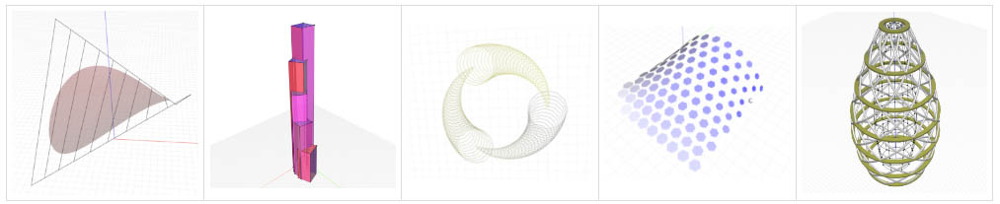
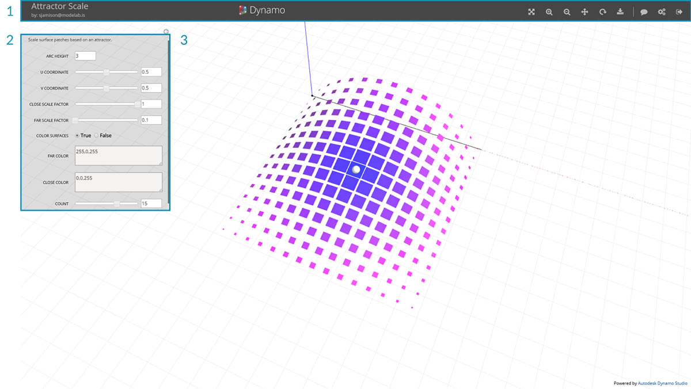
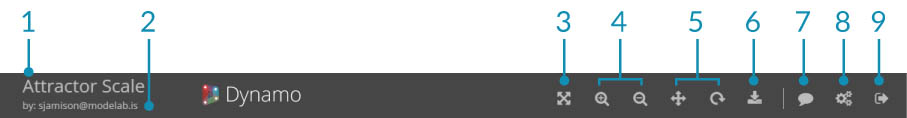
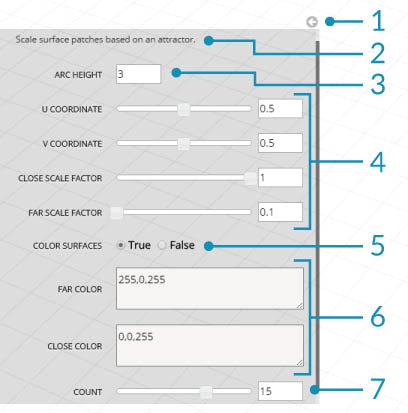

## [カスタマイザ]ビュー

Dynamo の[カスタマイザ]ビューでは、他のユーザが、スライダ、数値、ブール値などの入力から構成されるシンプルなインタフェースを介して、Web 上に置かれた Dynamo のスクリプトにアクセスすることができます。

[カスタマイザ]ビューを使用して複雑なグラフをシンプルなインタフェースに組み込むことにより、Dynamo やビジュアル プログラミングや 3D モデリングに慣れていないユーザも、スクリプトを使用することができます。Autodesk Account を持っているすべてのユーザは、共有リンクから[カスタマイザ]ビューの Dynamo スクリプトにアクセスすることができます。スクリプトへのアクセスは Dynamo のライセンスを持っていない場合でも可能です。

[カスタマイザ]ビューでは、ジオメトリを STL メッシュとして書き出してすばやくプロトタイプを作成することも、Dynamo ファイルとして書き出すこともできます。

> サンプルの[カスタマイザ]ビューは、[https://dynamo.autodesk.com/](https://dynamo.autodesk.com/) で参照することができます。

### [カスタマイザ]ビューのユーザ インタフェース

[カスタマイザ]ビューは、メニュー バー、ファイル入力とユーザ入力が表示されるフライアウト メニュー、Dynamo のワークペースに類似した 3D ビューから構成されています。

> 1. メニュー バー
2. 各種コントロール
3. 3D プレビュー

### [カスタマイザ]ビューのメニュー

[カスタマイザ]メニュー バーには、ファイル情報、ナビゲーション用の各種コントロール、ダウンロード オプションが表示されます。

> 1. タイトル: ファイル名が表示されます。
2. 作成者: ファイルの作成者が表示されます。
3. オブジェクト範囲ズーム: ジオメトリの範囲にズームします。
4. 拡大/縮小:- 拡大表示/縮小表示を行います。
5. 画面移動/オービット:- オービットと画面移動を切り替えます。
6. ダウンロード:- ファイルを STL または DYN として保存します。
7. フィードバック: コメント、提案、問題を送信します。
8. 管理/バージョン情報: Dynamo に関する情報が表示されます。
9. ログアウト: アカウントからログアウトして[カスタマイザ]ビューを終了します。

### 各種コントロール

コントロール メニューには、数値、スライダ、文字列、ブール値、ファイルの短い説明など、Dynamo スクリプトに対する入力情報が表示されます。各コントロールには、元の Dynamo ファイルで検出されたさまざまな入力情報が表示されます。表示されるコントロールは、スクリプトに応じて異なります。矢印アイコンをクリックすると、このメニューを折りたたむことができます。

> 1. コントロールの折りたたみ/展開
2. ファイルの説明
3. 入力された数値
4. 数値スライダ
5. ブール値
6. 文字列
7. 整数スライダ

