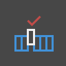
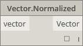

# ノードの索引

##### この索引では、この手引で言及しているすべてのノードと他の便利なコンポーネントについて、補足情報を提供します。ここで紹介するのは、Dynamo で使用できる 500 個のノードのうち一部にすぎません。

## 組み込み関数
--
||||
| -- | -- | -- |
||**Count**指定されたリスト内の項目の数を返します。||
||**Flatten**入力された多次元のリストをフラットにした 1 次元のリストを返します。||
||**Map**値を入力された範囲にマッピングします。||

## Core
--

#### Core.Color

||||
| -- | -- | -- |
||CREATE||
||**Color.ByARGB**アルファ、赤、緑、青の各成分から色を作成します。||
||**Color Range**開始色と終了色間の色のグラデーションから色を取得します。||

||ACTIONS||

||**Color.Brightness**色の明度の値を取得します。||
||**Color.Components**色の各成分を、アルファ、赤、緑、青の順のリストとして返します。||
||**Color.Saturation**色の彩度の値を取得します。||
||**Color.Hue**色の色相の値を取得します。||

||QUERY||

||**Color.Alpha**色のアルファ成分の値(0 ～ 255)を取得します。||
||**Color.Blue**色の青色成分の値(0 ～ 255)を取得します。||
||**Color.Green**色の赤色成分の値(0 ～ 255)を取得します。||
||**Color.Red**色の緑色成分の値(0 ～ 255)を取得します。||

#### Core.Display

||||
| -- | -- | -- |

||CREATE||

||**Display.ByGeometryColor**任意の色を使用してジオメトリを表示します。||

#### Core.Input

||||

| -- | -- | -- |

||ACTIONS||

||**Boolean**True と False のいずれかを選択します。||
||**Code Block**DesignScript のコードを直接作成することができます。||
||**Directory Path**システム上で任意のフォルダを選択して、そのパスを取得することができます。||
||**File Path**システム上で任意のファイルを選択して、そのファイル名を取得することができます。||
||**Integer Slider**整数値を生成するスライダです。||
||**Number** 数値を作成します。||
||**Number Slider** 数値を生成するスライダです。||
||**String**文字列を作成します。||

#### Core.List

||||
| -- | -- | -- |

||CREATE||
||**List.Create**与えられた入力に基づいて新しいリストを作成します。||
||**List.Combine**2 つのシーケンスの各要素にコンビネータを適用します。||
||**Number Range**指定された範囲内で数値のシーケンスを作成します。||
||**Number Sequence**数値のシーケンスを作成します。||

||ACTIONS||

||**List.Chop**リストを、それぞれ指定された個数の項目から成るリストの集合に分割します。||
||**List.Count**指定されたリストに格納されている項目の数を返します。||
||**List.Flatten**ネストされたリストのリストを、指定された量だけフラットにします。||
||**List.FilterByBoolMask**別個のブール値を要素に持つリスト内で対応するインデックスを検索して、シーケンスをフィルタします。||
||**List.GetItemAtIndex**リストの、指定されたインデックスにある項目を取得します。||
||**List.Map**リスト内のすべての要素に関数を適用し、その結果から新しいリストを生成します。||
||**List.Reverse**指定されたリスト内の項目を逆順で含む新しいリストを作成します。||
||**List.ReplaceItemAtIndex**リストの、指定されたインデックスにある項目を置き換えます。||
||**List.ShiftIndices**リスト内のインデックスを、指定された量だけ右に移動します。||
||**List.TakeEveryNthItem**指定されたオフセットの後、指定された値の倍数であるインデックスの項目を、指定されたリストから取得します。||
||**List.Transpose**任意のリストのリストの行と列を入れ替えます。他の行よりも短い行がある場合は、作成される配列が常に長方形になるように、プレースホルダーとして NULL 値が挿入されます。||

#### Core.Logic

||||

| -- | -- | -- |

||ACTIONS||
||**If**条件ステートメントです。テスト入力のブール値をチェックします。テスト入力が true である場合は、結果として true の入力を出力します。false である場合は、結果として false の入力を出力します。||

#### Core.Math

||||
| -- | -- | -- |

||ACTIONS||

||**Math.Cos**角度の余弦を求めます。||
||**Math.DegreesToRadians**度単位の角度をラジアン単位の角度に変換します。||
||**Math.Pow**指定された指数に対して値を累乗します。||
||**Math.RadiansToDegrees**ラジアン単位の角度を度単位の角度に変換します。||
||**Math.RemapRange**分布比率を保持しながら数値のリストの範囲を調整します。||
||**Math.Sin**角度の正弦を求めます。||

#### Core.Object

||||
| -- | -- | -- |

||ACTIONS||
||**Object.IsNull**指定されたオブジェクトが NULL であるかどうかを判断します。||

#### Core.Scripting

||||
| -- | -- | -- |

||ACTIONS||
||**Formula**数学式を評価します。NCalc を評価に使用します。[http://ncalc.codeplex.com](http://ncalc.codeplex.com) を参照してください。||

#### Core.String

||||
| -- | -- | -- |

||ACTIONS||
||**String.Concat**複数の文字列を 1 つの文字列に連結します。||
||**String.Contains**指定された文字列に指定されたサブストリングが含まれているかどうかを判断します。||
||**String.Join**複数の文字列を 1 つの文字列に連結し、結合されるそれぞれの文字列の間に区切り文字を挿入します。||
||**String.Split**1 つの文字列を文字列のリストに分割します。指定された区切り文字によって分割場所が決定されます。||
||**String.ToNumber**文字列を整数または倍精度浮動小数点数に変換します。||

#### Core.View

||||
| -- | -- | -- |

||ACTIONS||

||**View.Watch**ノードの出力を視覚化します。||
||**View.Watch 3D**ジオメトリのダイナミック プレビューを表示します。||

## Geometry

#### Geometry.Circle

||||
| -- | -- | -- |

||CREATE||

||**Circle.ByCenterPointRadius**入力された中心点と半径をワールド座標系の XY 平面に持ち、ワールド座標系の Z 軸を法線とする円を作成します。||
||**Circle.ByPlaneRadius**入力された平面の基準点(ルート)に中心を持ち、指定された半径を持つ円を平面上に作成します。||

#### Geometry.CoordinateSystem

||||
| -- | -- | -- |

||CREATE||
||**CoordinateSystem.ByOrigin**入力された点に基準点を持ち、X 軸と Y 軸を WCS(ワールド座標系)の X 軸および Y 軸に設定した座標系を作成します。||
||**CoordinateSystem.ByCyclindricalCoordinates**指定された座標系に対して、指定された円柱座標パラメータに基づいて座標系を作成します。||

#### Geometry.Cuboid

||||
| -- | -- | -- |

||CREATE||
||**Cuboid.ByLengths** (origin)中心を入力された点に設定し、指定された幅、長さ、高さの直方体を作成します。||

#### Geometry.Curve

||||
| -- | -- | -- |

||ACTIONS||

||**Curve.Extrude** (distance)法線ベクトルの方向に曲線を押し出します。||
||**Curve.PointAtParameter**StartParameter() から EndParameter() までの範囲の指定されたパラメータで曲線上の点を取得します。||

#### Geometry.Geometry

||||
| -- | -- | -- |

||ACTIONS||

||**Geometry.DistanceTo**このジオメトリから別のジオメトリへの距離を取得します。||
||**Geometry.Explode**複合要素または分割されていない要素をコンポーネント パーツに分割します。||
||**Geometry.ImportFromSAT**読み込まれたジオメトリのリストです。||
||**Geometry.Rotate** (basePlane)平面の基準点と法線を中心にオブジェクトを指定された角度だけ回転させます。||
||**Geometry.Translate**指定された方向に距離を指定して、ジオメトリ タイプを平行移動させます。||

#### Geometry.Line

||||
| -- | -- | -- |

||CREATE||

||**Line.ByBestFitThroughPoints**点の散布図に最もよく近似する直線を作成します。||
||**Line.ByStartPointDirectionLength**開始点から始まり、ベクトルの向きに指定された長さだけ延長する線分を作成します。||
||**Line.ByStartPointEndPoint**入力された 2 点を端点とする線分を作成します。||
||**Line.ByTangency**入力された曲線に接し、曲線のパラメータで指定された点に位置する直線を作成します。||

||QUERY||

||**Line.Direction**曲線の方向を返します。||

#### Geometry.NurbsCurve

||||
| -- | -- | -- |

||Create||

||**NurbsCurve.ByControlPoints**明示的な制御点を使用して B スプライン曲線を作成します。||
||**NurbsCurve.ByPoints**点間を補間して B スプライン曲線を作成します。|qcomm|

#### Geometry.NurbsSurface

||||
| -- | -- | -- |

||Create||
||**NurbsSurface.ByControlPoints**明示的な制御点と指定された U 次数と V 次数を使用して NURBS 曲面 を作成します。||
||**NurbsSurface.ByPoints**指定された補間される点、U 次数、V 次数を使用して NURBS 曲面を作成します。作成されるサーフェスはすべての指定された点を通過します。||

#### Geometry.Plane

||||
| -- | -- | -- |

||CREATE||
||**Plane.ByOriginNormal**中心をルート点に持ち、入力された法線ベクトルを持つ平面を作成します。||
||**Plane.XY**ワールド座標系の XY に平面を作成します。||

#### Geometry.Point

||||
| -- | -- | -- |

||CREATE||

||**Point.ByCartesianCoordinates**指定された座標系と 3 つのデカルト座標で点を作成します。||
||**Point.ByCoordinates** (2D) 指定された 2 つのデカルト座標を使用して、XY 平面に点を作成します。Z コンポーネントは 0 です。||
||**Point.ByCoordinates** (3D)指定された 3 つのデカルト座標を使用して点を作成します。||
||**Point.Origin**基準点 (0,0,0)を取得します。||

||ACTIONS||

||**Point.Add**点にベクトルを追加します。Translate(Vector)と同じ操作です。||

||QUERY||

||**Point.X**点の X 座標を取得します。||
||**Point.Y**点の Y 座標を取得します。||
||**Point.Z**点の Z 座標を取得します。||

#### Geometry.Polycurve

||||
| -- | -- | -- |

||CREATE||

||**Polycurve.ByPoints**点をつなげる線分のシーケンスからポリカーブを作成します。閉じた曲線を作成するには、最後の点の位置を始点の位置と同じにします。||

#### Geometry.Rectangle

||||
| -- | -- | -- |

||CREATE||
||**Rectangle.ByWidthLength** (Plane)入力された幅(平面の X 軸の長さ)と高さ(平面の Y 軸の長さ)を使用して、平面のルートを中心とする長方形を作成します。||

#### Geometry.Sphere

||||

| -- | -- | -- |

||CREATE||
||**Sphere.ByCenterPointRadius**入力された点を中心とし、指定された半径を持つソリッド球体を作成します。||

#### Geometry.Surface

||||
| -- | -- | -- |

||CREATE||
||**Surface.ByLoft**入力された断面曲線間をロフトしてサーフェスを作成します。||
||**Surface.ByPatch**入力された曲線で設定される閉じた境界の内部を塗り潰してサーフェスを作成します。||

||ACTIONS||
||**Surface.Offset**サーフェスの法線の方向に指定された距離だけサーフェスをオフセットします。||
||**Surface.PointAtParameter**指定された U および V パラメータの点を返します。||
||**Surface.Thicken**サーフェスに厚みを持たせてソリッドを作成します。サーフェスを法線の方向に両側に押し出します。||

#### Geometry.UV

||||
| -- | -- | -- |

||CREATE||

||**UV.ByCoordinates**2 つの倍精度浮動小数点値から UV を作成します。||

#### Geometry.Vector

||||
| -- | -- | -- |

||CREATE||

||**Vector.ByCoordinates**3 つのユークリッド座標でベクトルを形成します。||
||**Vector.XAxis**基底 X 軸ベクトル(1,0,0)を取得します。||
||**Vector.YAxis**基底 Y 軸ベクトル(0,1,0)を取得します。||
||**Vector.ZAxis**基底 Z 軸ベクトル(0,0,1)を取得します。||

||ACTIONS||

||**Vector.Normalized**正規化されたベクトルを取得します。||

演算子
--
||||
| -- | -- | -- |
||**+**加算||
||**-**減算||
||*****乗算||
||**/**除算||
||**%**剰余演算により、1 番目の入力を 2 番目の入力で除算して剰余を取得します。||
||**<**1 番目の値が 2 番目の値より小さいかどうか検証します。||
||**>**1 番目の値が 2 番目の値より大いかどうか検証します。||
||**==**2 つの値が等しいかどうか検証します。||

