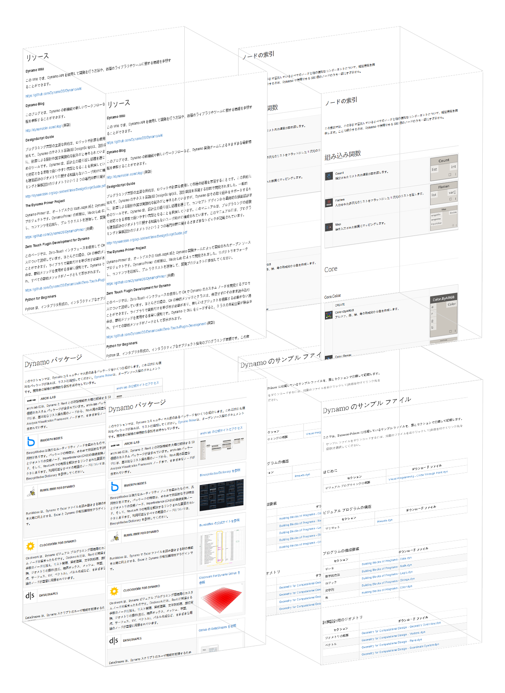

# 付録

このセクションでは、Dynamo の理解をさらに深めるための追加のリソースを紹介します。さらに、重要なノードの索引、便利なパッケージのコレクション、この手引で使用しているサンプル ファイルのリポジトリも記載します。他にも必要なリソースがあれば、このセクションに追加してください。[Dynamo Primer](https://github.com/DynamoDS/DynamoPrimer) は、オープン ソースのドキュメントです。

