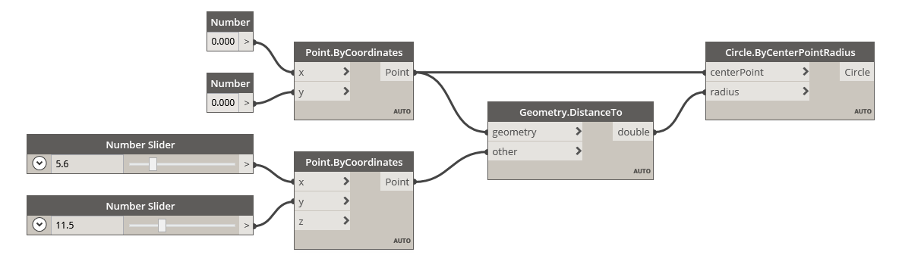

### 시각적 프로그래밍이란?

설계 중에는 설계 단계 간에 시각적 관계, 체계적 관계 또는 기하학적 관계를 설정하는 경우가 많습니다. 이러한 관계는 규칙에 따라 개념부터 결과까지 연결되는 워크플로우를 통해 개발되는 경우가 더 많습니다. 잘 모를 수도 있지만 알고리즘에 따라 작업하게 되면 입력, 처리 및 출력이라는 기본적인 논리를 따르는 단계별 작업 세트를 정의하게 됩니다. 프로그래밍을 사용하면 알고리즘을 공식화하면서 이러한 방식으로 계속 작업할 수 있습니다.

### 관련 알고리즘

강력한 기회를 제공하기도 하지만, **알고리즘**이라는 용어는 잘못된 개념을 제공할 수도 있습니다. 알고리즘이 예상치 못했거나 자연 그대로의 또는 멋진 결과를 생성할 수 있지만 마술은 아닙니다. 실제로 알고리즘 자체는 상당히 평범합니다. 종이학과 같은 실제적인 예를 사용해 보겠습니다. 먼저 정사각형 종이(입력)로 시작해서 일련의 접기 단계(처리 작업)를 거치면 학(출력)이 만들어집니다.


그렇다면 알고리즘은 어디에 있을까요? 알고리즘은 텍스트 또는 그래픽 방식으로 나타낼 수 있는 추상적 단계 세트입니다.

**텍스트 지침:**

1. 정사각형 단면 색종이로 시작합니다. 반을 접은 후 펼칩니다. 그런 다음, 다른 쪽으로 반을 접습니다.
2. 흰 면이 보이게 종이를 뒤집습니다. 종이를 반으로 접고, 잘 눌렀다가 펼친 후, 다시 반대 방향으로 접습니다.
3. 접힌 자국을 사용해서 모델의 위쪽 3개 구석을 아래쪽 구석으로 접습니다. 모델을 평평하게 만듭니다.
4. 위쪽 삼각형 날개를 중앙으로 접었다가 펼칩니다.
5. 모델의 위쪽을 아래쪽으로 접고 세게 눌러준 후 펼칩니다.
6. 모델의 맨 위쪽 날개를 펼치고 위쪽으로 가져오면서 모델 양쪽을 동시에 안쪽으로 눌러줍니다. 아래로 단단히 눌러줍니다.
7. 모델을 뒤집은 후 반대쪽에서 4~6단계를 반복합니다.
8. 앞쪽 날개를 중앙으로 접어줍니다.
9. 반대쪽에서 반복합니다.
10. 모델의 두 '다리'를 모두 위쪽으로 접은 후 단단히 눌렀다가 펼칩니다.
11. 방금 접은 자국을 따라 "다리"를 안으로 접어 넣습니다.
12. 한쪽 면을 안으로 접어 넣어 머리를 만든 후 날개를 아래로 접습니다.
13. 이제 학이 완성되었습니다.

**그래픽 지침:**


### 정의된 프로그래밍

이러한 지침 세트를 사용하면 학이 만들어지며, 자신의 방법을 따라 작업했다면 알고리즘을 적용했을 것입니다. 유일한 차이점은 해당 지침 세트의 공식화된 내용을 읽고 **프로그래밍**으로 이어지는 방식에 있습니다. 프로그래밍(*컴퓨터 프로그래밍*의 줄임말)은 일련의 동작 처리를 실행 프로그램으로 공식화하는 작업입니다. 학을 만드는 위의 지침을 컴퓨터가 읽고 실행할 수 있는 형식으로 전환하는 것이 바로 프로그래밍입니다.

프로그래밍 과정 중 직면하게 되는 첫 번째 장애물을 뛰어넘으려면 특정 형식의 추상화를 사용하여 컴퓨터와 효율적으로 소통해야 합니다. 이로 인해 JavaScript, Python 또는 C 등의 다양한 프로그래밍 언어 형식이 탄생했습니다. 종이학을 위한 지침과 같은 반복 가능한 지침 세트를 작성할 수 있으면 컴퓨터용으로 변환하기만 하면 됩니다. 우리는 컴퓨터에서 1개의 종이학을 접거나 각각 약간씩 다른 여러 개의 종이학을 접을 수 있도록 하려고 합니다. 컴퓨터에서는 지연이나 인적 오류 없이 지정되는 모든 작업 또는 작업 세트를 반복적으로 실행합니다. 이것이 프로그래밍의 힘이죠.

#### 정의된 시각적 프로그래밍

> 이 연습과 함께 제공되는 예시 파일([Visual Programming - Circle Through Point.dyn](datasets/1-1/Visual Programming - Circle Through Point.dyn))을 다운로드하십시오(마우스 오른쪽 버튼을 클릭하고 "다른 이름으로 링크 저장..."). 전체 예시 파일 리스트는 부록에서 확인할 수 있습니다.

종이학을 접기 위한 지침을 작성하는 업무를 맡게 된다면 어떻게 하시겠습니까? 그래픽, 텍스트 또는 이 둘을 모두 사용하시겠습니까?

위 질문에 대한 답에 그래픽이 포함된다면 **시각적 프로그래밍**이 적합할 것입니다. 프로그래밍 및 시각적 프로그래밍의 프로세스는 기본적으로 동일합니다. 이러한 프로그래밍에서는 동일한 공식화 프레임워크를 사용하지만, 우리는 그래픽(또는 "시각적") 사용자 인터페이스를 통해 프로그램의 명령 및 관계를 정의합니다. 구문에 따라 바인딩된 문자를 입력하는 대신, 미리 패키지된 노드를 함께 연결합니다. 다음은 노드 대 코드로 프로그래밍된 "점을 통과하는 원 그리기" 알고리즘을 비교한 것입니다.

**시각적 프로그램:**



**텍스트 프로그램:**

```
myPoint = Point.ByCoordinates(0.0,0.0,0.0);
x = 5.6;
y = 11.5;
attractorPoint = Point.ByCoordinates(x,y,0.0);
dist = myPoint.DistanceTo(attractorPoint);
myCircle = Circle.ByCenterPointRadius(myPoint,dist);
```

이 알고리즘의 결과는 다음과 같습니다.


진입 장벽을 낮추고 설계자에게 자주 정보를 제공할 수 있는 프로그래밍의 시각적 특성입니다. Dynamo는 시각적 프로그래밍 패러다임에 속하지만, 응용프로그램에서 텍스트 프로그래밍도 계속 사용할 수 있습니다. 이 내용은 나중에 살펴보겠습니다.

