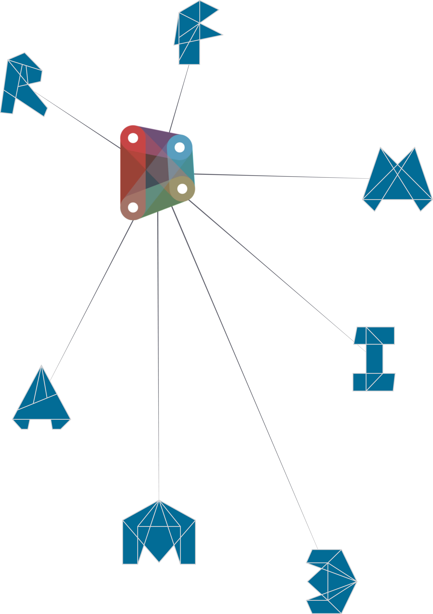

# 소개

Revit의 BIM(빌딩 정보 모델링)을 위한 애드온으로 시작한 Dynamo는 많은 발전을 거듭했습니다. 다른 무엇보다, Dynamo는 하나의 플랫폼으로 자리잡아 설계자는 시각적 프로그래밍을 탐색하고 문제를 해결하고 자체 도구를 만들 수 있도록 지원하고 있습니다. 몇 가지 컨텍스트를 설정하면서 Dynamo가 무엇인지, 그리고 어떻게 사용해야 하는지를 알아보는 과정을 시작해 보겠습니다.

