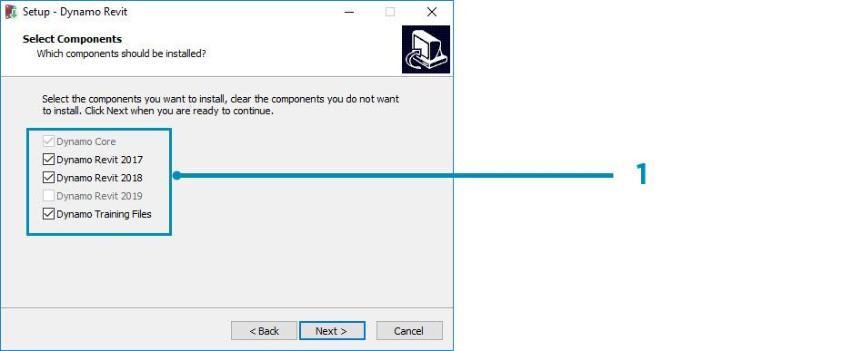
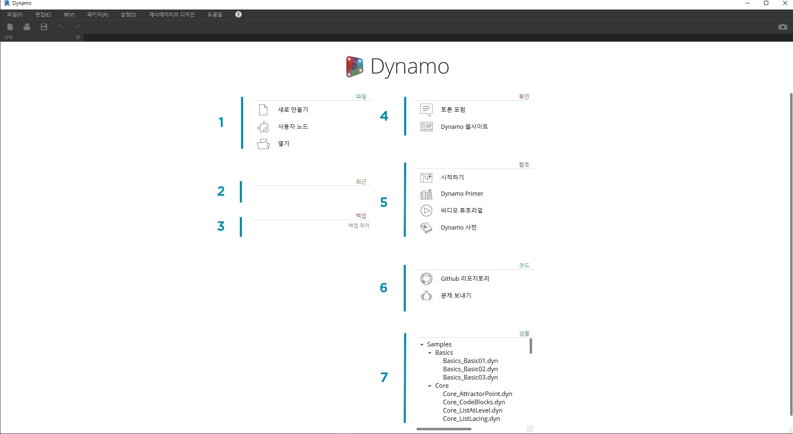
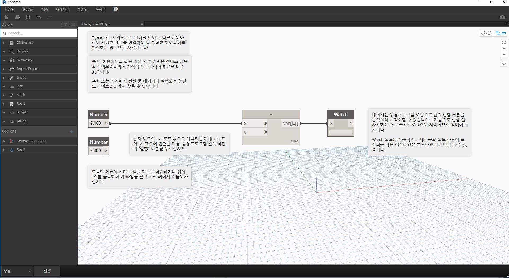

## Dynamo 설치 및 시작

Dynamo는 공식 버전과 시험판(즉 "일일 빌드" 버전) 모두에서 다운로드 가능한 설치 프로그램이 있는 오픈 소스 개발 프로젝트입니다. 공식 릴리즈를 다운로드하거나, 일일 빌드 또는 GitHub 프로젝트를 통해 Dynamo의 기능에 참여하십시오.

### 다운로드

정식 출시 버전의 Dynamo를 다운로드하려면 [Dynamo 웹 사이트](http://dynamobim.com/)를 방문하십시오. 홈페이지에서 클릭하여 바로 다운로드하거나 전용 다운로드 페이지로 이동합니다.

> 1. Dynamo for Architecture를 사용하는 계산 방식 설계에 대한 동영상을 시청합니다.
2. 또는 다운로드 페이지로 이동합니다.

여기에서 "최첨단" 개발 버전을 다운로드하거나 [Dynamo Github](https://github.com/DynamoDS/Dynamo) 프로젝트로 이동할 수 있습니다.

> 1. 공식 릴리즈 설치 프로그램을 다운로드합니다.
2. 일일 빌드 설치 프로그램을 다운로드합니다.
3. 개발자 커뮤니티에서 사용자 패키지를 확인합니다.
4. GitHub에서 Dynamo 개발에 참여합니다.

### 설치

다운로드한 설치 프로그램의 디렉토리로 이동한 후 실행 파일을 실행합니다. 설치 프로세스 중에 설치할 구성요소를 사용자화할 수 있습니다.

> 1. 설치할 구성요소를 선택합니다.

여기에서 Dynamo를 Revit과 같은 설치된 다른 응용프로그램에 연결하는 구성요소를 추가할지를 결정해야 합니다. Dynamo 플랫폼에 대한 자세한 내용은 **1.2장**을 참고하십시오.

### 실행

Dynamo를 시작하려면 \Program Files\Dynamo\Dynamo Revit\x.y로 이동한 후 DynamoSandbox.exe를 선택합니다. 이렇게 하면 독립 실행형 버전이 열리고 Dynamo의 *시작 페이지*가 표시됩니다. 이 페이지에 표준 메뉴와 도구막대가 표시되며 파일 기능에 액세스하거나 추가 리소스에 액세스할 수 있도록 바로 가기 모음도 제공됩니다.

> 1. 파일 - 새 파일 시작 또는 기존 파일을 엽니다.
2. 최근 - 최근 파일을 스크롤합니다.
3. 백업 - 백업에 액세스합니다.
4. 묻기 - 사용자 포럼 또는 Dynamo 웹 사이트에 바로 액세스합니다.
5. 참조 - 추가 학습 리소스를 자세히 살펴봅니다.
6. 코드 - 오픈 소스 개발 프로젝트에 참여합니다.
7. 샘플 - 설치와 함께 제공되는 예제를 확인합니다.

첫 번째 샘플 파일을 열어 첫 번째 작업공간을 열고 Dynamo가 제대로 작동하는지 확인합니다. 샘플 > 기본 > **Basics_Basic01.dyn**을 클릭합니다.

> 1. 실행 막대에 "자동"이 표시되는지 확인하거나 실행을 클릭합니다.
2. 지침에 따라 **Number** 노드를 **+** 노드에 연결합니다.
3. 이 Watch 노드에 결과가 표시되는지 확인합니다.

이 파일이 성공적으로 로드되면 Dynamo를 사용하여 첫 번째 시각적 프로그램을 실행할 수 있습니다.

