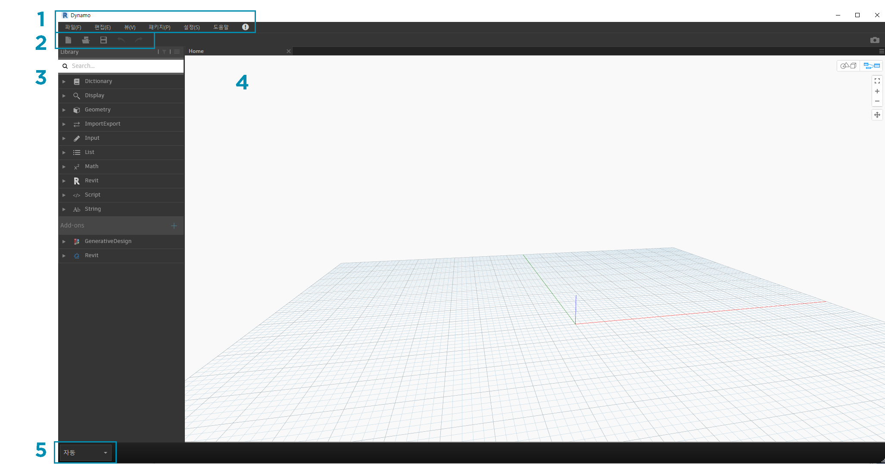
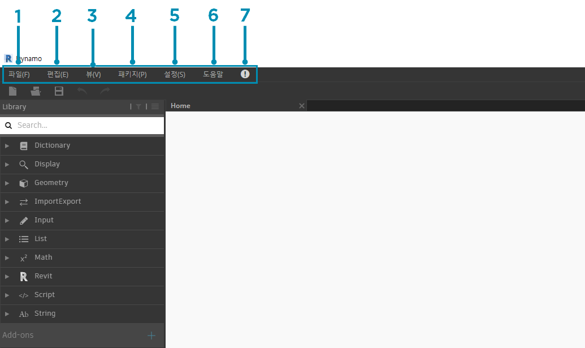
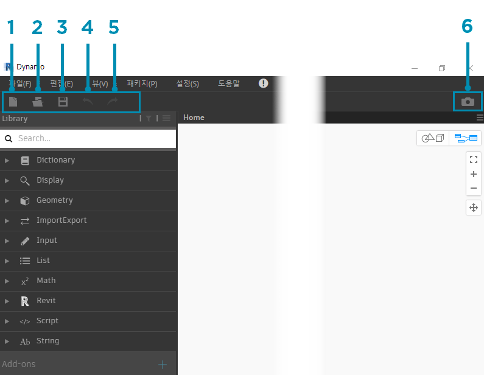
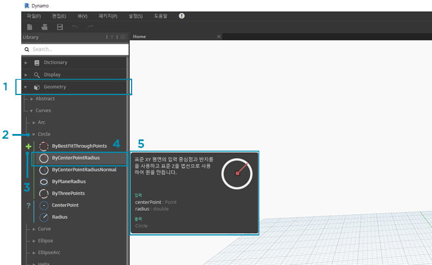
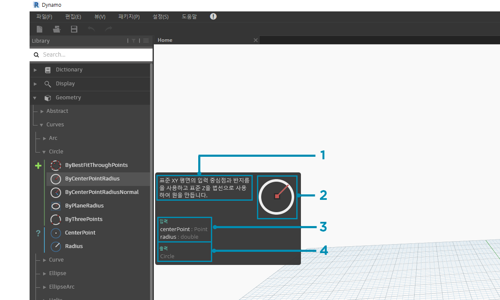
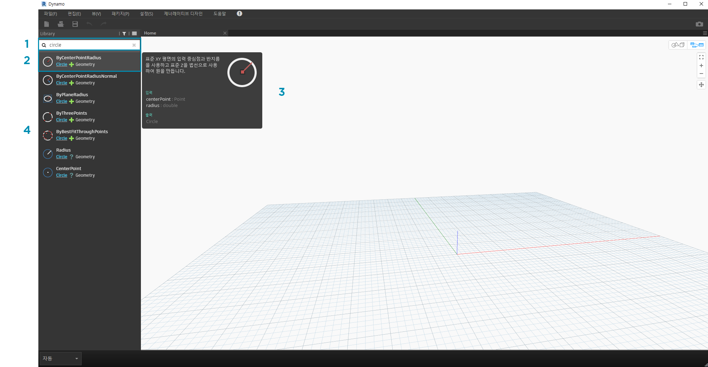
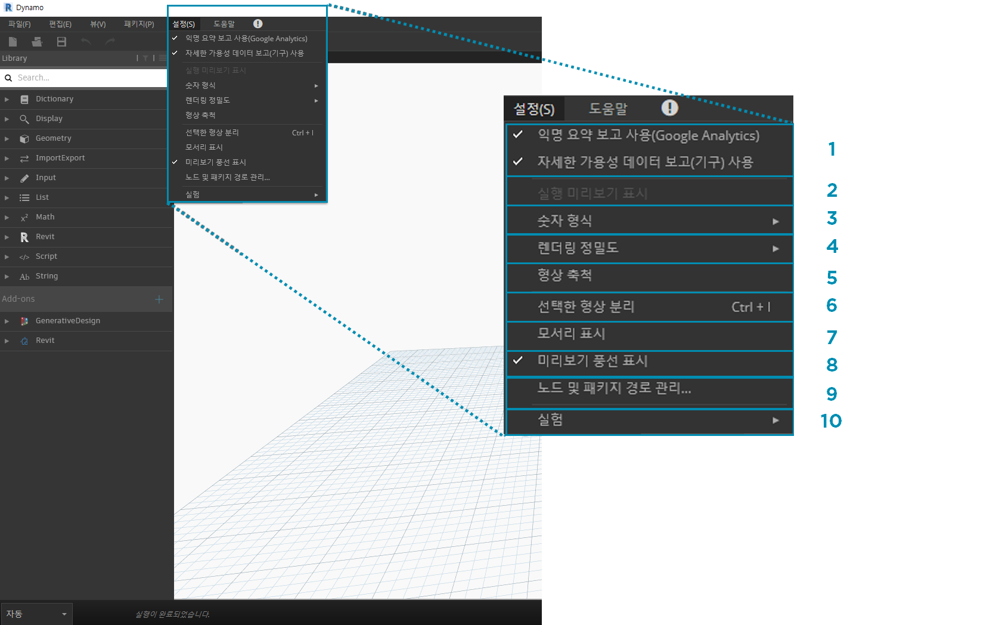
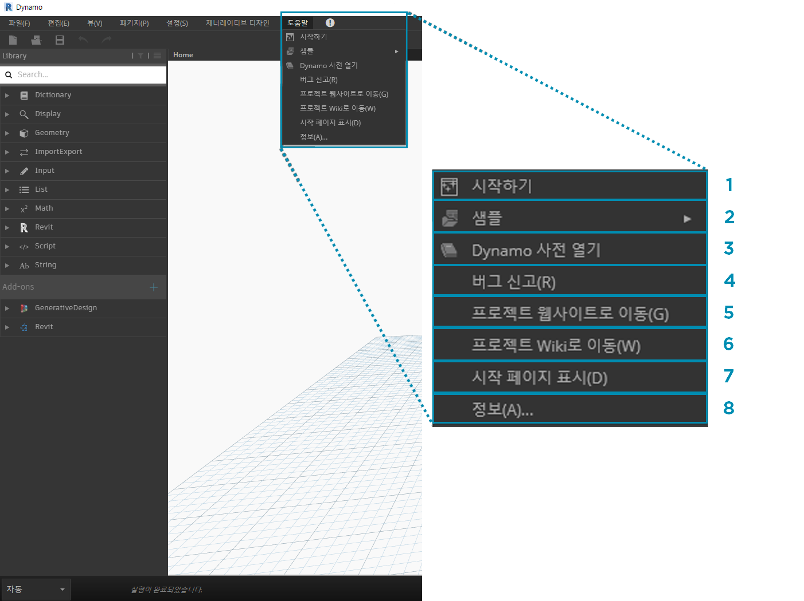

## Dynamo 사용자 인터페이스

Dynamo의 UI(사용자 인터페이스)는 다섯 개의 주요 영역으로 구성되어 있으며, 이중 가장 큰 영역은 비주얼 프로그램을 구성하는 작업공간입니다.

> 1. 메뉴
2. 도구막대
3. 도서관
4. 작업공간
5. 실행 막대

UI에 대해 자세히 알아보고 각 영역의 기능에 대해 살펴보겠습니다.

#### 메뉴

드롭다운 메뉴에서는 Dynamo 응용프로그램의 몇 가지 기본 기능을 찾을 수 있습니다. 대부분의 Windows 소프트웨어와 마찬가지로, 파일 관리와 관련된 동작과 선택 및 컨텐츠 편집을 위한 작업은 처음 두 개 메뉴에서 찾을 수 있습니다. 나머지 메뉴는 좀 더 Dynamo에 해당하는 항목입니다.

> 1. 파일
2. 편집
3. 뷰
4. 패키지
5. 설정
6. 도움말
7. 알림

#### 도구막대

Dynamo의 도구막대에는 파일 작업에 빠르게 액세스할 수 있는 일련의 버튼과 실행취소[Ctrl + Z] 및 재실행[Ctrl + Y] 명령이 포함되어 있습니다. 맨 오른쪽에는 작업공간의 스냅샷을 내보내는 또 다른 버튼이 있습니다. 이 버튼은 문서화 및 공유에 매우 유용합니다.

> 1. 새로 작성 - 새 .dyn 파일 작성
2. 열기 - 기존 .dyn(작업공간) 또는 .dyf(사용자 노드) 파일 열기
3. 저장/다른 이름으로 저장 - 활성 .dyn 또는 .dyf 파일 저장
4. 실행취소 - 마지막 작업 실행취소
5. 재실행 - 다음 작업 재실행
6. 작업공간을 이미지로 내보내기 - 표시되는 작업공간을 PNG 파일로 내보내기

#### 도서관

이 라이브러리에는 설치와 함께 제공되는 기본 노드뿐만 아니라 추가로 로드된 사용자 노드 또는 패키지까지 로드된 모든 노드가 포함되어 있습니다. 라이브러리의 노드는 노드에서 데이터를 **작성**하는지, **작업**을 실행하는지, 데이터를 **조회**하는지에 따라 라이브러리, 카테고리 및 하위 카테고리(해당되는 경우) 내에서 계층적으로 구성됩니다.

##### 찾아보기

기본적으로 **라이브러리**에는 8개의 노드 카테고리가 포함되어 있습니다. **코어** 및 **형상**은 가장 많은 노드 수를 포함하고 있으므로 찾아보기를 시작하기에 유용한 메뉴입니다. 이러한 카테고리를 훑어보면 작업공간에 추가할 수 있는 작업의 계층을 파악하고 이전에 사용해 본 적이 없는 새 노드를 빠르게 확인할 수 있습니다.

> 여기서는 노드의 기본 모음에 주안점을 두지만, 나중에 사용자 노드, 추가 라이브러리 및 Package Manager로 이 라이브러리를 확장할 예정입니다.

> 1. 사전
2. 화면표시
3. 지오메트리
4. ImportExport
5. 입력
6. 리스트
7. 일치 항목
8. Revit
9. 스크립트
10. 문자열
11. 애드온

메뉴를 클릭하여 라이브러리를 찾아봅니다. 형상 > 곡선 > 원을 클릭합니다. 표시되는 메뉴의 새 부분, 특히 **작성** 및 **조회** 레이블을 확인하십시오.

> 1. 도서관
2. 범주
3. 하위 카테고리: 작성/동작/조회
4. 노드
5. 노드 설명 및 특성 - 노드 아이콘 위로 마우스를 가져가면 나타납니다.

동일한 원 메뉴에서 **ByCenterPointRadius** 위로 마우스를 가져갑니다. 창에는 이름 및 아이콘 외에도 노드에 대한 자세한 정보가 표시됩니다. 이를 통해 노드에서 수행하는 작업, 입력에 필요한 항목, 출력으로 제공되는 항목을 쉽게 파악할 수 있습니다.

> 1. 설명 - 노드에 대한 일반 언어 설명
2. 아이콘 - 더 큰 버전의 라이브러리 메뉴 아이콘
3. 입력 - 이름, 데이터 유형 및 데이터 구조
4. 출력 - 데이터 유형 및 구조

##### 검색

작업공간에 추가할 노드의 상대적 특이성을 알고 있는 경우 **검색** 필드를 사용하는 것이 가장 유용합니다. 작업공간에서 설정을 편집하거나 값을 지정하지 않는 경우 이 필드에는 항상 커서가 있습니다. 입력을 시작하면 Dynamo 라이브러리에서는 선택한 최적 맞춤 일치 항목(Node 카테고리에서 해당 항목을 찾을 수 있는 경로 포함) 및 검색의 대체 일치 항목 리스트를 표시합니다. Enter 키를 누르거나 잘린 탐색기에서 항목을 클릭하면 강조 표시된 노드가 작업공간의 중심에 추가됩니다.

> 1. 검색 필드
2. 최적 맞춤 결과/선택
3. 대체 일치 항목

### 설정

형상부터 사용자 설정까지 이러한 옵션은 **설정** 메뉴에서 찾을 수 있습니다. 여기서 사용자 데이터의 공유를 선택하거나 선택하지 않아 Dynamo를 개선하고 응용프로그램의 소수점 정밀도와 형상 렌더링 품질을 정의할 수 있습니다.

> 1. 보고 사용 - 사용자 데이터를 공유하여 Dynamo를 개선하기 위한 옵션입니다.
2. 실행 미리보기 표시 - 그래프의 실행 상태를 미리 봅니다. 실행이 예약된 노드가 그래프에서 강조 표시됩니다.
3. 숫자 형식 옵션 - 소수점에 대한 문서 설정을 변경합니다.
4. 렌더링 정밀도 - 문서 렌더링 품질을 높이거나 낮춥니다.
5. 형상 축척 - 작업 중인 형상의 범위를 선택합니다.
6. 선택한 형상 분리 - 노드 선택을 기반으로 하여 배경 형상을 분리합니다.
7. 형상 모서리 표시/숨기기 - 3D 형상 모서리를 전환합니다.
8. 미리보기 풍선 표시/숨기기 - 노드 아래의 데이터 미리보기 풍선을 전환합니다.
9. 노드 및 패키지 경로 관리 - 파일 경로를 관리하여 노드와 패키지가 라이브러리에 표시되도록 합니다.
10. 실험적 기능 사용 - Dynamo의 새로운 베타 기능을 사용합니다.

### 도움말

문제가 있는 경우 **도움말** 메뉴를 확인해 보십시오. 여기에서 설치 시 함께 제공되는 샘플 파일을 찾아보고, 인터넷 브라우저를 통해 Dynamo 참조 웹 사이트 중 하나에 액세스할 수 있습니다. 필요한 경우 설치된 Dynamo의 버전을 확인하고 **정보** 옵션을 통해 해당 버전이 최신 버전인지 확인하십시오.

> 1. 시작하기 - Dynamo 사용에 대한 간략한 소개입니다.
2. 샘플 - 참조 예시 파일입니다.
3. Dynamo 사전 열기 - 모든 노드에 대한 문서가 포함된 리소스입니다.
4. 버그 보고 - GitHub에서 문제를 엽니다.
5. 프로젝트 웹 사이트로 이동 - GitHub에서 Dynamo 프로젝트를 봅니다.
6. 프로젝트 Wiki로 이동 - Dynamo API, 지원 라이브러리 및 도구를 사용한 개발 방법에 대해 알아보기 위해 Wiki를 방문합니다.
7. 시작 페이지 표시 - 문서 내에 있는 경우 Dynamo 시작 페이지로 돌아갑니다.
8. 정보 - Dynamo 버전 데이터입니다.

