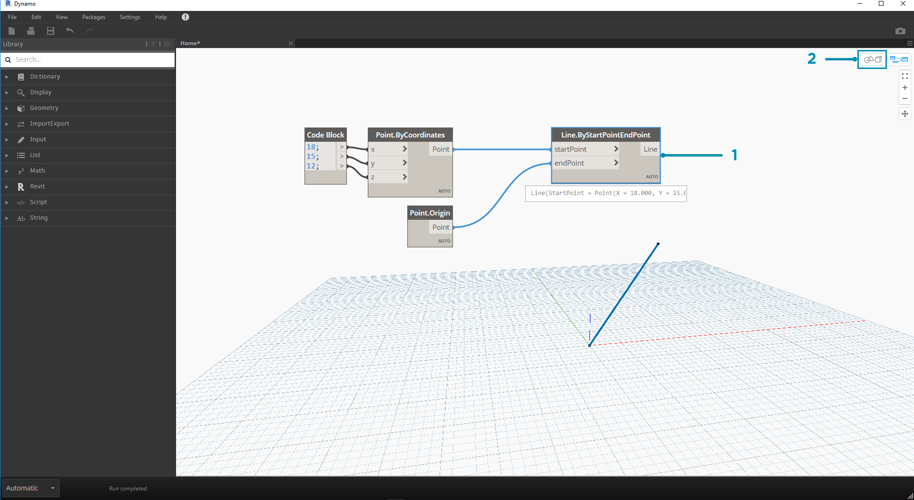
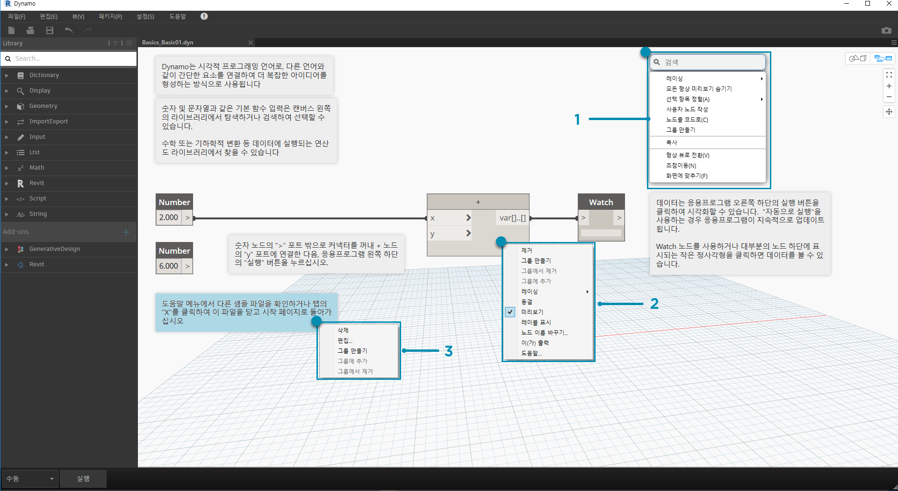
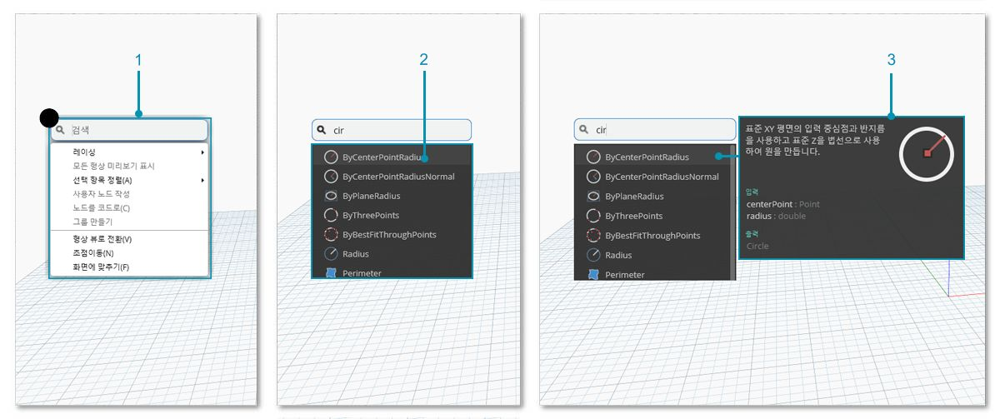

## 작업공간

Dynamo **작업공간**에서는 시각적 프로그램을 개발할 뿐만 아니라, 결과 형상을 미리 볼 수도 있습니다. 홈 작업공간에서 작업 중이든 사용자 노드에서 작업 중이든 마우스 또는 상단 오른쪽에 있는 버튼을 사용하여 탐색할 수 있습니다. 오른쪽 하단에서 모드 간에 전환하면 탐색하는 미리보기가 전환됩니다.

> 주: 노드 및 형상에는 그리기 순서가 있으므로 객체가 서로의 위에 렌더링될 수 있습니다. 여러 노드를 순서대로 추가하면 작업공간에서 같은 위치에 렌더링될 수 있기 때문에 혼동이 유발될 수도 있습니다.

> 1. 탭
2. 줌/초점이동 버튼
3. 미리보기 모드
4. 작업공간을 두 번 클릭

### 탭

활성 작업공간 탭에서는 프로그램을 탐색하고 편집할 수 있습니다. 새 파일을 열면 기본적으로 새 **홈** 작업공간이 열립니다. 노드가 선택될 때 파일 메뉴 또는 마우스 오른쪽 버튼을 클릭하면 표시되는 **선택 항목으로 새 노드 작성** 옵션을 통해 새 *사용자 노드* 작업공간을 열 수도 있습니다(이 기능은 자세히 살펴볼 예정).

> 주: 홈 작업공간은 한 번에 하나만 열 수 있지만, 추가 탭에 여러 개의 사용자 노드 작업공간을 열어 둘 수 있습니다.

### 그래프 및 3D 미리보기 탐색 비교

Dynamo에서 그래프 및 그래프의 3D 결과(형상을 작성 중인 경우)는 모두 작업공간에서 렌더링됩니다. 기본적으로 그래프는 활성 미리보기이므로 탐색 버튼이나 마우스 가운데 버튼을 사용하여 초점이동 및 줌을 수행하면 그래프를 전체적으로 살펴볼 수 있습니다. 다음과 같은 3가지 방법으로 활성 미리보기 간에 전환할 수 있습니다.

> 1. 작업공간의 미리보기 전환 버튼
2. 작업공간을 마우스 오른쪽 버튼으로 클릭하고 *... 뷰로 전환* 선택
3. 키보드 바로 가기(Ctrl+B)

3D 미리보기 탐색 모드에서도 **시작하기**에서 예로 제공된 점의 [직접 조작](http://primer.dynamobim.org/02_Hello-Dynamo/2-6_the_quick_start_guide.html) 기능을 제공합니다.

### 줌하여 중심 재설정

3D 미리보기 탐색 모드에서는 모델을 쉽게 자유로이 초점이동, 줌 및 회전할 수 있습니다. 그러나 형상 노드에서 작성한 객체를 특별히 줌하려면 하나의 노드를 선택한 상태에서 전체 줌 아이콘을 사용하면 됩니다.

> 1. 뷰의 중심에 오는 형상에 해당하는 노드를 선택합니다.
2. 3D 미리보기 탐색으로 전환합니다.

> 1. 오른쪽 상단의 전체 줌 아이콘을 클릭합니다.
2. 선택한 형상은 뷰 내 중앙에 배치됩니다.

### 마우스 옵션

활성 상태인 미리보기 모드에 따라, 마우스 버튼이 다르게 작동합니다. 일반적으로 마우스 왼쪽 버튼을 클릭하면 입력이 선택 및 지정되고, 마우스 오른쪽 버튼을 클릭하면 옵션에 액세스하게 되며, 마우스 가운데 버튼을 클릭하면 작업공간을 탐색할 수 있습니다. 마우스 오른쪽 버튼을 클릭하면 클릭한 위치의 컨텍스트에 따라 옵션이 표시됩니다.

> 1. 작업공간을 마우스 오른쪽 버튼으로 클릭합니다.
2. 노드를 마우스 오른쪽 버튼으로 클릭합니다.
3. 메모를 마우스 오른쪽 버튼으로 클릭합니다.

다음은 미리보기별 마우스 상호 작용 테이블입니다.

|**마우스 동작**|**그래프 미리보기**|**3D 미리보기**|
| -- | -- | -- |
|마우스 왼쪽 버튼 클릭|선택|해당 사항 없음|
|마우스 오른쪽 버튼 클릭|상황에 맞는 메뉴|줌 옵션|
|마우스 가운데 버튼 클릭|초점이동|초점이동|
|스크롤|줌 확대/축소|줌 확대/축소|
|두 번 클릭|코드 블록 작성|해당 사항 없음|

### 캔버스 내 검색

"캔버스 내 검색"을 사용하면 그래프의 사용자 위치에서 벗어나지 않아도 노드 설명 및 툴팁에 액세스할 수 있으므로 Dynamo 워크플로우 속도가 증가합니다. 마우스 오른쪽 버튼을 클릭하기만 하면 캔버스에서 작업 중인 모든 위치에서 "라이브러리 검색"의 모든 유용한 기능에 액세스할 수 있습니다.

> 1. 캔버스에서 아무 곳이나 마우스 오른쪽 버튼으로 클릭하여 검색 기능을 표시합니다. 검색 막대가 비어 있으면 드롭다운에 미리보기 메뉴가 표시됩니다.
2. 검색 막대에 검색어를 입력하는 동안 드롭다운 메뉴가 가장 관련성 높은 검색 결과를 표시하도록 계속 업데이트됩니다.
3. 검색 결과 위로 마우스를 가져가면 해당 설명 및 툴팁이 표시됩니다.

## 노드 레이아웃 정리

파일이 복잡하게 작성됨에 따라 Dynamo 캔버스를 정리된 상태로 유지하는 것이 점점 중요해지고 있습니다. **선택 항목 정렬** 도구는 소수의 선택된 노드하고만 작동하지만, Dynamo에서는 전체 파일 정리를 지원하는 **노드 배치 정리** 도구도 제공합니다.

#### 노드 정리 전

> 1. 자동으로 구성할 노드를 선택하거나 모두 선택하지 않은 상태로 두어 파일의 모든 노드를 정리합니다.
2. 노드 배치 정리 기능은 편집 탭 아래에 있습니다.
#### 노드 정리 후

3. 엇갈리게 배열되거나 겹쳐져 있는 노드가 정리되고 인접한 노드에 맞춰 정렬되면서 노드가 자동으로 재분산 및 정렬됩니다.

