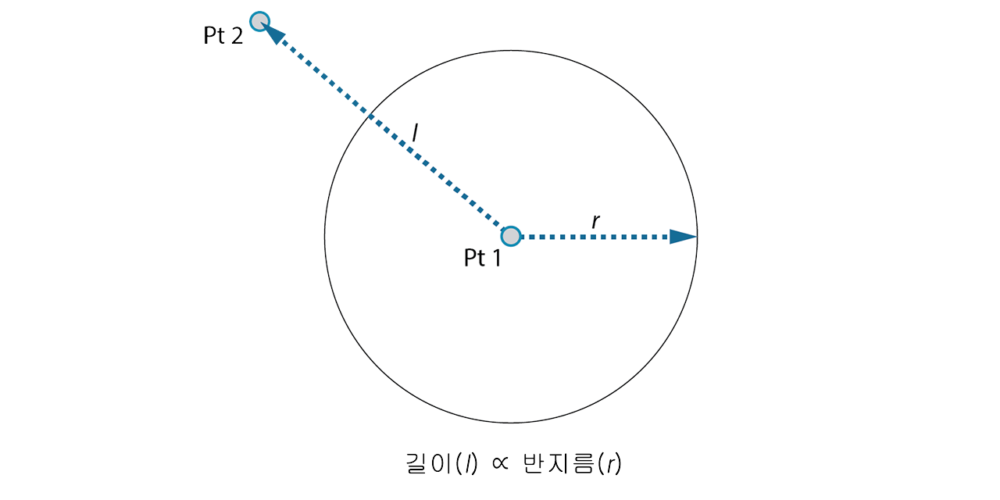
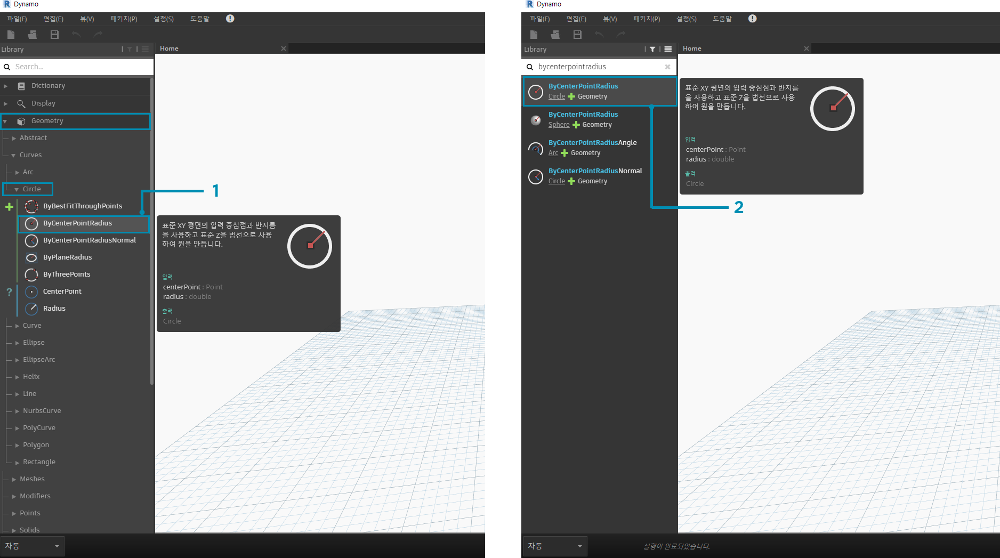
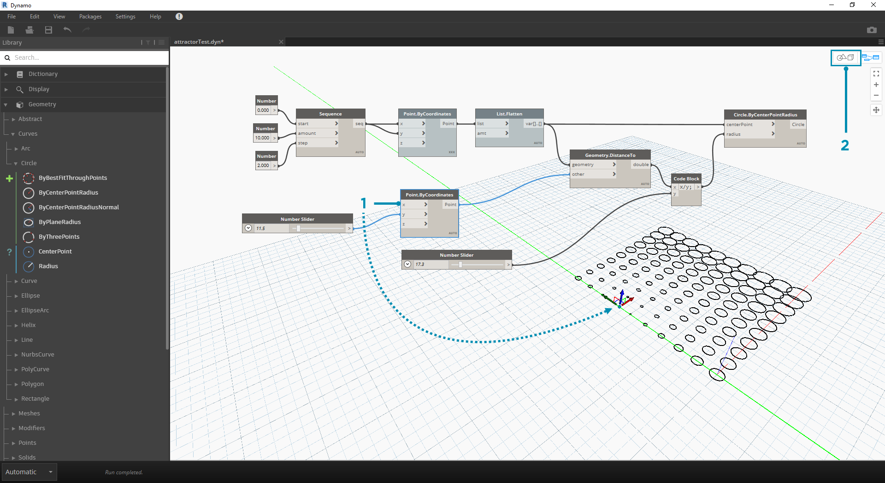

## 시작하기

인터페이스 배치 및 작업공간 탐색 방법을 숙지했으므로 이제 Dynamo에서 그래프를 개발하기 위한 일반적인 워크플로우를 살펴보겠습니다. 먼저 동적으로 크기가 조정되는 원을 작성한 다음, 다양한 반지름을 가진 원의 배열을 작성해 보겠습니다.

### 목표 및 관계 정의하기

Dynamo 작업공간에 추가하기 전에 달성하려는 목표와 어떤 중요한 관계를 설정할지를 명확히 파악하는 것이 중요합니다. 두 노드를 연결할 때는 항상 두 노드 사이에 명시적인 링크를 작성합니다. 데이터의 흐름은 나중에 변경할 수 있지만 일단 연결되고 나면 해당 관계가 확정됩니다. 이 연습에서는 반지름 입력이 근처 점까지의 거리(*관계*)로 정의되는 원(*목표*)을 작성하려고 합니다.



> 거리 기반 관계를 정의하는 점을 일반적으로 “어트랙터”라고 합니다. 여기서 어트랙터 점까지의 거리가 원의 크기를 지정하는 데 사용됩니다.

### 작업공간에 노드 추가하기

목표와 관계를 스케치했으므로 그래프 작성을 시작할 수 있습니다. Dynamo에서 실행할 작업의 순서를 나타내는 노드가 필요합니다. 원을 작성하려고 하므로 먼저 이러한 작업을 수행하는 노드를 찾아보겠습니다. 검색 필드를 사용하거나 라이브러리를 훑어보면 원을 작성하는 방법이 두 가지 이상 있다는 사실을 알게 됩니다.



> 1. 형상 > 곡선 > 원 > **Circle.ByPointRadius**로 이동
2. 검색 > "ByCenterPointRadius..."

라이브러리에서 클릭하여 **Circle.ByPointRadius** 노드를 작업공간에 추가하겠습니다. 이렇게 하면 작업공간의 중심에 해당 노드가 추가됩니다.


> 1. 라이브러리의 Circle.ByPointandRadius 노드
2. 라이브러리에서 노드를 클릭하면 해당 노드가 작업공간에 추가됨

또한 **Point.ByCoordinates**, **Number Input** 및 **Number Slider** 노드도 필요합니다.


> 1. 형상 > 점 > 점 > **Point.ByCoordinates**
2. 형상 > 형상 > **DistanceTo**
3. 입력 > 기본 > **Number**
4. 입력 > 기본 > **Number Slider**

### 와이어로 노드 연결하기

몇 개의 노드가 있으므로 노드의 포트를 와이어로 연결해야 합니다. 이러한 연결은 데이터의 흐름을 정의합니다.


> 1. **Number** - **Point.ByCoordinates**
2. **Number Slider** - **Point.ByCoordinates**
3. **Point.ByCoordinates**(2) - **DistanceTo**
4. **Point.ByCoordinates** - **DistanceTo** - **Circle.ByCenterPointRadius**

### 프로그램 실행하기

프로그램 흐름이 정의되었으므로 Dynamo에 프로그램을 실행하도록 지시하기만 하면 됩니다. 프로그램이 자동으로 또는 수동 모드에서 실행을 클릭하여 실행되면 데이터가 와이어를 통과하게 되며 3D 미리보기에서 결과를 확인할 수 있습니다.


> 1. (실행 클릭) - 실행 막대가 수동 모드인 경우 실행을 클릭하여 그래프를 실행해야 합니다.
2. 노드 미리보기 - 노드의 오른쪽 하단에 있는 상자 위로 마우스를 가져가면 결과 팝업이 표시됩니다.
3. 3D 미리보기 - 노드에서 형상을 작성하면 3D 미리보기에서 확인할 수 있습니다.
4. 작성 노드의 출력 형상입니다.

### 상세 정보 추가하기

프로그램이 작동 중인 경우 어트랙터 점을 통과하는 원이 3D 미리보기에 표시됩니다. 만족스러운 결과이지만, 상세 정보와 컨트롤을 더 추가할 수도 있습니다. 반지름에 미치는 영향을 교정할 수 있도록 원 노드에 대한 입력을 조정해 보겠습니다. 다른 **Number Slider**를 작업공간에 추가한 다음, 작업공간의 빈 영역을 두 번 클릭하여 **Code Block** 노드를 추가합니다. Code Block에서 필드를 편집하고 ```X/Y```를 지정합니다.


> 1. **Code Block**
2. **DistanceTo** 및 **Number Slider** - **Code Block**
3. **Code Block** - **Circle.ByCenterPointRadius**

### 복잡성 더하기

단순하게 시작해서 복잡성을 더하는 것은 프로그램을 점진적으로 개발하는 효과적인 방법입니다. 프로그램이 원 1개에 작동하면 2개 이상의 원에 프로그램의 기능을 적용해 보겠습니다. 1개의 중심점 대신, 점 그리드를 사용하고 결과 데이터 구조에서 변경 사항을 적용하면 프로그램에서는 이제 각각 어트랙터 점까지의 교정된 거리로 정의되는 고유한 반지름 값을 갖는 원을 많이 작성합니다.


> 1. **Number Sequence** 노드를 추가하고 **Point.ByCoordinates**의 입력을 대치합니다. Point.ByCoordinates를 마우스 오른쪽 버튼으로 클릭하고 레이싱 > 교차 참조를 선택합니다.
2. Point.ByCoordinates 다음으로 **Flatten** 노드를 추가합니다. 리스트를 완전히 단순화하려면 ```amt``` 입력을 기본값인 ```-1```로 둡니다.
3. 3D 미리보기가 원의 그리드로 업데이트됩니다.

### 직접 조작으로 조정하기

숫자 조작이 적절한 방법이 아닌 경우도 있습니다. 이제 배경 3D 미리보기에서 탐색할 때 점 형상을 수동으로 밀어 넣고 끌어올 수 있습니다. 또한 점으로 구성된 다른 형상을 제어할 수도 있습니다. 예를 들어, **Sphere.ByCenterPointRadius**는 직접 조작도 수행할 수 있습니다. **Point.ByCoordinates**로 일련의 X, Y 및 Z 값에서 점의 위치를 제어할 수 있습니다. 그러나 직접 조작 방법을 사용하면 **3D 미리보기 탐색** 모드에서 점을 수동으로 이동하여 슬라이더 값을 업데이트할 수 있습니다. 이렇게 하면 점의 위치를 식별하는 개별 값 세트를 보다 간단하게 제어할 수 있습니다.



> 1. **직접 조작**을 사용하려면 이동할 점의 패널을 선택합니다. 그러면 선택한 점 위에 화살표가 나타납니다.
2. **3D 미리보기 탐색** 모드로 전환합니다.


> 1. 점 위로 마우스를 가져가면 X, Y 및 Z축이 나타납니다.
2. 색상 화살표를 클릭하고 끌어 해당 축을 이동하면 **Number Slider** 값이 수동으로 이동한 점으로 실시간 업데이트됩니다.


> 1. **직접 조작** 이전에는 하나의 슬라이더만 **Point.ByCoordinates** 구성요소에 연결되어 있었습니다. 점을 X 방향으로 수동으로 이동하면 Dynamo에서는 X 입력에 대해 새 **Number Slider**를 자동으로 생성합니다.

