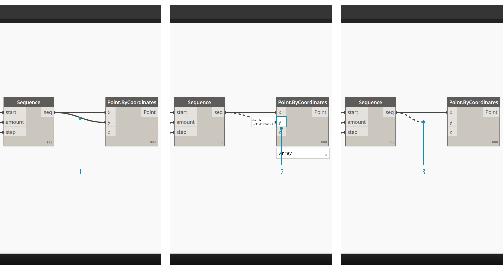

## 와이어

와이어는 노드 간에 연결되어 관계를 생성하고 시각적 프로그램의 흐름을 구성합니다. 문자 그대로 한 객체에서 다음 객체로 데이터 펄스를 운반하는 전기 와이어로 간주할 수 있습니다.

### 프로그램 흐름

와이어는 한 노드의 출력 포트를 다른 노드의 입력 포트에 연결합니다. 이 방향이 시각적 프로그램의 **데이터 흐름**을 설정합니다. 작업공간에서 원하는 대로 노드를 정렬할 수 있지만, 출력 포트가 노드의 오른쪽에 있고 입력 포트가 왼쪽에 있어 일반적으로 프로그램 흐름이 왼쪽에서 오른쪽으로 이동한다고 말할 수 있습니다.


### 와이어 작성

포트를 마우스 왼쪽 버튼으로 클릭한 다음, 다른 노드의 포트를 마우스 왼쪽 버튼으로 클릭하여 연결을 작성함으로써 와이어를 생성합니다. 연결 중에는 와이어가 점선으로 표시되며 성공적으로 연결되면 스냅되어 실선이 됩니다. 데이터는 항상 출력에서 입력으로 이 와이어를 따라 흐르지만, 연결된 포트를 클릭하는 순서에 따라 어떤 방향으로도 와이어를 만들 수 있습니다.

> 팁: 두 번째 클릭으로 연결을 완료하기 전에 와이어가 포트에 스냅되도록 한 다음, 마우스를 올려 놓아 포트 툴팁을 표시합니다.


> 1. Number Sequence 노드의 ```seq``` 출력 포트를 클릭합니다.
2. 다른 포트를 마우스 커서를 이동할 때 와이어는 점선으로 표시됩니다.
3. Point.ByCoordinates의 ```y``` 입력 포트를 클릭하여 연결을 완료합니다.

### 와이어 편집

시각적 프로그램에서 와이어로 표시된 연결을 편집하여 프로그램 흐름을 자주 조정하게 됩니다. 와이어를 편집하려면 이미 연결된 노드의 입력 포트를 마우스 왼쪽 버튼으로 클릭합니다. 다음 두 가지 옵션을 사용할 수 있습니다.



> 1. 기존 와이어입니다.
2. 입력 포트로의 연결을 변경하려면 다른 입력 포트를 마우스 왼쪽 버튼으로 클릭합니다.
3. 와이어를 제거하려면 와이어를 바깥쪽으로 당긴 다음, 작업공간을 마우스 왼쪽 버튼으로 클릭합니다

*참고 - 이제 여러 와이어를 동시에 이동하는 추가 기능을 사용할 수 있습니다. 이 내용은 [http://dynamobim.org/dynamo-1-3-release/](http://dynamobim.org/dynamo-1-3-release/)에서 다룹니다.

### 와이어 미리보기

기본적으로 와이어는 회색 스트로크로 미리 표시됩니다. 노드가 선택되면 연결 와이어는 노드와 동일한 청록색 하이라이트가 표시됩니다.


> 1. 기본 와이어
2. 강조 표시된 와이어

Dynamo에서는 뷰 > 커넥터 메뉴를 사용해 작업공간에서 와이어가 표시되는 방식도 사용자화할 수 있습니다. 여기서는 곡선 또는 폴리선 와이어 간을 전환하거나 한꺼번에 해제할 수 있습니다.


> 1. 커넥터 유형: 곡선
2. 커넥터 유형: 폴리선

