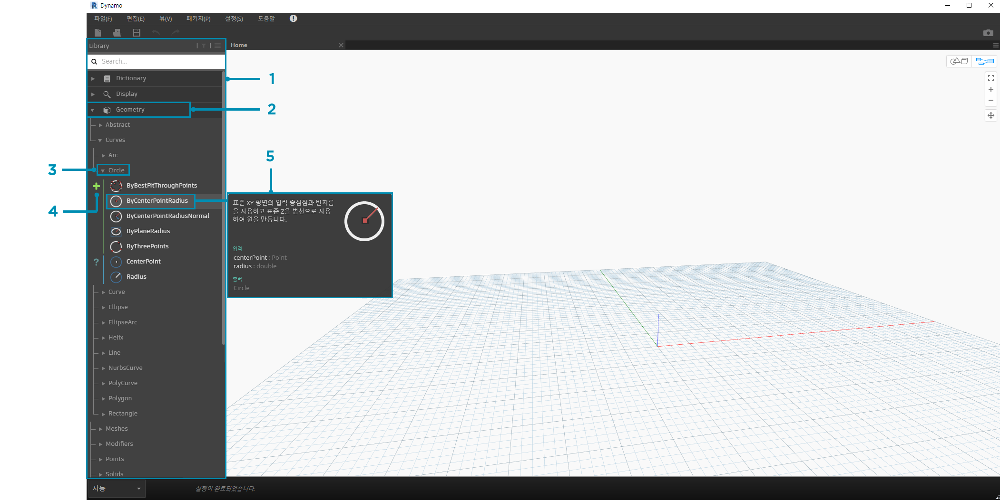
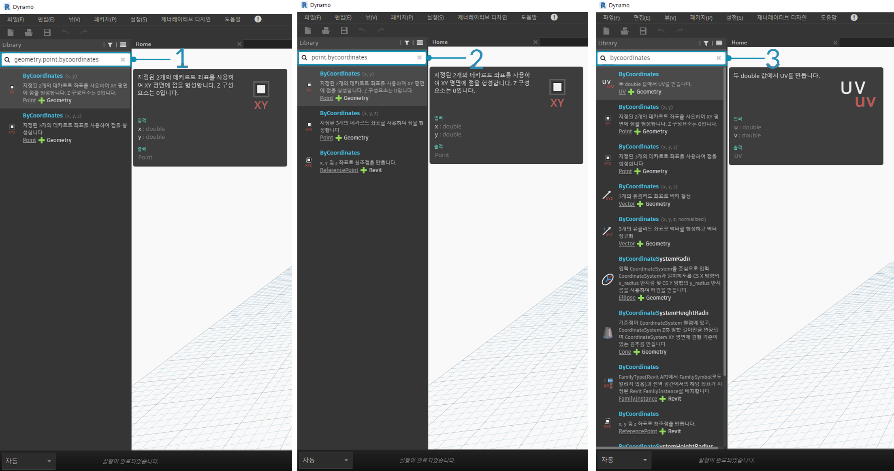

## Dynamo 라이브러리

**Dynamo 라이브러리**에는 실행할 시각적 프로그램을 정의하기 위해 작업공간에 추가하는 노드가 포함되어 있습니다. 라이브러리에서 노드를 검색하거나 찾아볼 수 있습니다. 여기에 포함된 노드(설치된 기본 노드, 정의하는 사용자 노드 및 Dynamo에 추가하는 Package Manager의 노드)는 카테고리를 기준으로 계층적으로 구성됩니다. 이 구성을 검토하고 자주 사용하게 될 주요 노드에 대해 알아보겠습니다.

### 라이브러리의 라이브러리

응용프로그램에서 접하게 되는 Dynamo **라이브러리**는 사실 각각 카테고리별로 그룹화된 노드를 포함하는 함수 라이브러리의 모음입니다. 처음에는 명확하지 않을 수 있지만, 이는 Dynamo의 기본 설치와 함께 제공되는 노드를 구성하기 위한 유연한 프레임워크이며 사용자 노드 및 추가 패키지로 이 기본 기능을 확장하기 시작하면 앞으로 더 개선될 것입니다.

#### 조직 체계

Dynamo UI의 **라이브러리** 섹션은 계층적으로 구성된 라이브러리로 이루어집니다. 라이브러리로 드릴다운하면 라이브러리, 라이브러리의 카테고리 및 카테고리의 하위 카테고리를 순차적으로 검색하면서 노드를 찾을 수 있습니다.



> 1. 라이브러리 - Dynamo 인터페이스의 영역
2. 라이브러리 - 관련 카테고리의 모음(**형상**)
3. 카테고리 - 관련 노드의 모음(예: **원**과 관련된 모든 항목)
4. 하위 카테고리 - 일반적으로 **작성**, **작업** 또는 **조회**에 따른 카테고리 내 노드 분류
5. 노드 - 작업을 수행하기 위해 작업공간에 추가되는 객체

#### 명명 규칙

각 라이브러리의 계층은 작업공간에 추가된 노드의 이름에 반영되며, 검색 필드에서 사용하거나 Code Block(*Dynamo 텍스트 언어* 사용)과 함께 사용할 수도 있습니다. 키워드를 사용하여 노드를 찾을 수 있으며, 계층을 점으로 구분하여 입력할 수도 있습니다.

라이브러리 계층에 있는 노드 위치의 서로 다른 부분을 ```library.category.nodeName``` 형식으로 입력하면 다음과 같이 서로 다른 결과가 반환됩니다.



> 1. ```library.category.nodeName```
2. ```category.nodeName```
3. ```nodeName``` 또는 ```keyword```

일반적으로 작업공간에서 노드의 이름은 ```category.nodeName``` 형식으로 렌더링됩니다. 단, Input 및 View 카테고리에는 특히 몇 가지 중요한 예외가 있습니다. 유사한 이름의 노드에 유의하고 카테고리 차이를 기록해 두십시오.


> 1. 대부분 라이브러리의 노드에는 카테고리 형식이 포함됩니다.
2. ```Point.ByCoordinates``` 및 ```UV.ByCoordinates```는 이름은 같지만 출처 카테고리는 서로 다릅니다.
3. 중요한 예외에는 내장된 함수, Core.Input, Core.View 및 연산자가 포함됩니다.

### 자주 사용하는 노드

Dynamo의 기본 설치에는 수백 가지의 노드가 포함되어 있습니다. 이 중에서 시각적 프로그램 개발에 필수적인 노드는 무엇일까요? 프로그램의 매개변수(**Input**)를 정의할 수 있도록 하는 노드를 집중적으로 살펴보고, 노드 작업(**Watch**) 결과를 확인하고, 바로 가기(**Code Block**)를 통해 입력 또는 기능을 정의해 보겠습니다.

#### 입력

Input 노드는 시각적 프로그램의 사용자(자신 또는 다른 사용자)가 핵심 매개변수를 사용하기 위한 주요 수단입니다. 다음은 Core 라이브러리의 Input 카테고리에서 사용할 수 있는 노드입니다.


> 1. 부울
2. 번호
3. 문자열
4. 번호 슬라이더
5. 정수 슬라이더
6. 디렉토리 경로
7. 파일 경로

#### Watch

Watch 노드는 시각적 프로그램을 통해 흐르는 데이터를 관리하는 데 필수적입니다. 노드 데이터 미리보기를 통해 노드의 결과를 볼 수 있지만, **Watch** 노드에 결과를 계속 표시하거나 **Watch3D** 노드를 통해 형상 결과를 볼 수도 있습니다. 이러한 두 노드는 Core 라이브러리의 View 카테고리에 있습니다.

> 팁: 시각적 프로그램에 많은 노드가 포함된 경우 3D 미리보기가 혼란스러운 경우가 있을 수 있습니다. 설정 메뉴에서 배경 미리보기 표시 옵션의 선택을 취소하고 Watch3D 노드를 사용하여 형상을 미리 보는 방법을 고려하십시오.


> 1. Watch - Watch 노드에서 항목을 선택하면 Watch3D 및 3D 미리보기에서 태그가 지정됩니다.
2. Watch3D - 오른쪽 하단 그립을 잡아 3D 미리보기에서와 같은 방법으로 크기를 조정하고 마우스로 탐색합니다.

#### Code Block

**Code Block** 노드는 줄을 세미콜론으로 구분하여 코드 블록을 정의하는 데 사용할 수 있습니다. 이 노드는 ```X/Y```만큼 간단할 수 있습니다. Code Block을 숫자 입력 정의에 대한 바로 가기나 다른 노드 기능에 대한 호출로 사용할 수도 있습니다. 이렇게 하기 위한 구문은 Dynamo 텍스트 언어 DesignScript의 명명 규칙을 따르며, 섹션 7.2에 설명되어 있습니다. 다음과 같은 바로 가기를 사용하여 원을 만들어 보십시오.


> 1. 두 번 클릭하여 **Code Block** 노드를 작성합니다.
2. ```Circle.ByCenterPointRadius(x,y);```를 입력합니다.
3. 작업공간을 클릭하여 선택을 취소하면 ```x``` 및 ```y``` 입력이 자동으로 추가됩니다.
4. **Point.ByCoordinates** 노드와 **Number Slider**를 작성한 다음, Code Block의 입력에 연결합니다.
5. 시각적 프로그램을 실행한 결과는 3D 미리보기에서 원으로 표시됩니다.

