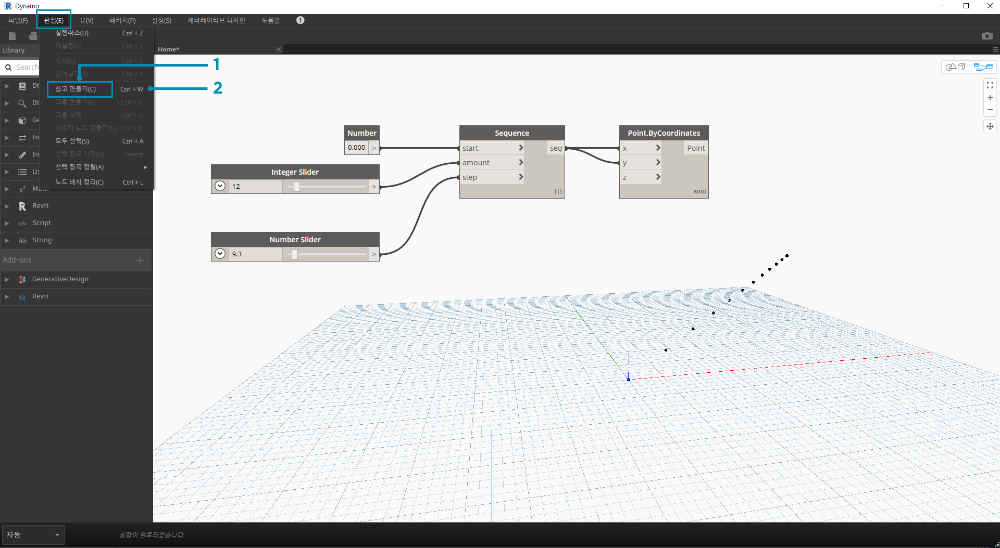

## 프로그램 관리

시각적 프로그래밍 프로세스 내에서 작업하는 것은 유용한 크리에이티브 활동일 수 있지만, 작업공간의 복잡성 및/또는 배치 때문에 프로그램 흐름과 핵심 사용자 입력이 빠르게 가려질 수 있습니다. 프로그램 관리를 위한 몇 가지 모범 사례를 살펴보겠습니다.

### 정렬

작업공간에 여러 개의 노드를 추가했으면 명확성을 위해 노드의 배치를 재구성하려고 할 수 있습니다. 둘 이상의 노드를 선택하고 작업공간을 마우스 오른쪽 버튼으로 클릭하면 팝업 창에는 X 및 Y에 맞춤 및 분배 옵션이 있는 **선택 항목 정렬** 메뉴가 표시됩니다.

> 1. 둘 이상의 노드를 선택합니다.
2. 작업공간을 마우스 오른쪽 버튼으로 클릭합니다.
3. **선택 항목 정렬** 옵션을 사용합니다.

### 주

일부 환경에서는 노드 이름을 검토하고 프로그램 흐름에 따라 시각적 프로그램을 "읽을 수" 있습니다. 다양한 경험을 갖춘 사용자들을 위해 일반 언어 레이블과 설명을 추가하는 것도 좋은 방법입니다. Dynamo에는 이 작업을 위해 편집할 수 있는 텍스트 필드가 있는 **Notes** 노드가 제공됩니다. 다음 두 가지 방법으로 작업공간에 참고 사항을 추가할 수 있습니다.

> 1. 편집 > 참고 만들기 메뉴로 이동합니다.
2. 키보드 바로 가기 Ctrl+W를 사용합니다.

참고 사항이 작업공간에 추가되면 텍스트 필드가 팝업되어 참고 사항의 텍스트를 편집할 수 있습니다. 작성한 후에는 Note 노드를 두 번 클릭하거나 마우스 오른쪽 버튼으로 클릭하여 참고 사항을 편집할 수 있습니다.

### 그룹화

시각적 프로그램의 규모가 커지면 실행될 더 큰 단계를 정해 두는 것이 도움이 됩니다. 더 큰 노드 모음을 **그룹**으로 강조 표시하고 배경 및 제목에 색상 직사각형을 사용하여 레이블을 지정할 수 있습니다. 다음 세 가지 방법으로 둘 이상의 노드를 선택하여 그룹을 만들 수 있습니다.

> 1. 편집 > 그룹 만들기 메뉴로 이동합니다.
2. 키보드 바로 가기 Ctrl+C를 사용합니다.
3. 작업공간을 마우스 오른쪽 버튼으로 클릭하고 "그룹 작성"을 선택합니다.

그룹이 작성되면 제목, 색상 등의 설정을 편집할 수 있습니다. 

> 팁: 파일에 주석을 달고 가독성을 높이기 위해서는 참고와 그룹을 둘 다 사용하는 것이 효과적입니다.

다음은 참고와 그룹이 추가된 섹션 2.4의 프로그램입니다.

> 1. 참고: "그리드 매개변수"
2. 참고: "그리드 점"
3. 그룹: "점 그리드 작성"
4. 그룹: "어트랙터 점 작성"
5. 참고: "거리 값 보정"
6. 참고: "원의 가변 그리드"

