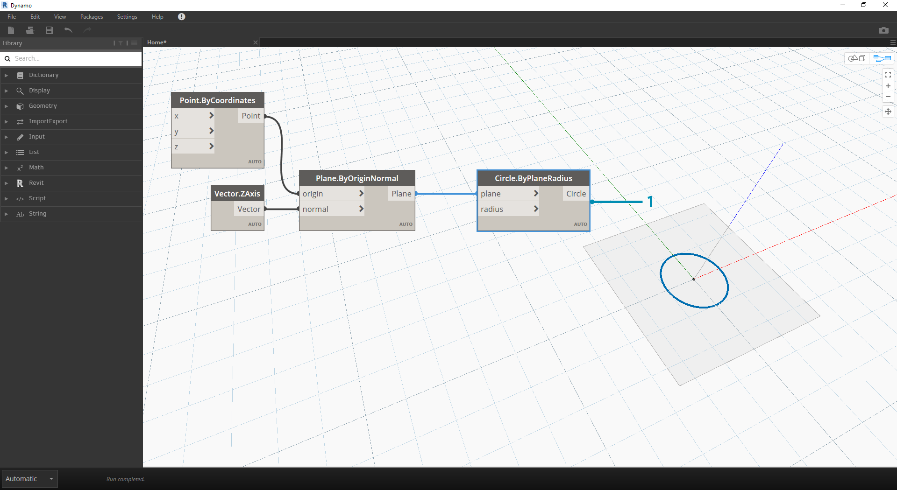
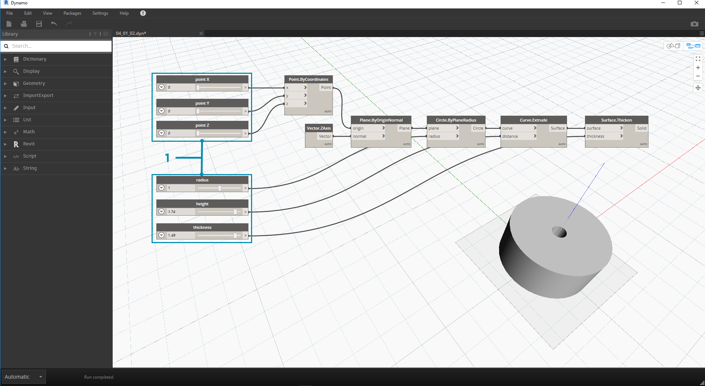

## 패널
데이터는 프로그램과 관련된 항목입니다. 데이터는 유선으로 이동되며, 새로운 형식의 출력 데이터로 처리되는 노드에 입력을 제공합니다. 데이터의 정의, 구성 방법을 검토하고 Dynamo에서 사용해 보겠습니다.

### 데이터란?

데이터는 정성적 또는 정량적 변수 값의 세트입니다. 가장 간단한 데이터 형식은 ```0```, ```3.14``` 또는 ```17```과 같은 숫자입니다. 그러나 데이터는 변화하는 숫자(```height```), 문자(```myName```), 형상(```Circle```) 또는 데이터 항목 리스트(```1,2,3,5,8,13,...```)를 나타내는 다양한 유형의 변수가 될 수도 있습니다. Dynamo 노드의 입력 포트에 추가할 데이터가 필요합니다. 작업이 없는 데이터가 있을 수 있지만 노드가 나타내는 작업을 처리하기 위해서는 데이터가 필요합니다. 노드를 작업공간에 추가할 때 입력을 제공하지 않으면 결과는 작업 자체의 결과가 아니라 함수가 됩니다.


> 1. 단순 데이터
2. 데이터 및 작업(노드)이 성공적으로 실행됩니다.
3. 데이터 입력이 없는 작업(노드)에서는 일반 함수를 반환합니다.

### Null 인식

```'null'``` 유형은 데이터가 없음을 나타냅니다. 이는 추상적인 개념이지만 시각적 프로그래밍 작업 중에 이 개념을 마주하게 될 가능성이 높습니다. 작업을 통해 유효한 결과가 작성되지 않는 경우 노드에서는 null을 반환합니다. null이 발생하는지 테스트하고 데이터 구조에서 null을 제거하는 작업은 강력한 프로그램을 작성하는 데 있어서 매우 중요한 부분입니다.

|아이콘|이름/구문|입력|출력|
| -- | -- | -- | -- |
||Object.IsNull|obj|부울|

### 데이터 구조

시각적 프로그래밍을 사용하는 경우 많은 데이터를 아주 빠르게 생성할 수 있으며, 계층 구조를 관리할 방법이 필요합니다. 이는 데이터를 저장하는 조직 체계인 데이터 구조의 역할입니다. 데이터 구조의 세부 사항과 사용 방법은 프로그래밍 언어마다 다릅니다. Dynamo에서는 리스트 기능을 통해 데이터에 계층을 추가합니다. 이러한 내용은 뒤쪽에 나오는 장에서 자세히 살펴보겠지만 여기서는 다음 내용부터 간단히 알아봅니다.

리스트는 하나의 데이터 구조에 배치된 항목의 모음을 나타냅니다.

* 내 손(*리스트*)에는 5개의 손가락(*항목*)이 있습니다.
* 도로(*리스트*)에는 10개의 가구(*항목*)가 있습니다.


> 1. **Number Sequence** 노드에서는 *start*, *amount* 및 *step* 입력을 사용하여 번호 리스트를 정의합니다. 이러한 노드를 사용하여 *100-109* 범위 및 *0-9* 범위에 대해 10개 숫자가 포함된 별도의 리스트를 2개를 작성했습니다.
2. **List.GetItemAtIndex** 노드에서는 특정 색인에 있는 리스트의 항목을 선택합니다. *0*을 선택하면 리스트의 첫 번째 항목이 표시됩니다(이 경우 *100*).
3. 두 번째 리스트에 동일한 프로세스를 적용하면 리스트의 첫 번째 항목인 *0* 값이 표시됩니다.
4. 이제 **List.Create** 노드를 사용하여 두 개의 리스트를 하나로 병합합니다. 노드에서 *리스트의 리스트를 작성합니다.* 그러면 데이터 구조가 변경됩니다.
5. 색인을 *0*으로 설정하여 **List.GetItemAtIndex**를 다시 사용하면 리스트의 리스트에서 첫 번째 리스트가 표시됩니다. 이는 리스트를 항목으로 처리하는 것을 의미하며, 이 점은 다른 스크립팅 언어와 다소 다릅니다. 뒤쪽에 나오는 장에서 리스트 조작 및 데이터 구조에 대해 좀 더 자세히 살펴보겠습니다.

Dynamo의 데이터 계층을 이해하기 위한 주요 개념은 **데이터 구조와 관련해서 리스트가 항목으로 간주된다는 점입니다.** 즉, Dynamo는 데이터 구조의 이해를 위해 하향식 프로세스로 작동합니다. 이것은 무엇을 의미합니까? 예시를 통해 살펴보겠습니다.

### 데이터를 사용하여 원통 체인 만들기

> 이 연습과 함께 제공되는 예시 파일([프로그램의 빌딩 블록 - Data.dyn](datasets/4-1/Building Blocks of Programs - Data.dyn))을 다운로드하십시오(마우스 오른쪽 버튼을 클릭하고 "다른 이름으로 링크 저장..." 선택). 전체 예시 파일 리스트는 부록에서 확인할 수 있습니다.

첫 번째 예에서는 이 섹션에서 설명한 형상 계층을 통과하는 쉘 원통을 조립합니다. 

> 1. **Point.ByCoordinates -** 캔버스에 노드를 추가하면 Dynamo 미리보기 그리드의 원점에 점이 표시됩니다. *x,y* 및 *z* 입력의 기본값은 *0.0*이며, 이 값을 사용하면 해당 위치에 점이 생깁니다.


> 1. **Plane.ByOriginNormal -** 형상 계층의 다음 단계는 평면입니다. 평면은 여러 가지 방법으로 구성할 수 있는데 우리는 입력을 위해 원점과 법선을 사용하겠습니다. 원점은 이전 단계에서 작성한 점 노드입니다.
2. **Vector.ZAxis -** z 방향으로 결합된 벡터입니다. 입력이 없으며 [0,0,1] 값의 벡터만 있습니다. 이 값을 *Plane.ByOriginNormal* 노드에 대한 *normal* 입력으로 사용합니다. 그러면 Dynamo 미리보기에 직사각형 평면이 표시됩니다.



> 1. **Circle.ByPlaneRadius -** 계층을 따라 위로 이동하면서 이제 이전 단계의 평면에서 곡선을 작성합니다. 노드에 연결한 후 원점에 원을 가져옵니다. 노드의 기본 반지름 값은 *1*입니다.


> 1. **Curve.Extrude -** 이제 항목에 깊이를 지정하고 세 번째 치수로 이동하여 항목이 팝업되도록 합니다. 이 노드에서는 곡선을 돌출시켜 곡선에서 표면을 작성합니다. 노드의 기본 거리는 *1*이며 뷰포트에 원통이 표시됩니다.


> 1. **Surface.Thicken -** 이 노드에서는 표면을 지정된 거리만큼 간격띄우기하고 양식을 닫아 닫힌 솔리드를 제공합니다. 기본 두께 값은 *1*이고 뷰포트에서 쉘 원통이 이러한 값과 함께 표시됩니다.


> 1. **Number Slider -** 이러한 모든 입력에 대해 기본값을 사용하는 대신, 파라메트릭 컨트롤을 몇 가지 모델에 추가해 보겠습니다.
2. **Domain Edit- **숫자 슬라이더를 캔버스에 추가한 후 왼쪽 상단에 있는 캐럿을 클릭하여 도메인 옵션을 표시합니다.
3. **Min/Max/Step -** *min*, *max* 및 *step* 값을 각각 *0*,*2* 및 *0.01*로 변경합니다. 이 작업은 전체 형상의 크기를 제어하기 위해 수행합니다.


> 1. **Number Slider -** 모든 기본 입력에서 기본값을 갖는 모든 입력에 슬라이더가 대신 생길 때까지 이 숫자 슬라이더를 여러 번 복사하여 붙여넣어 보겠습니다(슬라이더를 선택하고 Ctrl+C, Ctrl+V 키를 차례로 누름). 정의가 작동하려면 일부 슬라이더 값이 0보다 커야 합니다(즉, 표면을 두껍게 하려면 돌출 깊이가 있어야 함).

이제 이러한 슬라이더를 사용하여 파라메트릭 쉘 원통을 작성했습니다. 이러한 매개변수 중 일부를 조정해 보고 Dynamo 뷰포트에서 형상이 동적으로 업데이트되는 것을 확인합니다.



> 1. **Number Slider -** 이 작업에서 한 단계 더 나아가 캔버스에 슬라이더를 많이 추가했으며, 방금 작성한 도구의 인터페이스를 정리해야 합니다. 하나의 슬라이더를 마우스 오른쪽 버튼으로 클릭하고 "이름 바꾸기..."를 선택한 다음, 각 슬라이더의 이름을 해당 매개변수에 대해 적절한 이름으로 변경합니다. 이름에 대해서는 위 이미지를 참조할 수 있습니다.

여기서는 원통을 두껍게 작성했습니다. 이러한 객체는 현재 1개가 있습니다. 동적으로 연결된 상태를 유지하는 원통 배열을 작성하는 방법을 살펴보겠습니다. 이렇게 하기 위해 단일 항목으로 작업하는 대신 원통 리스트를 작성하겠습니다.


> 1. **Addition (+) -** 작성한 원통 옆에 원통 행을 추가하는 것이 목표입니다. 현재 원통과 인접한 원통을 추가하려는 경우 원통의 반지름과 해당 쉘의 두께를 둘 다 고려해야 합니다. 이 수는 슬라이더의 두 값을 더하여 얻습니다.


> 이 단계는 더 많이 관련되어 있으므로 좀 더 천천히 살펴보겠습니다. 최종 목표는 행에서 각 원통의 위치를 정의하는 숫자 리스트를 작성하는 것입니다.

> 1. **Multiplication -** 먼저 이전 단계의 값에 2를 곱합니다. 이전 단계의 값은 반지름을 나타냅니다. 원통을 전체 지름만큼 이동하겠습니다.
2. **Number Sequence -** 이 노드를 사용하여 숫자 배열을 작성합니다. 첫 번째 입력은 이전 단계에서 *step* 값으로의 *multiplication* 노드입니다. *number* 노드를 사용하여 *start* 값을 *0.0*으로 설정할 수 있습니다.
3. **Integer Slider - ** *amount* 값의 경우 정수 슬라이더를 연결합니다. 그러면 작성되는 원통의 수가 정의됩니다.
4. **Output - ** 이 리스트는 배열의 각 원통에 대해 이동된 거리를 표시하며 원래 슬라이더에서 파라메트릭 방식으로 구동됩니다.


> 1. 이 단계는 매우 간단합니다. 이전 단계에서 정의한 시퀀스를 원래 *Point.ByCoordinates*의 *x* 입력에 연결합니다. 그러면 삭제할 수 있는 *pointX* 슬라이더가 바뀝니다. 이제 뷰포트에 원통 배열이 표시됩니다(정수 슬라이더가 0보다 큰지 확인).


> 원통 체인은 여전히 모든 슬라이더에 동적으로 연결되어 있습니다. 각 슬라이더를 조정하며 정의가 업데이트되는 것을 확인해 보십시오.

