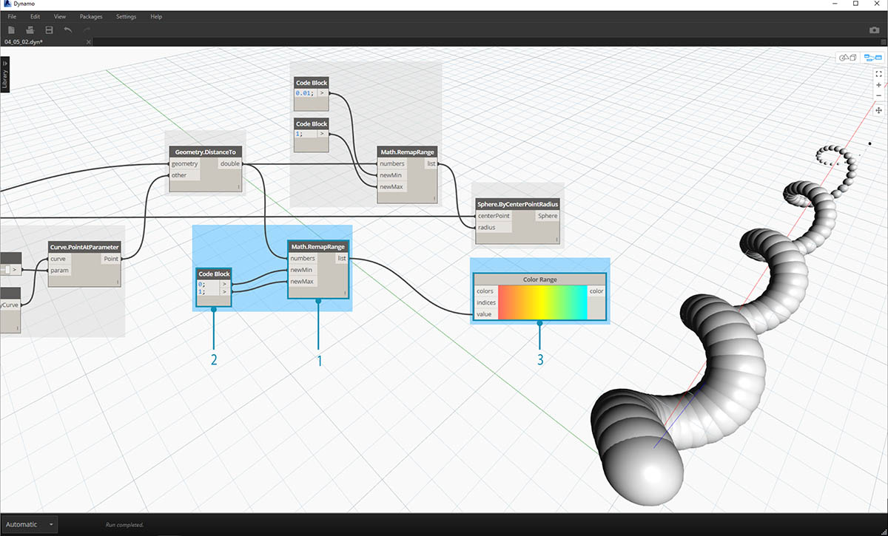
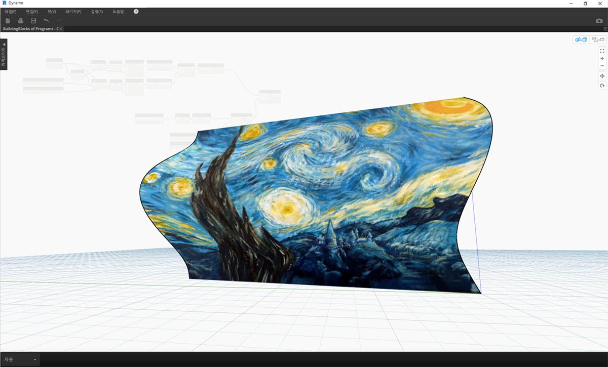

## 색상

색상은 시각적 프로그램의 출력에서 차이를 렌더링하고, 우수한 시각적 요소를 작성하는 데 유용한 데이터 유형입니다. 추상 데이터와 다양한 숫자를 사용할 경우 무엇이 어느 정도로 달라지는지 확인하기 어려운 경우가 있습니다. 이러한 경우 색상을 적용하면 매우 유용합니다.

### 색상 작성하기

Dynamo의 색상은 ARGB 입력을 사용하여 작성됩니다. ARGB는 알파, 빨간색, 초록색 및 파란색 채널에 해당합니다. 알파는 색상의 *투명도*를 나타내고, 다른 3개의 색상은 전체 색상 스펙트럼을 생성하기 위한 기본 색상으로 사용됩니다.

|아이콘|이름|구문|입력|출력|
| -- | -- | -- | -- | -- |
||ARGB 색상|Color.ByARGB|A,R,G,B|색상|

### 색상 값 조회하기

아래 표의 색상을 사용하면 색상을 정의하는 데 사용되는 특성(알파, 빨간색, 초록색 및 파란색)이 조회됩니다. Color.Components 노드는 다른 출력으로 4개의 색상을 모두 제공하므로 색상의 특성을 조회할 때 선호됩니다.

|아이콘|이름|구문|입력|출력|
| -- | -- | -- | -- | -- |
||알파|Color.Alpha|색상|A|
||빨간색|Color.Red|색상|R|
||초록색|Color.Green|색상|G|
||파란색|Color.Blue|색상|B|
||구성요소|Color.Components|색상|A,R,G,B|

아래 표의 색상은 **HSB 색상 공간**에 해당합니다. 색상을 색조, 채도 및 밝기로 나누면 색상을 좀 더 직관적으로 해석할 수 있습니다. 즉, '어떤 색상인가?', '색상이 얼마나 선명한가?', '색상이 얼마나 밝거나 어두운가?'와 같은 질문으로 각각 색조, 채도 및 밝기를 분석할 수 있습니다.

|아이콘|조회 이름|구문|입력|출력|
| -- | -- | -- | -- | -- |
||색조|Color.Hue|색상|색조|
||채도|Color.Saturation|색상|채도|
||밝기|Color.Brightness|색상|밝기|

### 색상 범위

색상 범위는 섹션 4.2의 **Remap Range** 노드와 비슷합니다. 이 노드에서는 숫자 리스트를 다른 영역에 다시 매핑합니다. 그러나 *숫자* 영역으로 매핑하는 대신, 0에서 1 사이의 입력 숫자를 기준으로 *색상 그라데이션*에 매핑합니다.

현재 노드는 잘 작동하지만 처음에는 모든 항목이 다 제대로 작동하지는 않을 수 있습니다. 색상 그라데이션에 익숙해지려면 대화식으로 테스트하는 것이 가장 좋습니다. 간단한 연습을 통해 숫자에 해당하는 출력 색상으로 그라데이션을 설정하는 방법을 살펴보겠습니다.

> 1. **세 가지 색상 정의: ** code block 노드를 사용하여 적절한 *0* 및 *255* 조합을 연결함으로써 *빨간색, 초록색* 및 *파란색*을 정의합니다.
2. **리스트 작성:** 세 개의 색상을 하나의 리스트로 병합합니다.
3. **색인 정의: ** 리스트를 작성하여 각 색상의 그립 위치를 정의합니다(0에서 1 사이). 초록색 값이 0.75인지 확인합니다. 이 경우 색상 범위 슬라이더의 수평 그라데이션을 따라 3/4 위치에 초록색이 배치됩니다.
4. **Code Block: ** 값(0에서 1 사이)을 입력하여 색상을 변환합니다.

### 색상 미리보기

**Display.ByGeometry** 노드를 사용하면 Dynamo 뷰포트의 형상에 색상을 지정할 수 있습니다. 이 노드는 여러 다른 유형의 형상을 구분하거나, 파라메트릭 개념을 보여 주거나, 시뮬레이션을 위한 해석 범례를 정의하는 데 유용합니다. 입력은 형상과 색상으로, 간단합니다. 위 이미지와 같은 그라데이션을 작성하기 위해 색상 입력이 **색상 범위** 노드에 연결됩니다.

### 색상 연습

> 이 연습과 함께 제공되는 예시 파일([프로그램의 빌딩 블록 - Color.dyn](datasets/4-5/Building Blocks of Programs - Color.dyn))을 다운로드하십시오(마우스 오른쪽 버튼을 클릭하고 "다른 이름으로 링크 저장..." 선택). 전체 예시 파일 리스트는 부록에서 확인할 수 있습니다.

이 연습에서는 형상과 함께 파라메트릭 방식으로 색상을 제어하는 데 중점을 둡니다. 형상은 아래에서 **Code Block**(3.2.3)을 사용하여 정의하는 기본 나선입니다. 이렇게 하면 파라메트릭 함수를 쉽고 빠르게 작성할 수 있습니다. 또한 이 작업에서는 형상이 아닌 색상에 주안점을 두므로 캔버스를 복잡하게 만들지 않고 Code Block을 사용하여 나선을 효율적으로 작성합니다. 좀 더 고급 자료로 넘어가게 되면 이 code block을 더 자주 사용하게 될 것입니다.

> 1. **Code Block:** 위의 공식을 사용하여 두 개의 code block을 정의합니다. 이 방법은 나선을 작성하는 빠른 파라메트릭 방법입니다.
2. **Point.ByCoordinates:** code block의 세 가지 출력을 노드의 좌표에 연결합니다.

이제 나선을 작성하는 점의 배열이 표시됩니다. 다음 단계는 나선을 시각화할 수 있도록 점을 통과하는 곡선을 작성하는 것입니다.

> 1. **PolyCurve.ByPoints:** *Point.ByCoordinates* 출력을 노드의 *points* 입력에 연결합니다. 나선형 곡선이 생성됩니다.
2. **Curve.PointAtParameter:** *PolyCurve.ByPoints* 출력을 *curve* 입력에 연결합니다. 이 단계의 목적은 곡선을 따라 미끄러지는 파라메트릭 어트랙터 점을 작성하는 것입니다. 이 곡선은 매개변수의 점을 평가하므로 0에서 1 사이의 *param* 값을 입력해야 합니다.
3. **Number Slider:** 캔버스에 추가한 후 *min* 값을 *0.0*으로 변경하고 *max* 값을 *1.0*으로 변경한 다음, *step* 값을 *.01*로 변경합니다. 슬라이더 출력을 *Curve.PointAtParameter*에 대한 *param* 입력에 연결합니다. 이제 슬라이더의 백분율(시작점 0, 끝점 1)로 표시되는 나선 길이를 따라 점이 표시됩니다.

참조점이 작성되었으므로 이제 참조점부터 나선을 정의하는 원래 점까지의 거리를 비교합니다. 이 거리 값에 따라 형상 및 색상이 결정됩니다.

> 1. **Geometry.DistanceTo:** *Curve.PointAtParameter* 출력을 *입력*에 연결합니다. *Point.ByCoordinates*를 *형상 입력에 연결합니다.
2. **Watch:** 결과 출력에서는 각 나선형 점부터 곡선을 따라 표시되는 참조점까지의 거리 리스트를 표시합니다.

다음 단계는 나선형 점부터 참조점까지의 거리 리스트로 매개변수를 구동하는 것입니다. 이러한 거리 값을 사용하여 곡선을 따라 일련의 구 반지름을 정의합니다. 구형이 적절한 크기로 유지되도록 하려면 거리 값을 *다시 매핑*해야 합니다.

> 1. **Math.RemapRange:** *Geometry.DistanceTo* 출력을 numbers 입력에 연결합니다.
2. **Code Block:** 값이 *0.01*인 code block을 *newMin* 입력에 연결하고 값이 *1*인 code block을 *newMax* 입력에 연결합니다.
3. **Watch:** *Math.RemapRange* 출력을 하나의 노드에 연결하고 *Geometry.DistanceTo* 출력을 다른 노드에 연결합니다. 결과를 비교합니다.

이 단계에서는 거리 리스트를 더 작은 범위로 다시 매핑했습니다. *newMin* 및 *newMax* 값은 적합하다고 여기는 대로 편집할 수 있습니다. 값이 다시 매핑되고 영역 전체에서 동일한 *분포 비율*이 적용됩니다.

> 1. **Sphere.ByCenterPointRadius:** *Math.RemapRange* 출력을 *radius* 입력에 연결하고 원래 *Point.ByCoordinates* 출력을 *centerPoint* 입력에 연결합니다.

> 1. **Number Slider:** number slider의 값을 변경하고 구의 크기가 업데이트되는 것을 확인합니다. 이제 파라메트릭 지그가 생성되었습니다.

구의 크기는 곡선을 따라 표시되는 참조점으로 정의된 파라메트릭 배열을 보여 줍니다. 구 반지름에 동일한 개념을 사용하여 해당 색상을 지정해 보겠습니다.

> 1. **Color Range:** 캔버스 위에 추가합니다. *value* 입력 위에 마우스를 놓으면 요청된 번호가 0에서 1 사이인 것을 알 수 있습니다. 이 영역과 호환되도록 *Geometry.DistanceTo* 출력의 숫자를 다시 매핑해야 합니다.
2. **Sphere.ByCenterPointRadius:** 지금은 이 노드에 대한 미리보기를 사용하지 않도록 설정하겠습니다(*마우스 오른쪽 버튼 클릭 > 미리보기*).

> 1. **Math.RemapRange:** 이 프로세스는 익숙해졌을 것입니다. *Geometry.DistanceTo* 출력을 numbers 입력에 연결합니다.
2. **Code Block:** 이전 단계와 마찬가지로, *newMin* 입력에 대해 *0* 값을 작성하고 *newMax*에 대해 *1* 값을 작성합니다. 이 경우 한 code block에서 두 개의 출력을 정의할 수 있습니다.
3. **Color Range:** *Math.RemapRange* 출력을 *value* 입력에 연결합니다.

> 1. **Color.ByARGB:** 두 개의 색상을 작성하려면 이 항목을 사용합니다. 이 프로세스가 생소할 수도 있지만 다른 소프트웨어의 RGB 색상과 동일한 것입니다. 여기서는 단순히 시각적 프로그래밍을 사용하여 이 프로세스를 수행합니다.
2. **Code Block:** *0*과 *255*의 두 값을 작성합니다. 위 이미지에 따라 두 출력을 두 *Color.ByARGB* 입력에 연결합니다(또는 선호하는 두 가지 색상 작성).
3. **Color Range:** *colors* 입력에서 색상 리스트를 요청합니다. 이전 단계에서 작성한 두 가지 색상으로부터 이 리스트를 작성해야 합니다.
4. **List.Create:** 두 색상을 하나의 리스트로 병합합니다. 출력을 *Color Range*에 대한 *colors* 입력에 연결합니다.

> 1. **Display.ByGeometryColor:** *Sphere.ByCenterPointRadius*를 *geometry* 입력에 연결하고 *Color Range*를 *color* 입력에 연결합니다. 이제 곡선의 영역을 따라 부드러운 그라데이션이 생성되었습니다.

> 정의에서 *number slider* 값을 이전과 다르게 변경하면 색상 및 크기가 업데이트됩니다. 이 경우 색상 및 반지름 크기가 직접 연계됩니다. 이제 두 매개변수 사이에 시각적 링크가 표시됩니다.

### 표면의 색상

**Display.BySurfaceColors** 노드를 사용하면 색상을 사용하여 표면 전반에서 데이터를 매핑할 수 있습니다. 이 기능을 통해 태양, 에너지, 근접성 등과 같은 불연속 해석을 통해 얻은 데이터를 시각화할 수 있게 됩니다. Dynamo의 표면에 색상을 적용하는 것은 다른 CAD 환경의 재료에 텍스처를 적용하는 것과 유사합니다. 아래 간단한 연습에서 이 도구를 사용하는 방법을 살펴보겠습니다.

### 표면의 색상 연습

> 이 연습과 함께 제공되는 예시 파일([프로그램의 빌딩 블록 - ColorOnSurface.zip](datasets/4-5/BuildingBlocks of Programs - ColorOnSurface.zip))을 다운로드하십시오(마우스 오른쪽 버튼을 클릭하고 "다른 이름으로 링크 저장..." 선택). 전체 예시 파일 리스트는 부록에서 확인할 수 있습니다.

> 먼저 **Display.BySurfaceColors** 노드의 입력으로 사용할 표면을 작성(또는 참조)해야 합니다. 이 예에서는 사인 및 코사인 곡선 사이에서 로프트를 시도합니다.

> 1. 이 노드 **그룹**은 Z축을 따라 점을 작성한 다음, 사인 및 코사인 함수를 기준으로 재배치합니다. 그런 다음, 두 점 리스트를 사용하여 NURBS 곡선을 생성합니다.
2. **Surface.ByLoft**: NURBS 곡선 리스트 사이에 보간된 표면을 생성합니다.

> 1. **File Path**: 픽셀 데이터 다운스트림에 대해 샘플링할 이미지 파일을 선택합니다.
2. **File.FromPath**를 사용하여 파일 경로를 파일로 변환한 다음, **Image.ReadFromFile**에 전달하여 샘플링할 이미지를 출력합니다.
3. **Image.Pixels**: 이미지를 입력하고 이미지의 X 및 Y 치수에 따라 사용할 샘플 값을 제공합니다.
4. **Slider**: **Image.Pixels**의 샘플 값을 제공합니다.
5. **Display.BySurfaceColors**: 각각 X와 Y를 따라 표면에서 색상 값 배열을 매핑합니다.

> 해상도가 400x300인 샘플의 출력 표면 미리보기 클로즈업

