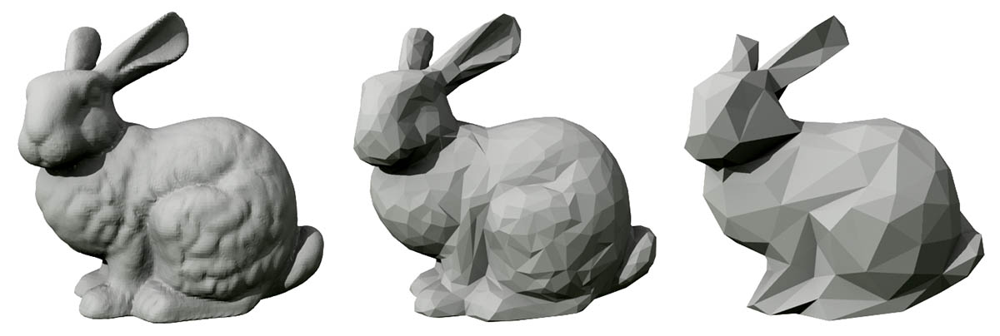
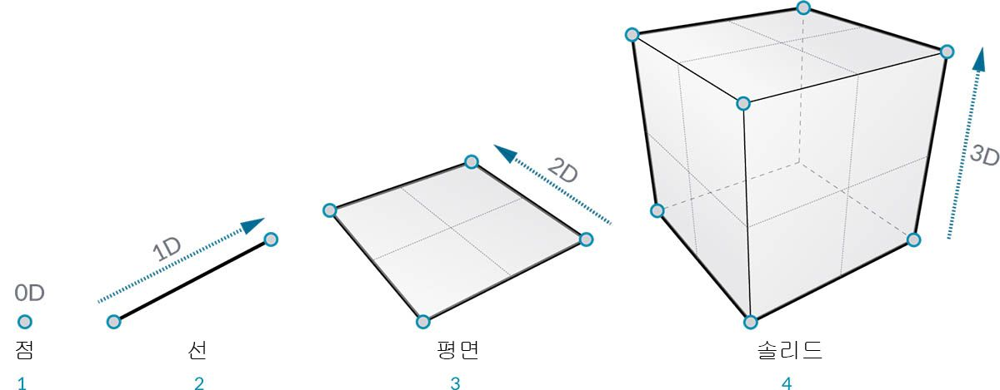
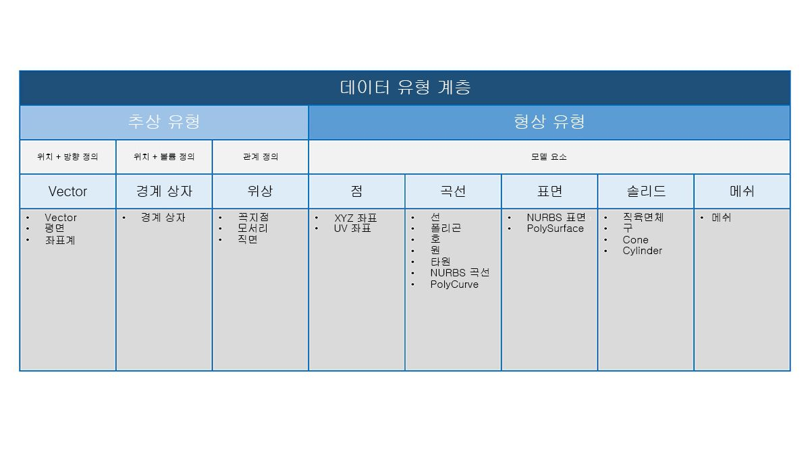

## 형상 개요
**형상**은 설계를 위한 언어입니다. 프로그래밍 언어나 환경의 핵심에 형상 커널이 포함되어 있으면 알고리즘을 통해 정확하고 강력한 모델을 설계하고, 설계 루틴을 자동화하고, 설계를 반복해서 생성할 수 있게 됩니다.

### 기본 사항
일반적으로 정의된 형상은 그림의 모양, 크기, 상대 위치 및 공간 특성을 연구한 것입니다. 이 분야에는 수천 년의 유구한 역사가 있습니다. 컴퓨터의 출현과 대중화를 통해 우리는 형상을 정의하고 탐색하고 생성하는 강력한 도구를 얻었습니다. 이제 복잡한 기하학적 상호 작용의 결과를 계산하는 작업이 매우 쉬워졌기에 우리가 실제로 그렇게 하고 있다는 사실은 거의 분명합니다.

> 컴퓨터의 성능을 통해 얼마나 다양하고 복잡한 형상을 얻을 수 있는지 궁금하다면 알고리즘을 테스트하는 데 사용되는 표준 모델인 Stanford Bunny를 웹에서 빠르게 검색해 보십시오.

알고리즘, 컴퓨팅 및 복잡성의 맥락에서 형상을 파악하는 일은 다소 어려울 수 있지만, 고급 응용프로그램 작성을 시작하기 위한 기본 사항으로 설정할 수 있는 핵심적이고 비교적 간단한 원칙이 몇 가지 있습니다.

1. 형상은 **데이터**입니다. 컴퓨터 및 Dynamo의 입장에서 볼 때 Bunny는 숫자와 그렇게 다르지 않습니다.
2. 형상은 **추상화**를 활용합니다. 기본적으로 기하학적 요소는 지정된 공간 좌표계 내에서 숫자, 관계 및 공식으로 설명됩니다.
3. 형상에는 **계층**이 있습니다. 점이 함께 모여 선을 만들고 선이 함께 모여 표면을 만드는 식입니다.
4. 형상은 **부분과 전체**를 동시에 설명합니다. 곡선이 있는 경우 곡선의 모양뿐만 아니라 해당 곡선을 구성하는 모든 점도 볼 수 있습니다.

실제로 이러한 원칙은 우리가 작업 중인 항목(형상의 유형, 형상이 작성된 방식 등)을 잘 알고 있어야 함을 의미합니다. 그래야 보다 복잡한 모델을 개발할 때 여러 형상을 유동적으로 구성, 분해 및 재구성할 수 있습니다.

### 계층 구조 단계별 이동
잠시 형상에 대한 추상적 설명 및 계층적 설명 간의 관계를 살펴보겠습니다. 이러한 두 가지 개념은 서로 관련되어 있지만 처음에는 명확하게 드러나지 않을 수 있으므로 좀 더 심층적인 워크플로우 또는 모델 개발을 시작하면 개념적 장애물에 빠르게 도달할 수 있습니다. 초보자인 경우 차원을 통해 우리가 모델링하는 "대상"을 쉽게 파악해 보십시오. 모양을 나타내는 데 필요한 차원을 통해 형상이 계층적으로 구성된 방식을 이해할 수 있습니다.

> 1. **점**(좌표로 정의됨)에는 차원이 없습니다. 이는 각 좌표를 나타내는 숫자일 뿐입니다.
2. **선**(두 점으로 정의됨)은 *1*차원입니다. 선을 따라 앞으로(양의 방향) 또는 뒤로(음의 방향) "걸어갈 수 있습니다".
3. **평면**(두 선으로 정의됨)은 *2*차원입니다. 이제 좀 더 왼쪽으로 또는 좀 더 오른쪽으로 걸어갈 수 있습니다.
4. **상자**(두 평면으로 정의됨)는 *3*차원입니다. 위쪽 또는 아래쪽에 상대적인 위치를 정의할 수 있습니다.

차원은 형상 분류를 시작하는 편리한 방법이지만 가장 좋은 방법은 아닙니다. 결국 점, 선, 평면 및 상자만으로 모델링하지는 않게 됩니다. 곡선이 필요할 수도 있으니까요. 또한 완전히 추상화된 형상 유형의 완전히 다른 카테고리가 있습니다. 이에 따라 방향, 체적 또는 부분 간의 관계와 같은 특성이 정의됩니다. 실제로는 벡터를 적용할 수 없으므로 공간에 표시되는 대상과 비교해서 정의하려면 어떻게 해야 할까요? 기하학적 계층을 더 상세하게 분류하면 추상 유형과 "도우미" 간의 차이점이 적용됩니다. 이는 각각 지원하는 항목 및 모델 요소의 모양을 그리는 데 도움이 되는 유형별로 그룹화할 수 있습니다.

### Dynamo Sandbox의 형상

그렇다면 Dynamo를 사용할 경우에는 어떤 의미가 있을까요? 형상 유형과 이러한 유형이 어떻게 관련되어 있는지를 잘 이해하면 라이브러리에서 사용할 수 있는 **Geometry 노드** 모음을 탐색할 수 있습니다. Geometry 노드는 계층이 아닌 알파벳순으로 정리되어 있습니다. 여기서는 Dynamo 인터페이스 내 배치와 유사하게 표시됩니다.

또한 Dynamo에서 모델을 만들고 배경 미리보기에 표시되는 항목의 미리보기를 그래프의 데이터 흐름에 연결하는 작업은 시간이 갈수록 점점 더 간단해집니다.

> 1. 가정된 좌표계는 그리드 및 색상 축으로 렌더링됩니다.
3. 선택된 노드에서는 해당하는 형상(노드에서 형상을 작성하는 경우)을 강조 표시 색상으로 배경에 렌더링합니다.

> 이 이미지와 함께 제공되는 예시 파일인 [Geometry for Computational Design - Geometry Overview.dyn](datasets/5-1/Geometry for Computational Design - Geometry Overview.dyn)을 다운로드하십시오(마우스 오른쪽 버튼을 클릭하고 "다른 이름으로 링크 저장"). 전체 예시 파일 리스트는 부록에서 확인할 수 있습니다.

### 형상에 대해 자세히 알아보기
Dynamo에서 모델을 작성하는 작업은 노드를 사용하여 생성할 수 있는 작업으로만 국한되지 않습니다. 다음은 형상을 사용하여 프로세스를 다음 단계로 발전시키는 몇 가지 주요 방법입니다.

1. Dynamo를 사용하면 파일을 가져올 수 있습니다. 점 구름에는 CSV를 사용하고, 표면을 가져올 때는 SAT를 사용해 보십시오.
2. Revit으로 작업하는 경우 Revit 요소를 참조하여 Dynamo에서 사용할 수 있습니다.
3. Dynamo Package Manager에서는 확장된 형상 유형 및 작업에 대한 추가 기능을 제공합니다. [Mesh Toolkit](https://github.com/DynamoDS/Dynamo/wiki/Dynamo-Mesh-Toolkit) 패키지를 확인하십시오.

