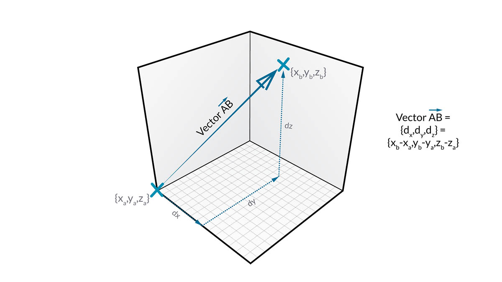
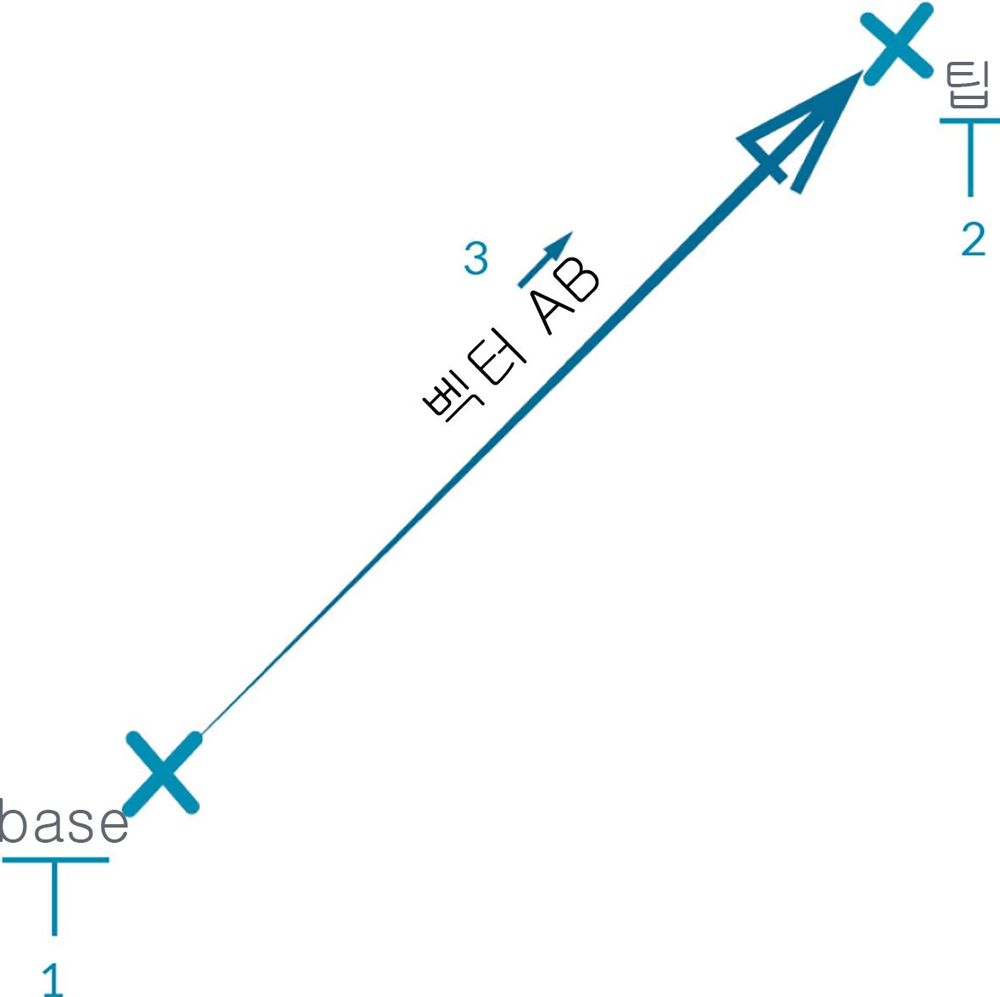

## 벡터, 평면 및 좌표계

벡터, 평면 및 좌표계는 추상 형상 유형의 기본 그룹을 구성합니다. 이러한 항목은 모양을 나타내는 다른 형상의 위치, 방향 및 공간 컨텍스트를 정의하는 데 유용합니다. 예를 들어 New York City, 42nd Street 및 Broadway(좌표계)에서 지상층(평면)에 선 채 북쪽(벡터)을 바라보고 있다면 이러한 "도우미"를 사용하여 현재 위치를 정의할 수 있습니다. 휴대폰 케이스 제품이나 고층 건물의 경우도 마찬가지입니다. 모델을 개발하려면 이러한 컨텍스트가 필요합니다.

### 벡터란?

벡터는 방향 및 크기를 설명하는 기하학적 수량입니다. 벡터는 추상적입니다. 즉, 기하학적 요소가 아니라 수량을 나타냅니다. 벡터와 점은 둘 다 값 리스트로 구성되기 때문에 벡터가 점으로 혼동되기 쉽습니다. 그러나 점은 지정된 좌표계에서의 위치를 나타내지만, 벡터는 "방향"과 같은 의미의 상대적인 위치 차이를 나타낸다는 점이 주요 차이점입니다.

상대적 차이를 이해하는 것이 어렵다면, 벡터 AB를 "점 A에 서서 점 B 쪽을 바라보고 있는" 상태라고 생각해 보십시오. 여기(A)에서 저기(B)까지의 방향이 벡터입니다.

동일한 AB 표기법을 사용하여 벡터를 좀 더 분석해 보겠습니다.

> 1. 벡터의 **시작점**을 **기준**이라고 합니다.
2. 벡터의 **끝점**을 **팁** 또는 **센스**라고 합니다.
3. 벡터 AB는 반대 방향을 향하는 벡터 BA와 같지 않습니다.

벡터(및 그 추상적 정의)에 관해 기분전환이 필요하다면 클래식 코미디인 Airplane을 보고 자주 인용되는 다음 농담을 들어보세요.

> *알았다, 오버. 우리 벡터는 뭐지? Victor?(Roger, Roger. What's our vector, Victor?)*

벡터는 Dynamo에서 모델의 핵심 구성요소로, 추상적인 "도우미" 카테고리에 속하기 때문에 벡터를 작성할 때는 때 배경 미리보기에 아무것도 표시되지 않습니다.

> 1. 벡터 미리보기를 위한 자리 표시자로 선을 사용할 수 있습니다.
> 이 이미지와 함께 제공되는 예시 파일([Geometry for Computational Design - Vectors.dyn](datasets/5-2/Geometry for Computational Design - Vectors.dyn))을 다운로드하십시오(마우스 오른쪽 버튼을 클릭하고 "다른 이름으로 링크 저장..."). 전체 예시 파일 리스트는 부록에서 확인할 수 있습니다.

### 평면이란?

평면은 추상적인 2D "도우미"입니다. 보다 구체적으로 말하면 평면은 개념적으로 "평평하여" 두 방향으로 무한하게 확장되며, 일반적으로 원점 근처에서 좀 더 작은 사각형으로 렌더링됩니다.

"잠깐! 원점이요? CAD 소프트웨어에서 모델링할 때 제가 사용하는 것과 같은 좌표계처럼 들리는데요."라는 생각이 드실 수 있습니다.

맞습니다. 대부분의 모델링 소프트웨어에서는 구성 평면이나 "레벨"을 활용하여 초안을 작성할 로컬 2D 컨텍스트를 정의합니다. XY, XZ, YZ 또는 북쪽, 남동쪽, 평면이 더 친숙하게 들릴 수 있습니다. 이러한 항목은 모두 무한 "평면" 컨텍스트를 정의하는 평면입니다. 평면에는 깊이가 없지만, 이는 방향을 설명하는 데 도움이 됩니다. 각 평면에는 원점, X 방향, Y 방향 및 Z(위쪽) 방향이 있습니다.

> 1. 평면은 추상적이지만, 평면에는 원점 위치가 있어 이를 공간에서 찾을 수 있습니다.
2. Dynamo에서 평면은 배경 미리보기에서 렌더링됩니다.
> 이 이미지와 함께 제공되는 예시 파일([Geometry for Computational Design - Planes.dyn](datasets/5-2/Geometry for Computational Design - Plane.dyn))을 다운로드하십시오(마우스 오른쪽 버튼을 클릭하고 "다른 이름으로 링크 저장..."). 전체 예시 파일 리스트는 부록에서 확인할 수 있습니다.

### 좌표계란?

평면에 익숙하다면 좌표계를 이해하는 것이 다소 어려울 수 있습니다. 평면은 좌표계(표준 "유클리드" 또는 "XYZ" 좌표계인 경우)와 모든 부분이 동일합니다.

하지만 원통형 또는 구형과 같은 대체 좌표계가 있습니다. 이후 섹션에서 살펴볼 텐데, 좌표계는 다른 형상 유형에 적용하여 해당 형상에서 위치를 정의할 수도 있습니다.

> 대체 좌표계(원통형, 구형) 추가

> 1. 평면은 추상적이지만, 좌표계에도 원점 위치가 있어 이를 공간에서 찾을 수 있습니다.
2. Dynamo에서 좌표계는 배경 미리보기에서 축을 정의하는 점(원점)과 선으로 렌더링됩니다(규칙에 따라 X는 빨간색, Y는 초록색, Z는 파란색임).
> 이 이미지와 함께 제공되는 예시 파일([Geometry for Computational Design - Coordinate System.dyn](datasets/5-2/Geometry for Computational Design - Coordinate System.dyn))을 다운로드하십시오(마우스 오른쪽 버튼을 클릭하고 "다른 이름으로 링크 저장..."). 전체 예시 파일 리스트는 부록에서 확인할 수 있습니다.

